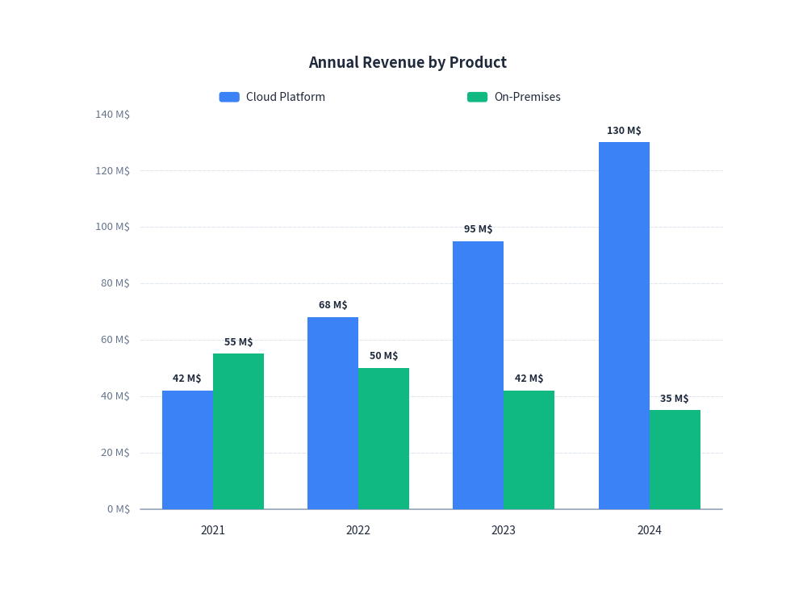
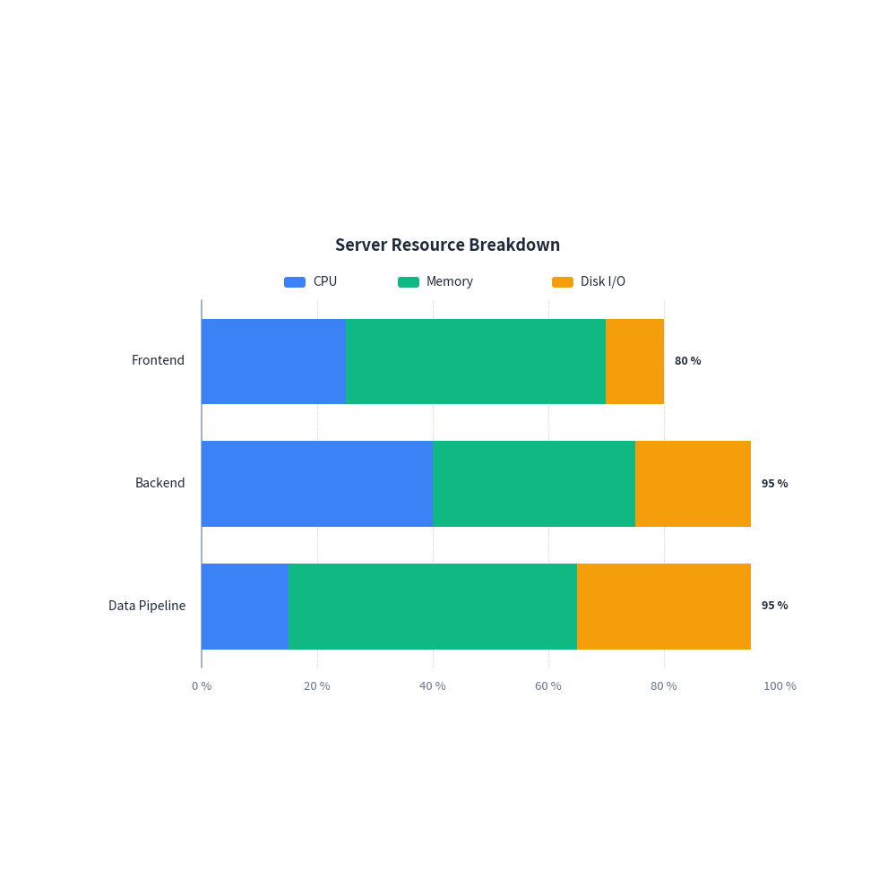
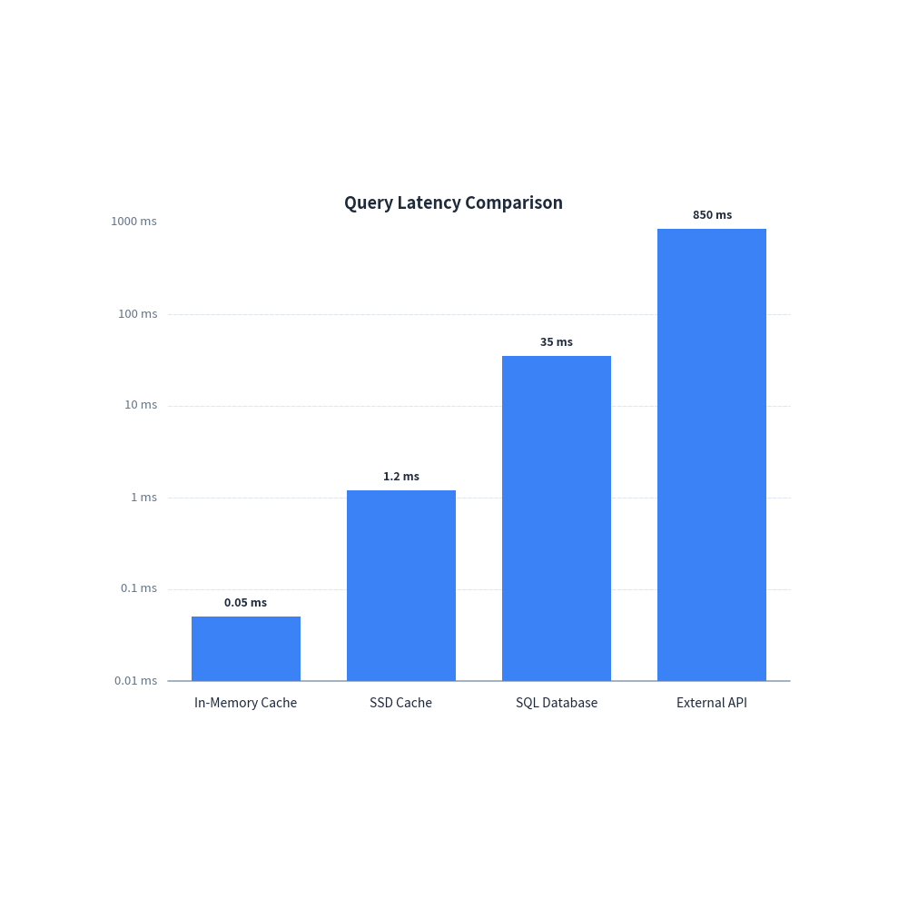
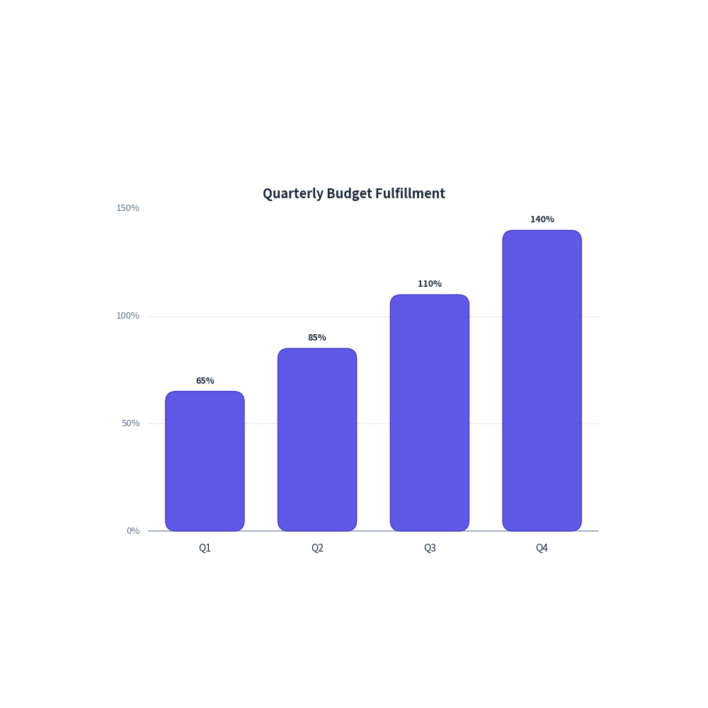

# Bar Chart Guide

`drawlib.charts.BarChart` provides flexible vertical and horizontal bar charts with support for grouping, stacking, custom ticks, and logarithmic scales.

---

## 1. Quick Start: Grouped Bar Chart

A vertical grouped bar chart compares multiple series across categories:


```python
from drawlib import canvas
from drawlib.charts import BarChart

canvas.initialize()
canvas.setup(width=95, height=70)

chart = BarChart(
    categories=["2021", "2022", "2023", "2024"],
    width=80,
    height=60,
    title="Annual Revenue by Product",
    show_values=True,
)
chart.add_series("Cloud Platform", [42.0, 68.0, 95.0, 130.0])
chart.add_series("On-Premises", [55.0, 50.0, 42.0, 35.0])
chart.configure_y_axis(unit="M$", show_grid=True)
chart.draw(xy=(8.0, 5.0))
```

<figure class="drawlib-image" style="text-align: center;">
  
  <figcaption class="drawlib-caption">Annual Revenue Comparison</figcaption>
</figure>


---

## 2. Horizontal Stacked Bar Chart

Horizontal stacked bars are ideal for visualizing resource breakdowns, survey responses, or task distributions:


```python
from drawlib import canvas
from drawlib.charts import BarChart

canvas.initialize()
canvas.setup(width=98, height=62)

chart = BarChart(
    categories=["Frontend", "Backend", "Data Pipeline"],
    width=80,
    height=52,
    orientation="horizontal",
    bar_mode="stack",
    title="Server Resource Breakdown",
    show_values=True,
)
chart.add_series("CPU", [25.0, 40.0, 15.0])
chart.add_series("Memory", [45.0, 35.0, 50.0])
chart.add_series("Disk I/O", [10.0, 20.0, 30.0])
chart.configure_x_axis(unit="%")
chart.draw(xy=(10.0, 5.0))
```

<figure class="drawlib-image" style="text-align: center;">
  
  <figcaption class="drawlib-caption">Resource Allocation</figcaption>
</figure>


---

## 3. Logarithmic Scale Benchmark

For latency measurements, algorithmic complexity, or exponential data across several orders of magnitude, set `scale="log"` on the value axis:


```python
from drawlib import canvas
from drawlib.charts import BarChart

canvas.initialize()
canvas.setup(width=95, height=70)

chart = BarChart(
    categories=["In-Memory Cache", "SSD Cache", "SQL Database", "External API"],
    width=80,
    height=60,
    title="Query Latency Comparison",
    show_values=True,
)
chart.add_series("Latency", [0.05, 1.2, 35.0, 850.0])
chart.configure_y_axis(scale="log", unit="ms")
chart.draw(xy=(8.0, 5.0))
```

<figure class="drawlib-image" style="text-align: center;">
  
  <figcaption class="drawlib-caption">Query Latency (Log Scale)</figcaption>
</figure>


---

## 4. Custom Ticks & Formatting

You can customize ticks, intervals, unit labels, and number formatting via `configure_y_axis` or `configure_x_axis`:


```python
from drawlib import canvas
from drawlib.charts import BarChart
from drawlib.types import Style

canvas.initialize()
canvas.setup(width=88, height=65)

chart = BarChart(
    categories=["Q1", "Q2", "Q3", "Q4"],
    width=75,
    height=55,
    title="Quarterly Budget Fulfillment",
    r=1.5,
    show_values=True,
)
chart.add_series(
    "Fulfillment",
    [65.0, 85.0, 110.0, 140.0],
    style=Style(
        shape_fill_color=(79, 70, 229, 0.9),
        shape_line_color=(67, 56, 202, 1.0),
        shape_line_width=1.0,
    ),
)
chart.configure_y_axis(
    ticks=[0.0, 50.0, 100.0, 150.0],
    format="{:.0f}%",
    show_grid=True,
)
chart.draw(xy=(7.0, 5.0))
```

<figure class="drawlib-image" style="text-align: center;">
  
  <figcaption class="drawlib-caption">Custom Ticks and Formatting</figcaption>
</figure>


---

## 5. API Reference

### `BarChart`

| Parameter | Type | Default | Description |
|---|---|---|---|
| `categories` | `list[str]` | Required | Names of category bins along the category axis. |
| `width` | `float` | `80.0` | Chart bounding width. |
| `height` | `float` | `50.0` | Chart bounding height. |
| `orientation` | `"vertical"` \| `"horizontal"` | `"vertical"` | Direction of bars. |
| `bar_mode` | `"group"` \| `"stack"` | `"group"` | Grouped side-by-side or stacked on top. |
| `bar_width_ratio` | `float` | `0.7` | Relative thickness ratio within category slot (0.0 - 1.0). |
| `title` | `str` | `""` | Chart title displayed at the top. |
| `legend_position` | `"auto"` \| `"top"` \| `"bottom"` \| `"right"` \| `"none"` | `"auto"` | Position of series legend. Automatically omitted if 1 series. |
| `r` | `float` | `0.0` | Corner radius for bars. |
| `show_values` | `bool` | `False` | Whether to render numerical text labels on bars. |

### Methods

- `add_series(name: str, values: list[float], color: ColorType | None = None, style: Style | None = None) -> BarSeries`
- `configure_y_axis(...) -> Axis`
- `configure_x_axis(...) -> Axis`
- `draw(xy: tuple[float, float] = (0.0, 0.0)) -> None`

---

<p align="center"><em>© 2026 drawlib by Yuichi Ito. Released under the Apache 2.0 License.</em></p>
