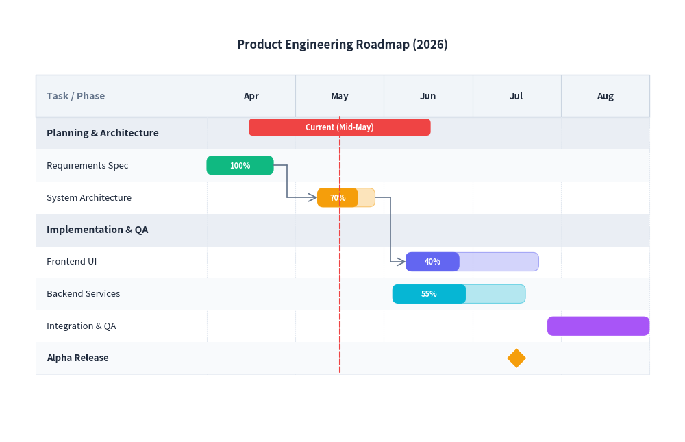
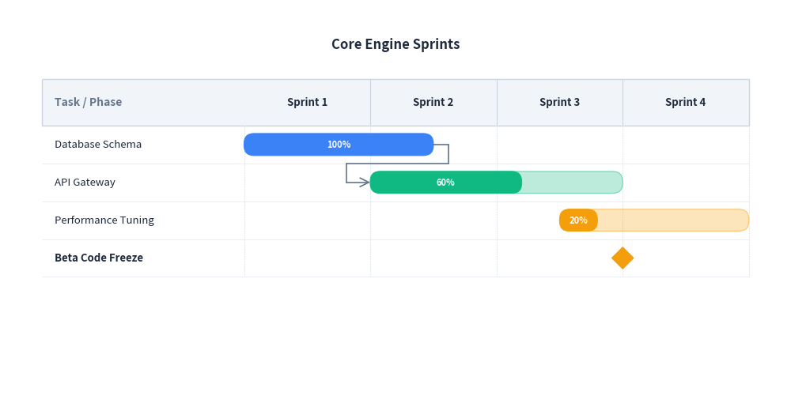

# Gantt Chart Guide

`drawlib.charts.GanttChart` provides declarative, vector-grade Gantt schedule charts for project roadmaps, release planning, and workflow timelines.

Drawing inspiration from sequence diagrams, `GanttChart` structures timeline columns horizontally along the X-axis while sequentially stacking task rows, section banners, and milestones downwards along the Y-axis.

---

## 1. Quick Start: Project Roadmap

Create a multi-phase project schedule with tasks, sections, progress bars, milestones, and dependencies:


```python
from drawlib import canvas
from drawlib.charts import GanttChart

canvas.initialize()
canvas.config(width=96, height=62)

chart = GanttChart(
    columns=["Apr", "May", "Jun", "Jul", "Aug"],
    width=90.0,
    height=55.0,
    title="Product Engineering Roadmap (2026)",
    header_height=6.0,
)

chart.add_section("Planning & Architecture")
t1 = chart.add_task("Requirements Spec", start="Apr", end=0.75, progress=1.0)
t2 = chart.add_task("System Architecture", start=1.25, end=1.9, progress=0.7)

chart.add_section("Implementation & QA")
t3 = chart.add_task("Frontend UI", start=2.25, end=3.75, progress=0.4)
chart.add_task("Backend Services", start=2.1, end=3.6, progress=0.55)
chart.add_task("Integration & QA", start=3.85, end="Aug", progress=0.0)

chart.add_milestone("Alpha Release", at="Jul")
chart.add_dependency(t1, t2)
chart.add_dependency(t2, t3)
chart.add_marker(at=1.5, label="Current (Mid-May)")

chart.draw(xy=(3.0, 3.0))
```

<figure class="drawlib-image" style="text-align: center;">
  
  <figcaption class="drawlib-caption">Project Roadmap Schedule</figcaption>
</figure>


---

## 2. Sprint Planning & Custom Colors

Specify numerical or sprint offsets, customize bar colors and corner rounding:


```python
from drawlib import canvas
from drawlib.charts import GanttChart

canvas.initialize()
canvas.config(width=94, height=48)

chart = GanttChart(
    columns=["Sprint 1", "Sprint 2", "Sprint 3", "Sprint 4"],
    width=88.0,
    height=42.0,
    title="Core Engine Sprints",
    bar_radius=1.2,
    show_zebra=False,
)

t1 = chart.add_task("Database Schema", start=0.0, end=1.5, progress=1.0, color=(59, 130, 246))
t2 = chart.add_task("API Gateway", start=1.0, end=3.0, progress=0.6, color=(16, 185, 129))
t3 = chart.add_task("Performance Tuning", start=2.5, end=4.0, progress=0.2, color=(245, 158, 11))

chart.add_dependency(t1, t2)
chart.add_milestone("Beta Code Freeze", at=3.0)

chart.draw(xy=(3.0, 3.0))
```

<figure class="drawlib-image" style="text-align: center;">
  
  <figcaption class="drawlib-caption">Sprint Schedule</figcaption>
</figure>


---

## 3. API Reference

### `GanttChart`

| Parameter | Type | Default | Description |
|---|---|---|---|
| `columns` | `list[str]` | Required | Ordered timeline interval labels along the horizontal X-axis. |
| `width` | `float` | `90.0` | Overall bounding box width. |
| `height` | `float \| None` | `None` | Overall bounding box height. If None, calculated from row count. |
| `row_height` | `float` | `4.5` | Height per task or section row. |
| `header_height` | `float` | `5.5` | Height of the top column header band. |
| `label_width` | `float` | `24.0` | Horizontal width allocated for the left task name column. |
| `title` | `str` | `""` | Chart title displayed at the top. |
| `title_style` | `Style \| None` | `None` | Style overriding title typography. |
| `header_style` | `Style \| None` | `None` | Style overriding header background and borders. |
| `grid_style` | `Style \| None` | `None` | Style overriding vertical timeline gridlines. |
| `task_style` | `Style \| None` | `None` | Default Style for task bars. |
| `section_style` | `Style \| None` | `None` | Default Style for section divider rows. |
| `show_vertical_grid` | `bool` | `True` | Whether to draw vertical column boundary lines. |
| `show_zebra` | `bool` | `True` | Whether to alternate row background colors. |
| `bar_radius` | `float` | `0.8` | Corner radius for task bars. |

### Methods

- `add_task(name: str, start: str | float, end: str | float, progress=0.0, color=None, style=None, show_progress_text=True) -> GanttTask`: Add a task bar spanning start to end.
- `add_section(name: str, style=None) -> GanttSection`: Add a full-width category section banner.
- `add_milestone(name: str, at: str | float, color=None, style=None) -> GanttMilestone`: Add a zero-duration diamond milestone marker.
- `add_marker(at: str | float, label="", color=None, style=None) -> GanttMarker`: Add a vertical reference line across all rows (e.g. today).
- `add_dependency(from_task: GanttTask, to_task: GanttTask, color=None, style=None) -> GanttDependency`: Draw an orthogonal arrow linking predecessor and successor tasks.
- `get_size() -> tuple[float, float]`: Return calculated (width, height) bounding dimensions.
- `draw(xy: tuple[float, float] = (0.0, 0.0)) -> None`: Render the Gantt chart onto the canvas.
