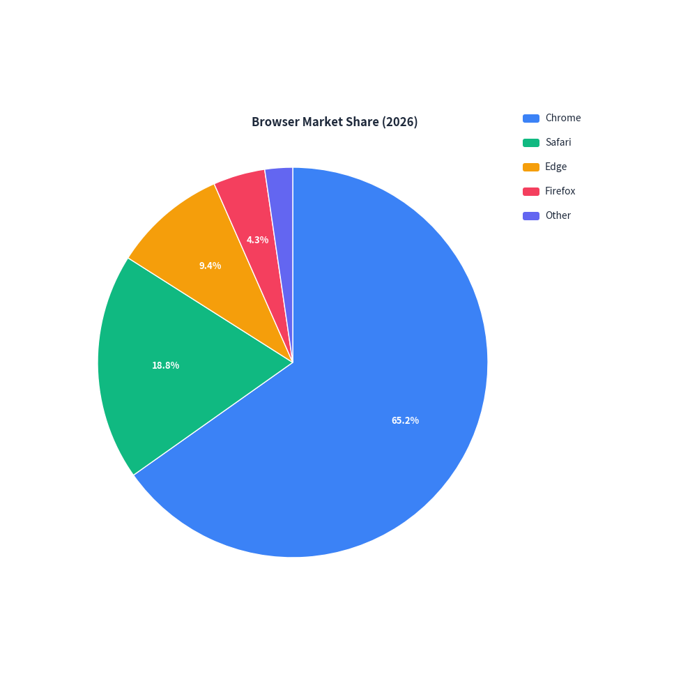
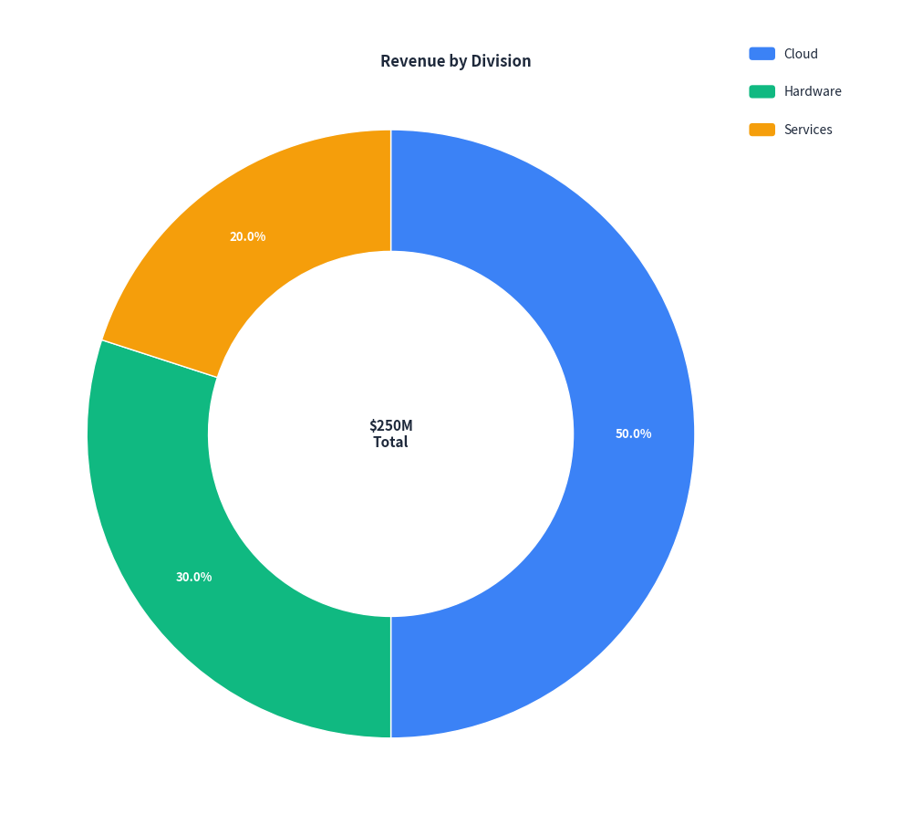
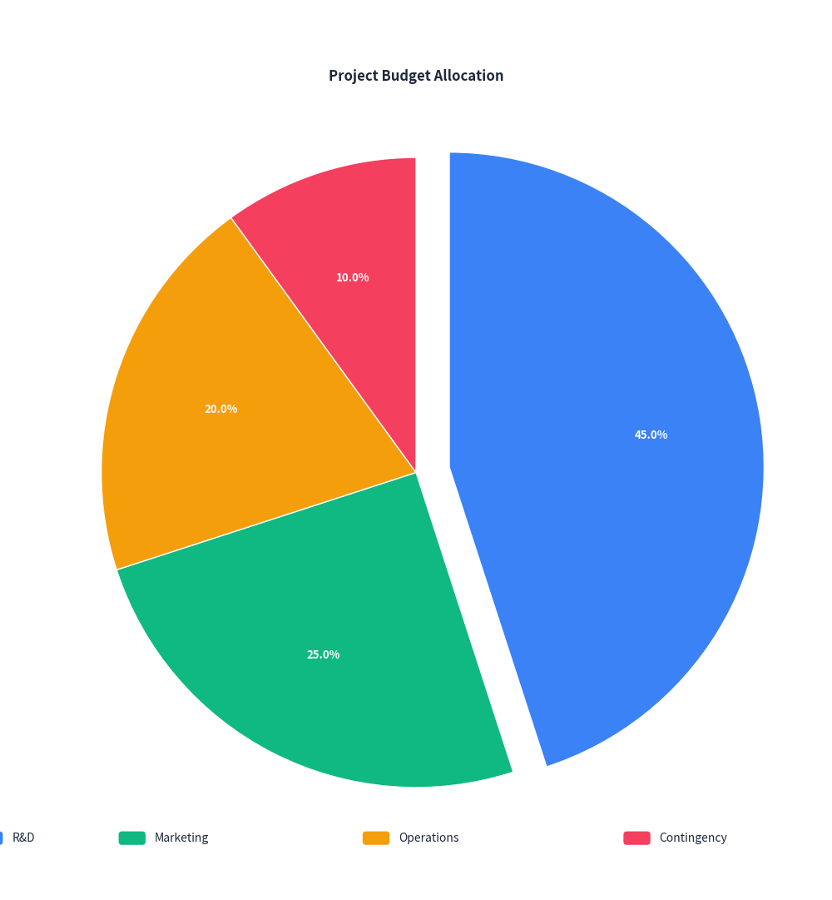

# Pie & Donut Chart Guide

`drawlib.charts.PieChart` provides modern 2D pie and donut charts for proportional data visualization. Slices, labels, and legends are automatically formatted and laid out with fine-grained control over center badges, exploded sectors, and typography.

---

## 1. Quick Start: Standard Pie Chart

Create a clean pie chart showing proportional breakdown with automatic percentage labels and legends:


```python
from drawlib import canvas
from drawlib.charts import PieChart

canvas.initialize()
canvas.config(width=84, height=76)

chart = PieChart(
    radius=28.0,
    title="Browser Market Share (2026)",
    legend_position="right",
)
chart.add_slice("Chrome", 65.2)
chart.add_slice("Safari", 18.8)
chart.add_slice("Edge", 9.4)
chart.add_slice("Firefox", 4.3)
chart.add_slice("Other", 2.3)
chart.draw(xy=(4.0, 3.0))
```

<figure class="drawlib-image" style="text-align: center;">
  
  <figcaption class="drawlib-caption">Browser Market Share</figcaption>
</figure>


---

## 2. Donut Chart with Center Badge

Set `hole_ratio` (e.g. `0.6`) to turn any pie chart into a donut chart, and display summary metrics or KPIs in the center with `center_text`:


```python
from drawlib import canvas
from drawlib.charts import PieChart

canvas.initialize()
canvas.config(width=84, height=76)

chart = PieChart(
    radius=28.0,
    hole_ratio=0.6,
    center_text="$250M\nTotal",
    title="Revenue by Division",
    legend_position="right",
)
chart.add_slice("Cloud", 125.0)
chart.add_slice("Hardware", 75.0)
chart.add_slice("Services", 50.0)
chart.draw(xy=(4.0, 3.0))
```

<figure class="drawlib-image" style="text-align: center;">
  
  <figcaption class="drawlib-caption">Revenue Breakdown Donut</figcaption>
</figure>


---

## 3. Exploded Slices & Custom Placement

Highlight important segments by setting `explode` on individual slices, and reposition the legend to the bottom:


```python
from drawlib import canvas
from drawlib.charts import PieChart

canvas.initialize()
canvas.config(width=74, height=80)

chart = PieChart(
    radius=28.0,
    title="Project Budget Allocation",
    legend_position="bottom",
)
chart.add_slice("R&D", 45.0, explode=3.0)
chart.add_slice("Marketing", 25.0)
chart.add_slice("Operations", 20.0)
chart.add_slice("Contingency", 10.0)
chart.draw(xy=(5.0, 4.0))
```

<figure class="drawlib-image" style="text-align: center;">
  
  <figcaption class="drawlib-caption">Budget Allocation with Exploded Slice</figcaption>
</figure>


---

## 4. API Reference

### `PieChart`

| Parameter | Type | Default | Description |
|---|---|---|---|
| `radius` | `float` | `20.0` | Outer radius of the pie circle. |
| `title` | `str` | `""` | Chart title displayed at the top. |
| `title_style` | `Style \| None` | `None` | Optional typography Style for title text. |
| `hole_ratio` | `float` | `0.0` | Inner hole ratio (0.0 for solid pie, 0.1–0.9 for donut ring). |
| `center_text` | `str` | `""` | Summary text or KPI metric rendered inside the donut hole. |
| `center_text_style` | `Style \| None` | `None` | Optional typography Style for center text. |
| `start_angle` | `float` | `90.0` | Starting orientation in degrees (90.0 is 12 o'clock). |
| `clockwise` | `bool` | `True` | Whether slices progress in clockwise direction. |
| `show_values` | `bool` | `True` | Whether to print percentage labels on slices (>= 4% share). |
| `value_format` | `str \| Callable` | `"{:.1f}%"` | Format string or callable formatting slice labels. |
| `value_label_style` | `Style \| None` | `None` | Optional Style for slice value labels. |
| `legend_position` | `"auto"` \| `"top"` \| `"bottom"` \| `"right"` \| `"none"` | `"right"` | Position of the legend box. |
| `width` | `float \| None` | `None` | Optional total container width override. |
| `height` | `float \| None` | `None` | Optional total container height override. |

### Methods

- `add_slice(name: str, value: float, color=None, style=None, explode=0.0) -> PieSlice`: Add a slice segment to the chart.
- `get_size() -> tuple[float, float]`: Return the total calculated (width, height) bounding dimensions.
- `draw(xy: tuple[float, float] = (0.0, 0.0)) -> None`: Render the chart onto the canvas.

---

<p align="center"><em>© 2026 drawlib by Yuichi Ito. Released under the Apache 2.0 License.</em></p>
