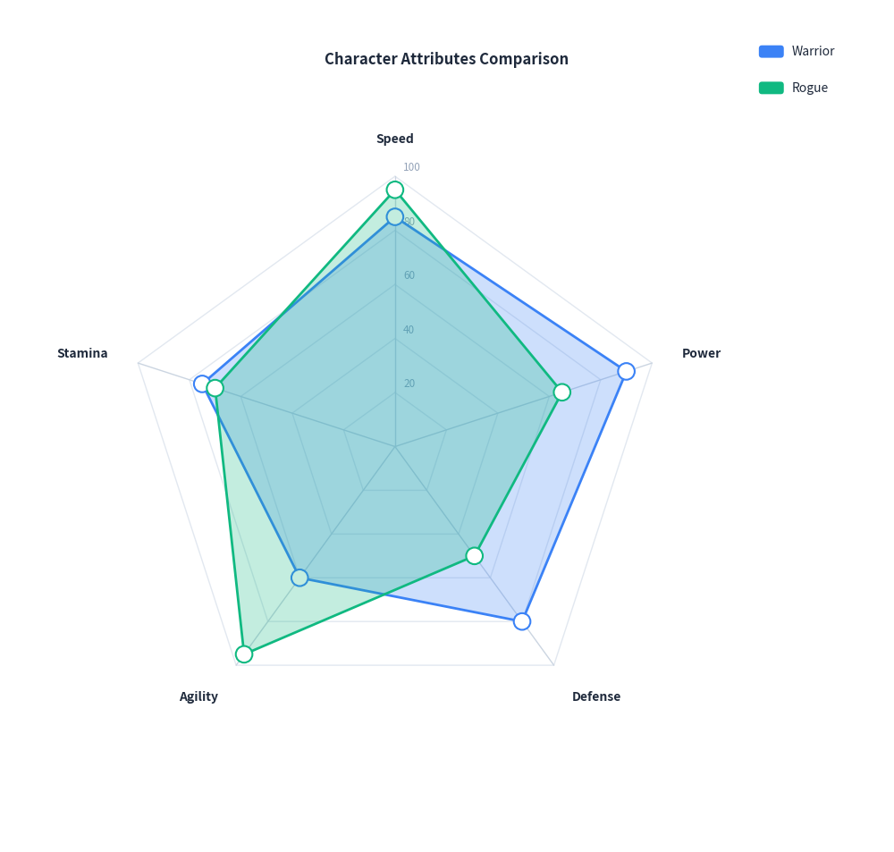
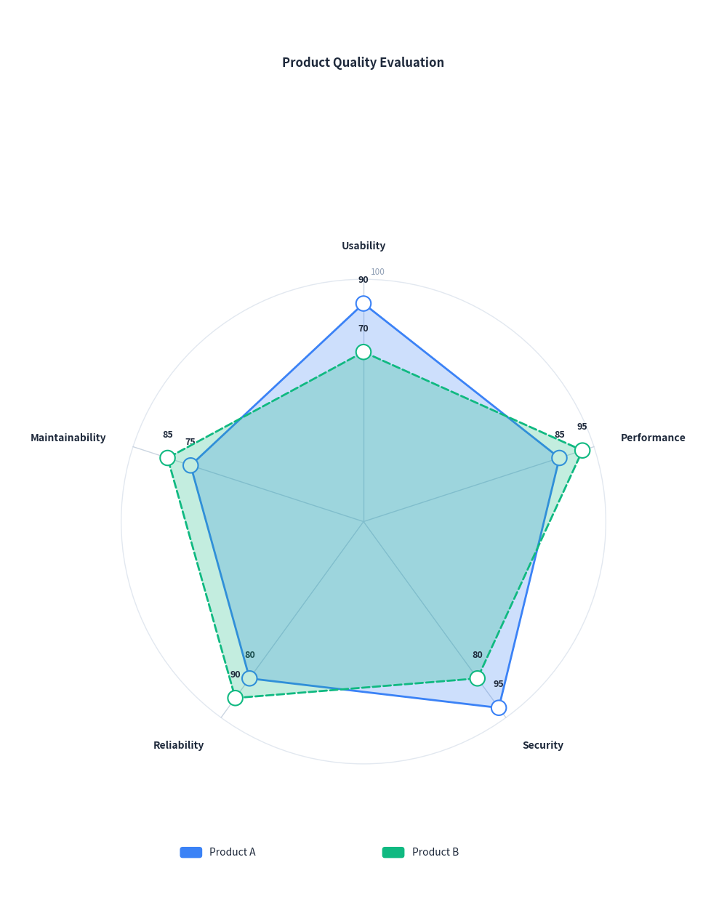

# Radar Chart Guide

`drawlib.charts.RadarChart` provides 2D radar (spider web) charts for multivariate performance analysis, skill evaluation, and multi-dimensional profile comparison.

---

## 1. Quick Start: Character Attributes Comparison

Compare multiple profiles across symmetric radial dimensions with polygon gridlines and automatic legend layout:


```python
from drawlib import canvas
from drawlib.charts import RadarChart

canvas.initialize()
canvas.config(width=86, height=82)

chart = RadarChart(
    categories=["Speed", "Power", "Defense", "Agility", "Stamina"],
    radius=26.0,
    title="Character Attributes Comparison",
    legend_position="right",
)
chart.add_series("Warrior", [85, 90, 80, 60, 75])
chart.add_series("Rogue", [95, 65, 50, 95, 70])
chart.draw(xy=(4.0, 3.0))
```

<figure class="drawlib-image" style="text-align: center;">
  
  <figcaption class="drawlib-caption">Character Attributes Comparison</figcaption>
</figure>


---

## 2. Circular Grid & Data Values

Use `grid_shape="circle"` for concentric circular contours, customize `line_style="dashed"`, and show numeric labels at each vertex with `show_values=True`:


```python
from drawlib import canvas
from drawlib.charts import RadarChart

canvas.initialize()
canvas.config(width=78, height=98)

chart = RadarChart(
    categories=["Usability", "Performance", "Security", "Reliability", "Maintainability"],
    radius=26.0,
    grid_shape="circle",
    levels=4,
    max_value=100.0,
    title="Product Quality Evaluation",
    legend_position="bottom",
    show_values=True,
)
chart.add_series("Product A", [90, 85, 95, 80, 75])
chart.add_series("Product B", [70, 95, 80, 90, 85], line_style="dashed")
chart.draw(xy=(5.0, 4.0))
```

<figure class="drawlib-image" style="text-align: center;">
  
  <figcaption class="drawlib-caption">Product Quality Evaluation</figcaption>
</figure>


---

## 3. API Reference

### `RadarChart`

| Parameter | Type | Default | Description |
|---|---|---|---|
| `categories` | `list[str]` | Required | List of dimension/axis names (minimum 3). |
| `radius` | `float` | `25.0` | Radius of the outer web boundary. |
| `min_value` | `float` | `0.0` | Value at the center origin point. |
| `max_value` | `float \| None` | `None` | Value at the outer perimeter. If None, calculated from data. |
| `levels` | `int` | `5` | Number of concentric grid rings. |
| `grid_shape` | `"polygon"` \| `"circle"` | `"polygon"` | Shape of concentric gridlines. |
| `show_grid_labels` | `bool` | `True` | Whether to display scale numbers along reference spoke. |
| `grid_label_format` | `str \| Callable \| None` | `None` | Formatter for grid scale values. |
| `grid_style` | `Style \| None` | `None` | Style overriding concentric gridlines. |
| `spoke_style` | `Style \| None` | `None` | Style overriding radial spoke lines. |
| `category_label_style` | `Style \| None` | `None` | Style overriding category label typography. |
| `title` | `str` | `""` | Chart title displayed at the top. |
| `title_style` | `Style \| None` | `None` | Style overriding title typography. |
| `legend_position` | `"auto"` \| `"top"` \| `"bottom"` \| `"right"` \| `"none"` | `"right"` | Position of legend box. |
| `show_values` | `bool` | `False` | Whether to print numeric values next to series vertices. |
| `value_format` | `str \| Callable \| None` | `None` | Formatter for vertex values. |
| `value_label_style` | `Style \| None` | `None` | Style overriding vertex value typography. |
| `width` | `float \| None` | `None` | Optional container width override. |
| `height` | `float \| None` | `None` | Optional container height override. |

### Methods

- `add_series(name: str, values: list[float], color=None, fill_alpha=0.25, line_width=2.0, line_style="solid", show_points=True, point_shape="circle", point_size=0.8, style=None) -> RadarSeries`: Register a data polygon.
- `get_size() -> tuple[float, float]`: Calculate overall bounding box dimensions.
- `draw(xy: tuple[float, float] = (0.0, 0.0)) -> None`: Render chart onto canvas.
