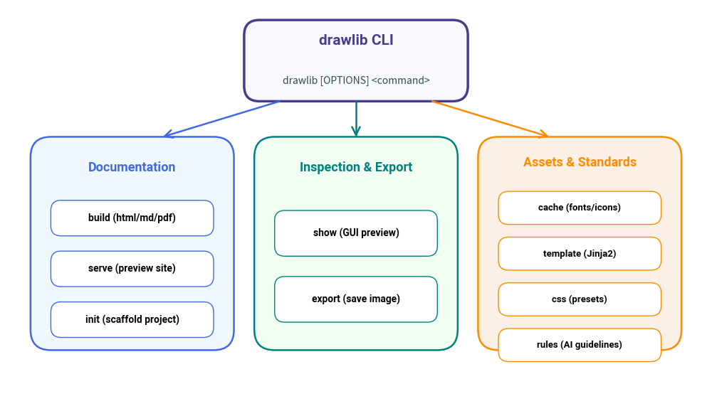

# CLI Overview & Global Options

Drawlib provides a comprehensive command line interface (`drawlib`) built on Python and Typer. It manages document builds, asset downloads, template inspection, development previewing, and AI coding agent guidelines.

---

## 1. Invoking the CLI

When Drawlib is installed in your Python environment or virtual environment via pip or uv, the `drawlib` executable is available globally:

```bash
drawlib --help
```

Alternatively, you can run the module directly through Python:

```bash
python -m drawlib --help
```

---

## 2. Command Hierarchy

The CLI is organized into specialized subcommands:

| Command | Purpose | Key Subcommands & Options |
| :--- | :--- | :--- |
| **`build`** | Compiles documents or drawing scripts into images, Markdown, HTML, or PDF. | `image`, `markdown`, `html`, `pdf` |
| **`serve`** | Launches a local HTTP development server for live previewing. | `--port`, `--check`, `--no-browser` |
| **`init`** | Scaffolds starter projects with templates. | `simple`, `site`, `pdf`, `--here` |
| **`show`** | Executes and renders a specific illustration block in a GUI viewer or file. | `--grid`, `--output`, `--config` |
| **`export`** | Headless extraction and export of a diagram directly to an image file. | `--output`, `--grid`, `--config` |
| **`cache`** | Manages local caches for dynamic release assets (fonts and icons). | `clear`, `list`, `download` |
| **`template`** | Manages built-in Jinja2 templates for HTML and PDF output. | `html`, `pdf`, `export`, `validate` |
| **`css`** | Manages built-in CSS stylesheets. | `html`, `pdf`, `export` |
| **`rules`** | Displays drawing guidelines and architectural rules for AI agents. | `show`, `build`, `topics`, `list` |


<figure class="drawlib-image" style="text-align: center;">
  
  <figcaption class="drawlib-caption">Drawlib Unified CLI Command Hierarchy</figcaption>
</figure>


---

## 3. Global Options

These options apply across all `drawlib` subcommands:

| Option | Flag | Description |
| :--- | :--- | :--- |
| `--version` | `-v` | Displays the installed software and API version and exits. |
| `--verbose` | | Enables verbose logging output (logging level `DEBUG`). |
| `--debug` | | Alias for `--verbose`. |
| `--quiet` | | Suppresses informational messages, displaying only errors. |
| `--developer` | | Enables verbose logging and disables user-facing error suppression, showing raw Python tracebacks. |
| `--help` | `-h` | Displays help message and command syntax. |

---

## 4. Next Steps

- **[`drawlib build`](./build.md)**: Compile Markdown and Python scripts to production targets.
- **[`drawlib serve`](./serve.md)**: Host documentation locally with automated asset integrity validation.
- **[`drawlib init`](./init.md)**: Bootstrap starter projects.
- **[`drawlib show` & `export`](./inspect.md)**: Interactive previewing and single-block rendering.
- **[`drawlib cache` & Assets](./assets.md)**: Manage font and icon caches.
- **[`drawlib rules`](./rules.md)**: AI agent rules and API reference manuals.

---

<p align="center"><em>© 2026 drawlib by Yuichi Ito. Released under the Apache 2.0 License.</em></p>
