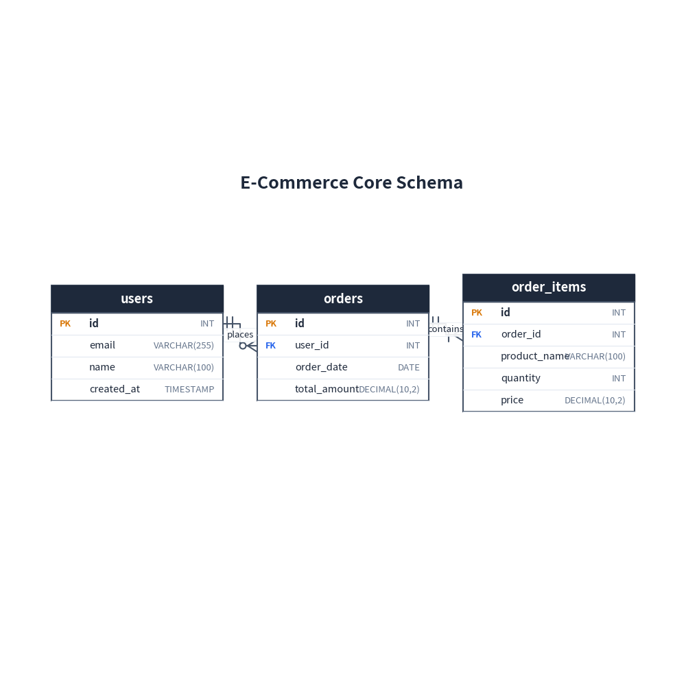
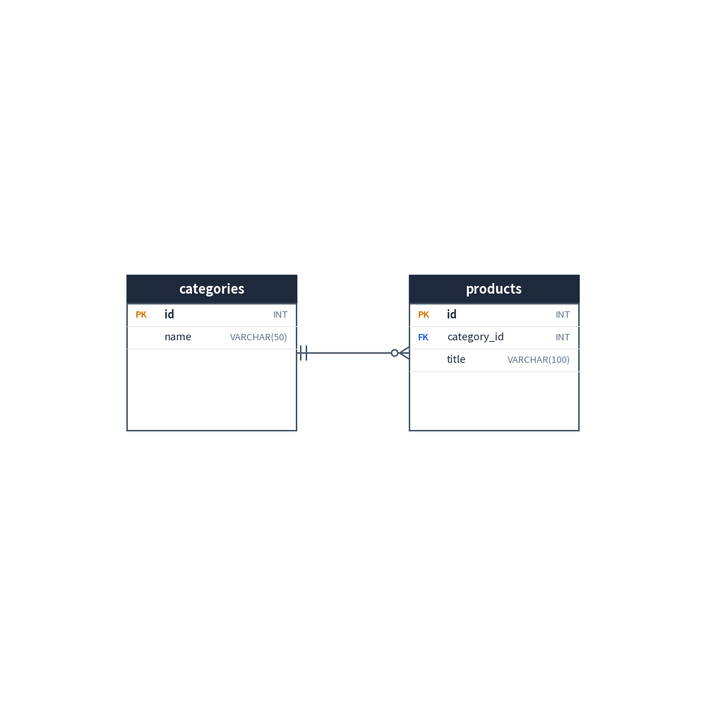
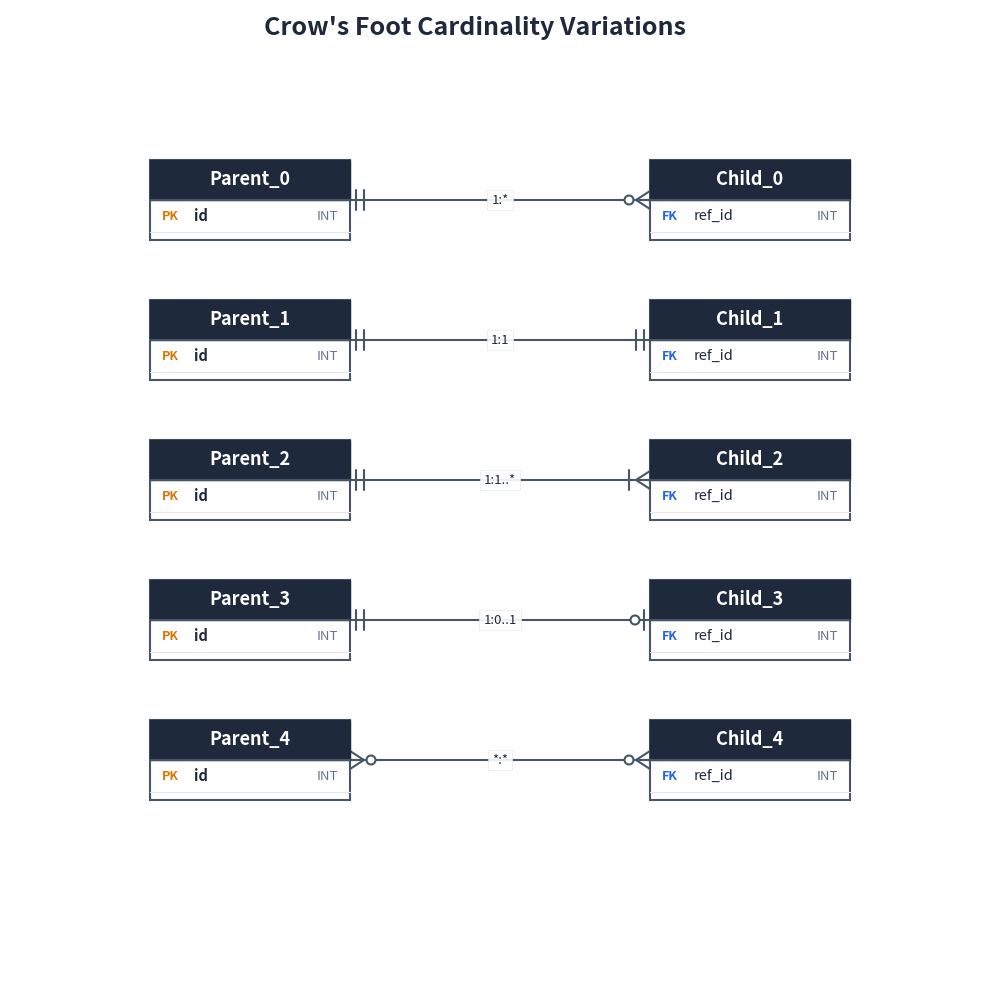
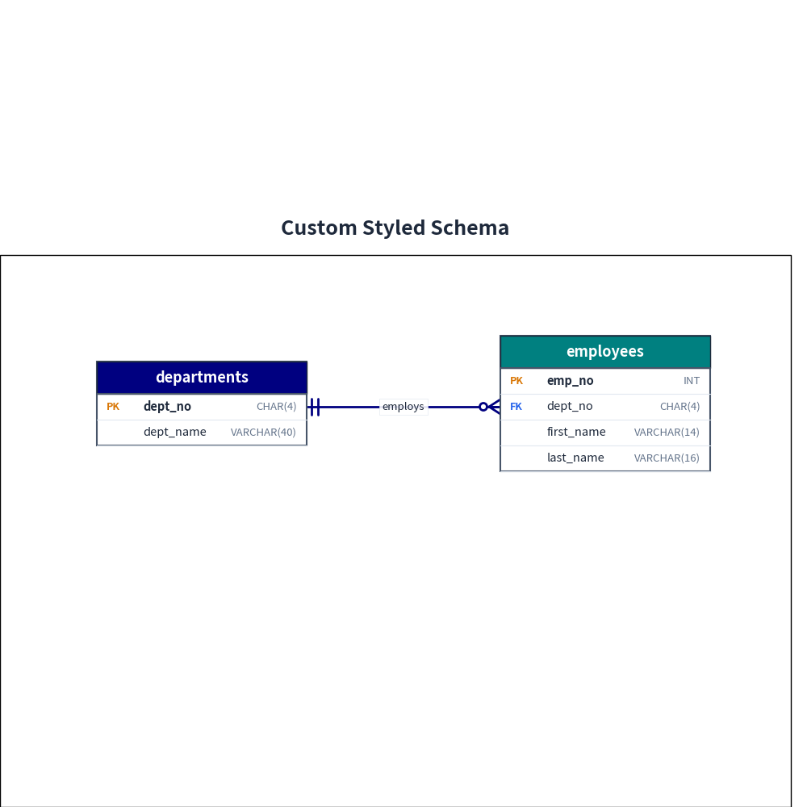

# ER Diagrams

`drawlib.diagrams.er` provides a declarative, pure-Python Entity-Relationship (ER) diagramming framework.
It adheres strictly to **IE Notation (Information Engineering / Crow's Foot notation)**—the global de-facto standard for relational database modeling.

---

## 1. Core Concepts

| Component | Class | Description |
|---|---|---|
| **Container** | `ERDiagram` | Top-level container managing entities, relationships, canvas sizing, and rendering. |
| **Table** | `Entity` | Represents a database table. `(x, y)` sets the **center** of the entity card. |
| **Connection** | `Relationship` | An edge connecting two entities with Crow's Foot multiplicity markers. |

---

## 2. Quick Start

Below is a relational schema modeling customers, orders, and order items:


```python
from drawlib import canvas
from drawlib.diagrams.er import ERDiagram, Entity

canvas.initialize()

erd = ERDiagram(title="E-Commerce Core Schema")

# 1. Define Entities
users = erd.add(Entity(name="users", width=25.0), xy=(20.0, 50.0))
users.add_column("id", type="INT", pk=True)
users.add_column("email", type="VARCHAR(255)", nullable=False)
users.add_column("name", type="VARCHAR(100)")
users.add_column("created_at", type="TIMESTAMP")

orders = erd.add(Entity(name="orders", width=25.0), xy=(50.0, 50.0))
orders.add_column("id", type="INT", pk=True)
orders.add_column("user_id", type="INT", fk=True)
orders.add_column("order_date", type="DATE")
orders.add_column("total_amount", type="DECIMAL(10,2)")

items = erd.add(Entity(name="order_items", width=25.0), xy=(80.0, 50.0))
items.add_column("id", type="INT", pk=True)
items.add_column("order_id", type="INT", fk=True)
items.add_column("product_name", type="VARCHAR(100)")
items.add_column("quantity", type="INT")
items.add_column("price", type="DECIMAL(10,2)")

# 2. Connect Relationships
# users (1) to orders (0 or more)
users.connect(
    orders,
    cardinality="1:*",
    start_side="right",
    end_side="left",
    start_column="id",
    end_column="user_id",
    label="places",
)

# orders (1) to items (1 or more)
orders.connect(
    items,
    cardinality="1:1..*",
    start_side="right",
    end_side="left",
    start_column="id",
    end_column="order_id",
    label="contains",
)

erd.draw(xy=(0.0, 0.0))
```

<figure class="drawlib-image" style="text-align: center;">
  
  <figcaption class="drawlib-caption">E-Commerce Schema ER Diagram</figcaption>
</figure>


---

## 3. Entity Configuration

### 3.1 Adding Columns

Columns can be added individually with `add_column()` or in batch using `add_columns()`:

```python
entity = Entity(name="products", width=26.0)

# Individual addition (fluent API)
entity.add_column("id", type="INT", pk=True)
entity.add_column("sku", type="VARCHAR(64)", nullable=False)

# Batch addition
entity.add_columns([
    ("price", "DECIMAL(10,2)"),
    ("stock", "INT", False, False, True),  # (name, type, pk, fk, nullable)
])
```

### 3.2 Sizing and Blank Margins

The placement coordinate `xy=(cx, cy)` in `erd.add(entity, xy=...)` defines the **center** of the entity.

Entities automatically compute their height based on the number of columns. You can also specify an explicit fixed `height` (or `size=(width, height)`). If the specified `height` is larger than the content, the extra vertical space is left as a clean, blank background area:


```python
from drawlib import canvas
from drawlib.diagrams.er import ERDiagram, Entity

canvas.initialize()

erd = ERDiagram()

# Specify a fixed height larger than content
categories = erd.add(Entity(name="categories", width=24.0, height=22.0), xy=(30.0, 50.0))
categories.add_column("id", type="INT", pk=True)
categories.add_column("name", type="VARCHAR(50)")

products = erd.add(Entity(name="products", width=24.0, height=22.0), xy=(70.0, 50.0))
products.add_column("id", type="INT", pk=True)
products.add_column("category_id", type="INT", fk=True)
products.add_column("title", type="VARCHAR(100)")

categories.connect(products, cardinality="1:*", start_side="right", end_side="left")

erd.draw()
```

<figure class="drawlib-image" style="text-align: center;">
  
  <figcaption class="drawlib-caption">Fixed-Size Entity with Blank Area</figcaption>
</figure>


---

## 4. Cardinality Notations (IE / Crow's Foot)

Drawlib provides strict type support via `Literal` for standard IE Crow's Foot cardinalities:

| Cardinality | Start Marker | End Marker | Description |
|---|---|---|---|
| `"1:*"` | Exactly 1 (`\|\|`) | Zero or more (`o<`) | Standard One-to-Many (default) |
| `"1:1"` | Exactly 1 (`\|\|`) | Exactly 1 (`\|\|`) | One-to-One |
| `"1:1..*"` | Exactly 1 (`\|\|`) | One or more (`\|<`) | Mandatory Child |
| `"1:0..1"` | Exactly 1 (`\|\|`) | Zero or one (`o\|`) | Optional One-to-One |
| `"0..1:1"` | Zero or one (`o\|`) | Exactly 1 (`\|\|`) | Optional Parent |
| `"0..1:*"` | Zero or one (`o\|`) | Zero or more (`o<`) | Optional One-to-Many |
| `"*:*"` | Zero or more (`o<`) | Zero or more (`o<`) | Many-to-Many |


```python
from drawlib import canvas
from drawlib.diagrams.er import ERDiagram, Entity, Cardinality

canvas.initialize()

cardinalities: list[Cardinality] = [
    "1:*",
    "1:1",
    "1:1..*",
    "1:0..1",
    "*:*",
]

erd = ERDiagram(title="Crow's Foot Cardinality Variations")

for idx, card in enumerate(cardinalities):
    y = 80.0 - idx * 14.0
    src = erd.add(Entity(name=f"Parent_{idx}", width=20.0, height=8.0), xy=(25.0, y))
    src.add_column("id", type="INT", pk=True)

    tgt = erd.add(Entity(name=f"Child_{idx}", width=20.0, height=8.0), xy=(75.0, y))
    tgt.add_column("ref_id", type="INT", fk=True)

    src.connect(tgt, cardinality=card, label=card)

erd.draw()
```

<figure class="drawlib-image" style="text-align: center;">
  
  <figcaption class="drawlib-caption">Supported IE Crow's Foot Cardinalities</figcaption>
</figure>


---

## 5. Routing and Anchoring

### 5.1 Orthogonal Routing

By default, relationships use smart right-angled (orthogonal) routing (`routing="orthogonal"`), generating clean Z-bends and L-bends. You can also specify `routing="direct"` for direct straight lines.

### 5.2 Attachment Sides

Sides can be explicitly chosen using `start_side` and `end_side`:
- `"left"`, `"right"`, `"top"`, `"bottom"`, or `"auto"` (default).

When `"auto"` is used, Drawlib automatically determines the nearest opposite sides based on relative entity positions.

### 5.3 Column-Level Anchoring

To connect a relationship directly to specific columns, pass `start_column` and/or `end_column`. When connecting from the left or right side, the edge aligns with the vertical center of the designated column row:

```python
users.connect(
    orders,
    cardinality="1:*",
    start_side="right",
    end_side="left",
    start_column="id",       # Line connects to 'id' row in users
    end_column="user_id",    # Line connects to 'user_id' row in orders
)
```

---

## 6. Custom Styling

Entities and relationships fully integrate with Drawlib's `Style` class:


```python
from drawlib import canvas
from drawlib._core.l3_styles import Colors, Style
from drawlib.diagrams.er import ERDiagram, Entity

canvas.initialize()

erd = ERDiagram(
    title="Custom Styled Schema",
    style=Style(fill_color=Colors.White),
)

# Custom header colors
departments = erd.add(
    Entity(
        name="departments",
        width=26.0,
        header_style=Style(fill_color=Colors.Navy, text_color=Colors.White),
    ),
    xy=(25.0, 50.0),
)
departments.add_column("dept_no", type="CHAR(4)", pk=True)
departments.add_column("dept_name", type="VARCHAR(40)")

employees = erd.add(
    Entity(
        name="employees",
        width=26.0,
        header_style=Style(fill_color=Colors.Teal, text_color=Colors.White),
    ),
    xy=(75.0, 50.0),
)
employees.add_column("emp_no", type="INT", pk=True)
employees.add_column("dept_no", type="CHAR(4)", fk=True)
employees.add_column("first_name", type="VARCHAR(14)")
employees.add_column("last_name", type="VARCHAR(16)")

departments.connect(
    employees,
    cardinality="1:*",
    start_side="right",
    end_side="left",
    start_column="dept_no",
    end_column="dept_no",
    label="employs",
    style=Style(line_color=Colors.Navy, line_width=2.0),
)

erd.draw()
```

<figure class="drawlib-image" style="text-align: center;">
  
  <figcaption class="drawlib-caption">Custom Styled ER Diagram</figcaption>
</figure>


