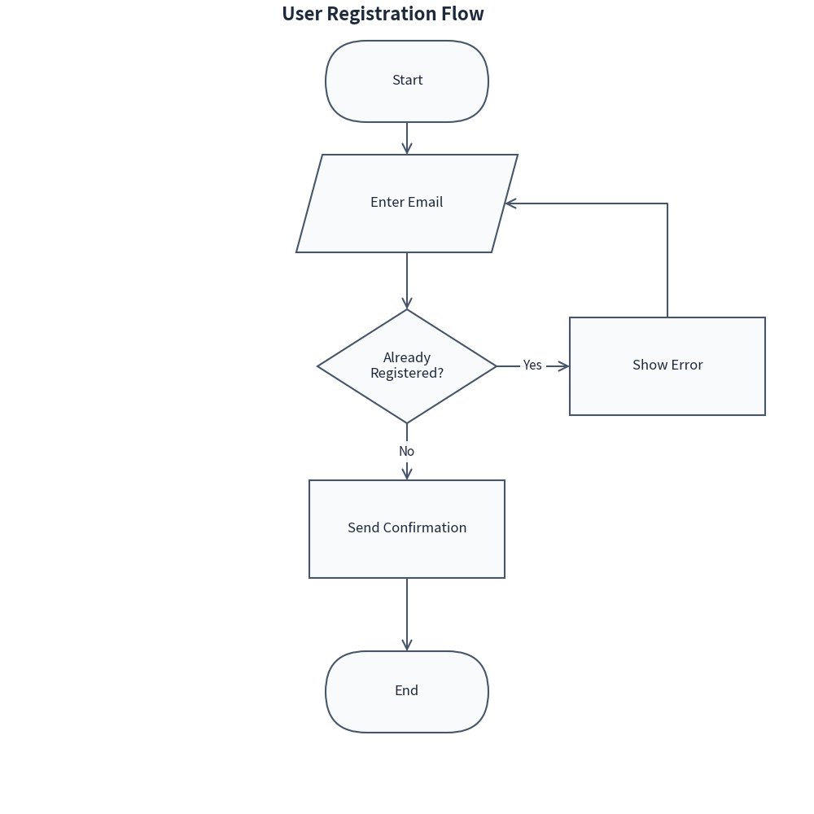
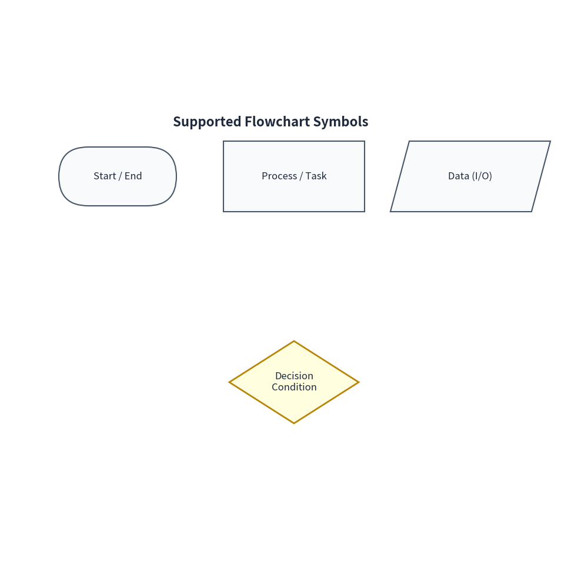
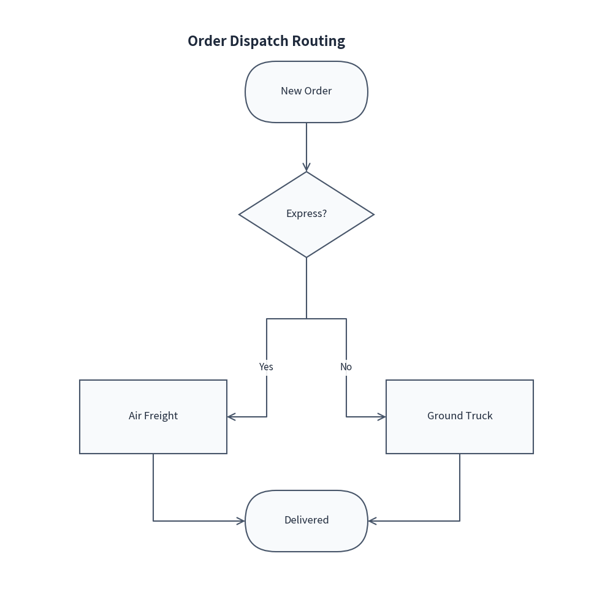
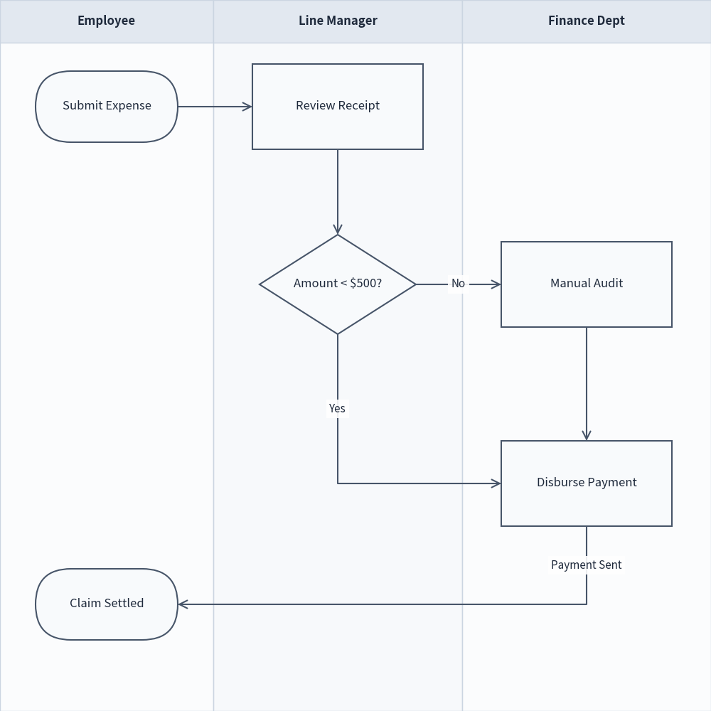

# Flow Diagrams

`drawlib.diagrams.flow` provides a declarative, pure-Python flowchart and business process workflow diagramming module within `drawlib`.
It adheres to standard flowchart conventions (ISO 5807 / JIS X 0121) and supports cross-functional swimlane diagrams.

---

## 1. Core Concepts

| Component | Class | Description |
|---|---|---|
| **Container** | `FlowDiagram` | Top-level container managing nodes, swimlanes, junctions, and connections. |
| **Action Step** | `Process` | Rectangular task or action block (`shape_type="process"`). |
| **Decision** | `Decision` | Rhombus / diamond shape representing a conditional branch (`shape_type="decision"`). |
| **Terminal** | `Start` / `End` | Rounded stadium (pill) shape marking the start or end of a flow. |
| **Input / Output** | `Data` | Parallelogram representing data input, output, or documents (`shape_type="data"`). |
| **Waypoint / Tap** | `Junction` | Zero-size connectable point `(x, y)` for T-junction branching and wire taps. |
| **Swimlane** | `Lane` | Column or row background boundary with a header card for grouping roles or actors. |
| **Connection** | `FlowEdge` | Directed or undirected connection line with orthogonal routing, arrowheads, and labels. |

---

## 2. Quick Start

Below is a typical flowchart with input, conditional branching (Yes/No), and a loopback path:


```python
from drawlib import canvas
from drawlib.diagrams.flow import (
    Data,
    Decision,
    End,
    FlowDiagram,
    Process,
    Start,
)

canvas.initialize()

flow = FlowDiagram(title="User Registration Flow")

# 1. Add nodes (coordinates specify shape center)
start = flow.add(Start("Start"), xy=(50.0, 90.0))
input_email = flow.add(Data("Enter Email"), xy=(50.0, 75.0))
check_exist = flow.add(Decision("Already\nRegistered?"), xy=(50.0, 55.0))
send_mail = flow.add(Process("Send Confirmation"), xy=(50.0, 35.0))
show_error = flow.add(Process("Show Error"), xy=(82.0, 55.0))
end = flow.add(End("End"), xy=(50.0, 15.0))

# 2. Connect steps
start.connect(input_email)
input_email.connect(check_exist)

# Decision branches
check_exist.connect(send_mail, label="No", start_side="bottom", end_side="top")
check_exist.connect(show_error, label="Yes", start_side="right", end_side="left")

# Loopback to input step
show_error.connect(input_email, start_side="top", end_side="right")

send_mail.connect(end)

flow.draw()
```

<figure class="drawlib-image" style="text-align: center;">
  
  <figcaption class="drawlib-caption">User Registration Flow</figcaption>
</figure>


---

## 3. Node Geometries and Arguments

All nodes in `drawlib.diagrams.flow` derive from `FlowNode` and follow Drawlib's standard shape argument conventions:

| Argument | Type | Default | Description |
|---|---|---|---|
| `text` | `str` | `""` | Text centered inside the geometric shape (multiline supported with `\n`). |
| `width` | `float` | `24.0` (`20.0` for Start/End, `22.0` for Decision) | Width of the node boundary. |
| `height` | `float` | `12.0` (`10.0` for Start/End, `14.0` for Decision) | Height of the node boundary. |
| `r` | `float` | `0.0` (`5.0` for Start/End) | Corner radius for rounded corners. |
| `style` | `Style \| None` | `None` | Fill color, border stroke width, and border color. |
| `textstyle` | `Style \| None` | `None` | Typography style (font, color, bold, alignment). |
| `textsize` | `float \| None` | `None` | Font size shorthand. |


```python
from drawlib import canvas
from drawlib.colors import Colors140
from drawlib.diagrams.flow import (
    Data,
    Decision,
    End,
    FlowDiagram,
    Process,
    Start,
)
from drawlib.types import Style

canvas.setup(width=95, height=55)

flow = FlowDiagram(title="Supported Flowchart Symbols")

flow.add(Start("Start / End"), xy=(18.0, 36.0))
flow.add(Process("Process / Task"), xy=(50.0, 36.0))
flow.add(Data("Data (I/O)"), xy=(82.0, 36.0))

decision_style = Style(
    shape_fill_color=Colors140.LightYellow,
    shape_line_color=Colors140.DarkGoldenRod,
    shape_line_width=2.0,
)
flow.add(Decision("Decision\nCondition", style=decision_style), xy=(50.0, 15.0))

flow.draw()
```

<figure class="drawlib-image" style="text-align: center;">
  
  <figcaption class="drawlib-caption">Standard Flowchart Shape Types</figcaption>
</figure>


---

## 4. Branching and Junctions

### 4.1 Decision Branching (Yes / No)

Branching paths can be defined using explicit connection sides (`start_side`, `end_side`) and labels:

```python
decision = flow.add(Decision("Is Valid?"), xy=(50.0, 60.0))
on_success = flow.add(Process("Proceed"), xy=(50.0, 35.0))
on_failure = flow.add(Process("Handle Error"), xy=(80.0, 60.0))

decision.connect(on_success, label="Yes", start_side="bottom", end_side="top")
decision.connect(on_failure, label="No", start_side="right", end_side="left")
```

### 4.2 T-Junctions and Intermediate Branch Points

Use `flow.junction(xy)` or `edge.add_point(xy)` to create branch junctions (identical to `ArchitectureDiagram`):


```python
from drawlib import canvas
from drawlib.diagrams.flow import (
    Decision,
    End,
    FlowDiagram,
    Process,
    Start,
)

canvas.initialize()

flow = FlowDiagram(title="Order Dispatch Routing")

start = flow.add(Start("New Order"), xy=(50.0, 85.0))
check = flow.add(Decision("Express?"), xy=(50.0, 65.0))

# Create a waypoint junction below the decision
j = flow.junction(xy=(50.0, 48.0))
check.connect(j)

# Branch out from the junction
air = flow.add(Process("Air Freight"), xy=(25.0, 32.0))
ground = flow.add(Process("Ground Truck"), xy=(75.0, 32.0))

j.connect(air, label="Yes", routing="orthogonal")
j.connect(ground, label="No", routing="orthogonal")

# Merge into End
end = flow.add(End("Delivered"), xy=(50.0, 15.0))
air.connect(end, start_side="bottom", end_side="left")
ground.connect(end, start_side="bottom", end_side="right")

start.connect(check)
flow.draw()
```

<figure class="drawlib-image" style="text-align: center;">
  
  <figcaption class="drawlib-caption">Branching and Merging with Junctions</figcaption>
</figure>


---

## 5. Cross-Functional Swimlanes

Swimlanes separate steps into columns or rows representing departments, actors, or microservices.

### 5.1 Global Coordinate Alignment

In `FlowDiagram`, swimlanes act as a clean background and boundary layer on top of a unified global coordinate system.
This allows tasks across different lanes to be effortlessly aligned along the same horizontal line ($Y$ coordinate):


```python
from drawlib import canvas
from drawlib.diagrams.flow import (
    Decision,
    End,
    FlowDiagram,
    Process,
    Start,
)

canvas.initialize()

flow = FlowDiagram(title="Expense Approval Workflow", width=100.0, height=100.0)

# 1. Define vertical lanes (columns from left to right)
flow.add_lane("Employee", width=30.0)
flow.add_lane("Line Manager", width=35.0)
flow.add_lane("Finance Dept", width=35.0)

# 2. Add nodes (Y coordinates align corresponding steps horizontally)
submit = flow.add(Start("Submit Expense"), xy=(15.0, 85.0))
review = flow.add(Process("Review Receipt"), xy=(47.5, 85.0))
decision = flow.add(Decision("Amount < $500?"), xy=(47.5, 60.0))

manual_audit = flow.add(Process("Manual Audit"), xy=(82.5, 60.0))
disburse = flow.add(Process("Disburse Payment"), xy=(82.5, 32.0))
end = flow.add(End("Claim Settled"), xy=(15.0, 15.0))

# 3. Connect cross-lane steps
submit.connect(review)
review.connect(decision)
decision.connect(manual_audit, label="No", start_side="right", end_side="left")
decision.connect(disburse, label="Yes", start_side="bottom", end_side="left")
manual_audit.connect(disburse, start_side="bottom", end_side="top")
disburse.connect(end, label="Payment Sent", start_side="bottom", end_side="right")

flow.draw()
```

<figure class="drawlib-image" style="text-align: center;">
  
  <figcaption class="drawlib-caption">Cross-Functional Swimlane Approval Flow</figcaption>
</figure>


### 5.2 Horizontal Swimlanes

Set `lane_orientation="horizontal"` to lay out lanes as rows from top to bottom:

```python
flow = FlowDiagram(title="Warehouse Pipeline", lane_orientation="horizontal", width=100.0, height=60.0)

flow.add_lane("Storefront", height=30.0)
flow.add_lane("Warehouse", height=30.0)

order = flow.add(Start("New Order"), xy=(20.0, 45.0))
pack = flow.add(Process("Pack Items"), xy=(50.0, 15.0))
ship = flow.add(End("Ship Order"), xy=(80.0, 15.0))

order.connect(pack)
pack.connect(ship)
```

---

<p align="center"><em>© 2026 drawlib by Yuichi Ito. Released under the Apache 2.0 License.</em></p>
