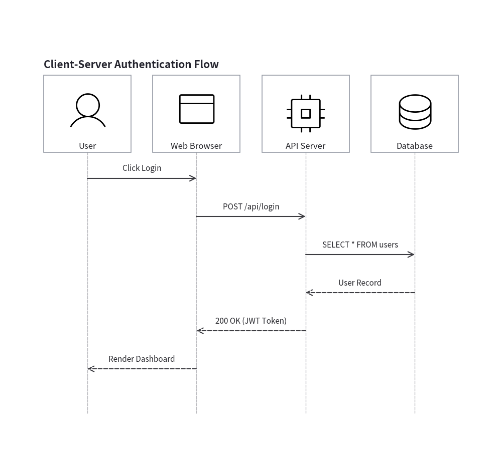
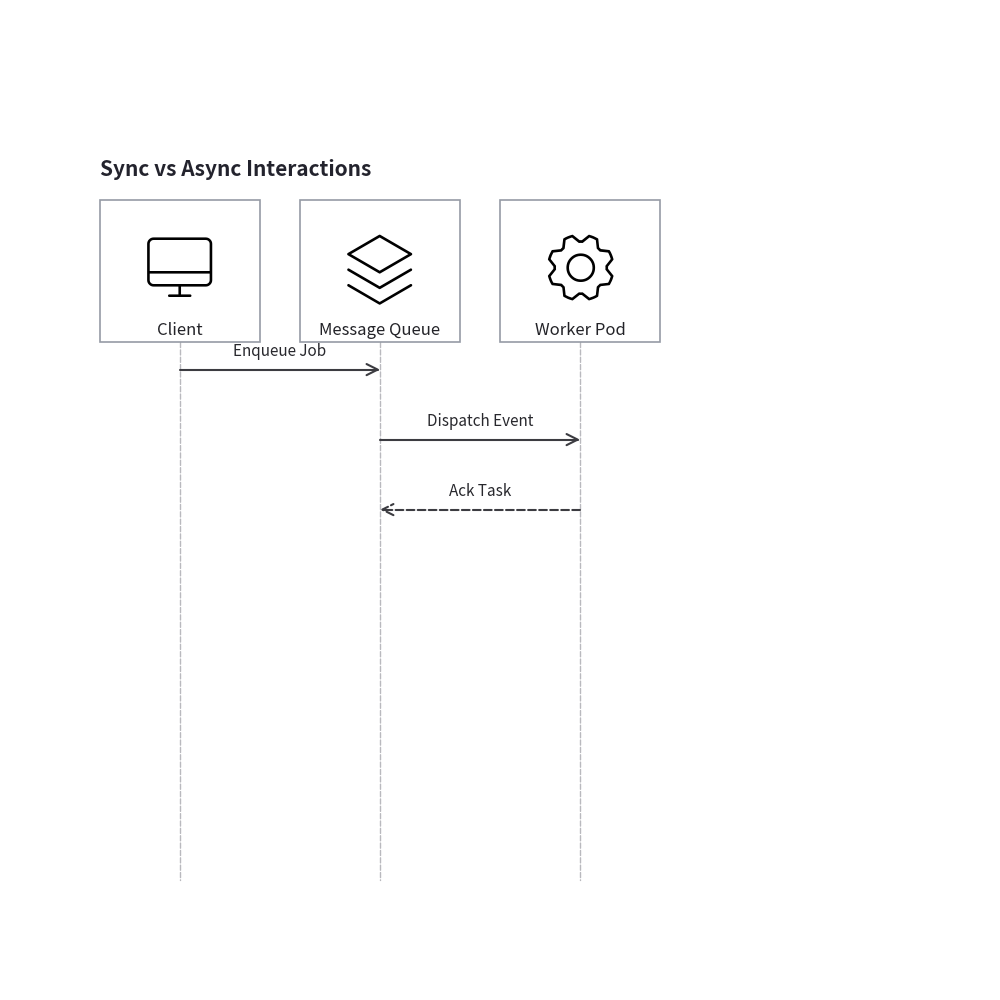
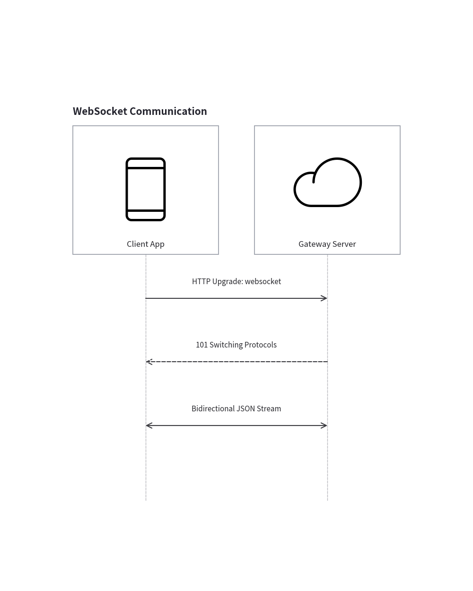
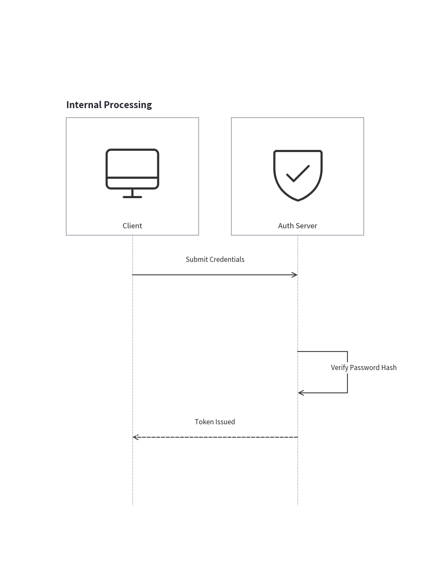
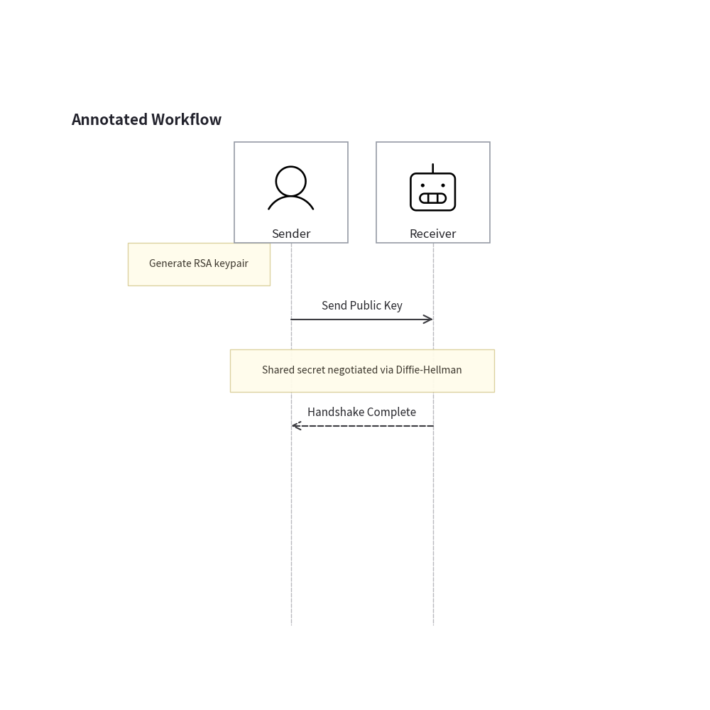
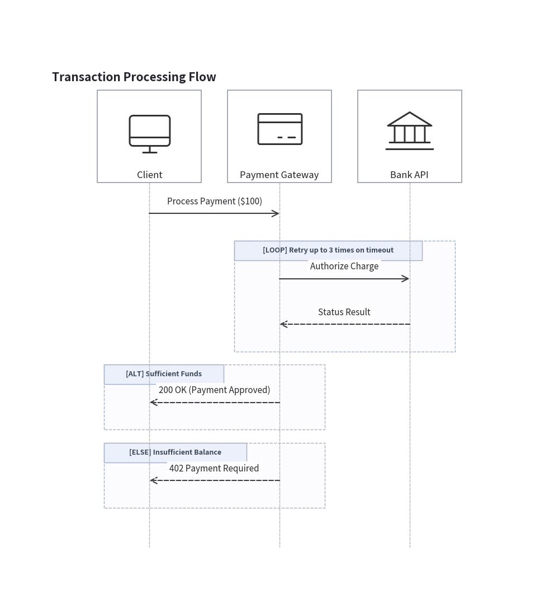
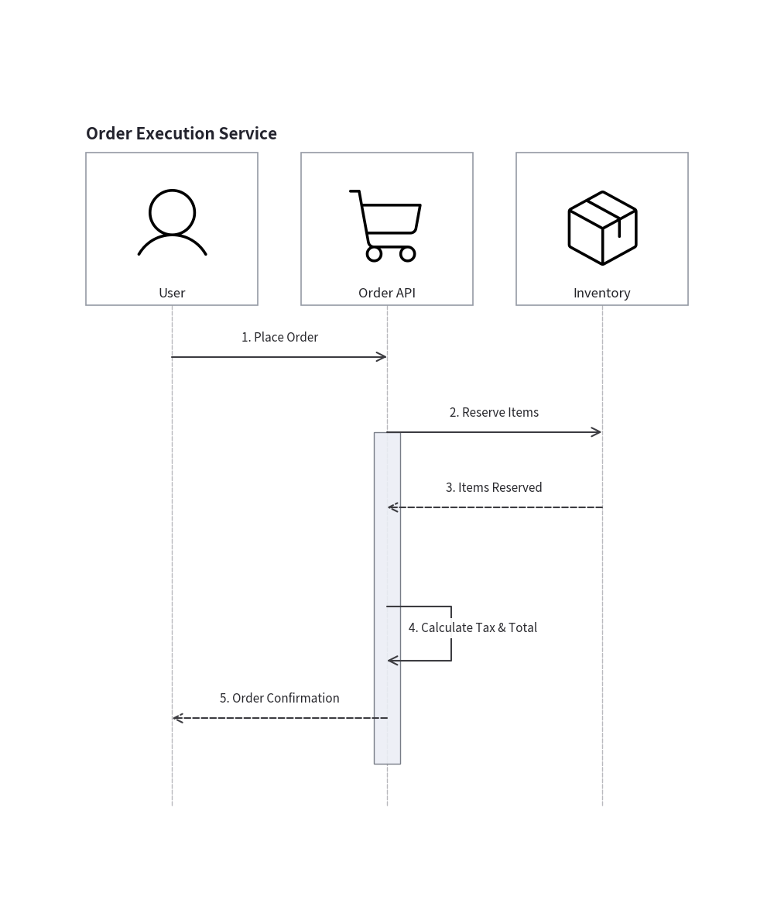
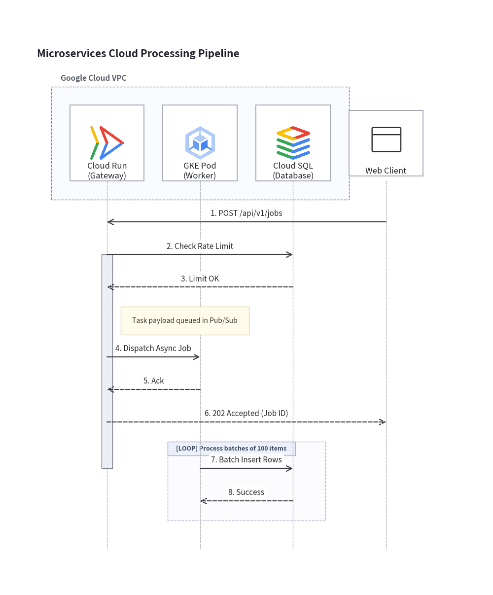

# Sequence Diagrams

`drawlib.diagrams.sequence` provides a declarative, pure-Python sequence diagramming framework.
Unlike external text-to-diagram engines that rely on cryptic ASCII notation (`->>`, `-->>`, `-)`), Drawlib gives you clean, Pythonic method verbs (`request()`, `reply()`, `connect()`), automatic top-to-bottom timeline pacing, structured condition blocks via Python `with` statements, and seamless integration with Drawlib's vector canvas and icon ecosystems.

---

## 1. Core Concepts

Sequence diagrams consist of 6 primary building blocks:

| Component | Class | Description |
|---|---|---|
| **Container** | `SequenceDiagram` | Manages participant lifelines, chronological timeline steps, auto-layout, and rendering. |
| **Participant** | `Participant` | An actor, microservice, or system component with a vertical lifeline. |
| **Message** | `Message` | A horizontal interaction arrow (`request()`, `reply()`, `connect()`, or self-call). |
| **Annotation** | `Note` | A sticky callout card placed beside a lifeline or spanning across multiple participants. |
| **Frame Block** | `Block` | A boundary box for condition branches (`alt` / `else_`), loops (`loop`), or optionals (`opt`). |
| **Group Box** | `ParticipantGroup` | A header clustering box enclosing a group of participant cards (e.g. `box "Internal VPC"`). |

---

## 2. Quick Start: Request & Reply

In Drawlib, message semantics are expressed through clear grammatical verbs:
- **`a.request(b, label)`**: Synchronous call or invocation (solid line with arrow `―▶`).
- **`b.reply(a, label)`**: Response or return value (dashed line with arrow `---▶`).


```python
from drawlib import canvas
from drawlib.diagrams.sequence import SequenceDiagram, Participant, PhosphorIcon

canvas.initialize()
canvas.config(width=92, height=86)

d = SequenceDiagram(title="Client-Server Authentication Flow")

user = d.add(Participant("User", icon=PhosphorIcon.USER, icon_size=8.0))
client = d.add(Participant("Web Browser", icon=PhosphorIcon.BROWSER, icon_size=8.0))
server = d.add(Participant("API Server", icon=PhosphorIcon.CPU, icon_size=8.0))
db = d.add(Participant("Database", icon=PhosphorIcon.DATABASE, icon_size=8.0))

# 1. User initiates login
user.request(client, "Click Login")
client.request(server, "POST /api/login")

# 2. Server queries DB and returns response
server.request(db, "SELECT * FROM users")
db.reply(server, "User Record")

# 3. Server returns JWT and client updates view
server.reply(client, "200 OK (JWT Token)")
client.reply(user, "Render Dashboard")

d.draw(xy=(3.0, 3.0))
```

<figure class="drawlib-image" style="text-align: center;">
  
  <figcaption class="drawlib-caption">Basic Request-Reply Flow</figcaption>
</figure>


---

## 3. Message Types and Arrows

### 3.1 Synchronous vs Asynchronous

You can specify `is_async=True` to indicate non-blocking, asynchronous events (such as event streaming or queue worker dispatches). Asynchronous messages are rendered with open stick arrowheads (`―>` or `--->`):


```python
from drawlib import canvas
from drawlib.diagrams.sequence import SequenceDiagram, Participant, PhosphorIcon

canvas.initialize()
canvas.config(width=72, height=65)

d = SequenceDiagram(title="Sync vs Async Interactions")

client = d.add(Participant("Client", icon=PhosphorIcon.DESKTOP, icon_size=8.0))
queue = d.add(Participant("Message Queue", icon=PhosphorIcon.STACK, icon_size=8.0))
worker = d.add(Participant("Worker Pod", icon=PhosphorIcon.GEAR, icon_size=8.0))

# Synchronous request (solid filled arrow)
client.request(queue, "Enqueue Job")

# Asynchronous dispatch (solid open stick arrow)
queue.request(worker, "Dispatch Event", is_async=True)

# Asynchronous acknowledgment (dashed open stick arrow)
worker.reply(queue, "Ack Task", is_async=True)

d.draw(xy=(3.0, 3.0))
```

<figure class="drawlib-image" style="text-align: center;">
  
  <figcaption class="drawlib-caption">Synchronous vs Asynchronous Messages</figcaption>
</figure>


### 3.2 Bidirectional Connections (`<->`)

When two entities establish a persistent, two-way communication channel (e.g. WebSocket connection, bidirectional gRPC stream, or keep-alive synchronization) without drawing redundant round trips, use `a.connect(b, arrow="<->")`:


```python
from drawlib import canvas
from drawlib.diagrams.sequence import SequenceDiagram, Participant, PhosphorIcon

canvas.initialize()
canvas.config(width=52, height=65)

d = SequenceDiagram(title="WebSocket Communication")

client = d.add(Participant("Client App", icon=PhosphorIcon.DEVICE_MOBILE, icon_size=8.0))
server = d.add(Participant("Gateway Server", icon=PhosphorIcon.CLOUD, icon_size=8.0))

client.request(server, "HTTP Upgrade: websocket")
server.reply(client, "101 Switching Protocols")

# Bidirectional persistent communication
client.connect(server, "Bidirectional JSON Stream", arrow="<->")

d.draw(xy=(3.0, 3.0))
```

<figure class="drawlib-image" style="text-align: center;">
  
  <figcaption class="drawlib-caption">Bidirectional Stream</figcaption>
</figure>


### 3.3 Self-Calls (Internal Processing)

When a participant calls itself (`p.request(p, label)`), Drawlib automatically routes the message as an orthogonal 3-segment loop returning to the same lifeline:


```python
from drawlib import canvas
from drawlib.diagrams.sequence import SequenceDiagram, Participant, PhosphorIcon

canvas.initialize()
canvas.config(width=52, height=71)

d = SequenceDiagram(title="Internal Processing")

client = d.add(Participant("Client", icon=PhosphorIcon.DESKTOP, icon_size=8.0))
auth = d.add(Participant("Auth Server", icon=PhosphorIcon.SHIELD_CHECK, icon_size=8.0))

client.request(auth, "Submit Credentials")

# Self-call loop
auth.request(auth, "Verify Password Hash")

auth.reply(client, "Token Issued")

d.draw(xy=(3.0, 3.0))
```

<figure class="drawlib-image" style="text-align: center;">
  
  <figcaption class="drawlib-caption">Self-Invocation Loop</figcaption>
</figure>


---

## 4. Sticky Note Annotations (`Note`)

Notes provide informative context alongside lifelines or across multiple participants:
- **`p.note("...", pos="right")`** (default): Placed to the right of the participant's lifeline.
- **`p.note("...", pos="left")`**: Placed to the left of the participant's lifeline.
- **`d.note("...", over=[p1, p2])`**: Spans centered across multiple lifelines.


```python
from drawlib import canvas
from drawlib.diagrams.sequence import SequenceDiagram, Participant, PhosphorIcon

canvas.initialize()
canvas.config(width=75, height=74)

d = SequenceDiagram(title="Annotated Workflow")

sender = d.add(Participant("Sender", icon=PhosphorIcon.USER, icon_size=8.0))
receiver = d.add(Participant("Receiver", icon=PhosphorIcon.ROBOT, icon_size=8.0))

# Note on single participant
sender.note("Generate RSA keypair", pos="left")

sender.request(receiver, "Send Public Key")

# Note across multiple participants
d.note("Shared secret negotiated via Diffie-Hellman", over=[sender, receiver])

receiver.reply(sender, "Handshake Complete")

d.draw(xy=(3.0, 3.0))
```

<figure class="drawlib-image" style="text-align: center;">
  
  <figcaption class="drawlib-caption">Sticky Notes Beside and Across Lifelines</figcaption>
</figure>


---

## 5. Structured Frames (`Block` with Python `with`)

Conditional logic, alternative flows, and loops are defined naturally using Python's `with` statement. The code indentation mirrors the nested boundary frames in the rendered diagram:

- **`with d.loop("Condition"):`**: Loop / repeated sequence.
- **`with d.alt("Condition A"):`** and **`with d.else_("Condition B"):`**: Alternative branches.
- **`with d.opt("Condition"):`**: Optional execution block.
- **`with d.par("Description"):`**: Parallel concurrent steps.


```python
from drawlib import canvas
from drawlib.diagrams.sequence import SequenceDiagram, Participant, PhosphorIcon

canvas.initialize()
canvas.config(width=86, height=94)

d = SequenceDiagram(title="Transaction Processing Flow")

client = d.add(Participant("Client", icon=PhosphorIcon.DESKTOP, icon_size=8.0))
gateway = d.add(Participant("Payment Gateway", icon=PhosphorIcon.CREDIT_CARD, icon_size=8.0))
bank = d.add(Participant("Bank API", icon=PhosphorIcon.BANK, icon_size=8.0))

client.request(gateway, "Process Payment ($100)")

with d.loop("Retry up to 3 times on timeout"):
    gateway.request(bank, "Authorize Charge")
    bank.reply(gateway, "Status Result")

with d.alt("Sufficient Funds"):
    gateway.reply(client, "200 OK (Payment Approved)")
with d.else_("Insufficient Balance"):
    gateway.reply(client, "402 Payment Required")

d.draw(xy=(3.0, 3.0))
```

<figure class="drawlib-image" style="text-align: center;">
  
  <figcaption class="drawlib-caption">Loops and Conditional Blocks</figcaption>
</figure>


---

## 6. Activation Bars and Autonumbering

### 6.1 Activation Bars (`activate()` / `deactivate()`)

You can visually highlight when an entity is actively executing by calling `p.activate()` and `p.deactivate()`. Drawlib draws a slender execution rectangle along the lifeline during the active span.

### 6.2 Autonumbering (`autonumber=True`)

Setting `autonumber=True` on `SequenceDiagram` automatically prepends sequential numbers (`1.`, `2.`, `3.`, ...) to all message labels in chronological order.


```python
from drawlib import canvas
from drawlib.diagrams.sequence import SequenceDiagram, Participant, PhosphorIcon

canvas.initialize()
canvas.config(width=72, height=85)

d = SequenceDiagram(title="Order Execution Service", autonumber=True)

user = d.add(Participant("User", icon=PhosphorIcon.USER, icon_size=8.0))
app = d.add(Participant("Order API", icon=PhosphorIcon.SHOPPING_CART, icon_size=8.0))
inventory = d.add(Participant("Inventory", icon=PhosphorIcon.PACKAGE, icon_size=8.0))

user.request(app, "Place Order")

# App begins active processing
app.activate()
app.request(inventory, "Reserve Items")
inventory.reply(app, "Items Reserved")

app.request(app, "Calculate Tax & Total")
app.reply(user, "Order Confirmation")
app.deactivate()

d.draw(xy=(3.0, 3.0))
```

<figure class="drawlib-image" style="text-align: center;">
  
  <figcaption class="drawlib-caption">Activation Bars and Autonumbering</figcaption>
</figure>


---

## 7. Complete Microservices Architecture Example

Here is a full production example combining participant groups (`ParticipantGroup`), GCP icons, sticky notes, conditional branches, and custom styling:


```python
from drawlib import canvas
from drawlib.colors import Colors
from drawlib.diagrams.sequence import SequenceDiagram, GcpIcon, Participant, ParticipantGroup, PhosphorIcon
from drawlib.types import Style

canvas.initialize()
canvas.config(width=106, height=128)

d = SequenceDiagram(title="Microservices Cloud Processing Pipeline", autonumber=True)

# Participant boundary group for internal cluster
backend = d.add_group(
    ParticipantGroup(
        title="Google Cloud VPC",
        padding=4.0,
        style=Style(
            shape_fill_color=(242, 246, 255, 0.4),
            shape_line_color=Colors.Gray,
            shape_line_style="dashed",
        ),
    )
)
api = backend.add(Participant("Cloud Run\n(Gateway)", icon=GcpIcon.CLOUD_RUN, icon_size=8.0))
worker = backend.add(Participant("GKE Pod\n(Worker)", icon=GcpIcon.GOOGLE_KUBERNETES_ENGINE, icon_size=8.0))
db = backend.add(Participant("Cloud SQL\n(Database)", icon=GcpIcon.CLOUD_SQL, icon_size=8.0))

# External client
client = d.add(Participant("Web Client", icon=PhosphorIcon.BROWSER, icon_size=8.0))

# Request flow
client.request(api, "POST /api/v1/jobs")
api.activate()

api.request(db, "Check Rate Limit")
db.reply(api, "Limit OK")

api.note("Task payload queued in Pub/Sub", pos="right")

api.request(worker, "Dispatch Async Job", is_async=True)
worker.reply(api, "Ack", is_async=True)

api.reply(client, "202 Accepted (Job ID)")
api.deactivate()

# Worker processing inside loop
with d.loop("Process batches of 100 items"):
    worker.request(db, "Batch Insert Rows")
    db.reply(worker, "Success")

d.draw(xy=(3.0, 3.0))
```

<figure class="drawlib-image" style="text-align: center;">
  
  <figcaption class="drawlib-caption">Production Microservices Pipeline</figcaption>
</figure>


---

<p align="center"><em>© 2026 drawlib by Yuichi Ito. Released under the Apache 2.0 License.</em></p>
