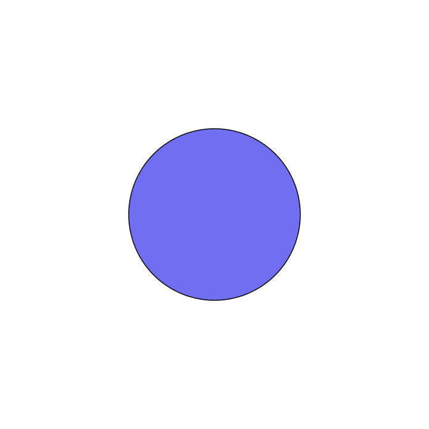

# Document Builder Guide

The `doc_builder` module compiles Markdown documents containing `drawlib` code blocks into fully rendered HTML static sites, PDFs, or GitHub-ready Markdown.

---

## 1. Using Python API (`build`)

Import `build` directly from `drawlib.doc_builder`:

```python
from drawlib.doc_builder import build

# Build GitHub Markdown documentation with embedded images
build(
    input_path="docs_src",
    output_path="docs",
    output_format="markdown"
)

# Build Web HTML documentation with built-in CSS preset
build(
    input_path="docs_src",
    output_path="docs_html",
    output_format="html",
    css_path="default"  # Presets: "default", "github", "monochrome", "minimal"
)
```

---

## 2. Using Command-Line Interface (CLI)

Drawlib provides a CLI tool accessible via `drawlib doc-builder compile`:

```bash
# Compile input directory to HTML site with "github" CSS preset
drawlib doc-builder compile docs_src -o docs_html --format html --css github

# Compile single file to PDF
drawlib doc-builder compile docs_src/index.md -o docs_html/index.pdf --format pdf
```

---

## 3. Built-in CSS Presets

When compiling HTML output, select from 4 built-in CSS presets:
- **`default`**: Drawlib signature Indigo/Violet modern design.
- **`github`**: GitHub Markdown clean light theme.
- **`monochrome`**: Slate/Zinc dark minimalist theme.
- **`minimal`**: Print-inspired editorial typography.

---

## 4. Code Block Options

Customize image size, alignment, captions, or output format directly on the code block header line using space-separated parameters:

```markdown
<!-- Shorthand syntax for 400px width and center alignment -->


```python
circle((50, 50), radius=20)
```

<div class="drawlib-image" style="text-align: center;">
  
</div>


<!-- Explicit key:value syntax with caption and SVG format override -->


```python
circle((50, 50), radius=20)
```

<figure class="drawlib-image" style="text-align: center;">
  
  <figcaption class="drawlib-caption">Network Topology</figcaption>
</figure>


```

### Available Parameters
- **`width:` / `w:`** or numeric shorthand (`400px`, `50%`) - Image width.
- **`height:` / `h:`** (`300px`) - Image height.
- **`align:` / `a:`** or shorthand (`left`, `center`, `right`) - Container alignment.
- **`format:` / `fmt:`** or shorthand (`png`, `svg`, `inline_svg`) - Per-block output format override.
- **`caption:`** (`caption:"Description"`) - Renders a `<figure>` with `<figcaption>`.
- **`class:`** (`class:custom-class`) - Custom CSS class on the container element.

---

## Navigation

- [Back to Index](./index.md)

