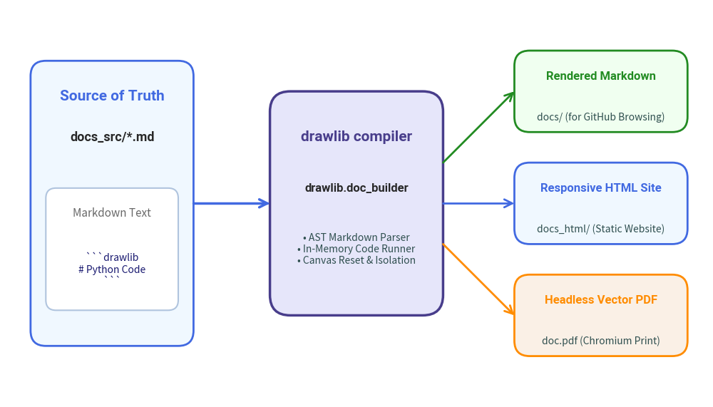

# Document Builder Overview

Drawlib follows an **"Illustration as Code"** and **"Documentation as Code"** philosophy. 
Instead of relying on external documentation engines (such as Sphinx, MkDocs, or Docusaurus) and managing external diagram image assets manually, Drawlib features a built-in documentation compiler: `drawlib.doc_builder`.

---

## 1. Core Principles

- **Single Source of Truth**: Author your documentation exclusively in standard Markdown (`.md`) containing embedded `drawlib` code blocks.
- **Zero External Diagram Generators**: Drawing scripts are executed natively during compilation, outputting vector-grade PNG, WebP, or SVG graphics.
- **Tri-Target Compilation**: A single documentation source compiles into three publication targets:
  1. **Rendered Markdown (`docs/`)**: Optimized for GitHub repository browsing. Code blocks become syntax-highlighted Python snippets followed by relative image links.
  2. **Static HTML Website (`docs_html/`)**: A responsive documentation website featuring auto-generated sidebar navigation, breadcrumbs, search-ready structure, clean typography, and light/dark theme styling.
  3. **Headless Vector PDF (`<name>.pdf`)**: High-fidelity publication-ready PDF documents generated via system Chromium browsers without requiring bulky browser automation frameworks.

---

## 2. Compilation Targets

| Target Format | Output Location | Primary Use Case | Output Characteristics |
| :--- | :--- | :--- | :--- |
| **HTML** | `docs_html/` | Public web hosting (GitHub Pages, Netlify, S3) | Interactive responsive website, sidebar navigation, light/dark themes, collapsible code sections. |
| **Markdown** | `docs/` | GitHub / GitLab repo browsing | Native Markdown with syntax-highlighted Python blocks and local image references. |
| **PDF** | `doc.pdf` / `<name>.pdf` | Offline distribution, print, release manuals | Vector-quality multi-page PDF generated via headless Chromium. |


<figure class="drawlib-image" style="text-align: center;">
  
  <figcaption class="drawlib-caption">Drawlib Single-Source Documentation Architecture</figcaption>
</figure>


---

## 3. Directory Layout & Workflow

A typical Drawlib documentation project is structured as follows:

```text
my_project/
├── docs_src/                  # [SOURCE OF TRUTH] Edit your markdown files here
│   ├── index.md               # Main landing page (H1 title becomes site title)
│   ├── navbar.md              # Optional navigation hierarchy definition
│   ├── config.py              # Global Python configuration script
│   ├── style.css              # Custom stylesheet (customizable directly)
│   ├── template.html          # Jinja2 HTML layout (customizable directly)
│   ├── build.sh               # Project build script
│   ├── guides/                # Topic subdirectories containing .md files
│   └── images/                # Static assets (logos, screenshots)
│
├── docs/                      # [GENERATED] Compiled Markdown for GitHub
│   ├── index.md
│   └── *_images/              # Generated illustrations
│
└── docs_html/                 # [GENERATED] Compiled static HTML website
    ├── index.html
    ├── style.css              # Extracted CSS stylesheet
    └── *_images/              # Generated illustrations and copied static assets
```

> [!IMPORTANT]
> **The Golden Rule**: Never edit files in `docs/` or `docs_html/` directly. Always author documentation in `docs_src/` and build using the `drawlib build` CLI command.

---

## 4. Next Steps

- **[Code Block Syntax](./code_blocks.md)**: Learn how to embed and configure `drawlib` code blocks in Markdown.
- **[Building Documents](./building_docs.md)**: Compile your documents using the CLI and Python API.
- **[Templates & Styling](./templates_and_css.md)**: Customize Jinja2 templates and CSS styling.
- **[Project Scaffolding](./project_scaffolding.md)**: Bootstrap starter projects with `drawlib init`.

---

<p align="center"><em>© 2026 drawlib by Yuichi Ito. Released under the Apache 2.0 License.</em></p>
