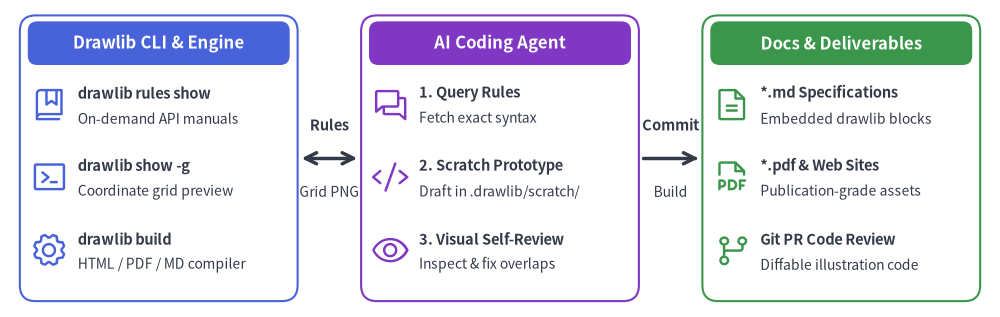
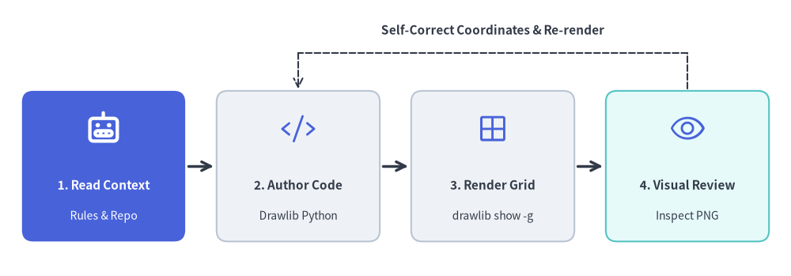

# AI-Driven Workflow & Agent Setup

Drawlib v0.3 is engineered from the ground up for **autonomous AI coding agents** (such as Claude Code, Cursor, Gemini, and GitHub Copilot). Instead of requiring human engineers to manually craft technical specifications and draw architecture diagrams, Drawlib makes it possible to delegate the **entire documentation lifecycle** to AI agents.


<figure class="drawlib-image" style="text-align: center;">
  
  <figcaption class="drawlib-caption">Drawlib & AI Agent Autonomous Interaction Model</figcaption>
</figure>

<details class="drawlib-code-details">
<summary>Source Code</summary>

```python
from drawlib.canvas import save, setup
from drawlib.icons import phosphor
from drawlib.lines import line
from drawlib.shapes import rectangle
from drawlib.styles import Styles
from drawlib.text import text

setup(width=126, height=40)

header_ts = Styles.WhiteBold.patch(text_size=12.0)
ts_title = Styles.DarkBold.patch(text_size=10.5, halign="left")
ts_sub = Styles.Dark.patch(text_size=10.0, halign="left")

# 1. Drawlib (CLI & Knowledge Base)
rectangle((20.0, 20.0), width=35.0, height=36.0, style=Styles.PrimaryOutline.patch(shape_r=2.0))
rectangle((20.0, 34.5), width=33.0, height=5.5, style=Styles.PrimaryFlat.patch(shape_r=1.2), text="Drawlib CLI & Engine", text_style=header_ts)

phosphor.book_bookmark(xy=(6.2, 26.8), width=4.8, style=Styles.Primary)
text((9.8, 28.2), text="drawlib rules show", style=ts_title)
text((9.8, 25.0), text="On-demand API manuals", style=ts_sub)

phosphor.terminal_window(xy=(6.2, 17.6), width=4.8, style=Styles.Primary)
text((9.8, 19.0), text="drawlib show -g", style=ts_title)
text((9.8, 15.8), text="Coordinate grid preview", style=ts_sub)

phosphor.gear(xy=(6.2, 8.4), width=4.8, style=Styles.Primary)
text((9.8, 9.8), text="drawlib build", style=ts_title)
text((9.8, 6.6), text="HTML / PDF / MD compiler", style=ts_sub)

# 2. AI Agent (Autonomous Partner)
rectangle((63.0, 20.0), width=35.0, height=36.0, style=Styles.AccentOutline.patch(shape_r=2.0))
rectangle((63.0, 34.5), width=33.0, height=5.5, style=Styles.AccentFlat.patch(shape_r=1.2), text="AI Coding Agent", text_style=header_ts)

phosphor.chats(xy=(49.2, 26.8), width=4.8, style=Styles.Accent)
text((52.8, 28.2), text="1. Query Rules", style=ts_title)
text((52.8, 25.0), text="Fetch exact syntax", style=ts_sub)

phosphor.code(xy=(49.2, 17.6), width=4.8, style=Styles.Accent)
text((52.8, 19.0), text="2. Scratch Prototype", style=ts_title)
text((52.8, 15.8), text="Draft in .drawlib/scratch/", style=ts_sub)

phosphor.eye(xy=(49.2, 8.4), width=4.8, style=Styles.Accent)
text((52.8, 9.8), text="3. Visual Self-Review", style=ts_title)
text((52.8, 6.6), text="Inspect & fix overlaps", style=ts_sub)

# 3. Docs / Illustration (Deliverables)
rectangle((106.0, 20.0), width=35.0, height=36.0, style=Styles.SuccessOutline.patch(shape_r=2.0))
rectangle((106.0, 34.5), width=33.0, height=5.5, style=Styles.SuccessFlat.patch(shape_r=1.2), text="Docs & Deliverables", text_style=header_ts)

phosphor.file_text(xy=(92.2, 26.8), width=4.8, style=Styles.Success)
text((95.8, 28.2), text="*.md Specifications", style=ts_title)
text((95.8, 25.0), text="Embedded drawlib blocks", style=ts_sub)

phosphor.file_pdf(xy=(92.2, 17.6), width=4.8, style=Styles.Success)
text((95.8, 19.0), text="*.pdf & Web Sites", style=ts_title)
text((95.8, 15.8), text="Publication-grade assets", style=ts_sub)

phosphor.git_branch(xy=(92.2, 8.4), width=4.8, style=Styles.Success)
text((95.8, 9.8), text="Git PR Code Review", style=ts_title)
text((95.8, 6.6), text="Diffable illustration code", style=ts_sub)

# Connections (Drawlib <-> AI -> Docs)
line((38.0, 20.0), (45.0, 20.0), arrow_head="<->", style=Styles.DarkBold)
text((41.5, 24.2), text="Rules", style=Styles.DarkBold.patch(text_size=10.5))
text((41.5, 15.8), text="Grid PNG", style=Styles.Dark.patch(text_size=10.0))

line((81.0, 20.0), (88.0, 20.0), arrow_head="->", style=Styles.DarkBold)
text((84.5, 24.2), text="Commit", style=Styles.DarkBold.patch(text_size=10.5))
text((84.5, 15.8), text="Build", style=Styles.Dark.patch(text_size=10.0))
save()
```

</details>


---

## The AI-Native Collaboration Model

Drawlib provides a tightly integrated tripartite architecture between the library's on-demand knowledge engine, the autonomous AI coding agent, and version-controlled project documentation.

### Why Drawlib is Ideal for AI Agents

When tasked with generating technical illustrations, AI agents typically struggle with raw SVG generation or GUI design tools:
- **Raw SVGs are brittle**: LLMs frequently miscalculate coordinate bounds, leading to clipped text and misaligned arrows.
- **Low-level Matplotlib requires boilerplate**: Matplotlib is designed for statistical plots, not clean software architecture schemas.
- **GUI tools cannot be driven by agents**: AI agents cannot drag and drop shapes in Visio or Figma.
- **High-Level Declarative Abstractions**: Instead of drawing raw boxes and wires, an agent simply writes `ArchitectureDiagram`, `ERDiagram`, or `FlowDiagram`. The library handles orthogonal routing, padding, and marker styling automatically.
- **Built-in Visual Harmony**: Predefined semantic styles (`Styles.PrimaryFlat`, `Styles.AccentFlat`) ensure that AI-generated diagrams look publication-ready without fine-tuning color codes.

### Why Agents Don't Hallucinate Drawlib Code
Unlike traditional libraries where agents often hallucinate outdated APIs or struggle with deprecated options, Drawlib eliminates hallucinations through **active command-line guidance**:
1. **On-Demand Rule Injection**: Rather than stuffing thousands of tokens of API documentation into the agent's prompt context, the agent simply queries `drawlib rules show <topic>` when it needs exact signatures.
2. **Deterministic Geometry**: Agents do not have to guess rendering outcomes; they run `drawlib show -g` to render images with absolute millimeter grids and verify their work visually.

To enable your AI agent to author Drawlib illustrations and documentation, configure your environment with Drawlib's core guidelines.

### 1. Configure Workspace Rules
Add the Drawlib agent instructions to your project's rule file:

- **Cursor**: Paste the instructions into `.cursorrules` or `.cursor/rules/drawlib.md`.
- **Claude Code**: Add instructions to your project's `CLAUDE.md`.
- **Gemini / Generic Agents**: Place instructions in `.agents/rules/drawlib.md`.

You can dump the official agent instruction template directly using the CLI:

```bash
# Display the bootstrap agent manual
$ uv run drawlib rules show agent-instruction
```

### 2. Project-First Rule (`drawlib init`)
Teach your agent to **never create bare `.py` files in an uninitialized directory** or build project folders manually. Always scaffold a Drawlib project first so `styles.py` (theme & language fonts), `utils.py`, `_assets/`, and `build.sh` are properly configured:

```bash
# Standalone diagram image(s) only -> images_src/*.py -> images/*.png
$ uv run drawlib init images [-l <lang>] [-s <style>]

# Linear technical document / RFC / PDF -> doc_src/*.md
$ uv run drawlib init doc [target] [-l <lang>] [-s <style>]

# Multi-page documentation website -> docs_src/**/*.md
$ uv run drawlib init site [target] [-l <lang>] [-s <style>]

# 16:9 presentation slide deck -> slide_src/*.md
$ uv run drawlib init slide [target] [-l <lang>] [-s <style>]
```

### 3. Essential Commands & On-Demand Rules Catalog
Ensure your agent knows how to query on-demand rule topics and preview drawings with a coordinate grid:

| Purpose | Command |
| :--- | :--- |
| **List Available Rule Topics** | `uv run drawlib rules list` |
| **Canvas & Lifecycle Overview** | `uv run drawlib rules show overview` |
| **Style Guide & 50%+ Neutral Rule** | `uv run drawlib rules show style-guide` |
| **Animation Loop & Idioms** | `uv run drawlib rules show anim-guide` |
| **16:9 Slide Authoring & Layouts** | `uv run drawlib rules show slide-guide` |
| **Project Scaffolding & Structure** | `uv run drawlib rules show project` |
| **CLI Reference (`build`, `show`, `cache`)** | `uv run drawlib rules show cli` |
| **Unified API Cheat Sheet** | `uv run drawlib rules show api` |
| **Auto-Layout Graphs (`drawlib.graph`)** | `uv run drawlib rules show lib-graph` |
| **Domain Diagrams (`drawlib.diagrams`)** | `uv run drawlib rules show lib-diagrams` |
| **SmartArts & GeoMap (`drawlib.smartarts`)** | `uv run drawlib rules show lib-smartarts` |
| **Quantitative Charts (`drawlib.charts`)** | `uv run drawlib rules show lib-charts` |
| **Render Named Markdown Block Preview** | `uv run drawlib show <md_path> <diagram.png> -g -o .drawlib/scratch/preview.png` |
| **Render Standalone Script Preview** | `uv run drawlib show <script.py> -g -o .drawlib/scratch/preview.png` |
| **Build Full Project** | `./<target>_src/build.sh` or `uv run drawlib build html docs_src/ -o docs_html/` |

---

## The Autonomous Verification Loop

Teach your agent to follow Drawlib's autonomous self-correction loop when creating diagrams:


<figure class="drawlib-image" style="text-align: center;">
  
  <figcaption class="drawlib-caption">Autonomous AI Visual Self-Correction Loop</figcaption>
</figure>

<details class="drawlib-code-details">
<summary>Source Code</summary>

```python
from drawlib.canvas import save, setup
from drawlib.icons import phosphor
from drawlib.lines import line
from drawlib.shapes import rectangle
from drawlib.styles import Styles
from drawlib.text import text

setup(width=126, height=44)

# 1. Read Context (Hero node)
rectangle((16.5, 17.5), width=26.0, height=24.0, style=Styles.PrimaryFlat.patch(shape_r=1.8))
phosphor.robot((16.5, 23.5), width=5.6, style=Styles.WhiteBold)
text((16.5, 14.5), "1. Read Context", style=Styles.WhiteBold.patch(text_size=11.0))
text((16.5, 9.5), "Rules & Repo", style=Styles.White.patch(text_size=10.0))

# 2. Author Code
rectangle((47.5, 17.5), width=26.0, height=24.0, style=Styles.Neutral.patch(shape_r=1.8))
phosphor.code((47.5, 23.5), width=5.6, style=Styles.Primary)
text((47.5, 14.5), "2. Author Code", style=Styles.DarkBold.patch(text_size=11.0))
text((47.5, 9.5), "Drawlib Python", style=Styles.Dark.patch(text_size=10.0))

# 3. Render Grid
rectangle((78.5, 17.5), width=26.0, height=24.0, style=Styles.Neutral.patch(shape_r=1.8))
phosphor.grid_four((78.5, 23.5), width=5.6, style=Styles.Primary)
text((78.5, 14.5), "3. Render Grid", style=Styles.DarkBold.patch(text_size=11.0))
text((78.5, 9.5), "drawlib show -g", style=Styles.Dark.patch(text_size=10.0))

# 4. Visual Review
rectangle((109.5, 17.5), width=26.0, height=24.0, style=Styles.SecondaryNeutral.patch(shape_r=1.8))
phosphor.eye((109.5, 23.5), width=5.6, style=Styles.Primary)
text((109.5, 14.5), "4. Visual Review", style=Styles.DarkBold.patch(text_size=11.0))
text((109.5, 9.5), "Inspect PNG", style=Styles.Dark.patch(text_size=10.0))

# Forward arrows
line((30.0, 17.5), (34.0, 17.5), arrow_head="->", style=Styles.DarkBold)
line((61.0, 17.5), (65.0, 17.5), arrow_head="->", style=Styles.DarkBold)
line((92.0, 17.5), (96.0, 17.5), arrow_head="->", style=Styles.DarkBold)

# Feedback loop
line((109.5, 29.8), (109.5, 35.5), style=Styles.DarkDashed)
line((109.5, 35.5), (47.5, 35.5), style=Styles.DarkDashed)
line((47.5, 35.5), (47.5, 29.8), arrow_head="->", style=Styles.DarkDashed)
text((78.5, 39.2), "Self-Correct Coordinates & Re-render", style=Styles.DarkBold.patch(text_size=11.0))
save()
```

</details>


1. **Inspect Context**: The agent inspects actual repository files (models, API routers, database schemas) to understand the architecture.
2. **Draft Illustration**: The agent scaffolds a project via `drawlib init` (if not already present) and authors the drawing code in `images_src/<name>.py` or an embedded ````drawlib```` Markdown block with `file:<diagram.png>`.
3. **Render Image with Grid (`-g`)**:  
   `uv run drawlib show <md_path> <diagram.png> -g -o .drawlib/scratch/preview.png` (or `uv run drawlib show images_src/<name>.py -g -o .drawlib/scratch/preview.png`).
4. **Multimodal Self-Review**: The agent inspects the rendered PNG with its vision/file viewing tool, checking for:
   - Label overflow or text clipping outside boxes.
   - Overlapping arrow lines or awkward elbow routings.
   - Missing perimeter margins around canvas borders.
5. **Auto-Adjust & Finalize**: The agent adjusts coordinates, re-renders until clean, and builds the final project outputs.

---

> [!TIP]
> For complete system prompts, rule topic catalogues, and advanced automated CI/CD integration, proceed to **[Chapter 9: AI Agents & Advanced Integration](../09_ai_agents_and_advanced/ai_agent_instructions.md)**.
