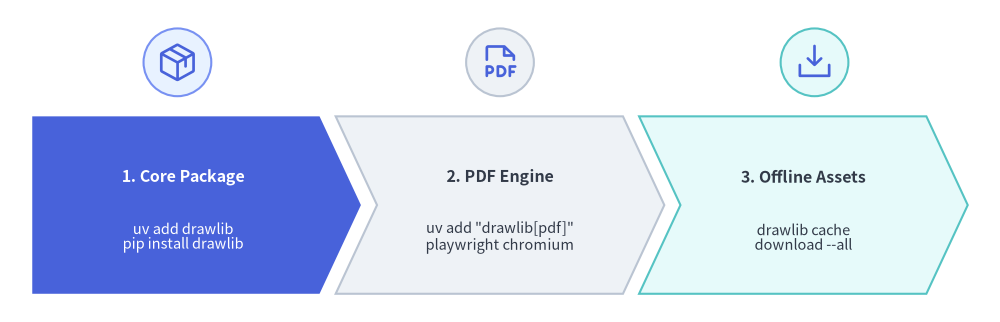
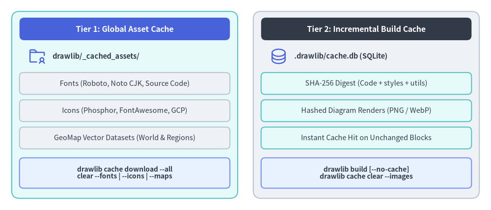

# Installation Guide

Drawlib is published on PyPI and can be installed using `uv` (recommended) or standard `pip`.
This guide covers core package installation, optional headless PDF export dependencies, and offline asset caching.


<figure class="drawlib-image" style="text-align: center;">
  
  <figcaption class="drawlib-caption">Three-Step Drawlib Environment Setup Workflow</figcaption>
</figure>

<details class="drawlib-code-details">
<summary>Source Code</summary>

```python
from drawlib.canvas import save, setup
from drawlib.icons import phosphor
from drawlib.shapes import circle
from drawlib.smartarts import ChevronProcess
from drawlib.styles import Styles

setup(width=124, height=40)

workflow = ChevronProcess(
    style=Styles.Neutral,
    text_style=Styles.DarkBold.patch(text_size=11.5),
    description_style=Styles.Dark.patch(text_size=10.5),
    corner_angle=65.0,
    spacing=2.0,
    flat_left_end=True,
)
workflow.add(
    "1. Core Package",
    description="uv add drawlib\npip install drawlib",
    style=Styles.PrimaryFlat,
    text_style=Styles.WhiteBold.patch(text_size=11.5),
    description_style=Styles.White.patch(text_size=10.5),
)
workflow.add(
    "2. PDF Engine",
    description='uv add "drawlib[pdf]"\nplaywright chromium',
    style=Styles.Neutral,
)
workflow.add(
    "3. Offline Assets",
    description="drawlib cache\ndownload --all",
    style=Styles.SecondaryNeutral,
)
workflow.draw(xy=(4.0, 3.5), width=116.0, height=22.0)

# Step icons above each chevron stage
circle((22.0, 32.2), radius=4.2, style=Styles.PrimaryNeutral)
phosphor.package((22.0, 32.2), width=5.2, style=Styles.Primary)

circle((62.0, 32.2), radius=4.2, style=Styles.Neutral)
phosphor.file_pdf((62.0, 32.2), width=5.2, style=Styles.Primary)

circle((101.0, 32.2), radius=4.2, style=Styles.SecondaryNeutral)
phosphor.download_simple((101.0, 32.2), width=5.2, style=Styles.Primary)

save()
```

</details>


---

## Requirements

- **Python**: Version 3.11 or higher.
- **Operating System**: Linux, macOS, or Windows.

---

## 1. Using `uv` (Recommended)

Add Drawlib to your current project dependencies:

```bash
# Add to active project
$ uv add drawlib

# Verify installation and CLI version
$ uv run drawlib --version
```

### Standalone CLI Execution (`uvx`)
If you want to run the Drawlib CLI tool without adding it to a project:

```bash
$ uvx drawlib --version
$ uvx drawlib init site
```

---

## 2. Using `pip`

Install Drawlib into your virtual environment:

```bash
$ pip install drawlib

# Verify installation
$ drawlib --version
```

---

## 3. Optional PDF Export Support

Drawlib includes built-in support for compiling Markdown documents into standalone PDF publications via headless Chromium.

To enable PDF generation (`drawlib build pdf`):

```bash
# When using uv:
$ uv add "drawlib[pdf]"
$ uv run playwright install chromium

# When using pip:
$ pip install "drawlib[pdf]"
$ playwright install chromium
```

---

## 4. Asset & Build Cache Management (`drawlib cache`)

To maintain a minimal PyPI package size, high-resolution icon sets (Phosphor, FontAwesome, and official Google Cloud icons), multilingual fonts, and geographic map datasets are downloaded on demand upon first use and cached inside `drawlib/_cached_assets/` (managed via `drawlib cache`). Meanwhile, project-local incremental diagram builds are cached separately in `.drawlib/cache.db`.


<figure class="drawlib-image" style="text-align: center;">
  
  <figcaption class="drawlib-caption">Two-Tier Asset and Incremental Build Cache Architecture</figcaption>
</figure>

<details class="drawlib-code-details">
<summary>Source Code</summary>

```python
from drawlib.canvas import save, setup
from drawlib.icons import phosphor
from drawlib.shapes import rectangle
from drawlib.styles import Styles
from drawlib.text import text

setup(width=126, height=54)

hdr_ts = Styles.WhiteBold.patch(text_size=11.5)
path_ts = Styles.DarkBold.patch(text_size=10.5, halign="left")
row_ts = Styles.Dark.patch(text_size=10.5)
cmd_ts = Styles.DarkBold.patch(text_size=10.0)

# Left container: Tier 1 Global Asset Cache
rectangle((32.0, 27.0), width=58.0, height=48.0, style=Styles.SecondaryNeutral.patch(shape_r=2.0))
rectangle((32.0, 46.5), width=54.0, height=5.8, style=Styles.PrimaryFlat.patch(shape_r=1.2), text="Tier 1: Global Asset Cache", text_style=hdr_ts)

phosphor.folder_user((9.5, 39.5), width=4.8, style=Styles.Primary)
text((13.5, 39.5), "drawlib/_cached_assets/", style=path_ts)

rectangle((32.0, 32.5), width=54.0, height=5.6, style=Styles.Neutral.patch(shape_r=1.0), text="Fonts (Roboto, Noto CJK, Source Code)", text_style=row_ts)
rectangle((32.0, 25.5), width=54.0, height=5.6, style=Styles.Neutral.patch(shape_r=1.0), text="Icons (Phosphor, FontAwesome, GCP)", text_style=row_ts)
rectangle((32.0, 18.5), width=54.0, height=5.6, style=Styles.Neutral.patch(shape_r=1.0), text="GeoMap Vector Datasets (World & Regions)", text_style=row_ts)
rectangle((32.0, 9.5), width=54.0, height=7.8, style=Styles.PrimaryNeutral.patch(shape_r=1.0), text="drawlib cache download --all\nclear --fonts | --icons | --maps", text_style=cmd_ts)

# Right container: Tier 2 Project Incremental Build Cache
rectangle((94.0, 27.0), width=58.0, height=48.0, style=Styles.Neutral.patch(shape_r=2.0))
rectangle((94.0, 46.5), width=54.0, height=5.8, style=Styles.DarkFlat.patch(shape_r=1.2), text="Tier 2: Incremental Build Cache", text_style=hdr_ts)

phosphor.database((71.5, 39.5), width=4.8, style=Styles.Primary)
text((75.5, 39.5), ".drawlib/cache.db (SQLite)", style=path_ts)

rectangle((94.0, 32.5), width=54.0, height=5.6, style=Styles.SecondaryNeutral.patch(shape_r=1.0), text="SHA-256 Digest (Code + styles + utils)", text_style=row_ts)
rectangle((94.0, 25.5), width=54.0, height=5.6, style=Styles.SecondaryNeutral.patch(shape_r=1.0), text="Hashed Diagram Renders (PNG / WebP)", text_style=row_ts)
rectangle((94.0, 18.5), width=54.0, height=5.6, style=Styles.SecondaryNeutral.patch(shape_r=1.0), text="Instant Cache Hit on Unchanged Blocks", text_style=row_ts)
rectangle((94.0, 9.5), width=54.0, height=7.8, style=Styles.PrimaryNeutral.patch(shape_r=1.0), text="drawlib build [--no-cache]\ndrawlib cache clear --images", text_style=cmd_ts)

save()
```

</details>


You can inspect, pre-fetch (e.g. for offline builds, Docker images, or CI/CD pipelines), and clear both caches via `drawlib cache`:

```bash
# Inspect cached font, icon, and map packages
$ uv run drawlib cache list

# Pre-download all font, icon, and map packages
$ uv run drawlib cache download --all

# Or pre-download specific asset categories selectively
$ uv run drawlib cache download --fonts
$ uv run drawlib cache download --icons
$ uv run drawlib cache download --maps

# Clear project-local incremental diagram build cache (.drawlib/cache.db)
$ uv run drawlib cache clear --images

# Clear all caches (downloaded font/icon/map assets + SQLite image build cache)
$ uv run drawlib cache clear --all
```

---

## 5. Verifying Installation

Verify that the Drawlib CLI commands and rule guides are accessible:

```bash
$ uv run drawlib --help
$ uv run drawlib rules list
```
