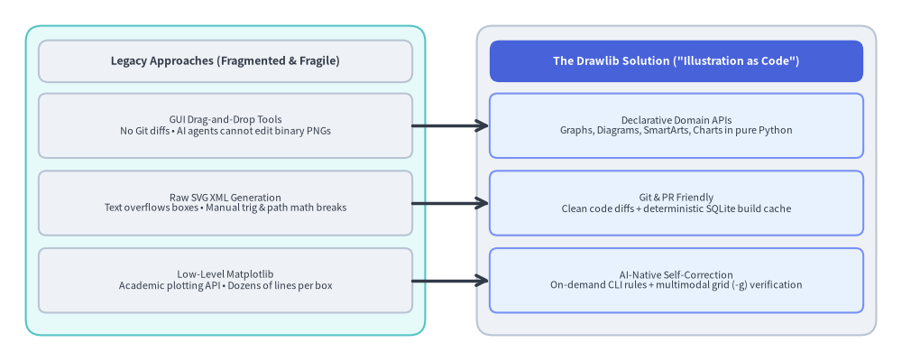
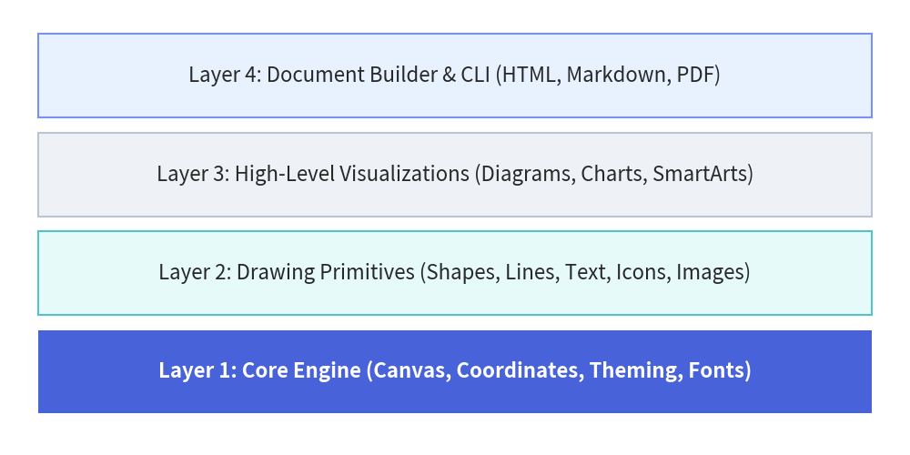

# About Drawlib

Drawlib is a pure-Python library engineered around the dual paradigms of **"Illustration as Code"** and **"Documentation as Code"**.

It empowers human developers, system architects, and **autonomous AI coding agents** to design, version-control, and publish clean architectural schemas, workflow charts, and entire multi-page technical documentation websites directly from declarative Python code.

---

## The Paradigm Shift: Why Illustration as Code?

In modern software development accelerated by AI coding assistants, code refactoring and feature additions move at an unprecedented pace. However, system architecture documentation, database schemas, and workflow diagrams are frequently left behind—leading to **documentation rot** and onboarding bottlenecks.

### The Limits of GUI Tools in Modern Workflows

Traditional technical diagramming relies on drag-and-drop GUI tools (such as Draw.io, Visio, Lucidchart, or Figma). While convenient for quick whiteboard sketches, managing illustrations as exported binary files (PNG, JPEG) introduces critical flaws:

- **No Meaningful Version Control**: Binary images cannot produce meaningful Git diffs in pull requests. Reviewers cannot inspect what architectural components changed.
- **AI Agents Cannot Edit Binary Assets**: While AI coding agents can read and edit codebases seamlessly, they cannot manipulate pixels or drag-and-drop canvas elements in GUI software.
- **Visual & Branding Drift**: Colors, stroke widths, paddings, and font sizes drift unpredictably across team members, diluting corporate design standards.

### The Pitfalls of Raw SVG & Direct Matplotlib Generation

When engineers attempt to automate diagramming via code, they often ask AI agents to generate raw SVG XML or low-level Matplotlib scripts. In practice, both approaches quickly break down:

- **Raw SVG Generation**:
  - LLMs cannot accurately compute font glyph widths or dynamic multi-line text wrapping without a browser layout engine, frequently causing text to overflow boundary boxes.
  - Computing precise connection vectors, orthogonal routes, and arrowheads by hand requires excessive trigonometric calculations that easily misalign.
  - Generating hundreds of raw `<path>` and `<polygon>` elements creates unmaintainable blobs of XML that humans cannot easily review or audit.
- **Direct Matplotlib Scripting**:
  - Matplotlib was originally engineered for academic data visualization (scatter plots, histograms, line graphs), not software systems engineering.
  - It lacks native abstractions for architectural components (nodes, boundary containers, sequence lifelines, decision gates, standardized cloud icons).
  - Authors must write dozens of lines of low-level boilerplate just to draw and style a single labeled box with an icon.

### The Drawlib Solution: "Illustration as Code"

Drawlib treats architectural illustrations as first-class software artifacts governed by standard engineering practices:

1. **Deterministic & Reproducible**: Geometry, spacing, palette shades, and typography are mathematically defined in code. Re-running the build guarantees bit-for-bit identical visual output.
2. **Pull-Request Friendly**: Modifying an architecture (such as adding a microservice or updating an API gateway route) appears as clean, human-readable code diffs in Git.
3. **High-Level Domain Primitives**: Declarative abstractions (`ArchitectureDiagram`, `ChevronProcess`, `Table`, `ArchitectureGraph`) eliminate layout boilerplate while preserving pixel-perfect control.
4. **Algorithmic Geometry**: Leverage loops, list comprehensions, and trigonometric functions to generate grids, circular cycles, and trees without manual drag-and-drop positioning.
5. **Centralized Style Governance**: Theme tokens (`DefaultStyles`, `GoogleStyles`, `MonochromeStyles`) ensure that shapes, connectors, text, and icons adhere to a cohesive visual hierarchy.


<figure class="drawlib-image" style="text-align: center;">
  
  <figcaption class="drawlib-caption">Legacy Diagramming Approaches vs. Drawlib Illustration as Code</figcaption>
</figure>

<details class="drawlib-code-details">
<summary>Source Code</summary>

```python
from drawlib.canvas import save, setup
from drawlib.lines import line
from drawlib.shapes import rectangle
from drawlib.styles import Styles

setup(width=140, height=56)

# Left container: Legacy Approaches (Fragmented & Fragile)
rectangle((35, 28), width=62, height=48, style=Styles.SecondaryNeutral.patch(shape_r=2.5))
rectangle(
    (35, 46.5),
    width=58,
    height=6.5,
    style=Styles.Neutral.patch(shape_r=1.5),
    text="Legacy Approaches (Fragmented & Fragile)",
    text_style=Styles.DarkBold.patch(text_size=8.8),
)
rectangle(
    (35, 36.5),
    width=58,
    height=10,
    style=Styles.Neutral.patch(shape_r=1.2),
    text="GUI Drag-and-Drop Tools\nNo Git diffs • AI agents cannot edit binary PNGs",
    text_style=Styles.Dark.patch(text_size=7.8),
)
rectangle(
    (35, 24.5),
    width=58,
    height=10,
    style=Styles.Neutral.patch(shape_r=1.2),
    text="Raw SVG XML Generation\nText overflows boxes • Manual trig & path math breaks",
    text_style=Styles.Dark.patch(text_size=7.8),
)
rectangle(
    (35, 12.5),
    width=58,
    height=10,
    style=Styles.Neutral.patch(shape_r=1.2),
    text="Low-Level Matplotlib\nAcademic plotting API • Dozens of lines per box",
    text_style=Styles.Dark.patch(text_size=7.8),
)

# Right container: The Drawlib Solution ("Illustration as Code")
rectangle((105, 28), width=62, height=48, style=Styles.Neutral.patch(shape_r=2.5))
rectangle(
    (105, 46.5),
    width=58,
    height=6.5,
    style=Styles.PrimaryFlat.patch(shape_r=1.5),
    text='The Drawlib Solution ("Illustration as Code")',
    text_style=Styles.WhiteBold.patch(text_size=8.8),
)
rectangle(
    (105, 36.5),
    width=58,
    height=10,
    style=Styles.PrimaryNeutral.patch(shape_r=1.2),
    text="Declarative Domain APIs\nGraphs, Diagrams, SmartArts, Charts in pure Python",
    text_style=Styles.Dark.patch(text_size=7.8),
)
rectangle(
    (105, 24.5),
    width=58,
    height=10,
    style=Styles.PrimaryNeutral.patch(shape_r=1.2),
    text="Git & PR Friendly\nClean code diffs + deterministic SQLite build cache",
    text_style=Styles.Dark.patch(text_size=7.8),
)
rectangle(
    (105, 12.5),
    width=58,
    height=10,
    style=Styles.PrimaryNeutral.patch(shape_r=1.2),
    text="AI-Native Self-Correction\nOn-demand CLI rules + multimodal grid (-g) verification",
    text_style=Styles.Dark.patch(text_size=7.8),
)

# Transition arrows from Legacy pain points to Drawlib solutions
line((64, 36.5), (76, 36.5), arrow_head="->", style=Styles.DarkBold)
line((64, 24.5), (76, 24.5), arrow_head="->", style=Styles.DarkBold)
line((64, 12.5), (76, 12.5), arrow_head="->", style=Styles.DarkBold)

save()
```

</details>


---

## AI-Native by Design

Drawlib is purposely designed for the era of **AI-assisted software development**.

Large Language Models (LLMs) and AI coding agents (such as Claude Code, Cursor, Gemini) excel at writing declarative code, but struggle with manual visual tools. Because Drawlib drawings are expressed entirely as clean Python code or embedded Markdown blocks (` ```drawlib `), AI agents can:

- **Understand Existing Diagrams**: Parse and refactor diagrams simply by reading Python source code.
- **Generate Complex Diagrams**: Autonomously write full cloud architectures, sequence diagrams, and flowcharts based on repository code analysis.
- **Inspect Syntax Rules On-Demand**: AI agents can query the library's built-in manual directly via the CLI (`drawlib rules show <topic>`).
- **Autonomous Visual Self-Correction**: Agents can export images with coordinate overlays (`drawlib show -g`), visually inspect them with multimodal vision tools, and self-correct label clipping or line overlaps.

---

## Layered Architecture

Drawlib is structured into four cohesive layers, ensuring both low-level flexibility and high-level productivity:


<figure class="drawlib-image" style="text-align: center;">
  
  <figcaption class="drawlib-caption">Drawlib Layered Architecture</figcaption>
</figure>

<details class="drawlib-code-details">
<summary>Source Code</summary>

```python
from drawlib.canvas import save, setup
from drawlib.shapes import rectangle
from drawlib.styles import Styles

setup(width=120, height=60)

# Layers: Core Engine as hero anchor, upper layers in calm neutral cards
rectangle((60, 50), width=110, height=11, style=Styles.PrimaryNeutral, text="Layer 4: Animation, Slide & Doc Builder (anim, slide, tools, CLI)")
rectangle((60, 37), width=110, height=11, style=Styles.Neutral, text="Layer 3: High-Level Visualizations (Graphs, Diagrams, Charts, SmartArts)")
rectangle((60, 24), width=110, height=11, style=Styles.SecondaryNeutral, text="Layer 2: Drawing Primitives (Shapes, Lines, Text, Icons, Images)")
rectangle((60, 11), width=110, height=11, style=Styles.PrimaryFlat, text="Layer 1: Core Engine (Canvas, Coordinates, Theming, Fonts)", text_style=Styles.WhiteBold)
save()
```

</details>


1. **Layer 1: Core Engine (`drawlib.canvas`, `drawlib.styles`, `drawlib.types`, `drawlib.fonts`)**  
   Manages canvas lifecycle, Cartesian coordinate systems, local coordinate transforms, theme resolution, and universal font typography.
2. **Layer 2: Drawing Primitives (`drawlib.shapes`, `drawlib.lines`, `drawlib.text`, `drawlib.icons`, `drawlib.images`)**  
   Provides **24** vector shapes (including `cylinder`, `face`, and `bubblespeech`), flexible line connectors with routing and arrowheads, typography, and standardized icon sets (Phosphor, FontAwesome, GCP).
3. **Layer 3: High-Level Visualizations & Geometry (`drawlib.graph`, `drawlib.smartarts`, `drawlib.charts`, `drawlib.diagrams`, `drawlib.math`)**  
   Ready-to-use domain components: auto-layout graphs (`LayerGraph`, `ArchitectureGraph`, `TreeGraph`, `RadialGraph`, `GridGraph`), cloud architectures, flowcharts, sequence diagrams, UML class/state diagrams, ER diagrams, data charts, process flows, geographic maps (`drawlib.smartarts.GeoMap`), and geometry & path/color interpolation utilities (`drawlib.math`).
4. **Layer 4: Animation, Presentation & Document Builder (`drawlib.anim`, `drawlib.slide`, `drawlib.tools`)**  
   Provides multi-frame animation (`drawlib.anim` for APNG & Animated WebP), a 16:9 widescreen slide stage & compiler (`drawlib.slide`), and a programmatic build, preview server, and cache API (`drawlib.tools`) that compiles Markdown files with embedded `drawlib` blocks into responsive static HTML sites, GitHub-ready Markdown, slide decks, and standalone PDF publications.
