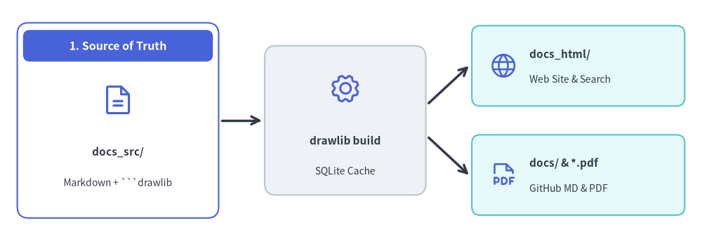
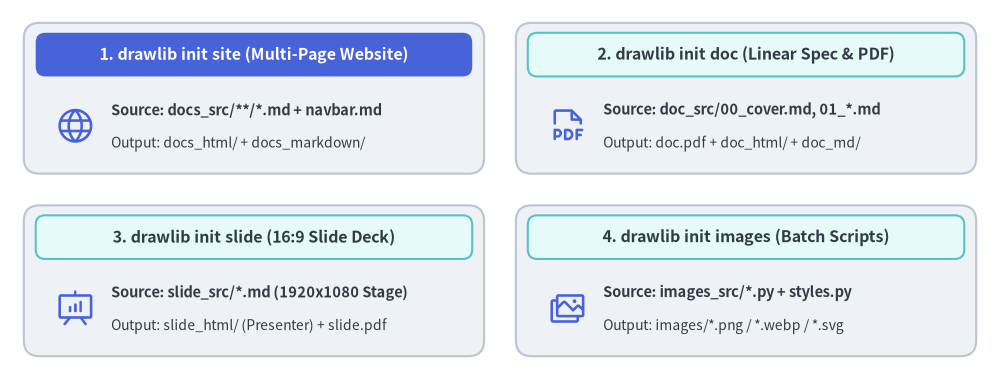

# Documentation Project & Build Overview

Drawlib is not only a drawing library—it is a **complete documentation compiler** that bridges executable Python illustrations and version-controlled technical documentation.

---

## The Documentation-as-Code Workflow

Instead of writing documentation in static wikis and manually copying and pasting PNG screenshots, Drawlib establishes a clean, repeatable build pipeline:


<figure class="drawlib-image" style="text-align: center;">
  
  <figcaption class="drawlib-caption">Drawlib Documentation Build Pipeline</figcaption>
</figure>

<details class="drawlib-code-details">
<summary>Source Code</summary>

```python
from drawlib.canvas import save, setup
from drawlib.icons import phosphor
from drawlib.lines import line
from drawlib.shapes import rectangle
from drawlib.styles import Styles
from drawlib.text import text

setup(width=122, height=42)

# 1. Source folder (Hero focal origin)
rectangle((20.5, 21.0), width=35.0, height=34.0, style=Styles.PrimaryOutline.patch(shape_r=2.0))
rectangle((20.5, 34.0), width=33.0, height=5.5, style=Styles.PrimaryFlat.patch(shape_r=1.2), text="1. Source of Truth", text_style=Styles.WhiteBold.patch(text_size=11.5))
phosphor.file_text((20.5, 24.5), width=6.0, style=Styles.Primary)
text((20.5, 15.5), "docs_src/", style=Styles.DarkBold.patch(text_size=11.0))
text((20.5, 10.2), "Markdown + ```drawlib", style=Styles.Dark.patch(text_size=10.0))

# 2. Build engine (Calm Neutral card)
rectangle((60.0, 21.0), width=28.0, height=26.0, style=Styles.Neutral.patch(shape_r=2.0))
phosphor.gear((60.0, 26.5), width=5.8, style=Styles.Primary)
text((60.0, 17.5), "drawlib build", style=Styles.DarkBold.patch(text_size=11.0))
text((60.0, 12.2), "SQLite Cache", style=Styles.Dark.patch(text_size=10.0))

# 3. Outputs (Secondary Neutral cards)
rectangle((100.5, 30.5), width=37.0, height=14.0, style=Styles.SecondaryNeutral.patch(shape_r=1.5))
phosphor.globe((87.5, 30.5), width=5.0, style=Styles.Primary)
text((92.0, 32.5), "docs_html/", style=Styles.DarkBold.patch(text_size=11.0, halign="left"))
text((92.0, 28.2), "Web Site & Search", style=Styles.Dark.patch(text_size=10.0, halign="left"))

rectangle((100.5, 11.5), width=37.0, height=14.0, style=Styles.SecondaryNeutral.patch(shape_r=1.5))
phosphor.file_pdf((87.5, 11.5), width=5.0, style=Styles.Primary)
text((92.0, 13.5), "docs/ & *.pdf", style=Styles.DarkBold.patch(text_size=11.0, halign="left"))
text((92.0, 9.2), "GitHub MD & PDF", style=Styles.Dark.patch(text_size=10.0, halign="left"))

# Connectors
line((38.5, 21.0), (45.5, 21.0), arrow_head="->", style=Styles.DarkBold)
line((74.5, 24.0), (81.5, 30.5), arrow_head="->", style=Styles.DarkBold)
line((74.5, 18.0), (81.5, 11.5), arrow_head="->", style=Styles.DarkBold)
save()
```

</details>


### The Golden Rule: `<name>_src/` is the Single Source of Truth
- Always edit Markdown files and Python code inside the source directory (e.g. `docs_src/`).
- Never edit the output directories (`docs/`, `docs_html/`, `docs.pdf`) directly; they are build artifacts completely overwritten during compilation.

---

## 1. Project Scaffolding (`drawlib init`)

Scaffold a complete project template with a single command:

```bash
# List available starter project templates
$ uv run drawlib init list

# Initialize a multi-page documentation website (creates docs_src/)
$ uv run drawlib init site

# Or scaffold into a custom target name (positional argument, e.g., mybook_src/ -> mybook_html/):
$ uv run drawlib init site mybook

# Optional flags: --style (-s) for theme and --lang (-l) for language fonts
$ uv run drawlib init doc rbac -s google --lang ja
```

Drawlib supports four starter project types:
- **`doc`**: Linear technical document / spec / RFC / report compiled to HTML (`doc_html/`), PDF (`doc.pdf`), Markdown (`doc_markdown/`), and diagrams (`doc_images/`).
- **`site`**: Multi-page documentation website (`docs_html/`), Markdown site (`docs_markdown/` or `docs/`), and diagrams (`docs_images/`).
- **`slide`**: 16:9 presentation slide deck compiled to web deck (`slide_html/`), vector PDF (`slide.pdf`), and diagrams (`slide_images/`).
- **`images`**: Standalone Python illustration scripts (`images_src/*.py`) batch-compiled to image files (`images/*.png`).


<figure class="drawlib-image" style="text-align: center;">
  
  <figcaption class="drawlib-caption">The Four Drawlib Project Scaffolding Archetypes (drawlib init)</figcaption>
</figure>

<details class="drawlib-code-details">
<summary>Source Code</summary>

```python
from drawlib.canvas import save, setup
from drawlib.icons import phosphor
from drawlib.shapes import rectangle
from drawlib.styles import Styles
from drawlib.text import text

setup(width=126, height=48)

hdr_white = Styles.WhiteBold.patch(text_size=11.5)
hdr_dark = Styles.DarkBold.patch(text_size=11.5)
body_bold = Styles.DarkBold.patch(text_size=10.5, halign="left")
body_sub = Styles.Dark.patch(text_size=10.0, halign="left")

# 1. Top-Left: drawlib init site (Hero header)
rectangle((32.0, 35.5), width=58.0, height=19.0, style=Styles.Neutral.patch(shape_r=2.0))
rectangle((32.0, 41.0), width=55.0, height=5.5, style=Styles.PrimaryFlat.patch(shape_r=1.2), text="1. drawlib init site (Multi-Page Website)", text_style=hdr_white)
phosphor.globe((9.5, 32.0), width=5.2, style=Styles.Primary)
text((14.0, 34.0), "Source: docs_src/**/*.md + navbar.md", style=body_bold)
text((14.0, 29.8), "Output: docs_html/ + docs_markdown/", style=body_sub)

# 2. Top-Right: drawlib init doc
rectangle((94.0, 35.5), width=58.0, height=19.0, style=Styles.Neutral.patch(shape_r=2.0))
rectangle((94.0, 41.0), width=55.0, height=5.5, style=Styles.SecondaryNeutral.patch(shape_r=1.2), text="2. drawlib init doc (Linear Spec & PDF)", text_style=hdr_dark)
phosphor.file_pdf((71.5, 32.0), width=5.2, style=Styles.Primary)
text((76.0, 34.0), "Source: doc_src/00_cover.md, 01_*.md", style=body_bold)
text((76.0, 29.8), "Output: doc.pdf + doc_html/ + doc_md/", style=body_sub)

# 3. Bottom-Left: drawlib init slide
rectangle((32.0, 12.5), width=58.0, height=19.0, style=Styles.Neutral.patch(shape_r=2.0))
rectangle((32.0, 18.0), width=55.0, height=5.5, style=Styles.SecondaryNeutral.patch(shape_r=1.2), text="3. drawlib init slide (16:9 Slide Deck)", text_style=hdr_dark)
phosphor.presentation_chart((9.5, 9.0), width=5.2, style=Styles.Primary)
text((14.0, 11.0), "Source: slide_src/*.md (1920x1080 Stage)", style=body_bold)
text((14.0, 6.8), "Output: slide_html/ (Presenter) + slide.pdf", style=body_sub)

# 4. Bottom-Right: drawlib init images
rectangle((94.0, 12.5), width=58.0, height=19.0, style=Styles.Neutral.patch(shape_r=2.0))
rectangle((94.0, 18.0), width=55.0, height=5.5, style=Styles.SecondaryNeutral.patch(shape_r=1.2), text="4. drawlib init images (Batch Scripts)", text_style=hdr_dark)
phosphor.images((71.5, 9.0), width=5.2, style=Styles.Primary)
text((76.0, 11.0), "Source: images_src/*.py + styles.py", style=body_bold)
text((76.0, 6.8), "Output: images/*.png / *.webp / *.svg", style=body_sub)

save()
```

</details>


---

## 2. One-Command Compilation (`drawlib build`)

Once initialized, compile your documentation using the generated `build.sh` script or the `drawlib build` CLI:

```bash
# Run the project master build script
$ ./docs_src/build.sh

# Or compile using the CLI subcommands directly:
$ uv run drawlib build html docs_src/ -o docs_html/
$ uv run drawlib build markdown docs_src/ -o docs/
$ uv run drawlib build pdf doc_src/ -o doc.pdf
$ uv run drawlib build slide slide_src/ -o slide_html/
$ uv run drawlib build image images_src/ -o images/

# Force a clean re-render bypassing the SQLite build cache (.drawlib/cache.db):
$ uv run drawlib build html docs_src/ -o docs_html/ --no-cache
```

During the build process:
1. Drawlib detects all ````drawlib```` code blocks across your Markdown documents (or `.py` scripts in `images_src/`).
2. The code blocks are executed in isolated memory spaces to render vector/raster diagrams.
3. Rendered images are cached deterministically in `.drawlib/cache.db` (only modified code blocks or styles re-render; pass `--no-cache` or run `uv run drawlib cache clear --images` to force re-rendering).
4. The final HTML website, slide deck, PDF, or rendered Markdown documents are generated with verified image links.

---

## 3. Local Live Preview & Link Verification (`drawlib serve`)

Preview your compiled HTML site locally with automatic pre-flight link and asset inspection:

```bash
# Start local HTTP preview server on http://localhost:8000
$ uv run drawlib serve docs_html/

# Run headless broken-link and missing-asset verification only (ideal for CI/CD)
$ uv run drawlib serve docs_html/ --check
```

Open `http://localhost:8000` in your browser to inspect the full documentation site, navigation sidebar, and responsive styling.

---

> [!NOTE]
> For in-depth guides on code block attributes (`show-code`, `fold-code`, `caption:`), custom HTML templates, CSS theming, caching, and Chromium PDF exports, see **[Chapter 8: Document Builder & CLI](../08_doc_builder_and_cli/overview.md)**.
