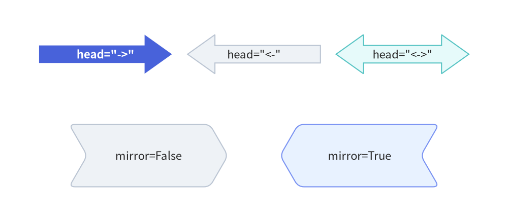

# Block Arrows

In addition to line connectors (`drawlib.lines`), Drawlib provides six **directed block arrow primitives** in `drawlib.shapes`. 
Block arrows are closed 2D polygons with customizable tail widths, arrowhead dimensions, and corner rounding. They are widely used for data pipelines, architectural flows, and process stages.

---

## 1. Overview of Block Arrow Functions

The six block arrow functions in `drawlib.shapes` fall into two groups with respect to text labeling:
- **Embedded Label Support (`text` & `text_style`)**: `arrow()` and `chevron()` accept `text` and `text_style` directly.
- **Standalone Label Placement (`drawlib.text.text()`)**: `arrow_l()`, `arrow_u()`, `arrow_arc()`, and `arrow_polyline()` do **not** accept `text` or `text_style`; place a standalone `text(xy, ...)` call adjacent to the arrow path.


<figure class="drawlib-image" style="text-align: center;">
  
  <figcaption class="drawlib-caption">Overview of Drawlib Block Arrow Primitives</figcaption>
</figure>

<details class="drawlib-code-details">
<summary>Source Code</summary>

```python
from drawlib.canvas import save, setup
from drawlib.shapes import arrow, arrow_arc, arrow_l, arrow_polyline, arrow_u, chevron, rectangle
from drawlib.styles import Styles
from drawlib.text import text

setup(width=136, height=68)

# Subtle background cards for 3x2 grid
for cx in (25, 68, 111):
    for cy in (50, 18):
        rectangle((cx, cy), width=38, height=26, style=Styles.Neutral.patch(shape_r=2))

# 1. Straight Block Arrow (Hero)
arrow((11, 53), (39, 53), tail_width=4.5, head_width=10, head_length=7.5, style=Styles.PrimaryFlat, text="arrow", text_style=Styles.WhiteBold.patch(text_size=8.5))
text((25, 41), "1. arrow()", style=Styles.DarkBold.patch(text_size=8.5))

# 2. Chevron
chevron((68, 53), width=26, height=12, corner_angle=60, style=Styles.SecondaryNeutral.patch(shape_r=1), text="chevron", text_style=Styles.DarkBold.patch(text_size=8.5))
text((68, 41), "2. chevron()", style=Styles.DarkBold.patch(text_size=8.5))

# 3. L-shaped Arrow
arrow_l((111, 54), width=22, height=13, tail_width=3.2, head_width=8, head_length=6, style=Styles.DarkBold.patch(shape_r=2.5))
text((111, 41), "3. arrow_l()", style=Styles.DarkBold.patch(text_size=8.5))

# 4. U-turn Arrow
arrow_u((25, 22), width=22, height=13, tail_width=3.2, head_width=8, head_length=6, style=Styles.DarkBold.patch(shape_r=3))
text((25, 9), "4. arrow_u()", style=Styles.DarkBold.patch(text_size=8.5))

# 5. Arrow Arc (Circular flow)
arrow_arc((68, 25.5), width=22, height=15, angle_start=180, angle_end=0, tail_width=3.2, head_width=8, head_angle=14, style=Styles.SecondaryNeutral)
text((68, 9), "5. arrow_arc()", style=Styles.DarkBold.patch(text_size=8.5))

# 6. Multi-Point Polyline Arrow
arrow_polyline([(98, 16), (110, 16), (110, 24.5), (124, 24.5)], tail_width=3.2, head_width=8, head_length=6, style=Styles.PrimaryNeutral.patch(shape_r=2))
text((111, 9), "6. arrow_polyline()", style=Styles.DarkBold.patch(text_size=8.5))

save()
```

</details>


---

## 2. Straight Block Arrow (`arrow`)

Draws a directed block arrow between two arbitrary coordinates `xy1` and `xy2`.

```python
arrow(
    xy1: tuple[float, float],
    xy2: tuple[float, float],
    tail_width: float,
    head_width: float,
    head_length: float,
    head: Literal["->", "<-", "<->"] = "->",
    *,
    style: Style,
    text: str = "",
    text_style: Style | None = None,
) -> None
```

| Parameter | Type | Default | Description |
| :--- | :--- | :--- | :--- |
| `xy1` | `tuple[float, float]` | *Required* | Base center coordinate of the arrow tail `(x1, y1)`. |
| `xy2` | `tuple[float, float]` | *Required* | Tip coordinate of the arrowhead `(x2, y2)`. |
| `tail_width` | `float` | *Required* | Width of the rectangular shaft (`> 0`). |
| `head_width` | `float` | *Required* | Full transverse width of the arrowhead base (`> 0`). |
| `head_length` | `float` | *Required* | Axial length of the arrowhead from base to tip (`> 0`). |
| `head` | `Literal["->", "<-", "<->"]` | `"->"` | Arrowhead direction: forward (`"->"`), backward (`"<-"`), or bidirectional (`"<->"`). |
| `style` | `Style` | *Required* | Shape fill and stroke style. |
| `text` | `str` | `""` | Embedded label centered and auto-rotated along the arrow shaft. |
| `text_style` | `Style \| None` | `None` | Optional typography style override for `text`. |


```python
from drawlib.canvas import save, setup
from drawlib.lines import line
from drawlib.shapes import arrow, circle
from drawlib.styles import Styles
from drawlib.text import text

setup(width=124, height=52)

# Primary straight block arrow from xy1=(26, 24) to xy2=(86, 24)
arrow(
    (26, 24),
    (86, 24),
    tail_width=8,
    head_width=18,
    head_length=14,
    head="->",  # "->", "<-", or "<->"
    style=Styles.PrimaryFlat,
    text="Data Ingestion",
    text_style=Styles.WhiteBold,
)

# Endpoint markers for xy1 and xy2
circle((26, 24), radius=1.2, style=Styles.DangerFlat)
line((26, 24), (26, 11), style=Styles.DangerDashed)
text((26, 7.5), "xy1 (26, 24)", style=Styles.DangerBold.patch(text_size=8.5))

circle((86, 24), radius=1.2, style=Styles.DangerFlat)
line((86, 24), (86, 11), style=Styles.DangerDashed)
text((86, 7.5), "xy2 (86, 24)", style=Styles.DangerBold.patch(text_size=8.5))

# Dimension: tail_width (shaft y = 20..28)
line((16, 20), (26, 20), style=Styles.MutedDashed)
line((16, 28), (26, 28), style=Styles.MutedDashed)
line((18, 20), (18, 28), arrow_head="<->", style=Styles.DarkBold)
text((9, 24), "tail_width", style=Styles.DarkBold.patch(text_size=8.5))

# Dimension: head_length (x = 72..86)
line((72, 33), (72, 41), style=Styles.MutedDashed)
line((86, 24), (86, 41), style=Styles.MutedDashed)
line((72, 39), (86, 39), arrow_head="<->", style=Styles.DarkBold)
text((79, 43.5), "head_length", style=Styles.DarkBold.patch(text_size=8.5))

# Dimension: head_width (arrowhead base y = 15..33)
line((72, 15), (100, 15), style=Styles.MutedDashed)
line((72, 33), (100, 33), style=Styles.MutedDashed)
line((98, 15), (98, 33), arrow_head="<->", style=Styles.DarkBold)
text((110, 24), "head_width", style=Styles.DarkBold.patch(text_size=8.5))

save()
```

<figure class="drawlib-image" style="text-align: center;">
  
  <figcaption class="drawlib-caption">Straight Block Arrow with Dimensional Anatomy</figcaption>
</figure>


---

## 3. Process Chevron (`chevron`)

Draws an interlocking 6-vertex arrowhead-shaped block with an indented rear notch, ideal for sequential stage diagrams.

```python
chevron(
    xy: tuple[float, float],
    width: float,
    height: float,
    corner_angle: float,
    mirror: bool = False,
    *,
    style: Style,
    text: str = "",
    text_style: Style | None = None,
) -> None
```

| Parameter | Type | Default | Description |
| :--- | :--- | :--- | :--- |
| `xy` | `tuple[float, float]` | *Required* | Anchor coordinate `(x, y)` (center by default with preset `Styles.*`). |
| `width` / `height` | `float` | *Required* | Horizontal body width and vertical height (`> 0`). |
| `corner_angle` | `float` | *Required* | Tip and rear notch angle in degrees (`0 < corner_angle < 90`). |
| `mirror` | `bool` | `False` | If `True`, mirrors the chevron horizontally so it points left. |
| `style` | `Style` | *Required* | Fill, stroke, rotation (`style.angle`), and vertex rounding (`style.shape_r` as a scalar `float` or 6-tuple of per-vertex radii). |
| `text` / `text_style` | `str` / `Style \| None` | `""` / `None` | Centered text label and optional typography override. |


```python
from drawlib.canvas import save, setup
from drawlib.shapes import chevron
from drawlib.styles import Styles

setup(width=100, height=40)
chevron(
    (50, 20),
    width=40,
    height=20,
    corner_angle=60,  # Tip acute angle
    style=Styles.PrimaryFlat,
    text="Stage 1",
    text_style=Styles.WhiteBold,
)
save()
```

<figure class="drawlib-image" style="text-align: center;">
  
  <figcaption class="drawlib-caption">Sequential Process Chevron</figcaption>
</figure>


### Arrowhead Directions (`head`) & Mirrored Chevrons (`mirror=True`)

All directed block arrows (`arrow`, `arrow_l`, `arrow_u`, `arrow_arc`, `arrow_polyline`) support `head="->"`, `head="<-"`, and `head="<->"`, while `chevron()` supports horizontal reversal via `mirror=True`:


```python
from drawlib.canvas import save, setup
from drawlib.shapes import arrow, chevron
from drawlib.styles import Styles

setup(width=130, height=56)

# Top row: head="->", head="<-", head="<->"
arrow((10, 42), (44, 42), tail_width=4.5, head_width=10, head_length=7, head="->", style=Styles.PrimaryFlat, text='head="->"', text_style=Styles.WhiteBold)
arrow((48, 42), (82, 42), tail_width=4.5, head_width=10, head_length=7, head="<-", style=Styles.Neutral, text='head="<-"')
arrow((86, 42), (120, 42), tail_width=4.5, head_width=10, head_length=7, head="<->", style=Styles.SecondaryNeutral, text='head="<->"')

# Bottom row: Standard chevron (mirror=False) vs Mirrored chevron (mirror=True)
chevron((38, 16), width=36, height=16, corner_angle=60, mirror=False, style=Styles.Neutral.patch(shape_r=1.5), text="mirror=False")
chevron((92, 16), width=36, height=16, corner_angle=60, mirror=True, style=Styles.PrimaryNeutral.patch(shape_r=1.5), text="mirror=True")

save()
```

<figure class="drawlib-image" style="text-align: center;">
  
  <figcaption class="drawlib-caption">Arrowhead Directions (head='->', '<-', '<->') and Mirrored Chevrons (mirror=True)</figcaption>
</figure>


> [!TIP]
> For chained multi-stage chevron pipelines, consider using the high-level **[`ChevronProcess`](../03_smartarts/chevron_process.md)** component, which calculates automatic spacing and themes.

---

## 4. Orthogonal Routed Arrows (`arrow_l`, `arrow_u`)

> [!NOTE]
> `arrow_l()` and `arrow_u()` do **not** accept `text` or `text_style`. Use standalone `drawlib.text.text()` to place labels near the elbow or shaft.

### L-Shaped Corner Arrow (`arrow_l`)
Draws a 90-degree right-angled block arrow centered at `xy` within a bounding box `(width, height)`.

```python
arrow_l(
    xy: tuple[float, float],
    width: float,
    height: float,
    tail_width: float,
    head_width: float,
    head_length: float,
    head: Literal["->", "<-", "<->"] = "->",
    *,
    style: Style,
) -> None
```

| Parameter | Type | Default | Description |
| :--- | :--- | :--- | :--- |
| `xy` | `tuple[float, float]` | *Required* | Center coordinate `(x, y)` of the L-arrow bounding box. |
| `width` / `height` | `float` | *Required* | Bounding box horizontal width and vertical height (`> 0`). |
| `tail_width` | `float` | *Required* | Shaft width (`> 0`). |
| `head_width` / `head_length` | `float` | *Required* | Arrowhead width and axial length (`> 0`). |
| `head` | `Literal["->", "<-", "<->"]` | `"->"` | Arrowhead direction (`"->"`, `"<-"`, or `"<->"`). |
| `style` | `Style` | *Required* | Fill, stroke, rotation (`style.angle`), and elbow rounding radius (`style.shape_r` as a scalar `float` or 1-tuple). |


```python
from drawlib.canvas import save, setup
from drawlib.shapes import arrow_l
from drawlib.styles import Styles

setup(width=100, height=60)
arrow_l(
    (50, 30),
    width=40,
    height=35,
    tail_width=4,
    head_width=11,
    head_length=8,
    # Corner rounding radius
    style=Styles.DarkBold.patch(shape_r=5),
)
save()
```

<figure class="drawlib-image" style="text-align: center;">
  
  <figcaption class="drawlib-caption">Right-Angled Corner Arrow</figcaption>
</figure>


### U-Turn Feedback Arrow (`arrow_u`)
Draws a 180-degree turnaround block arrow centered at `xy`, typically used for retry mechanisms or feedback loops.

```python
arrow_u(
    xy: tuple[float, float],
    width: float,
    height: float,
    tail_width: float,
    head_width: float,
    head_length: float,
    head: Literal["->", "<-", "<->"] = "->",
    *,
    style: Style,
) -> None
```

| Parameter | Type | Default | Description |
| :--- | :--- | :--- | :--- |
| `xy` | `tuple[float, float]` | *Required* | Center coordinate `(x, y)` of the U-arrow bounding box. |
| `width` / `height` | `float` | *Required* | Bounding box horizontal width and vertical height (`> 0`). |
| `tail_width` | `float` | *Required* | Shaft width (`> 0`). |
| `head_width` / `head_length` | `float` | *Required* | Arrowhead width and axial length (`> 0`). |
| `head` | `Literal["->", "<-", "<->"]` | `"->"` | Arrowhead direction (`"->"`, `"<-"`, or `"<->"`). |
| `style` | `Style` | *Required* | Fill, stroke, rotation (`style.angle`), and turn rounding radius (`style.shape_r` as a scalar `float` or 2-tuple `(r1, r2)` for the two corners). |


```python
from drawlib.canvas import save, setup
from drawlib.shapes import arrow_u
from drawlib.styles import Styles

setup(width=100, height=60)
arrow_u(
    (50, 30),
    width=35,
    height=40,
    tail_width=4,
    head_width=11,
    head_length=8,
    # Corner rounding radius (scalar or 2-tuple)
    style=Styles.DarkBold.patch(shape_r=6),
)
save()
```

<figure class="drawlib-image" style="text-align: center;">
  
  <figcaption class="drawlib-caption">180-Degree U-Turn Arrow</figcaption>
</figure>


---

## 5. Circular & Multi-Point Arrows (`arrow_arc`, `arrow_polyline`)

> [!NOTE]
> `arrow_arc()` and `arrow_polyline()` do **not** accept `text` or `text_style`. Use standalone `drawlib.text.text()` to place labels inside or alongside the curve/path.

### Circular Arc Arrow (`arrow_arc`)
Draws an elliptical arc block arrow between `angle_start` and `angle_end`.

```python
arrow_arc(
    xy: tuple[float, float],
    width: float,
    height: float,
    tail_width: float,
    head_width: float,
    head_angle: float = 10,
    head: Literal["->", "<-", "<->"] = "->",
    angle_start: float = 0,
    angle_end: float = 180,
    *,
    style: Style,
) -> None
```

| Parameter | Type | Default | Description |
| :--- | :--- | :--- | :--- |
| `xy` | `tuple[float, float]` | *Required* | Center coordinate `(x, y)` of the underlying ellipse. |
| `width` / `height` | `float` | *Required* | Horizontal and vertical diameters of the arc ellipse (`> 0`). |
| `tail_width` / `head_width` | `float` | *Required* | Curved shaft width and arrowhead base width (`> 0`). |
| `head_angle` | `float` | `10` | Angular span of the arrowhead in degrees. |
| `head` | `Literal["->", "<-", "<->"]` | `"->"` | Arrowhead direction (`"->"`, `"<-"`, or `"<->"`). |
| `angle_start` / `angle_end` | `float` | `0` / `180` | Starting and ending angles in degrees counterclockwise (CCW). |
| `style` | `Style` | *Required* | Fill, stroke, and whole-arc rotation (`style.angle`). |


```python
from drawlib.canvas import save, setup
from drawlib.shapes import arrow_arc
from drawlib.styles import Styles

setup(width=100, height=35)
arrow_arc(
    (50, 26),
    width=45,
    height=32,
    tail_width=4,
    head_width=11,
    head_angle=12,
    head="->",
    angle_start=180,
    angle_end=0,
    style=Styles.DarkBold,
)
save()
```

<figure class="drawlib-image" style="text-align: center;">
  
  <figcaption class="drawlib-caption">Circular Arc Arrow</figcaption>
</figure>


### Multi-Point Polyline Arrow (`arrow_polyline`)
Draws a complex routed block arrow passing through an arbitrary list of waypoint coordinates `[(x1, y1), (x2, y2), ...]`.

```python
arrow_polyline(
    xys: list[tuple[float, float]],
    tail_width: float,
    head_width: float,
    head_length: float,
    head: Literal["->", "<-", "<->"] = "->",
    *,
    style: Style,
) -> None
```

| Parameter | Type | Default | Description |
| :--- | :--- | :--- | :--- |
| `xys` | `list[tuple[float, float]]` | *Required* | Sequence of at least 2 waypoint coordinates `[(x1, y1), (x2, y2), ...]`. |
| `tail_width` | `float` | *Required* | Width of the polyline shaft (`> 0`). |
| `head_width` / `head_length` | `float` | *Required* | Arrowhead width and axial length (`> 0`). |
| `head` | `Literal["->", "<-", "<->"]` | `"->"` | Arrowhead direction (`"->"`, `"<-"`, or `"<->"`). |
| `style` | `Style` | *Required* | Fill, stroke, and joint corner rounding (`style.shape_r` as a scalar `float` or a `(len(xys) - 2)`-tuple of per-joint radii). |


```python
from drawlib.canvas import save, setup
from drawlib.shapes import arrow_polyline
from drawlib.styles import Styles

setup(width=100, height=60)
arrow_polyline(
    [(15, 15), (50, 15), (50, 45), (85, 45)],
    tail_width=4,
    head_width=11,
    head_length=8,
    head="->",
    # Uniform scalar radius or (len(xys) - 2)-tuple per intermediate joint
    style=Styles.PrimaryFlat.patch(shape_r=(3, 6)),
)
save()
```

<figure class="drawlib-image" style="text-align: center;">
  
  <figcaption class="drawlib-caption">Multi-Point Polyline Arrow</figcaption>
</figure>


