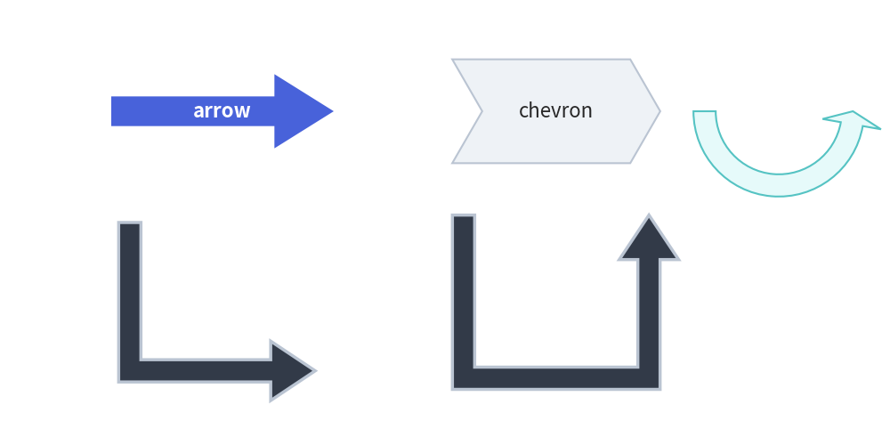
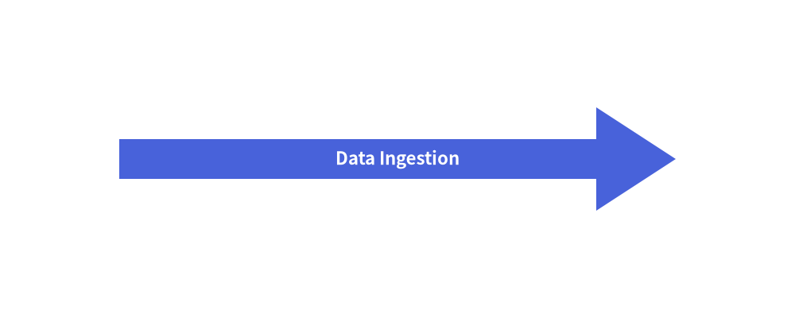
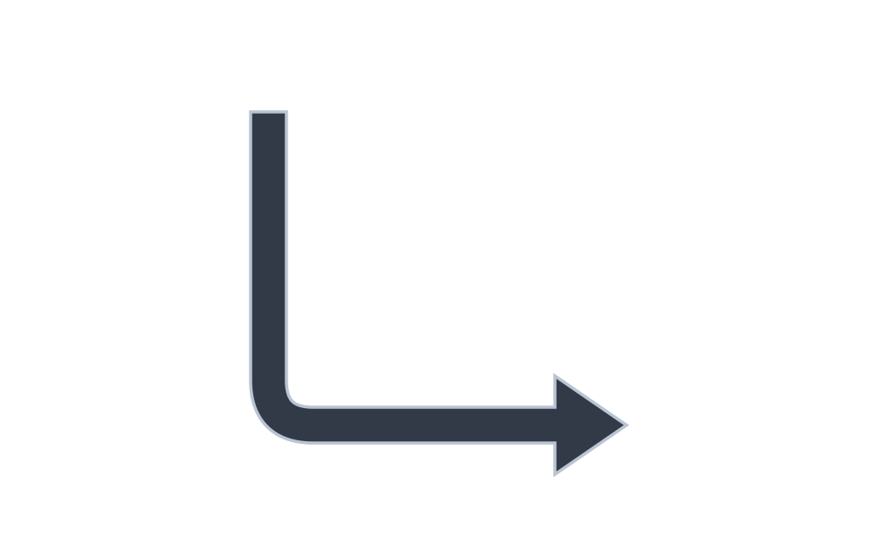
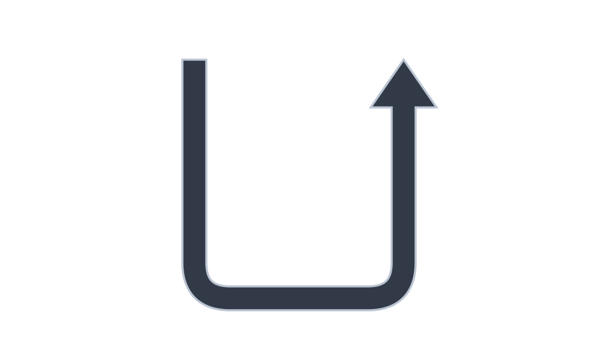
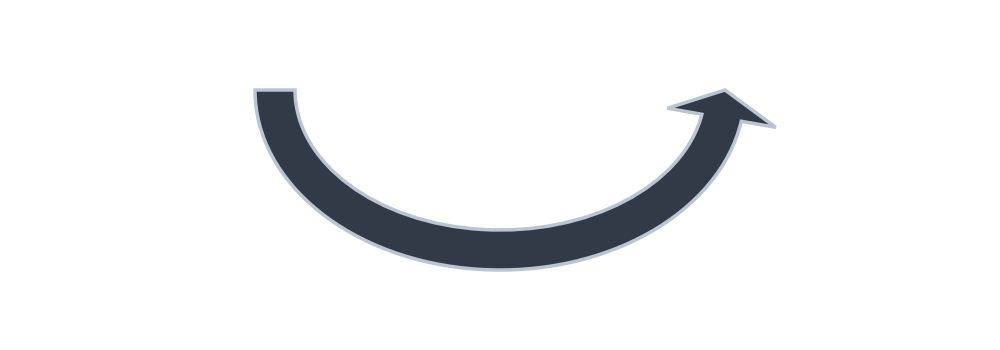
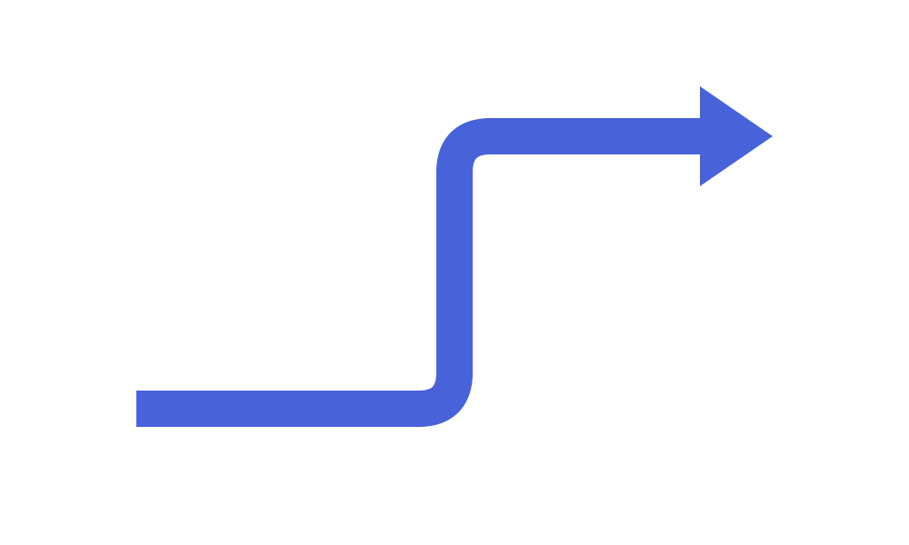

# Block Arrows

In addition to line connectors (`drawlib.lines`), Drawlib provides six **directed block arrow primitives** in `drawlib.shapes`. 
Block arrows are closed 2D polygons with customizable tail widths, arrowhead dimensions, and corner rounding. They are widely used for data pipelines, architectural flows, and process stages.

---

## 1. Overview of Block Arrow Functions


<figure class="drawlib-image" style="text-align: center;">
  
  <figcaption class="drawlib-caption">Overview of Drawlib Block Arrow Primitives</figcaption>
</figure>


---

## 2. Straight Block Arrow (`arrow`)

Draws a directed block arrow between two arbitrary coordinates `xy1` and `xy2`.


```python
from drawlib.canvas import save, setup
from drawlib.shapes import arrow
from drawlib.styles import Styles

setup(width=100, height=40)
arrow(
    (15, 20),
    (85, 20),
    tail_width=5,
    head_width=13,
    head_length=10,
    head="->",  # "->", "<-", or "<->"
    style=Styles.PrimaryFlat,
    text="Data Ingestion",
    text_style=Styles.WhiteBold,
)
save()
```

<figure class="drawlib-image" style="text-align: center;">
  
  <figcaption class="drawlib-caption">Straight Block Arrow with Centered Label</figcaption>
</figure>


- **`head`**: Supports single forward (`"->"`), backward (`"<-"`), or bidirectional (`"<->"`) arrowheads.
- **`text`**: Automatically centers a label within the arrow shaft.

---

## 3. Process Chevron (`chevron`)

Draws an interlocking arrowhead-shaped block with an indented rear notch, ideal for sequential stage diagrams:


```python
from drawlib.canvas import save, setup
from drawlib.shapes import chevron
from drawlib.styles import Styles

setup(width=100, height=40)
chevron(
    (50, 20),
    width=40,
    height=20,
    corner_angle=60,  # Tip acute angle
    style=Styles.PrimaryFlat,
    text="Stage 1",
    text_style=Styles.WhiteBold,
)
save()
```

<figure class="drawlib-image" style="text-align: center;">
  
  <figcaption class="drawlib-caption">Sequential Process Chevron</figcaption>
</figure>


> [!TIP]
> For chained multi-stage chevron pipelines, consider using the high-level **[`ChevronProcess`](../03_smartarts/chevron_process.md)** component, which calculates automatic spacing and themes.

---

## 4. Orthogonal Routed Arrows

### L-Shaped Corner Arrow (`arrow_l`)
Draws a 90-degree right-angled block arrow within a bounding box `(width, height)`.


```python
from drawlib.canvas import save, setup
from drawlib.shapes import arrow_l
from drawlib.styles import Styles

setup(width=100, height=60)
arrow_l(
    (50, 30),
    width=40,
    height=35,
    tail_width=4,
    head_width=11,
    head_length=8,
    # Corner rounding radius
    style=Styles.DarkBold.patch(shape_r=5),
)
save()
```

<figure class="drawlib-image" style="text-align: center;">
  
  <figcaption class="drawlib-caption">Right-Angled Corner Arrow</figcaption>
</figure>


### U-Turn Feedback Arrow (`arrow_u`)
Draws a 180-degree turnaround block arrow, typically used for retry mechanisms or feedback loops.


```python
from drawlib.canvas import save, setup
from drawlib.shapes import arrow_u
from drawlib.styles import Styles

setup(width=100, height=60)
arrow_u(
    (50, 30),
    width=35,
    height=40,
    tail_width=4,
    head_width=11,
    head_length=8,
    # Corner rounding radius
    style=Styles.DarkBold.patch(shape_r=6),
)
save()
```

<figure class="drawlib-image" style="text-align: center;">
  
  <figcaption class="drawlib-caption">180-Degree U-Turn Arrow</figcaption>
</figure>


---

## 5. Circular & Multi-Point Arrows

### Circular Arc Arrow (`arrow_arc`)
Draws an elliptical arc block arrow between `angle_start` and `angle_end`.


```python
from drawlib.canvas import save, setup
from drawlib.shapes import arrow_arc
from drawlib.styles import Styles

setup(width=100, height=35)
arrow_arc(
    (50, 26),
    width=45,
    height=32,
    angle_start=180,
    angle_end=0,
    tail_width=4,
    head_width=11,
    style=Styles.DarkBold,
)
save()
```

<figure class="drawlib-image" style="text-align: center;">
  
  <figcaption class="drawlib-caption">Circular Arc Arrow</figcaption>
</figure>


### Multi-Point Polyline Arrow (`arrow_polyline`)
Draws a complex routed block arrow passing through an arbitrary list of waypoint coordinates `[(x1, y1), (x2, y2), ...]`.


```python
from drawlib.canvas import save, setup
from drawlib.shapes import arrow_polyline
from drawlib.styles import Styles

setup(width=100, height=60)
arrow_polyline(
    [(15, 15), (50, 15), (50, 45), (85, 45)],
    tail_width=4,
    head_width=11,
    head_length=8,
    style=Styles.PrimaryFlat.patch(shape_r=4),
)
save()
```

<figure class="drawlib-image" style="text-align: center;">
  
  <figcaption class="drawlib-caption">Multi-Point Polyline Arrow</figcaption>
</figure>


