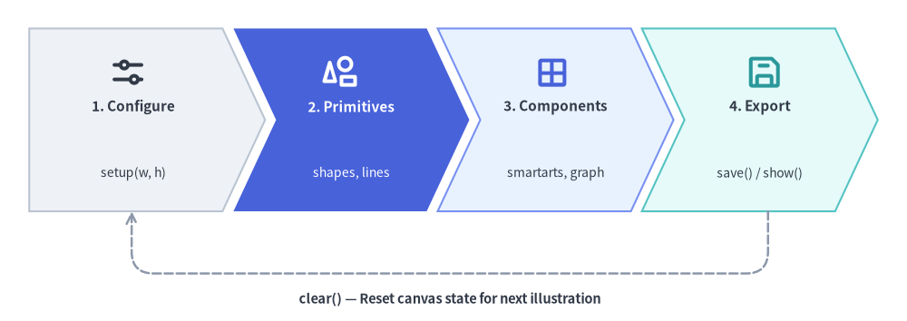
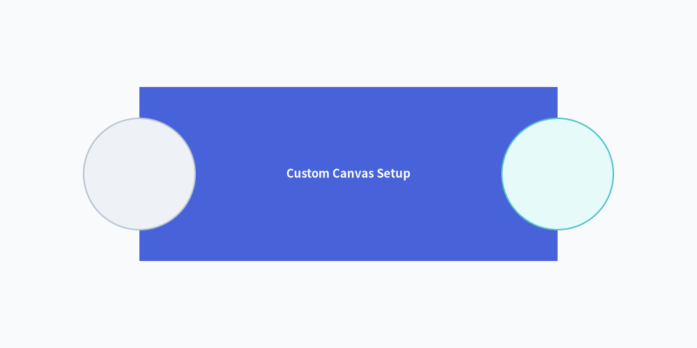
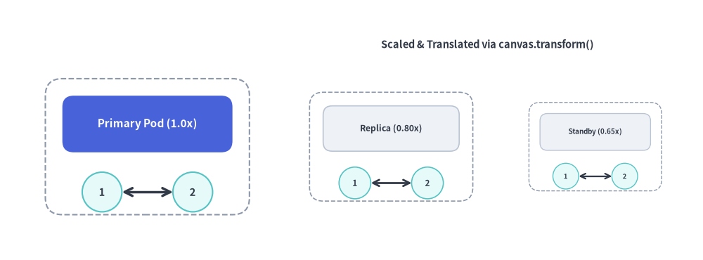

# Canvas & Coordinates

The `canvas` is the foundational drawing surface of Drawlib.  
Under the "Illustration as Code" paradigm, canvas dimensions, resolution, background coloring, coordinate grids, and export formats are managed entirely through declarative Python function calls.
Drawlib maintains an active canvas singleton where drawing functions register visual elements before the canvas is saved or rendered:


<figure class="drawlib-image" style="text-align: center;">
  
  <figcaption class="drawlib-caption">The Drawlib Canvas Lifecycle Model</figcaption>
</figure>

<details class="drawlib-code-details">
<summary>Source Code</summary>

```python
from drawlib.canvas import save, setup
from drawlib.icons import phosphor
from drawlib.lines import lines_curved
from drawlib.smartarts import ChevronProcess
from drawlib.styles import Styles
from drawlib.text import text

setup(width=124, height=44)

# 4-Stage Canvas Lifecycle Pipeline using ChevronProcess
lifecycle = ChevronProcess(
    style=Styles.Neutral,
    text_style=Styles.DarkBold.patch(text_size=11.0, xy_shift=(0, -2.2)),
    description_style=Styles.Dark.patch(text_size=10.0, xy_shift=(0, -2.8)),
    corner_angle=65.0,
    spacing=1.5,
    flat_left_end=True,
)
lifecycle.add("1. Configure", description="setup(w, h)")
lifecycle.add(
    "2. Primitives",
    description="shapes, lines",
    style=Styles.PrimaryFlat,
    text_style=Styles.WhiteBold.patch(text_size=11.0, xy_shift=(0, -2.2)),
    description_style=Styles.White.patch(text_size=10.0, xy_shift=(0, -2.8)),
)
lifecycle.add("3. Components", description="smartarts, graph", style=Styles.PrimaryNeutral)
lifecycle.add("4. Export", description="save() / show()", style=Styles.SecondaryNeutral)

lifecycle.draw(xy=(4, 15), width=116.0, height=25.0)

# Overlay Phosphor icons at the top center of each chevron stage
stage_icons = [
    (17.5, phosphor.sliders_horizontal, Styles.DarkBold),
    (46.5, phosphor.shapes, Styles.WhiteBold),
    (75.5, phosphor.grid_four, Styles.PrimaryBold),
    (104.5, phosphor.floppy_disk, Styles.SecondaryBold),
]
for cx, icon_fn, icon_st in stage_icons:
    icon_fn((cx, 34.0), width=5.2, style=icon_st)

# Return loop from Stage 4 back to Stage 1
lines_curved(
    [(105, 15), (105, 6.5), (18, 6.5), (18, 15)],
    r=3.0,
    arrow_head="->",
    style=Styles.MutedDashed.patch(line_width=1.8),
)
text(
    (61.5, 3.0),
    "clear() — Reset canvas state for next illustration",
    style=Styles.DarkBold.patch(text_size=10.5),
)
save()
```

</details>


---

## 1. Imports & Core Lifecycle

Canvas lifecycle functions and the singleton `canvas` instance are imported from `drawlib.canvas`:

```python
from drawlib.canvas import (
    canvas,       # Active singleton Canvas instance (provides canvas.transform())
    clear,        # Reset canvas state and configuration between drawings
    get_dimage,   # Render canvas in-memory and return a Dimage object
    save,         # Save drawing to disk (PNG, WebP, JPG, SVG, PDF)
    setup,        # Configure dimensions, grid, background color, and DPI
    show,         # Display canvas in an interactive GUI window
)
```

> [!IMPORTANT]
> **Sequential Scripts & Multi-Image Generation**:  
> If you generate multiple illustrations in a single Python script, always call `clear()` between images. Otherwise, elements from earlier drawings will bleed onto subsequent canvases.

---

## 2. Cartesian Coordinate Space

Drawlib uses a mathematical Cartesian coordinate system:

- **Origin `(0, 0)`**: Fixed at the **bottom-left corner** of the canvas.
- **X-Axis**: Increases horizontally to the right (`0` to `width`).
- **Y-Axis**: Increases vertically upwards (`0` to `height`).
- **Center-Based Anchoring**: Coordinates `(x, y)` for shapes, text, and icons refer to their **exact geometric center** by default.


```python
from drawlib.canvas import save, setup
from drawlib.shapes import circle, rectangle
from drawlib.styles import Colors, Styles

# Custom background color (Muted tone 1) and coordinate grid
setup(width=100, height=50, background_color=Colors.Muted1, grid=True)

rectangle((50, 25), width=60, height=25, style=Styles.PrimaryFlat, text="Custom Canvas Setup", text_style=Styles.WhiteBold.patch(text_size=12.0))
circle((20, 25), radius=8, style=Styles.Neutral)
circle((80, 25), radius=8, style=Styles.SecondaryNeutral)
save()
```

<figure class="drawlib-image" style="text-align: center;">
  
  <figcaption class="drawlib-caption">Custom Canvas Configuration with Grid</figcaption>
</figure>


---

## 3. Function & Method Reference

### 3.1. `setup()`
Configures canvas geometry, resolution, coordinate grids, and background appearance. Must be called before drawing elements.

```python
setup(
    width: int | None = None,
    height: int | None = None,
    dpi: int | None = None,
    color: Color | tuple[int, int, int] | tuple[int, int, int, float] | str | None = None,
    alpha: float | None = None,
    background_color: Color | tuple[int, int, int] | tuple[int, int, int, float] | str | None = None,
    background_alpha: float | None = None,
    grid: bool | None = None,
    grid_only: bool | None = None,
    grid_style: Style | None = None,
    grid_centerstyle: Style | None = None,
    grid_xpitch: int | None = None,
    grid_ypitch: int | None = None,
)
```

#### Parameter Reference:
| Parameter | Type | Default | Description |
| :--- | :--- | :--- | :--- |
| `width` | `int` | `100` | Canvas width in virtual coordinate units (`> 0`). |
| `height` | `int` | `100` | Canvas height in virtual coordinate units (`> 0`). |
| `dpi` | `int` | `100` | Dots per inch (resolution and raster sharpness). |
| `background_color` / `color` | `Color \| tuple \| str` | `(255, 255, 255)` | Canvas background color as a `Color` instance, RGB/RGBA tuple, hex string (`"#f8fafc"`), or CSS color name (`color` is a shorthand alias for `background_color`). |
| `background_alpha` / `alpha` | `float` | `1.0` | Background opacity in `[0.0, 1.0]` (`0.0` = fully transparent, `1.0` = opaque; `alpha` is a shorthand alias for `background_alpha`). |
| `grid` | `bool` | `False` | Overlays coordinate grid lines for layout alignment. |
| `grid_only` | `bool` | `False` | Renders the coordinate grid overlay without saving a separate non-grid image. |
| `grid_style` | `Style` | Gray dashed | Custom line style for regular grid lines (automatically enables `grid=True`). |
| `grid_centerstyle`| `Style` | Bold gray dashed | Custom line style for center axes (`x = width / 2`, `y = height / 2`). |
| `grid_xpitch` | `int` | `width / 10` | Spacing between vertical grid lines. |
| `grid_ypitch` | `int` | `height / 10` | Spacing between horizontal grid lines. |

---

### 3.2. `save()`
Exports the active canvas to an image file on disk.

```python
save(
    file: str | None = None,
    format: Literal["png", "webp", "jpg", "pdf", "svg"] | None = None,
)
```

- **`file`**: Target file path. If omitted, defaults to `<script_name>.png` in the directory of the running script.
- **`format`**: Output image format (`"png"`, `"webp"`, `"jpg"`/`"jpeg"`, `"svg"`, `"pdf"`). If omitted, inferred from the filename extension or defaults to `"png"`.
- **Grid Export Behavior (`setup(..., grid=True)`)**:
  - When `grid=True` and `grid_only=False` (default), calling `save("out.png")` writes **two files**: the clean illustration (`out.png`) and a companion grid-overlaid image (`out_grid.png`).
  - When `grid_only=True`, calling `save("out.png")` writes **only a single file** (`out.png`) with the coordinate grid overlaid directly on the drawing.

> [!NOTE]
> **Handling `save()` in Markdown Blocks**:
> In Markdown embedded code blocks (` ```drawlib `), calling `save()` is optional because the Document Builder captures the canvas automatically. If `save()` is called within an embedded block, the engine treats it safely as a no-op to prevent duplicate writes or collisions. However, explicitly including `save()` (without arguments) in complete examples is recommended for 100% copy-paste compatibility with standalone `.py` scripts.

---

### 3.3. `show()`
Opens a local interactive desktop window displaying the illustration. In headless environments (CI/CD, Docker, remote servers), use `save()` or CLI `drawlib show -o <path>` instead.

### 3.4. `clear()`
Resets canvas geometry, clears registered artists, and restores default styles and configuration parameters.

### 3.5. `get_dimage()`
Renders the canvas in-memory and returns a `Dimage` object, allowing programmatic image transformations, cropping, and chaining without writing temporary files to disk.

---

### 3.6. Local Coordinate Scaling & Translation (`canvas.transform()`)

The `canvas.transform()` context manager applies a similarity transformation (proportional scaling around an anchor `origin` plus an `(dx, dy)` translation offset) to all shapes, lines, icons, and text drawn within its `with` block. Transforms can also be nested.

```python
with canvas.transform(
    origin: tuple[float, float] = (0.0, 0.0),
    scale: float = 1.0,
    translate: tuple[float, float] = (0.0, 0.0),
):
    ...
```

- **`origin`**: Anchor coordinate `(ox, oy)` around which scaling is performed (defaults to `(0.0, 0.0)`).
- **`scale`**: Positive proportional scale factor (`> 0`, defaults to `1.0`). Scales geometry, stroke widths, arrowheads, and font sizes together.
- **`translate`**: Additional `(dx, dy)` translation offset applied in canvas units (defaults to `(0.0, 0.0)`).


```python
from drawlib.canvas import canvas, save, setup
from drawlib.lines import line
from drawlib.shapes import circle, rectangle
from drawlib.styles import Styles
from drawlib.text import text

setup(width=124, height=46, grid=True, grid_xpitch=25, grid_ypitch=12)

def draw_service_pod(title: str, is_hero: bool = False) -> None:
    """Reusable pod component authored in local coordinates around (26, 20)."""
    card_style = Styles.PrimaryFlat if is_hero else Styles.Neutral
    label_style = (Styles.WhiteBold if is_hero else Styles.DarkBold).patch(text_size=11.0)
    rectangle((26, 20), width=36, height=24, style=Styles.MutedDashed.patch(shape_r=3))
    rectangle((26, 24), width=30, height=10, style=card_style.patch(shape_r=2), text=title, text_style=label_style)
    circle((18, 12), radius=3.5, style=Styles.SecondaryNeutral, text="1", text_style=Styles.DarkBold.patch(text_size=10.5))
    circle((34, 12), radius=3.5, style=Styles.SecondaryNeutral, text="2", text_style=Styles.DarkBold.patch(text_size=10.5))
    line((21.5, 12), (30.5, 12), arrow_head="<->", style=Styles.DarkBold)

# 1. Original 1.0x pod at (26, 20)
draw_service_pod("Primary Pod (1.0x)", is_hero=True)

# 2. Scaled (0.80x) and translated (+43, 0) replica pod
with canvas.transform(origin=(26, 20), scale=0.80, translate=(43, 0)):
    draw_service_pod("Replica (0.80x)")

# 3. Scaled (0.65x) and translated (+79, 0) standby pod
with canvas.transform(origin=(26, 20), scale=0.65, translate=(79, 0)):
    draw_service_pod("Standby (0.65x)")

text((86, 38), "Scaled & Translated via canvas.transform()", style=Styles.DarkBold.patch(text_size=10.5))
save()
```

<figure class="drawlib-image" style="text-align: center;">
  
  <figcaption class="drawlib-caption">Local Coordinate Scaling and Translation with canvas.transform()</figcaption>
</figure>


