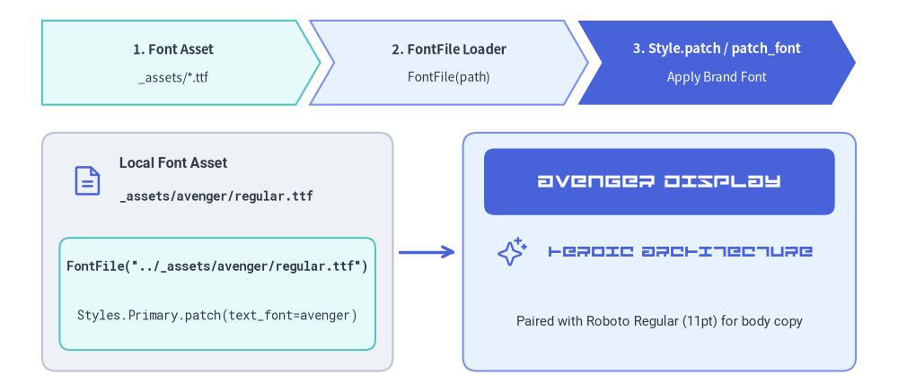
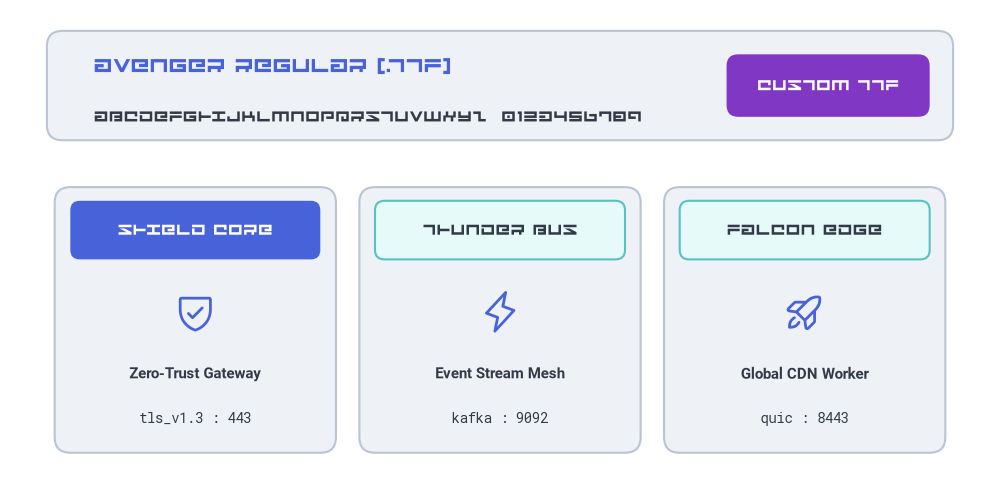
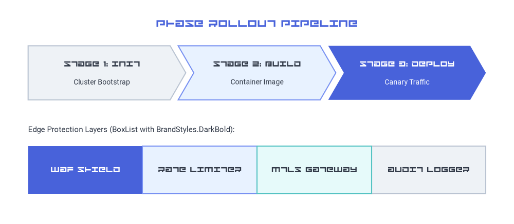

# Custom Font Files (`FontFile`)

While Drawlib ships with 13 curated cross-platform font families (`Font`, `FontRoboto`, `FontJapanese`, etc.), organizations and design teams frequently need to render diagrams using **corporate brand typefaces, display fonts, or local `.ttf` / `.otf` assets**. `FontFile` lets you load any TrueType or OpenType font file directly from your project's `_assets/` directory and apply it to individual labels, shapes, or your entire project theme.


<figure class="drawlib-image" style="text-align: center;">
  
  <figcaption class="drawlib-caption">Loading a Custom TrueType Font (_assets/avenger/regular.ttf) with FontFile</figcaption>
</figure>

<details class="drawlib-code-details">
<summary>Source Code</summary>

```python
from drawlib.canvas import save, setup
from drawlib.fonts import FontFile, FontMonoSpace, FontRoboto
from drawlib.icons import phosphor
from drawlib.lines import line
from drawlib.shapes import rectangle
from drawlib.smartarts import ChevronProcess
from drawlib.styles import Styles
from drawlib.text import text

setup(width=128, height=56)

avenger = FontFile("../_assets/avenger/regular.ttf")

# Top pipeline banner using ChevronProcess
pipeline = ChevronProcess(
    style=Styles.SecondaryNeutral,
    text_style=Styles.DarkBold.patch(text_size=10.5),
    description_style=Styles.Dark.patch(text_size=10.0),
    corner_angle=60.0,
    spacing=2.0,
    flat_left_end=True,
)
pipeline.add("1. Font Asset", description="_assets/*.ttf")
pipeline.add("2. FontFile Loader", description="FontFile(path)", style=Styles.PrimaryNeutral)
pipeline.add(
    "3. Style.patch / patch_font",
    description="Apply Brand Font",
    style=Styles.PrimaryFlat,
    text_style=Styles.WhiteBold.patch(text_size=10.5),
    description_style=Styles.White.patch(text_size=10.0),
)
pipeline.draw(xy=(6.0, 41.0), width=116.0, height=12.0)

# Left Card: Local Font File Asset & Code
rectangle((31, 20.0), width=50, height=34, style=Styles.Neutral.patch(shape_r=2.0))
phosphor.file_text((12.5, 30.2), width=5.0, style=Styles.Primary)
text(
    (17.0, 32.5),
    "Local Font Asset",
    style=Styles.DarkBold.patch(text_font=FontRoboto.ROBOTO_BOLD, text_size=11.5, halign="left"),
)
text(
    (17.0, 28.0),
    "_assets/avenger/regular.ttf",
    style=Styles.Dark.patch(text_font=FontMonoSpace.ROBOTO_MONO_BOLD, text_size=10.0, halign="left"),
)

rectangle((31, 14.0), width=45, height=16.0, style=Styles.SecondaryNeutral.patch(shape_r=1.5))
text(
    (31, 18.0),
    'FontFile("../_assets/avenger/regular.ttf")',
    style=Styles.Dark.patch(text_font=FontMonoSpace.ROBOTO_MONO_BOLD, text_size=10.0),
)
text(
    (31, 11.0),
    "Styles.Primary.patch(text_font=avenger)",
    style=Styles.Dark.patch(text_font=FontMonoSpace.ROBOTO_MONO_REGULAR, text_size=10.0),
)

# Connector arrow
line((57, 20.0), (65, 20.0), arrow_head="->", style=Styles.PrimaryBold)

# Right Card: Live Avenger Font Specimen (Hero Showcase)
rectangle((94, 20.0), width=56, height=34, style=Styles.PrimaryNeutral.patch(shape_r=2.0))
rectangle(
    (94, 30.0),
    width=50,
    height=9.5,
    style=Styles.PrimaryFlat.patch(shape_r=1.5),
    text="AVENGER DISPLAY",
    text_style=Styles.White.patch(text_font=avenger, text_size=15.0),
)
phosphor.sparkle((73.0, 20.0), width=4.5, style=Styles.Primary)
text(
    (97, 20.0),
    "HEROIC ARCHITECTURE",
    style=Styles.Primary.patch(text_font=avenger, text_size=13.0),
)
text(
    (94, 10.0),
    "Paired with Roboto Regular (11pt) for body copy",
    style=Styles.Dark.patch(text_font=FontRoboto.ROBOTO_REGULAR, text_size=10.5),
)

save()
```

</details>


---

## 1. `FontFile` API & Path Resolution

Import `FontFile` from `drawlib.fonts` and pass the path to your font file:

```python
from drawlib.fonts import FontFile

avenger_font = FontFile("../_assets/avenger/regular.ttf")
```

| Parameter | Type | Required | Description |
| :--- | :--- | :--- | :--- |
| `file` | `str \| Path` | Yes | Path to a local `.ttf`, `.otf`, `.woff`, or `.woff2` font file. Validated immediately on construction (`FileNotFoundError` is raised if the file does not exist). |

### How Relative Paths Are Resolved
When you pass a relative path to `FontFile(file=...)`, Drawlib resolves it automatically:
1. **Relative to the calling `.py` script or `.md` file directory**: For example, inside `docs_src/02_drawing_primitives/font_file.md`, `"../_assets/avenger/regular.ttf"` points to `docs_src/_assets/avenger/regular.ttf`.
2. **Automatic parent directory search**: If the relative path is not found in the immediate directory of the Markdown/Python file, Drawlib walks up to 3 parent directories to locate project-root assets. This means `FontFile("_assets/avenger/regular.ttf")` and `FontFile("../_assets/avenger/regular.ttf")` both work seamlessly from chapter subdirectories.

---

## 2. Applying `FontFile` to Text and Shapes

Pass a `FontFile` instance to `style.patch(text_font=...)` on any `text()` call, geometric shape (`rectangle`, `circle`, etc.), or badge.

The example below loads `_assets/avenger/regular.ttf` and pairs it as a display typeface alongside `FontRoboto` and `FontMonoSpace`:


```python
from drawlib.canvas import save, setup
from drawlib.fonts import FontFile, FontMonoSpace, FontRoboto
from drawlib.icons import phosphor
from drawlib.shapes import rectangle
from drawlib.styles import Styles
from drawlib.text import text

setup(width=128, height=62)

# Load custom TrueType font from _assets/avenger/regular.ttf
avenger = FontFile("../_assets/avenger/regular.ttf")

# 1. Top Display Specimen Banner
rectangle((64, 51), width=116, height=14, style=Styles.Neutral.patch(shape_r=2.0))
text(
    (12, 53.5),
    "AVENGER REGULAR (.TTF)",
    style=Styles.Primary.patch(text_font=avenger, text_size=15.0, halign="left"),
)
text(
    (12, 47.0),
    "ABCDEFGHIJKLMNOPQRSTUVWXYZ  0123456789",
    style=Styles.Dark.patch(text_font=avenger, text_size=11.5, halign="left"),
)
rectangle(
    (106, 51),
    width=26,
    height=8,
    style=Styles.AccentFlat.patch(shape_r=1.5),
    text="CUSTOM TTF",
    text_style=Styles.White.patch(text_font=avenger, text_size=11.5),
)

# 2. Three Feature Cards Mixing Custom Display Headers with Clean Body Copy
cards = [
    (25, Styles.PrimaryFlat, Styles.White, phosphor.shield_check, "SHIELD CORE", "Zero-Trust Gateway", "tls_v1.3 : 443"),
    (64, Styles.SecondaryNeutral, Styles.Dark, phosphor.lightning, "THUNDER BUS", "Event Stream Mesh", "kafka : 9092"),
    (103, Styles.SecondaryNeutral, Styles.Dark, phosphor.rocket_launch, "FALCON EDGE", "Global CDN Worker", "quic : 8443"),
]

for cx, hdr_style, hdr_text_style, icon_fn, banner_label, subtitle, endpoint in cards:
    # Outer neutral card
    rectangle((cx, 21), width=36, height=34, style=Styles.Neutral.patch(shape_r=2.0))
    # Header bar rendered with custom Avenger font
    rectangle(
        (cx, 32.5),
        width=32,
        height=7.5,
        style=hdr_style.patch(shape_r=1.2),
        text=banner_label,
        text_style=hdr_text_style.patch(text_font=avenger, text_size=11.5),
    )
    # Icon + standard Roboto & Monospace metadata
    icon_fn((cx, 22.0), width=5.5, style=Styles.Primary)
    text((cx, 14.0), subtitle, style=Styles.DarkBold.patch(text_font=FontRoboto.ROBOTO_BOLD, text_size=10.5))
    text((cx, 8.5), endpoint, style=Styles.Dark.patch(text_font=FontMonoSpace.ROBOTO_MONO_REGULAR, text_size=10.0))

save()
```

<figure class="drawlib-image" style="text-align: center;">
  
  <figcaption class="drawlib-caption">Applying FontFile (_assets/avenger/regular.ttf) to Text Banners and Shape Cards</figcaption>
</figure>


---

## 3. Project-Wide Custom Fonts with `Styles.patch_font()`

Instead of patching `text_font` on every shape, call `Styles.patch_font()` to create a custom `Styles` catalog that applies your `FontFile` across high-level components such as `SmartArts`, `Diagrams`, and `Graphs`.

- **Display Headers + Standard Body**: Pass `bold=avenger` while keeping `regular=FontRoboto.ROBOTO_REGULAR` so component titles (`*Bold` styles) render in your custom display typeface while descriptions remain clean and readable.
- **Full Custom Brand Family**: Pass `regular=FontFile("..."), bold=FontFile("..."), thin=FontFile("...")` in `styles.py` to switch every preset style token across the entire project.


```python
from drawlib.canvas import save, setup
from drawlib.fonts import FontFile, FontRoboto
from drawlib.smartarts import BoxList, ChevronProcess
from drawlib.styles import Styles
from drawlib.text import text

setup(width=128, height=56)

avenger = FontFile("../_assets/avenger/regular.ttf")

# Create a themed Styles catalog where Bold tokens use Avenger and Regular tokens use Roboto
BrandStyles = Styles.patch_font(
    regular=FontRoboto.ROBOTO_REGULAR,
    bold=avenger,
)

text(
    (64, 50.0),
    "PHASE ROLLOUT PIPELINE",
    style=BrandStyles.PrimaryBold.patch(text_size=15.0),
)

# 1. ChevronProcess using BrandStyles.DarkBold (Avenger) for stage headers and Roboto for descriptions
proc = ChevronProcess(
    style=BrandStyles.Neutral,
    text_style=BrandStyles.DarkBold.patch(text_size=11.0),
    description_style=BrandStyles.Dark.patch(text_size=10.0),
    corner_angle=60.0,
    spacing=2.0,
    flat_left_end=True,
)
proc.add("STAGE 1: INIT", description="Cluster Bootstrap")
proc.add("STAGE 2: BUILD", description="Container Image", style=BrandStyles.PrimaryNeutral)
proc.add(
    "STAGE 3: DEPLOY",
    description="Canary Traffic",
    style=BrandStyles.PrimaryFlat,
    text_style=BrandStyles.WhiteBold.patch(text_size=11.0),
    description_style=BrandStyles.White.patch(text_size=10.0),
)
proc.draw(xy=(7.0, 31.0), width=114.0, height=13.5)

# 2. Contiguous BoxList using BrandStyles
text(
    (7.0, 23.5),
    "Edge Protection Layers (BoxList with BrandStyles.DarkBold):",
    style=BrandStyles.Dark.patch(text_size=10.5, halign="left"),
)
boxes = BoxList(
    style=BrandStyles.Neutral,
    text_style=BrandStyles.DarkBold.patch(text_size=11.0),
)
boxes.add("WAF SHIELD", style=BrandStyles.PrimaryFlat, text_style=BrandStyles.WhiteBold.patch(text_size=11.0))
boxes.add("RATE LIMITER", style=BrandStyles.PrimaryNeutral)
boxes.add("MTLS GATEWAY", style=BrandStyles.SecondaryNeutral)
boxes.add("AUDIT LOGGER", style=BrandStyles.Neutral)
boxes.draw(xy=(7.0, 7.5), box_width=28.5, box_height=12.0, align="left")

save()
```

<figure class="drawlib-image" style="text-align: center;">
  
  <figcaption class="drawlib-caption">Using Styles.patch_font() with FontFile Across SmartArt Components</figcaption>
</figure>


### Configuring `styles.py` for an Entire Project
To apply corporate font files to every diagram in a `doc`, `site`, `slide`, or `images` project without repeating `FontFile` imports in each file, place your font files in `_assets/fonts/` and update `styles.py`:

```python
# styles.py
from drawlib.fonts import FontFile, FontSourceCode
from drawlib.styles import Styles

Styles = Styles.patch_font(
    regular=FontFile("_assets/avenger/regular.ttf"),
    bold=FontFile("_assets/avenger/regular.ttf"),
    thin=FontFile("_assets/avenger/regular.ttf"),
    sourcecode=FontSourceCode.SOURCECODEPRO,
)
```

---

## 4. Asset Organization & Build Caching

1. **Store Fonts Under `_assets/`**:
   Keep custom `.ttf` / `.otf` files inside your project's `_assets/` directory (for example, `docs_src/_assets/avenger/regular.ttf`). During `drawlib build html` and `drawlib build markdown`, `_assets/` is automatically copied to the output directory.
2. **Incremental Cache Tracking (`.drawlib/cache.db`)**:
   Drawlib's build cache hashes local files referenced under `_assets/`. If you replace or update `_assets/avenger/regular.ttf`, `drawlib build` detects the file checksum change and re-renders affected diagrams automatically.
3. **See Also**:
   - [Fonts & Multilingual Catalog](./fonts.md) — Built-in `Font`, `FontRoboto`, `FontJapanese`, and 10+ regional font classes.
   - [Text & Typography](./text.md) — Positioning, alignment, rotation, and bounding boxes with `text()`.
   - [Styles & Theming](./styles.md) — Preset style tokens and `Styles.patch_font()`.
