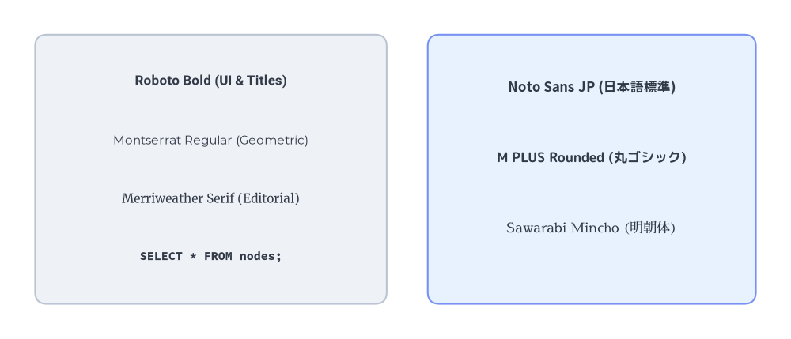
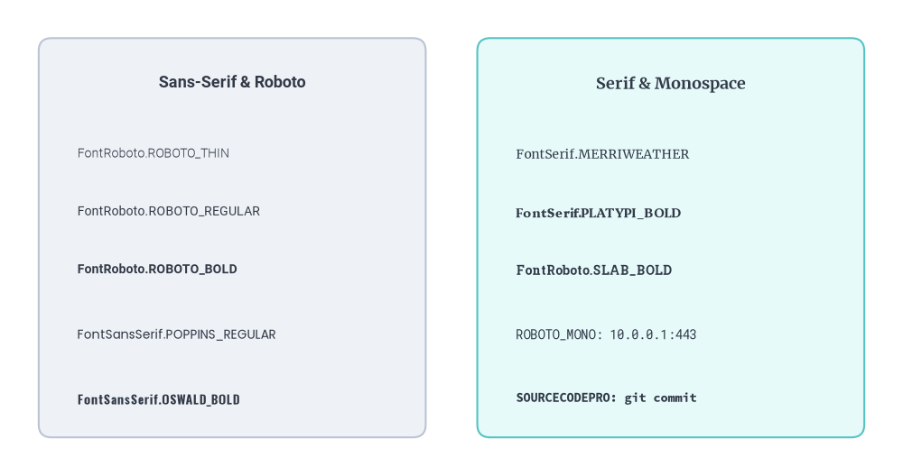
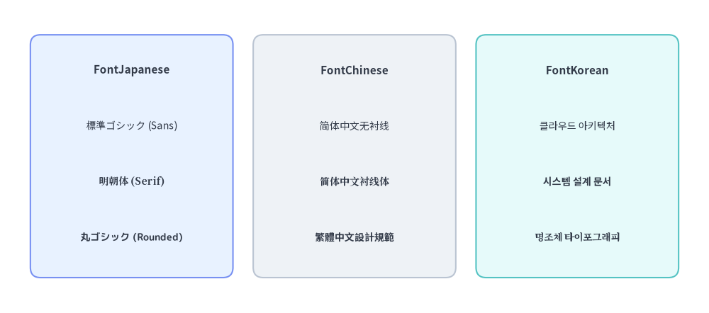

# Fonts & Multilingual Catalog

Drawlib does not rely on host operating system fonts, which often differ across Linux, macOS, and Windows and cause text clipping or layout drift in CI.
Instead, `drawlib.fonts` provides **14 curated font classes** backed by open-source Google Noto, Roboto, M PLUS, and Adobe Source families—downloaded on demand and cached locally for deterministic, cross-platform rendering.

---

## 1. Overview of Built-in Typography


<figure class="drawlib-image" style="text-align: center;">
  
  <figcaption class="drawlib-caption">Cross-Platform Western, Monospace, and CJK Font Families in Drawlib</figcaption>
</figure>

<details class="drawlib-code-details">
<summary>Source Code</summary>

```python
from drawlib.canvas import save, setup
from drawlib.fonts import (
    FontJapanese,
    FontMonoSpace,
    FontRoboto,
    FontSansSerif,
    FontSerif,
)
from drawlib.shapes import rectangle
from drawlib.styles import Styles
from drawlib.text import text

setup(width=135, height=58)

# Left card: Western & Monospace specimen
rectangle((36, 29), width=60, height=46, style=Styles.Neutral.patch(shape_r=2))
text((36, 44), "Roboto Bold (UI & Titles)", style=Styles.DarkBold.patch(text_font=FontRoboto.ROBOTO_BOLD, text_size=12))
text((36, 34), "Montserrat Regular (Geometric)", style=Styles.Dark.patch(text_font=FontSansSerif.MONTSERRAT_REGULAR, text_size=11))
text((36, 24), "Merriweather Serif (Editorial)", style=Styles.Dark.patch(text_font=FontSerif.MERRIWEATHER_REGULAR, text_size=11))
text((36, 14), "SELECT * FROM nodes;", style=Styles.Dark.patch(text_font=FontMonoSpace.SOURCECODEPRO_BOLD, text_size=11))

# Right card: Multilingual CJK specimen
rectangle((101, 29), width=56, height=46, style=Styles.PrimaryNeutral.patch(shape_r=2))
text((101, 43), "Noto Sans JP (日本語標準)", style=Styles.DarkBold.patch(text_font=FontJapanese.SANSSERIF_BOLD, text_size=12))
text((101, 31), "M PLUS Rounded (丸ゴシック)", style=Styles.Dark.patch(text_font=FontJapanese.MPLUSROUNDED1C_BOLD, text_size=12))
text((101, 19), "Sawarabi Mincho (明朝体)", style=Styles.Dark.patch(text_font=FontJapanese.SAWARABI_MINCHO, text_size=12))

save()
```

</details>


---

## 2. Complete Catalog of All 14 Classes in `drawlib.fonts`

All font classes are imported directly from `drawlib.fonts`:

```python
from drawlib.fonts import (
    # 1. Universal Default, Custom File Loader & Base Class
    Font,
    FontFile,
    FontBase,
    # 2. Western & Code Typography
    FontRoboto,
    FontSansSerif,
    FontSerif,
    FontMonoSpace,
    FontSourceCode,
    # 3. CJK & International Scripts
    FontJapanese,
    FontChinese,
    FontKorean,
    FontArabic,
    FontThai,
    FontBrahmic,
)
```

### 2.1. System, Universal & Custom Font Classes (3 Classes)

| Class | Category | Members / Signature | Description |
| :--- | :--- | :--- | :--- |
| **`Font`** | Universal Default | `SANSSERIF_THIN`, `SANSSERIF_REGULAR`, `SANSSERIF_BOLD`, `SERIF_THIN`, `SERIF_REGULAR`, `SERIF_BOLD` | Default cross-platform font family (Noto Sans / Noto Serif CJK) supporting Latin and East Asian scripts out of the box. |
| **`FontFile`** | Custom Font Loader | `FontFile(file="path/to/font.ttf")` | Loads any external `.ttf`, `.otf`, `.woff`, or `.woff2` corporate font file (resolved relative to the calling script). |
| **`FontBase`** | Abstract Base Enum | `class FontBase(str, Enum)` | Base class inherited by all built-in font enumerations for type checking and style validation. |

### 2.2. Western & Code Typography Classes (5 Classes)

| Class | Typeface Families | Available Weight / Style Variants |
| :--- | :--- | :--- |
| **`FontRoboto`** | Roboto, Roboto Serif, Roboto Mono, Roboto Condensed, Roboto Slab | `ROBOTO_THIN`, `ROBOTO_REGULAR`, `ROBOTO_BOLD` (aliases: `THIN`, `REGULAR`, `BOLD`), `SERIF_THIN`, `SERIF_REGULAR`, `SERIF_BOLD`, `MONO_THIN`, `MONO_REGULAR`, `MONO_BOLD`, `CONDENSED_THIN`, `CONDENSED_REGULAR`, `CONDENSED_BOLD`, `SLAB_THIN`, `SLAB_REGULAR`, `SLAB_BOLD` |
| **`FontSansSerif`** | Lato, Montserrat, Oswald, Poppins, Raleway | `LATO_THIN`, `LATO_REGULAR`, `LATO_BOLD`, `MONTSERRAT_THIN`, `MONTSERRAT_REGULAR`, `MONTSERRAT_BOLD`, `OSWALD_THIN`, `OSWALD_REGULAR`, `OSWALD_BOLD`, `POPPINS_THIN`, `POPPINS_REGULAR`, `POPPINS_BOLD`, `RALEWAYS_THIN`, `RALEWAYS_REGULAR`, `RALEWAYS_BOLD` |
| **`FontSerif`** | Courier, Merriweather, Platypi, Playfair Display | `COURIER_REGULAR`, `COURIER_BOLD`, `MERRIWEATHER_THIN`, `MERRIWEATHER_REGULAR`, `MERRIWEATHER_BOLD`, `PLATYPI_THIN`, `PLATYPI_REGULAR`, `PLATYPI_BOLD`, `PLAYFAIRDISPLAY_REGULAR`, `PLAYFAIRDISPLAY_BOLD` |
| **`FontMonoSpace`** | Roboto Mono, Courier, Source Code Pro, Source Han Code JP | `ROBOTO_MONO_THIN`, `ROBOTO_MONO_REGULAR`, `ROBOTO_MONO_BOLD`, `COURIER_REGULAR`, `COURIER_BOLD`, `SOURCECODEPRO_THIN`, `SOURCECODEPRO_REGULAR`, `SOURCECODEPRO_BOLD`, `SOURCEHANCODEJP_THIN`, `SOURCEHANCODEJP_REGULAR`, `SOURCEHANCODEJP_BOLD` |
| **`FontSourceCode`** | Source Code Blocks | `ROBOTO_MONO`, `COURIER`, `SOURCECODEPRO`, `SOURCEHANCODEJP` (used for `Styles.sourcecode_font` and `SourceCode` smartarts) |

### 2.3. CJK & International Script Classes (6 Classes)

| Class | Script / Region | Available Weight / Style Variants |
| :--- | :--- | :--- |
| **`FontJapanese`** | Japanese (Kanji, Hiragana, Katakana) | `SANSSERIF_THIN`, `SANSSERIF_REGULAR`, `SANSSERIF_BOLD`, `SERIF_THIN`, `SERIF_REGULAR`, `SERIF_BOLD`, `MPLUS1P_THIN`, `MPLUS1P_REGULAR`, `MPLUS1P_BOLD`, `MPLUSROUNDED1C_THIN`, `MPLUSROUNDED1C_REGULAR`, `MPLUSROUNDED1C_BOLD`, `SAWARABI_GOTHIC`, `SAWARABI_MINCHO` |
| **`FontChinese`** | Simplified (SC), Traditional (TC), Hong Kong (HK) | `SIMPLIFIED_SANSSERIF_THIN`, `SIMPLIFIED_SANSSERIF_REGULAR`, `SIMPLIFIED_SANSSERIF_BOLD`, `SIMPLIFIED_SERIF_THIN`, `SIMPLIFIED_SERIF_REGULAR`, `SIMPLIFIED_SERIF_BOLD`, `TRADITIONAL_SANSSERIF_THIN`, `TRADITIONAL_SANSSERIF_REGULAR`, `TRADITIONAL_SANSSERIF_BOLD`, `TRADITIONAL_SERIF_THIN`, `TRADITIONAL_SERIF_REGULAR`, `TRADITIONAL_SERIF_BOLD`, `HONGKONG_SANSSERIF_THIN`, `HONGKONG_SANSSERIF_REGULAR`, `HONGKONG_SANSSERIF_BOLD`, `HONGKONG_SERIF_THIN`, `HONGKONG_SERIF_REGULAR`, `HONGKONG_SERIF_BOLD` |
| **`FontKorean`** | Korean (Hangul) | `SANSSERIF_THIN`, `SANSSERIF_REGULAR`, `SANSSERIF_BOLD`, `SERIF_THIN`, `SERIF_REGULAR`, `SERIF_BOLD` |
| **`FontArabic`** | Arabic (Sans, Kufi, Naskh) | `SANSSERIF_THIN`, `SANSSERIF_REGULAR`, `SANSSERIF_BOLD`, `KUFI_THIN`, `KUFI_REGULAR`, `KUFI_BOLD`, `NASKH_REGULAR`, `NASKH_BOLD` |
| **`FontThai`** | Thai | `SANSSERIF_THIN`, `SANSSERIF_REGULAR`, `SANSSERIF_BOLD`, `SERIF_THIN`, `SERIF_REGULAR`, `SERIF_BOLD` |
| **`FontBrahmic`** | Bengali, Devanagari, Tamil, Telugu | `BENGALI_SANSSERIF_THIN`/`REGULAR`/`BOLD`, `BENGALI_SERIF_THIN`/`REGULAR`/`BOLD`, `DEVANAGARI_SANSSERIF_THIN`/`REGULAR`/`BOLD`, `DEVANAGARI_SERIF_THIN`/`REGULAR`/`BOLD`, `TAMIL_SANSSERIF_THIN`/`REGULAR`/`BOLD`, `TAMIL_SERIF_THIN`/`REGULAR`/`BOLD`, `TELUGU_SANSSERIF_THIN`/`REGULAR`/`BOLD`, `TELUGU_SERIF_THIN`/`REGULAR`/`BOLD` |

---

## 3. Visual Specimen: Western & Monospace Typography

Use `style.patch(text_font=...)` to apply specific font families and weights (`THIN`, `REGULAR`, `BOLD`) to individual labels or cards:


```python
from drawlib.canvas import save, setup
from drawlib.fonts import (
    FontMonoSpace,
    FontRoboto,
    FontSansSerif,
    FontSerif,
)
from drawlib.shapes import rectangle
from drawlib.styles import Styles
from drawlib.text import text

setup(width=140, height=74)

# Column 1: FontRoboto & FontSansSerif
rectangle((36, 37), width=60, height=62, style=Styles.Neutral.patch(shape_r=2))
text((36, 61), "Sans-Serif & Roboto", style=Styles.DarkBold.patch(text_font=FontRoboto.ROBOTO_BOLD, text_size=13))

specimens_left = [
    (50, FontRoboto.ROBOTO_THIN, "FontRoboto.ROBOTO_THIN"),
    (41, FontRoboto.ROBOTO_REGULAR, "FontRoboto.ROBOTO_REGULAR"),
    (32, FontRoboto.ROBOTO_BOLD, "FontRoboto.ROBOTO_BOLD"),
    (22, FontSansSerif.POPPINS_REGULAR, "FontSansSerif.POPPINS_REGULAR"),
    (12, FontSansSerif.OSWALD_BOLD, "FontSansSerif.OSWALD_BOLD"),
]
for y, font_enum, label in specimens_left:
    text((12, y), label, style=Styles.Dark.patch(text_font=font_enum, text_size=10, halign="left"))

# Column 2: FontSerif & FontMonoSpace
rectangle((104, 37), width=60, height=62, style=Styles.SecondaryNeutral.patch(shape_r=2))
text((104, 61), "Serif & Monospace", style=Styles.DarkBold.patch(text_font=FontSerif.MERRIWEATHER_BOLD, text_size=13))

specimens_right = [
    (50, FontSerif.MERRIWEATHER_REGULAR, "FontSerif.MERRIWEATHER"),
    (41, FontSerif.PLATYPI_BOLD, "FontSerif.PLATYPI_BOLD"),
    (32, FontRoboto.SLAB_BOLD, "FontRoboto.SLAB_BOLD"),
    (22, FontMonoSpace.ROBOTO_MONO_REGULAR, "ROBOTO_MONO: 10.0.0.1:443"),
    (12, FontMonoSpace.SOURCECODEPRO_BOLD, "SOURCECODEPRO: git commit"),
]
for y, font_enum, label in specimens_right:
    text((80, y), label, style=Styles.Dark.patch(text_font=font_enum, text_size=10, halign="left"))

save()
```

<figure class="drawlib-image" style="text-align: center;">
  
  <figcaption class="drawlib-caption">Western Sans-Serif, Serif, and Monospace Font Specimen Catalog</figcaption>
</figure>


---

## 4. Visual Specimen: CJK & Multilingual Typography

Drawlib provides dedicated regional font classes for Japanese (`FontJapanese`), Chinese (`FontChinese`), and Korean (`FontKorean`), as well as `FontArabic`, `FontThai`, and `FontBrahmic`:


```python
from drawlib.canvas import save, setup
from drawlib.fonts import FontChinese, FontJapanese, FontKorean
from drawlib.shapes import rectangle
from drawlib.styles import Styles
from drawlib.text import text

setup(width=140, height=62)

# 1. Japanese Fonts (FontJapanese)
rectangle((26, 31), width=40, height=48, style=Styles.PrimaryNeutral.patch(shape_r=2))
text((26, 48), "FontJapanese", style=Styles.DarkBold.patch(text_size=11))
text((26, 37), "標準ゴシック (Sans)", style=Styles.Dark.patch(text_font=FontJapanese.SANSSERIF_REGULAR, text_size=10))
text((26, 26), "明朝体 (Serif)", style=Styles.Dark.patch(text_font=FontJapanese.SERIF_BOLD, text_size=10))
text((26, 15), "丸ゴシック (Rounded)", style=Styles.Dark.patch(text_font=FontJapanese.MPLUSROUNDED1C_BOLD, text_size=10))

# 2. Chinese Fonts (FontChinese)
rectangle((70, 31), width=40, height=48, style=Styles.Neutral.patch(shape_r=2))
text((70, 48), "FontChinese", style=Styles.DarkBold.patch(text_size=11))
text((70, 37), "简体中文无衬线", style=Styles.Dark.patch(text_font=FontChinese.SIMPLIFIED_SANSSERIF_REGULAR, text_size=10))
text((70, 26), "简体中文衬线体", style=Styles.Dark.patch(text_font=FontChinese.SIMPLIFIED_SERIF_BOLD, text_size=10))
text((70, 15), "繁體中文設計規範", style=Styles.Dark.patch(text_font=FontChinese.TRADITIONAL_SANSSERIF_BOLD, text_size=10))

# 3. Korean Fonts (FontKorean)
rectangle((114, 31), width=40, height=48, style=Styles.SecondaryNeutral.patch(shape_r=2))
text((114, 48), "FontKorean", style=Styles.DarkBold.patch(text_size=11))
text((114, 37), "클라우드 아키텍처", style=Styles.Dark.patch(text_font=FontKorean.SANSSERIF_REGULAR, text_size=10))
text((114, 26), "시스템 설계 문서", style=Styles.Dark.patch(text_font=FontKorean.SANSSERIF_BOLD, text_size=10))
text((114, 15), "명조체 타이포그래피", style=Styles.Dark.patch(text_font=FontKorean.SERIF_BOLD, text_size=10))

save()
```

<figure class="drawlib-image" style="text-align: center;">
  
  <figcaption class="drawlib-caption">Multilingual CJK Typography Specimen (Japanese, Chinese, Korean)</figcaption>
</figure>


---

## 5. Project-Wide Font Patching & Asset Caching

### 5.1. Switching Project Fonts Globally (`Styles.patch_font()`)

Instead of patching `text_font` or `text_size` on every individual call, configure your project's `styles.py` using `Styles.patch_font()` to update regular, bold, thin, source-code fonts, and baseline font size across all preset tokens at once:

```python
Styles.patch_font(
    regular: FontBase | FontFile | None = None,
    *,
    bold: FontBase | FontFile | None = None,
    thin: FontBase | FontFile | None = None,
    sourcecode: FontSourceCode | None = None,
    size: float | None = None,
) -> Self
```

| Parameter | Type | Default | Description |
| :--- | :--- | :--- | :--- |
| `regular` | `FontBase \| FontFile \| None` | `None` | Baseline font applied to regular style variants. If `bold` or `thin` are omitted, `regular` is also used as their fallback. |
| `bold` | `FontBase \| FontFile \| None` | `None` | Keyword-only font override applied to `Bold` and `*Bold` style variants. |
| `thin` | `FontBase \| FontFile \| None` | `None` | Keyword-only font override applied to `Thin` and `*Thin` style variants. |
| `sourcecode` | `FontSourceCode \| None` | `None` | Keyword-only monospace font override assigned to `Styles.sourcecode_font`. |
| `size` | `float \| None` | `None` | Keyword-only global font size override in points (`text_size`) applied across all `Style` tokens in the catalog. |

```python
# styles.py
from drawlib.fonts import FontJapanese, FontSourceCode
from drawlib.styles import Styles

Styles = Styles.patch_font(
    regular=FontJapanese.SANSSERIF_REGULAR,
    bold=FontJapanese.SANSSERIF_BOLD,
    thin=FontJapanese.SANSSERIF_THIN,
    sourcecode=FontSourceCode.SOURCEHANCODEJP,
    size=14.0,
)
```

When scaffolding a new project with `drawlib init`, pass `--lang ja` (or `zh`, `ko`) to generate this `styles.py` configuration automatically.

### 5.2. Offline & CI Font Asset Caching (`drawlib cache`)

To keep the core `drawlib` wheel lightweight, font files are downloaded on first use and cached locally. For air-gapped environments, Docker builds, or CI pipelines, pre-download font packages using the CLI (see [Caching Architecture & CI/CD](../08_doc_builder_and_cli/caching_and_cicd.md)):

```bash
# Inspect cached font and icon packages
uv run drawlib cache list

# Pre-download all font and icon packages for offline builds
uv run drawlib cache download --all

# Clear cached font/icon assets if needed
uv run drawlib cache clear --all
```

