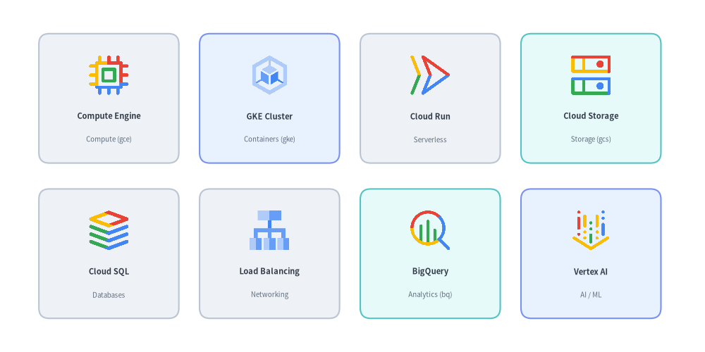
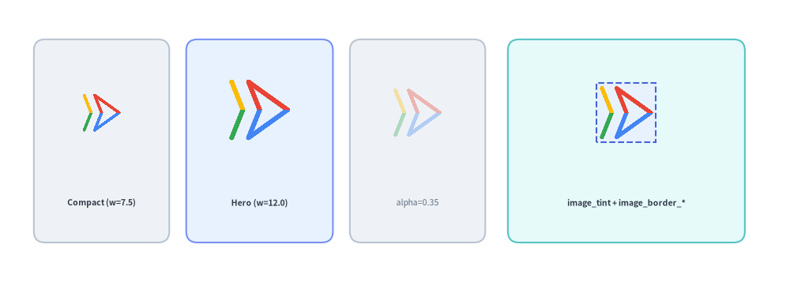
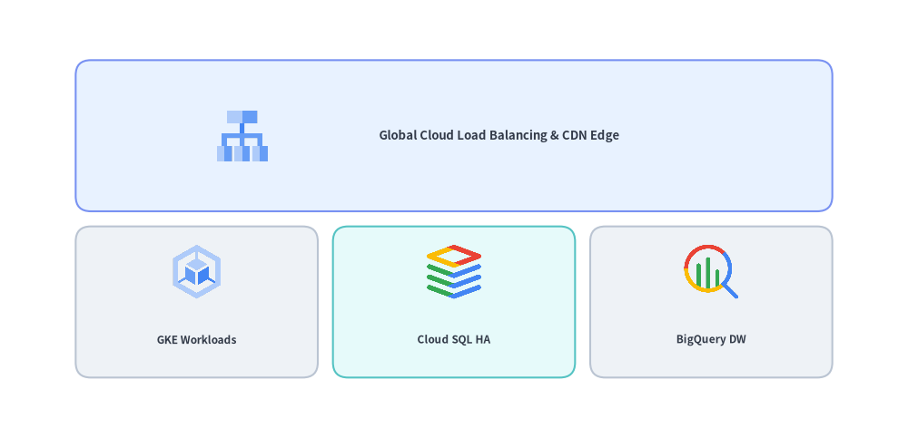
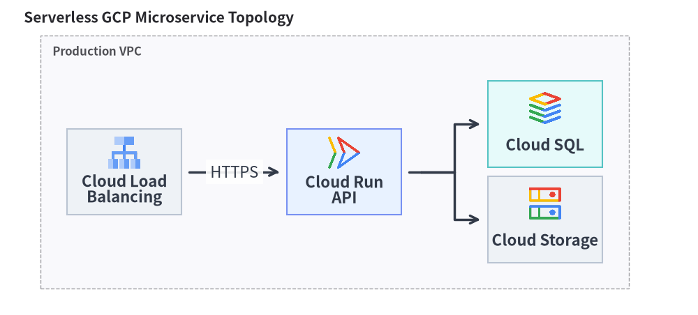

# Google Cloud (GCP) Icons

Drawlib provides over 250 official, multi-color **Google Cloud Platform (GCP)** architecture icons via `drawlib.icons.gcp`. Assets are automatically downloaded and cached on first use, and can be placed either as standalone canvas primitives or inside high-level layout and architecture diagram components.

---

## 1. Categorized GCP Icon Showcase

Every GCP service is available as a function `gcp.<service_name>(xy, width, *, style)` (with convenient shorthand aliases `gcp.gce`, `gcp.gke`, `gcp.gcs`, and `gcp.bq`):


<figure class="drawlib-image" style="text-align: center;">
  
  <figcaption class="drawlib-caption">Official Google Cloud Architecture Icons Across Core Categories</figcaption>
</figure>

<details class="drawlib-code-details">
<summary>Source Code</summary>

```python
from drawlib.canvas import save, setup
from drawlib.icons import gcp
from drawlib.shapes import rectangle
from drawlib.styles import Styles
from drawlib.text import text

setup(width=136, height=68)

row1 = [
    ("Compute Engine", "Compute (gce)", gcp.compute_engine, Styles.Neutral),
    ("GKE Cluster", "Containers (gke)", gcp.google_kubernetes_engine, Styles.PrimaryNeutral),
    ("Cloud Run", "Serverless", gcp.cloud_run, Styles.Neutral),
    ("Cloud Storage", "Storage (gcs)", gcp.cloud_storage, Styles.SecondaryNeutral),
]

row2 = [
    ("Cloud SQL", "Databases", gcp.cloud_sql, Styles.Neutral),
    ("Load Balancing", "Networking", gcp.cloud_load_balancing, Styles.Neutral),
    ("BigQuery", "Analytics (bq)", gcp.bigquery, Styles.SecondaryNeutral),
    ("Vertex AI", "AI / ML", gcp.vertex_ai, Styles.PrimaryNeutral),
]

for row_idx, items in enumerate([row1, row2]):
    cy = 49 if row_idx == 0 else 19
    for col_idx, (title, cat, icon_fn, card_st) in enumerate(items):
        cx = 21 + col_idx * 31
        rectangle((cx, cy), width=27, height=25, style=card_st.patch(shape_r=2))
        icon_fn((cx, cy + 4.5), width=8.5, style=Styles.Primary)
        text((cx, cy - 3.5), title, style=Styles.DarkBold.patch(text_size=8))
        text((cx, cy - 8.0), cat, style=Styles.Muted.patch(text_size=7))

save()
```

</details>


### 1.1. Major GCP Icon Categories & Shorthand Aliases

| Category | Representative `drawlib.icons.gcp` Functions |
| :--- | :--- |
| **Compute** | `compute_engine` *(alias: `gce`)*, `app_engine`, `batch`, `vmware_engine` |
| **Containers & Serverless** | `google_kubernetes_engine` *(alias: `gke`)*, `cloud_run`, `cloud_functions` *(alias: `functions`)*, `anthos` |
| **Storage** | `cloud_storage` *(alias: `gcs`)*, `filestore`, `persistent_disk` |
| **Databases** | `cloud_sql`, `cloud_spanner`, `bigtable`, `firestore`, `memorystore` |
| **Networking** | `virtual_private_cloud` *(alias: `vpc`)*, `cloud_load_balancing`, `cloud_cdn`, `cloud_dns`, `cloud_nat`, `cloud_interconnect` |
| **Data & Analytics** | `bigquery` *(alias: **`bq`**)*, `pubsub`, `dataflow`, `dataproc`, `cloud_composer`, `looker` |
| **AI & Machine Learning** | `vertex_ai`, `automl`, `document_ai`, `cloud_vision_api`, `speech_to_text`, `cloud_translation_api` |
| **Security & Operations** | `cloud_armor`, `identity_and_access_management` *(alias: `iam`)*, `secret_manager`, `key_management_service` *(alias: `kms`)*, `cloud_monitoring`, `cloud_logging`, `cloud_build`, `artifact_registry` |

### 1.2. Dynamic Icon Lookup by Name (`gcp_icon`)

When the icon name is determined dynamically at runtime (for example, loaded from a configuration file or dictionary), you can invoke the low-level `gcp_icon()` helper or resolve functions from `drawlib.icons.gcp`:

```python
from drawlib.icons import gcp, gcp_icon
from drawlib.styles import Styles

# Render a GCP service icon by string identifier
gcp_icon((50, 25), width=10.0, name="bigquery", style=Styles.Primary)

# Or look up the generated service function dynamically on the gcp module
getattr(gcp, "compute_engine")((80, 25), width=10.0, style=Styles.Primary)
```

---

## 2. Sizing, Opacity, Tinting & Border Framing (`style.image_*`)

Because `gcp.<service_name>(xy, width, *, style)` renders normalized 512×512 RGBA PNG assets through the canvas `image()` engine, it supports all `image_*` styling and transform attributes on `Style`:

| `Style` Attribute | Type | Default | Visual Effect on GCP Icon |
| :--- | :--- | :--- | :--- |
| `alpha` | `float` | `1.0` | Fades the icon opacity (`0.35` is ideal for standby/decommissioned replicas). |
| `image_tint_color` | `Color \| tuple \| str` | `None` | Fills transparent background pixels behind the icon artwork with a solid color (`Dimage.fill()`). |
| `image_border_color` | `Color \| tuple \| str` | `(0, 0, 0)` | Stroke color of the rectangular border frame around the icon bounding box. |
| `image_border_width` | `float` | `0` | Border stroke width in points (`> 0` draws a frame around the icon). |
| `image_border_style` | `"solid" \| "dashed" \| "dotted" \| "dashdot"` | `"solid"` | Dash pattern of the icon border frame. |
| `angle`, `halign`, `valign` | `float`, `str`, `str` | `0.0`, `"center"`, `"center"` | Rotates or shifts the icon anchor point on the canvas. |

| Diagram Role | Recommended `width` | Typical Styling |
| :--- | :--- | :--- |
| **Primary Gateway / Hero Service** | `11.0 – 14.0` units | `style=Styles.Primary` inside a `Styles.PrimaryNeutral` card |
| **Standard Service Node** | `8.5 – 10.5` units | `style=Styles.Primary` inside a `Styles.Neutral` card |
| **Embedded Pod / Sub-Node** | `7.0 – 8.0` units | `style=Styles.Primary` inside a compact subnet card |
| **Decommissioned / Standby Node** | `8.5 – 10.0` units | `style=Styles.Primary.patch(alpha=0.35)` |


```python
from drawlib.canvas import save, setup
from drawlib.icons import gcp
from drawlib.shapes import rectangle
from drawlib.styles import Colors, Styles
from drawlib.text import text

setup(width=140, height=50)

# 1. Compact Size (width=7.5)
rectangle((18, 25), width=24, height=36, style=Styles.Neutral.patch(shape_r=2))
gcp.cloud_run((18, 30), width=7.5, style=Styles.Primary)
text((18, 14), "Compact (w=7.5)", style=Styles.DarkBold.patch(text_size=7.5))

# 2. Hero Size (width=12.0)
rectangle((46, 25), width=26, height=36, style=Styles.PrimaryNeutral.patch(shape_r=2))
gcp.cloud_run((46, 30.5), width=12.0, style=Styles.Primary)
text((46, 14), "Hero (w=12.0)", style=Styles.DarkBold.patch(text_size=7.5))

# 3. Standby Opacity (alpha=0.35)
rectangle((74, 25), width=24, height=36, style=Styles.Neutral.patch(shape_r=2))
gcp.cloud_run((74, 30), width=9.5, style=Styles.Primary.patch(alpha=0.35))
text((74, 14), "alpha=0.35", style=Styles.Muted.patch(text_size=7.5))

# 4. Background Tint + Dashed Border (image_tint_color & image_border_*)
rectangle((111, 25), width=42, height=36, style=Styles.SecondaryNeutral.patch(shape_r=2))
framed_style = Styles.Primary.patch(
    image_tint_color=Colors.Primary1,
    image_border_color=Colors.Primary,
    image_border_width=1.5,
    image_border_style="dashed",
)
gcp.cloud_run((111, 30), width=10.5, style=framed_style)
text((111, 14), "image_tint + image_border_*", style=Styles.DarkBold.patch(text_size=7.5))

save()
```

<figure class="drawlib-image" style="text-align: center;">
  
  <figcaption class="drawlib-caption">GCP Icon Sizing Tiers, Opacity (alpha), Background Tint (image_tint_color), and Border Framing (image_border_*)</figcaption>
</figure>


---

## 3. Using GCP Icons in Diagrams

You can integrate GCP icons into technical illustrations at three levels of abstraction depending on your layout needs:

| Approach | Best For | How Icons Are Placed |
| :--- | :--- | :--- |
| **1. Standalone `gcp.<service>()`** | Custom canvas layouts, bespoke cards, annotations | Call `gcp.<service>((x, y), width=...)` directly over `rectangle()` cards. |
| **2. Paired with `GridLayout`** | Tiered architecture matrices, service catalogs | Draw matrix background cells with `GridLayout`, then overlay `gcp.<service>()` at cell centers. |
| **3. Inside `ArchitectureDiagram`** | Connected VPC topologies, subnets, fan-out routing | Pass `icon=GcpIcon.<SERVICE>` to `Node(...)` for automatic card layout and orthogonal wire routing. |

### 3.1. Overlaying GCP Icons on `GridLayout` Matrix Tiers


```python
from drawlib.canvas import save, setup
from drawlib.icons import gcp
from drawlib.smartarts import GridLayout
from drawlib.styles import Styles

setup(width=120, height=58)

# 1. Draw a 3-column x 2-row GridLayout matrix
grid = GridLayout(
    num_column=3,
    num_row=2,
    style=Styles.Neutral.patch(shape_r=2),
    text_style=Styles.DarkBold.patch(text_size=9),
)
# Top header row spanning all 3 columns
grid.add(
    position=(0, 1),
    width=3,
    height=1,
    text="Global Cloud Load Balancing & CDN Edge",
    style=Styles.PrimaryNeutral.patch(shape_r=2),
    text_style=Styles.DarkBold.patch(text_size=9.5, xy_shift=(6, 0)),
)
# Bottom 3 service cells (shift labels down to make room for icons)
lbl_style = Styles.DarkBold.patch(text_size=8.5, xy_shift=(0, -5))
grid.add(position=(0, 0), width=1, height=1, text="GKE Workloads", text_style=lbl_style)
grid.add(
    position=(1, 0),
    width=1,
    height=1,
    text="Cloud SQL HA",
    style=Styles.SecondaryNeutral.patch(shape_r=2),
    text_style=lbl_style,
)
grid.add(position=(2, 0), width=1, height=1, text="BigQuery DW", text_style=lbl_style)

grid.draw(xy=(10, 8), width=100, height=42, margin=2.0)

# 2. Overlay GCP icons onto the grid cells
gcp.cloud_load_balancing((32, 40), width=7.5, style=Styles.Primary)
gcp.gke((26, 22), width=8.0, style=Styles.Primary)
gcp.cloud_sql((60, 22), width=8.0, style=Styles.Primary)
gcp.bigquery((94, 22), width=8.0, style=Styles.Primary)

save()
```

<figure class="drawlib-image" style="text-align: center;">
  
  <figcaption class="drawlib-caption">Overlaying GCP Icons on a GridLayout Tier Matrix</figcaption>
</figure>


### 3.2. High-Level `ArchitectureDiagram` (`Node` & `GcpIcon`)

When connecting services with routed arrows and VPC/subnet boundary boxes, use **[`ArchitectureDiagram`](../05_diagrams/architecture.md)** with `Node(..., icon=GcpIcon.<SERVICE>)`:


```python
from drawlib.canvas import clear, save, setup
from drawlib.diagrams.architecture import ArchitectureDiagram, GcpIcon, Node, NodeGroup
from drawlib.styles import Styles

clear()
setup(width=146, height=66)

d = ArchitectureDiagram(
    node_style=Styles.Primary,
    node_text_style=Styles.DarkBold,
    edge_style=Styles.DarkBold,
    edge_text_style=Styles.Dark,
    node_card_style=Styles.Neutral,
    title="Serverless GCP Microservice Topology",
)

vpc = d.add(NodeGroup(title="Production VPC", padding=5.5), xy=(6.0, 6.0))
lb = vpc.add(
    Node((24, 18), "Cloud Load\nBalancing", icon=GcpIcon.CLOUD_LOAD_BALANCING, icon_size=7.5),
    xy=(16.0, 20.0),
)
run = vpc.add(
    Node(
        (24, 18),
        "Cloud Run\nAPI",
        icon=GcpIcon.CLOUD_RUN,
        icon_size=7.5,
        card_style=Styles.PrimaryNeutral,
    ),
    xy=(62.0, 20.0),
)
sql = vpc.add(
    Node(
        (24, 18),
        "Cloud SQL",
        icon=GcpIcon.CLOUD_SQL,
        icon_size=7.5,
        card_style=Styles.SecondaryNeutral,
    ),
    xy=(104.0, 30.0),
)
gcs = vpc.add(
    Node((24, 18), "Cloud Storage", icon=GcpIcon.CLOUD_STORAGE, icon_size=7.5),
    xy=(104.0, 10.0),
)

d.connect(lb, run, label="HTTPS", padding=1.5)
run.fork([sql, gcs], at_x=84.0, padding=1.5)

d.draw(xy=(4.0, 4.0))
save()
```

<figure class="drawlib-image" style="text-align: center;">
  
  <figcaption class="drawlib-caption">Mini GCP Topology Using ArchitectureDiagram and GcpIcon</figcaption>
</figure>


