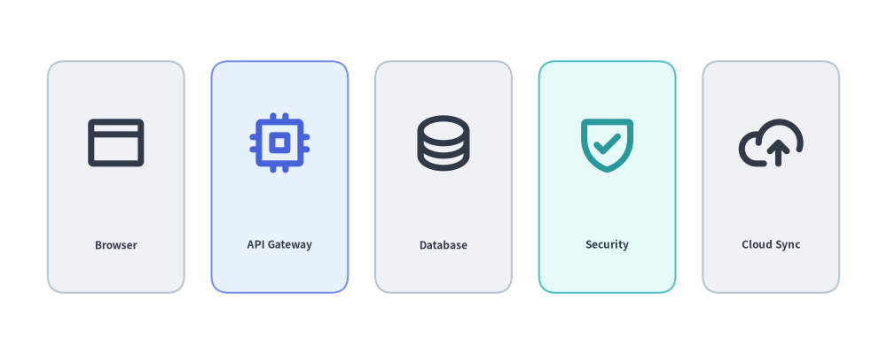
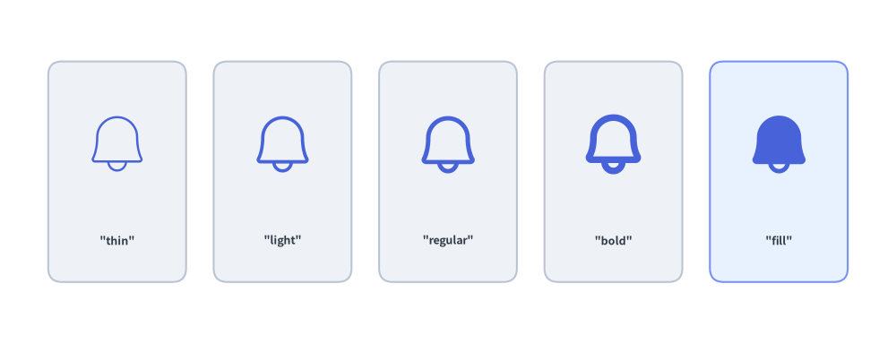
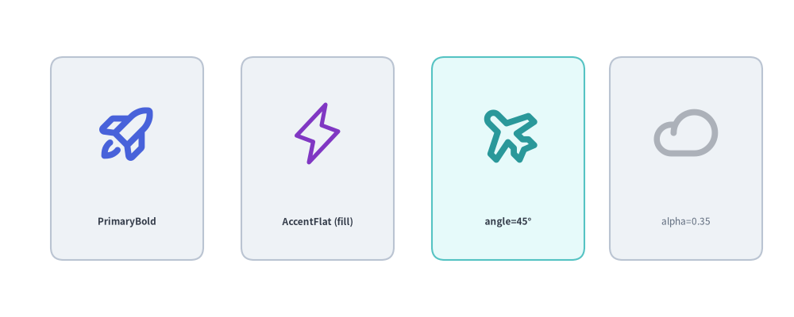
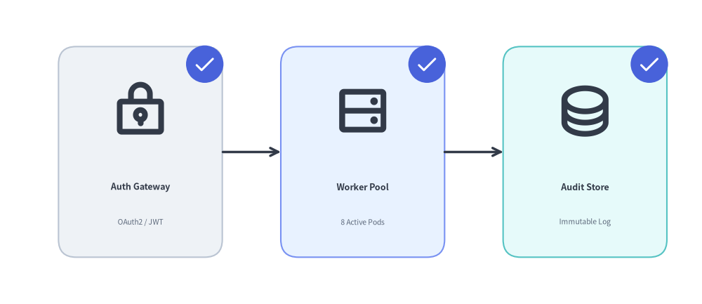

# Phosphor Vector Icons

Drawlib bundles the complete **Phosphor Icons** (<https://phosphoricons.com>) vector glyph family via `drawlib.icons.phosphor`—offering over 1,500 razor-sharp vector icons across 5 typographic weights—alongside the low-level `font_icon()` function for custom TrueType icon fonts.

---

## 1. Overview of Phosphor Vector Icons


<figure class="drawlib-image" style="text-align: center;">
  
  <figcaption class="drawlib-caption">Phosphor Vector Icons Paired with Calm Neutral Cards</figcaption>
</figure>

<details class="drawlib-code-details">
<summary>Source Code</summary>

```python
from drawlib.canvas import save, setup
from drawlib.icons import phosphor
from drawlib.shapes import rectangle
from drawlib.styles import Styles
from drawlib.text import text

setup(width=130, height=52)

items = [
    ("Browser", phosphor.browser, Styles.Neutral, Styles.DarkBold),
    ("API Gateway", phosphor.cpu, Styles.PrimaryNeutral, Styles.PrimaryBold),
    ("Database", phosphor.database, Styles.Neutral, Styles.DarkBold),
    ("Security", phosphor.shield_check, Styles.SecondaryNeutral, Styles.SecondaryBold),
    ("Cloud Sync", phosphor.cloud_arrow_up, Styles.Neutral, Styles.DarkBold),
]

for i, (label, icon_fn, card_st, icon_st) in enumerate(items):
    cx = 17 + i * 24
    rectangle((cx, 26), width=20, height=34, style=card_st.patch(shape_r=2.5))
    icon_fn((cx, 31), width=9.5, style=icon_st)
    text((cx, 16), label, style=Styles.DarkBold.patch(text_size=8.5))

save()
```

</details>


---

## 2. Function Signature & Styling Parameters

Every Phosphor icon is exposed as a function named after the icon in `snake_case`:

```python
from drawlib.icons import phosphor

phosphor.<icon_name>(
    xy: tuple[float, float],
    width: float,
    *,
    style: Style,
) -> None
```

| Parameter / Style Field | Type | Default | Description |
| :--- | :--- | :--- | :--- |
| `xy` | `tuple[float, float]` | *Required* | Anchor coordinate `(x, y)` of the icon (center-aligned by default). |
| `width` | `float` | *Required* | Icon width in canvas units (height scales proportionally at a 1:1 aspect ratio). |
| `style` | `Style` | *Required* | Preset or patched `Style` controlling weight, color, alignment, offset, rotation, and opacity. |
| `style.icon_style` | `"thin" \| "light" \| "regular" \| "bold" \| "fill"` | `"thin"` | Typographic stroke weight of the Phosphor glyph. |
| `style.icon_color` | `tuple[int, int, int] \| Color` | Theme color | Glyph color (automatically mapped by preset styles like `Styles.PrimaryBold`, `Styles.DarkBold`, `Styles.WhiteBold`). |
| `style.halign` | `"left" \| "center" \| "right"` | `"center"` | Horizontal anchor alignment relative to `xy[0]`. |
| `style.valign` | `"bottom" \| "center" \| "top"` | `"center"` | Vertical anchor alignment relative to `xy[1]`. |
| `style.xy_shift` | `tuple[float, float] \| None` | `None` | Relative `(dx, dy)` coordinate offset rotated along with `angle`. |
| `style.xy_abs_shift` | `tuple[float, float] \| None` | `None` | Absolute `(dx, dy)` coordinate offset independent of `angle`. |
| `style.angle` | `float` | `0.0` | Counterclockwise rotation angle in degrees around `xy`. |
| `style.alpha` | `float` | `1.0` | Opacity from `0.0` (transparent) to `1.0` (fully opaque). |


---

## 3. Typographic Weights (`thin`, `light`, `regular`, `bold`, `fill`)

Phosphor vector icons support 5 typographic weights controlled via `style.patch(icon_style=...)` or preset style suffixes (`*Light` -> `"light"`, `*Bold` -> `"bold"`, `*Flat` -> `"fill"`):

- **`"thin"`**: Ultra-fine stroke for subtle background watermarks.
- **`"light"`**: Delicate line weight for dense technical schemas.
- **`"regular"`**: Balanced standard stroke for general diagram nodes.
- **`"bold"`**: Prominent heavy stroke for primary gateways and services.
- **`"fill"`**: Solid filled silhouette for active states, badges, and alerts.


```python
from drawlib.canvas import save, setup
from drawlib.icons import phosphor
from drawlib.shapes import rectangle
from drawlib.styles import Styles
from drawlib.text import text

setup(width=130, height=50)

weights = ["thin", "light", "regular", "bold", "fill"]

for i, w_name in enumerate(weights):
    cx = 17 + i * 24
    card_st = Styles.PrimaryNeutral if w_name == "fill" else Styles.Neutral
    rectangle((cx, 25), width=20, height=32, style=card_st.patch(shape_r=2))
    phosphor.bell((cx, 29), width=10, style=Styles.Primary.patch(icon_style=w_name))
    text((cx, 15), f'"{w_name}"', style=Styles.DarkBold.patch(text_size=9))

save()
```

<figure class="drawlib-image" style="text-align: center;">
  
  <figcaption class="drawlib-caption">The Five Phosphor Typographic Weights</figcaption>
</figure>


---

## 4. Semantic Coloring, Rotation & Opacity

Because Phosphor icons are rendered as vector glyphs, you can tint them with any preset theme style (`Styles.PrimaryBold`, `Styles.SecondaryBold`, `Styles.DarkBold`, `Styles.WhiteBold`), rotate them via `angle`, or fade them via `alpha`:


```python
from drawlib.canvas import save, setup
from drawlib.icons import phosphor
from drawlib.shapes import rectangle
from drawlib.styles import Styles
from drawlib.text import text

setup(width=125, height=50)

# 1. Semantic PrimaryBold
rectangle((20, 25), width=24, height=32, style=Styles.Neutral.patch(shape_r=2))
phosphor.rocket_launch((20, 29), width=10, style=Styles.PrimaryBold)
text((20, 15), "PrimaryBold", style=Styles.DarkBold.patch(text_size=8.5))

# 2. Filled Accent Silhouette
rectangle((50, 25), width=24, height=32, style=Styles.Neutral.patch(shape_r=2))
phosphor.lightning((50, 29), width=10, style=Styles.AccentFlat)
text((50, 15), "AccentFlat (fill)", style=Styles.DarkBold.patch(text_size=8.5))

# 3. Rotated Icon (angle=45)
rectangle((80, 25), width=24, height=32, style=Styles.SecondaryNeutral.patch(shape_r=2))
phosphor.airplane((80, 29), width=10, style=Styles.SecondaryBold.patch(angle=45))
text((80, 15), "angle=45°", style=Styles.DarkBold.patch(text_size=8.5))

# 4. Semi-Transparent Icon (alpha=0.35)
rectangle((108, 25), width=24, height=32, style=Styles.Neutral.patch(shape_r=2))
phosphor.cloud((108, 29), width=10, style=Styles.DarkBold.patch(alpha=0.35))
text((108, 15), "alpha=0.35", style=Styles.Muted.patch(text_size=8.5))

save()
```

<figure class="drawlib-image" style="text-align: center;">
  
  <figcaption class="drawlib-caption">Semantic Coloring, Rotation (angle), and Opacity (alpha)</figcaption>
</figure>


---

## 5. Pairing Phosphor Icons with Shapes & Badges

In architectural diagrams and pipelines, pair Phosphor icons with neutral container cards (`rectangle`) and circular corner badges (`circle`):


```python
from drawlib.canvas import save, setup
from drawlib.icons import phosphor
from drawlib.lines import line
from drawlib.shapes import circle, rectangle
from drawlib.styles import Styles
from drawlib.text import text

setup(width=120, height=52)

stages = [
    (24, "Auth Gateway", "OAuth2 / JWT", phosphor.lock_key, Styles.Neutral),
    (62, "Worker Pool", "8 Active Pods", phosphor.hard_drives, Styles.PrimaryNeutral),
    (100, "Audit Store", "Immutable Log", phosphor.database, Styles.SecondaryNeutral),
]

for cx, title, subtitle, icon_fn, card_st in stages:
    # 1. Container card
    rectangle((cx, 26), width=28, height=36, style=card_st.patch(shape_r=3))
    # 2. Main Phosphor icon
    icon_fn((cx, 33), width=10, style=Styles.DarkBold)
    # 3. Title & subtitle labels
    text((cx, 20), title, style=Styles.DarkBold.patch(text_size=9))
    text((cx, 14), subtitle, style=Styles.Muted.patch(text_size=7.5))
    # 4. Corner check badge
    bx, by = cx + 11, 41
    circle((bx, by), radius=3.2, style=Styles.PrimaryFlat)
    phosphor.check((bx, by), width=3.8, style=Styles.WhiteBold)

line((38, 26), (48, 26), arrow_head="->", style=Styles.DarkBold)
line((76, 26), (86, 26), arrow_head="->", style=Styles.DarkBold)

save()
```

<figure class="drawlib-image" style="text-align: center;">
  
  <figcaption class="drawlib-caption">Pairing Phosphor Icons with Service Cards and Corner Badges</figcaption>
</figure>


---

## 6. Low-Level `font_icon()` for Custom Icon Fonts

To render glyphs from custom or third-party `.ttf` icon fonts (such as FontAwesome or corporate icon fonts), use `font_icon()` from `drawlib.icons`:

```python
from drawlib.icons import font_icon
from drawlib.styles import Styles

font_icon(
    xy=(50, 25),
    width=12,
    code="\uf09b",  # Unicode glyph code point
    file="assets/fonts/fa-brands-400.ttf",  # Path to .ttf font file
    style=Styles.DarkBold,
)
```

---

## 7. Frequently Used Phosphor Icons by Category

| Category | Popular `phosphor.<name>` Functions |
| :--- | :--- |
| **Compute & Systems** | `cpu`, `hard_drive`, `hard_drives`, `desktop`, `laptop`, `device_mobile`, `terminal_window`, `code`, `browser`, `globe` |
| **Cloud & Storage** | `cloud`, `cloud_arrow_up`, `cloud_arrow_down`, `cloud_check`, `database`, `folder`, `file_text`, `file_code`, `archive` |
| **Networking & Git** | `broadcast`, `wifi_high`, `arrows_left_right`, `git_branch`, `git_commit`, `git_merge`, `git_pull_request`, `share_network` |
| **Security & Users** | `lock`, `lock_key`, `shield`, `shield_check`, `shield_warning`, `key`, `fingerprint`, `user`, `users`, `user_circle` |
| **Status & Analytics** | `check`, `check_circle`, `warning`, `warning_circle`, `info`, `gear`, `bell`, `magnifying_glass`, `chart_bar`, `chart_line_up` |

> [!TIP]
> For official Google Cloud service icons, see **[Google Cloud (GCP) Icons](./icons_gcp.md)**.
