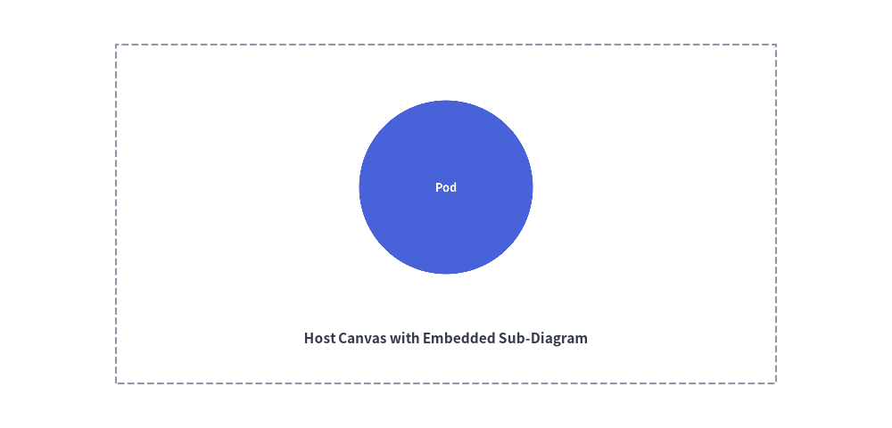

# Images & Dimage

Drawlib allows embedding external bitmap and vector images directly into your illustrations.  
You can combine raster graphics (company logos, cloud service icons, application screenshots) with vector shapes and annotations, or manipulate graphics programmatically using the in-memory `Dimage` model.

---

## 1. Overview of Image Placement


<figure class="drawlib-image" style="text-align: center;">
  
  <figcaption class="drawlib-caption">Embedding External Assets and In-Memory Dimages</figcaption>
</figure>


---

## 2. Placing Images (`image`)

The `image()` function places an image on the canvas at coordinate `xy`, automatically preserving its original aspect ratio.

```python
image(
    xy: tuple[float, float],
    width: float,
    image: str | Image.Image | Dimage,
    angle: float = 0.0,
    style: Style | None = None,
)
```

### Parameter Reference:
- **`xy`**: Center coordinate anchor point `(x, y)`.
- **`width`**: Width of the image in canvas units. The height scales proportionally.
- **`image`**: File path (`.png`, `.jpg`, `.svg`), PIL `Image` instance, or `Dimage` object.
- **`angle`**: Counter-clockwise rotation angle around `xy`.
- **`style`**: Optional styling controlling opacity (`image_alpha`) or alignment.

### Changing Anchor Alignment
By default, `(x, y)` anchors the center of the image. To position an image by its bottom-left corner:

```python
from drawlib.styles import Styles

bottom_left_style = Styles.PrimaryBold.patch(halign="left", valign="bottom")
image((10, 10), width=25, image="logo.png", style=bottom_left_style)
```

---

## 3. In-Memory Image Manipulation (`Dimage`)

The `Dimage` class wraps a PIL Image object with Drawlib transformation utilities:

```python
from drawlib.images import Dimage

# 1. Load from file
dimg = Dimage("assets/screenshot.png")

# 2. Inspect dimensions
width, height = dimg.get_image_size()

# 3. Apply color tinting
# Replaces non-transparent pixels with an RGB tint
tinted_dimg = dimg.fill((52, 152, 219))

# 4. Clone instance
copy_dimg = dimg.copy()
```

---

## 4. Dynamic In-Memory Rendering (`get_dimage_from_code`)

Drawlib can execute a snippet of Drawlib drawing code dynamically and return the rendered result directly as an in-memory `Dimage`.  
This enables recursive nesting and reusable sub-diagram templates:


```python
from drawlib.canvas import save, setup
from drawlib.images import get_dimage_from_code, image
from drawlib.shapes import rectangle
from drawlib.styles import Styles
from drawlib.text import text

# 1. Render a sub-component in-memory
sub_code = """
from drawlib.canvas import save, setup
from drawlib.shapes import circle
from drawlib.styles import Styles

setup(width=40, height=40)
circle((20, 20), radius=15, style=Styles.PrimaryFlat, text="Pod", text_style=Styles.WhiteBold.patch(text_size=36))
save()
"""

sub_diagram = get_dimage_from_code(sub_code)

# 2. Embed the sub-diagram onto the primary canvas
setup(width=100, height=50)
rectangle((50, 25), width=70, height=36, style=Styles.MutedDashed)
image((50, 26), width=28, image=sub_diagram)
text((50, 11), "Host Canvas with Embedded Sub-Diagram", style=Styles.DarkBold)

save()
```

<figure class="drawlib-image" style="text-align: center;">
  
  <figcaption class="drawlib-caption">Dynamic Sub-Diagram Rendering via get_dimage_from_code</figcaption>
</figure>


