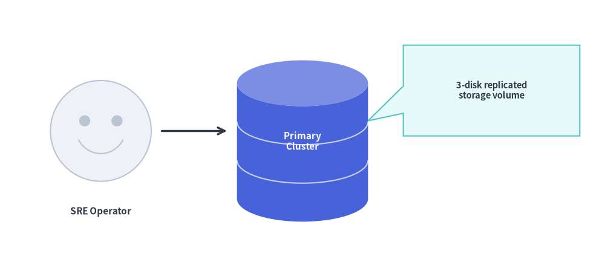
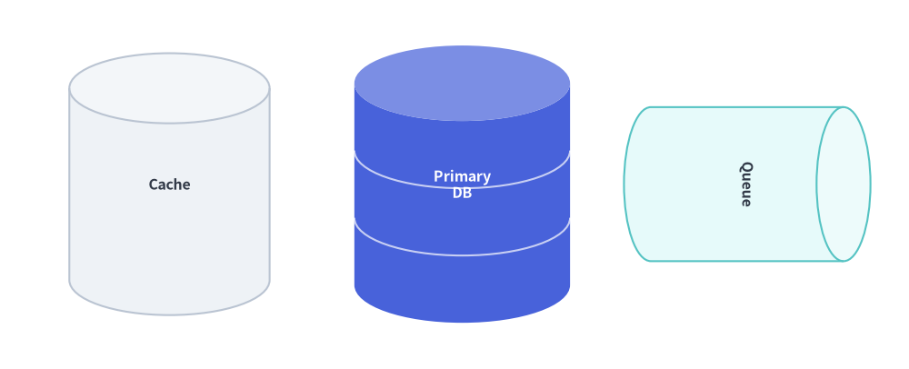
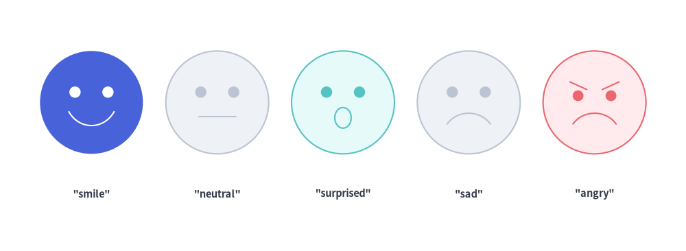
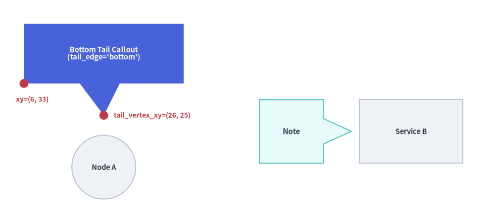

# Cylinders, Faces & Callouts

Beyond standard geometric primitives, `drawlib.shapes` includes three expressive domain shapes for technical architecture and storytelling diagrams:


<figure class="drawlib-image" style="text-align: center;">
  
  <figcaption class="drawlib-caption">Combining Actor Faces, 3D Database Cylinders, and Speech Callouts</figcaption>
</figure>

<details class="drawlib-code-details">
<summary>Source Code</summary>

```python
from drawlib.canvas import save, setup
from drawlib.lines import line
from drawlib.shapes import bubblespeech, cylinder, face
from drawlib.styles import Styles
from drawlib.text import text

setup(width=120, height=52)

# 1. User Actor Face
face((20, 26), radius=10, style=Styles.Neutral, mood="smile")
text((20, 10), "SRE Operator", style=Styles.DarkBold.patch(text_size=11.0))

# 2. 3-Disk Primary Database Cylinder
cylinder(
    (60, 24),
    width=26,
    height=32,
    disks=3,
    style=Styles.PrimaryFlat,
    text="Primary\nCluster",
    text_style=Styles.WhiteBold.patch(text_size=11.0),
)

# 3. Callout Speech Bubble pointing to the Database
bubblespeech(
    xy=(80, 25),
    width=35,
    height=18,
    tail_edge="left",
    tail_start_ratio=0.25,
    tail_end_ratio=0.55,
    tail_vertex_xy=(73, 28),
    style=Styles.SecondaryNeutral,
    text="3-disk replicated\nstorage volume",
    text_style=Styles.DarkBold.patch(text_size=10.5),
)

line((32, 26), (45, 26), arrow_head="->", style=Styles.DarkBold)

save()
```

</details>


---

## 1. Overview of Domain Shapes

- **`cylinder`**: 3D shaded storage cylinders and multi-disk database stacks.
- **`face`**: Expressive user/actor personas and operational status faces.
- **`bubblespeech`**: Callout speech bubbles with directional pointer tails.

---

## 2. 3D Cylinders & Database Stacks (`cylinder`)

For relational databases, object storage buckets, disk arrays, and message queues, `cylinder` renders a 3D cylindrical container with an automatically lightened elliptical top cap:

```python
cylinder(
    xy: tuple[float, float],
    width: float,
    height: float,
    *,
    style: Style,
    disks: int = 1,
    text: str = "",
    text_style: Style | None = None,
)
```

| Parameter | Type | Default | Description |
| :--- | :--- | :--- | :--- |
| `xy` | `tuple[float, float]` | *Required* | Center coordinate `(x, y)` of the cylinder. |
| `width` / `height` | `float` | *Required* | Total horizontal width and vertical height (`> 0`). |
| `disks` | `int` | `1` | Number of stacked disk tiers (`>= 1`). Values `2` or `3+` add curved divider seams. |
| `style` | `Style` | *Required* | Shape fill and stroke style. Set `style.patch(angle=-90)` for horizontal FIFO queues/pipes. |
| `text` / `text_style` | `str` / `Style \| None` | `""` / `None` | Centered text label and optional typography override. |


```python
from drawlib.canvas import save, setup
from drawlib.shapes import cylinder
from drawlib.styles import Styles

setup(width=118, height=48)

# 1. Single-tier cache cylinder
cylinder((22, 24), width=26, height=34, style=Styles.Neutral, text="Cache", text_style=Styles.DarkBold.patch(text_size=11.5))

# 2. 3-disk database stack (disks=3)
cylinder(
    (60, 24),
    width=28,
    height=36,
    disks=3,
    style=Styles.PrimaryFlat,
    text="Primary\nDB",
    text_style=Styles.WhiteBold.patch(text_size=11.5),
)

# 3. Horizontal rotated cylinder (angle=-90 for message queue)
cylinder(
    (97, 24),
    width=20,
    height=32,
    style=Styles.SecondaryNeutral.patch(angle=-90),
    text="Queue",
    text_style=Styles.DarkBold.patch(text_size=11.5),
)

save()
```

<figure class="drawlib-image" style="text-align: center;">
  
  <figcaption class="drawlib-caption">Single Cylinder, 3-Disk Database Stack, and Horizontal Queue</figcaption>
</figure>


---

## 3. Expressive Actor & Status Faces (`face`)

For user personas, customer journey maps, and system health indicators, `face` renders a circular face with eyes, eyebrows, and five built-in facial expressions (`mood`):

```python
face(
    xy: tuple[float, float],
    radius: float,
    *,
    style: Style,
    mood: Literal["smile", "neutral", "sad", "angry", "surprised"] = "smile",
    text: str = "",
    text_style: Style | None = None,
)
```

- **`mood`**: Selects the mouth and eyebrow geometry (`"smile"`, `"neutral"`, `"sad"`, `"angry"`, or `"surprised"`).
- **Automatic Feature Contrast**: Eyes, eyebrows, and mouth automatically use `style.shape_line_color` on outlined cards, or high-contrast `text_color` / white on borderless flat styles (`Styles.PrimaryFlat`).


```python
from drawlib.canvas import save, setup
from drawlib.shapes import face
from drawlib.styles import Styles
from drawlib.text import text

setup(width=120, height=44)

moods = [
    ("smile", Styles.PrimaryFlat),
    ("neutral", Styles.Neutral),
    ("surprised", Styles.SecondaryNeutral),
    ("sad", Styles.Neutral),
    ("angry", Styles.DangerNeutral),
]

for i, (mood_name, st) in enumerate(moods):
    cx = 16 + i * 22
    face((cx, 26), radius=9, style=st, mood=mood_name)
    text((cx, 10), f'"{mood_name}"', style=Styles.DarkBold.patch(text_size=10.5))

save()
```

<figure class="drawlib-image" style="text-align: center;">
  
  <figcaption class="drawlib-caption">The Five Facial Moods in drawlib.shapes.face</figcaption>
</figure>


---

## 4. Callout Speech Bubbles (`bubblespeech`)

`bubblespeech` draws a rectangular callout box with an integrated triangular pointer tail that originates from any of the four edges (`"left"`, `"top"`, `"right"`, `"bottom"`) and points to an exact target coordinate `tail_vertex_xy`:

```python
bubblespeech(
    xy: tuple[float, float],
    width: float,
    height: float,
    tail_edge: Literal["left", "top", "right", "bottom"],
    tail_start_ratio: float,
    tail_vertex_xy: tuple[float, float],
    tail_end_ratio: float,
    *,
    style: Style,
    text: str = "",
    text_style: Style | None = None,
)
```

| Parameter | Type | Description |
| :--- | :--- | :--- |
| `xy` | `tuple[float, float]` | **Bottom-left corner** `(x, y)` of the rectangular bubble body (always bottom-left anchored regardless of `style.halign`/`valign`). |
| `width` / `height` | `float` | Width and height of the rectangular bubble body (`> 0`). |
| `tail_edge` | `"left" \| "top" \| "right" \| "bottom"` | Which edge of the bubble body the pointer tail attaches to. |
| `tail_start_ratio` | `float` | Start position along `tail_edge` in `[0.0, 1.0]` (`< tail_end_ratio`). |
| `tail_end_ratio` | `float` | End position along `tail_edge` in `[0.0, 1.0]` (`> tail_start_ratio`). |
| `tail_vertex_xy` | `tuple[float, float]` | Absolute canvas coordinate `(x, y)` where the tip of the tail points. |
| `style` / `text` / `text_style` | `Style` / `str` / `Style \| None` | Bubble fill/stroke style and centered annotation text. Note: `bubblespeech` ignores `style.shape_r`, `style.angle`, and `style.halign`/`valign`. |


```python
from drawlib.canvas import save, setup
from drawlib.shapes import bubblespeech, circle, rectangle
from drawlib.styles import Styles
from drawlib.text import text

setup(width=124, height=54)

# Target nodes
circle((26, 12), radius=8.0, style=Styles.Neutral, text="Node A", text_style=Styles.DarkBold.patch(text_size=10.5))
rectangle((103, 21), width=26, height=16, style=Styles.Neutral, text="Service B", text_style=Styles.DarkBold.patch(text_size=10.5))

# 1. Callout with bottom tail pointing down to Node A
bubblespeech(
    xy=(6, 33),
    width=40,
    height=15,
    tail_edge="bottom",
    tail_start_ratio=0.35,
    tail_end_ratio=0.60,
    tail_vertex_xy=(26, 25),
    style=Styles.PrimaryFlat,
    text="Bottom Tail Callout\n(tail_edge='bottom')",
    text_style=Styles.WhiteBold.patch(text_size=10.5),
)

# Coordinate indicators for bottom-left anchor xy and tail_vertex_xy
circle((6, 33), radius=1.1, style=Styles.DangerFlat)
text((4, 29.0), "xy=(6, 33)", style=Styles.DangerBold.patch(text_size=10.0, halign="left"))

circle((26, 25), radius=1.1, style=Styles.DangerFlat)
text((28.5, 25.0), "tail_vertex_xy=(26, 25)", style=Styles.DangerBold.patch(text_size=10.0, halign="left"))

# 2. Callout with right tail pointing to Service B
bubblespeech(
    xy=(65, 13),
    width=16,
    height=16,
    tail_edge="right",
    tail_start_ratio=0.30,
    tail_end_ratio=0.70,
    tail_vertex_xy=(88, 21),
    style=Styles.SecondaryNeutral,
    text="Note",
    text_style=Styles.DarkBold.patch(text_size=11.0),
)

save()
```

<figure class="drawlib-image" style="text-align: center;">
  
  <figcaption class="drawlib-caption">Speech Bubble Callouts with Bottom-Left Anchor xy and Pointer Tail Vertex</figcaption>
</figure>


> [!TIP]
> For embedding syntax-highlighted source code blocks alongside callouts, see **[SourceCode](../03_smartarts/source_code.md)**.
