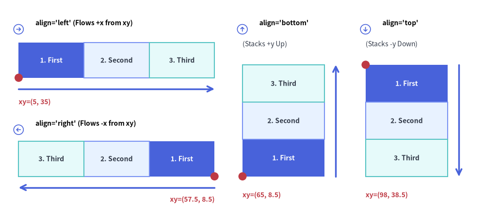
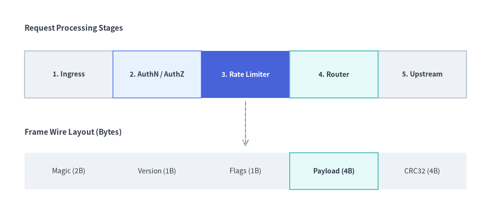
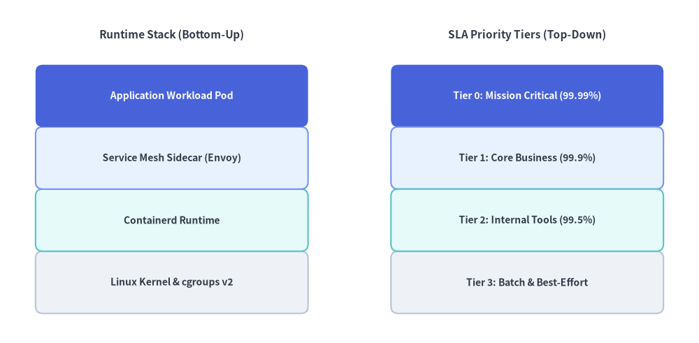

# BoxList

The `BoxList` component renders contiguous linear sequences of rectangular cards along a horizontal or vertical axis.
Custom-styled items are automatically rendered in a second pass so their borders cleanly overlay adjacent default boxes—making `BoxList` ideal for memory/packet layouts, stage sequences, and vertical feature stacks.


<figure class="drawlib-image" style="text-align: center;">
  
  <figcaption class="drawlib-caption">BoxList Directional Alignments (left, right, bottom, top) and Anchor Points</figcaption>
</figure>

<details class="drawlib-code-details">
<summary>Source Code</summary>

```python
from drawlib.canvas import save, setup
from drawlib.icons import phosphor
from drawlib.lines import line
from drawlib.shapes import circle
from drawlib.smartarts import BoxList
from drawlib.styles import Styles
from drawlib.text import text

setup(width=130, height=56)

bl = BoxList(
    style=Styles.Neutral,
    text_style=Styles.DarkBold.patch(text_size=10.0),
)
bl.add("1. First", style=Styles.PrimaryFlat, text_style=Styles.WhiteBold.patch(text_size=10.0))
bl.add("2. Second", style=Styles.PrimaryNeutral)
bl.add("3. Third", style=Styles.SecondaryNeutral)

# 1. Top-Left Panel: align="left" (flows +x from bottom-left xy)
phosphor.arrow_circle_right(xy=(5.0, 48.0), width=3.4, style=Styles.PrimaryFlat)
text((9.5, 49.7), "align='left' (Flows +x from xy)", style=Styles.BlackBold.patch(text_size=10.0, halign="left"))
bl.draw(xy=(5.0, 35.0), box_width=17.5, box_height=9.5, align="left")
line((5.0, 32.0), (57.5, 32.0), arrow_head="->", style=Styles.PrimaryBold)
circle((5.0, 35.0), radius=1.1, style=Styles.DangerFlat)
text((5.0, 28.5), "xy=(5, 35)", style=Styles.DangerBold.patch(text_size=10.0, halign="left"))

# 2. Bottom-Left Panel: align="right" (flows -x from bottom-right xy)
phosphor.arrow_circle_left(xy=(5.0, 21.0), width=3.4, style=Styles.PrimaryFlat)
text((9.5, 22.7), "align='right' (Flows -x from xy)", style=Styles.BlackBold.patch(text_size=10.0, halign="left"))
bl.draw(xy=(57.5, 8.5), box_width=17.5, box_height=9.5, align="right")
line((57.5, 5.5), (5.0, 5.5), arrow_head="->", style=Styles.PrimaryBold)
circle((57.5, 8.5), radius=1.1, style=Styles.DangerFlat)
text((57.5, 2.3), "xy=(57.5, 8.5)", style=Styles.DangerBold.patch(text_size=10.0, halign="right"))

# 3. Middle Panel: align="bottom" (stacks +y upward from bottom-left xy)
phosphor.arrow_circle_up(xy=(65.0, 48.0), width=3.4, style=Styles.PrimaryFlat)
text((69.5, 49.7), "align='bottom'", style=Styles.BlackBold.patch(text_size=10.0, halign="left"))
text((65.0, 44.0), "(Stacks +y Up)", style=Styles.Dark.patch(text_size=10.0, halign="left"))
bl.draw(xy=(65.0, 8.5), box_width=22.0, box_height=10.0, align="bottom")
line((90.0, 8.5), (90.0, 38.5), arrow_head="->", style=Styles.PrimaryBold)
circle((65.0, 8.5), radius=1.1, style=Styles.DangerFlat)
text((65.0, 3.5), "xy=(65, 8.5)", style=Styles.DangerBold.patch(text_size=10.0, halign="left"))

# 4. Right Panel: align="top" (stacks -y downward from top-left xy)
phosphor.arrow_circle_down(xy=(98.0, 48.0), width=3.4, style=Styles.PrimaryFlat)
text((102.5, 49.7), "align='top'", style=Styles.BlackBold.patch(text_size=10.0, halign="left"))
text((98.0, 44.0), "(Stacks -y Down)", style=Styles.Dark.patch(text_size=10.0, halign="left"))
bl.draw(xy=(98.0, 38.5), box_width=22.0, box_height=10.0, align="top")
line((123.0, 38.5), (123.0, 8.5), arrow_head="->", style=Styles.PrimaryBold)
circle((98.0, 38.5), radius=1.1, style=Styles.DangerFlat)
text((98.0, 3.5), "xy=(98, 38.5)", style=Styles.DangerBold.patch(text_size=10.0, halign="left"))

save()
```

</details>


---

## 1. Horizontal Sequence with Highlighted Focal Stage (`align="left"`)

When `align="left"` (the default), boxes flow horizontally to the right (`+x`) starting from `xy=(x, y)`. You can combine multiple `BoxList` instances with arrows or labels to illustrate pipelines and packet structures.


```python
from drawlib.canvas import save, setup
from drawlib.lines import line
from drawlib.smartarts import BoxList
from drawlib.styles import Styles
from drawlib.text import text

setup(width=120, height=52)

# 1. Top: Data Processing Pipeline Sequence
text((6, 45), "Request Processing Stages", style=Styles.DarkBold.patch(text_size=11.0, halign="left"))

pipeline = BoxList(
    style=Styles.Neutral,
    text_style=Styles.DarkBold.patch(text_size=10.0),
)
pipeline.add("1. Ingress")
pipeline.add("2. AuthN / AuthZ", style=Styles.PrimaryNeutral)
pipeline.add(
    "3. Rate Limiter",
    style=Styles.PrimaryFlat,
    text_style=Styles.WhiteBold.patch(text_size=10.0),
)
pipeline.add("4. Router", style=Styles.SecondaryNeutral)
pipeline.add("5. Upstream")
pipeline.draw(xy=(6, 28), box_width=21.6, box_height=11.5, align="left")

# 2. Bottom: Contiguous Binary Frame / Memory Layout
text((6, 19.5), "Frame Wire Layout (Bytes)", style=Styles.DarkBold.patch(text_size=11.0, halign="left"))

packet = BoxList(
    style=Styles.NeutralFlat,
    text_style=Styles.Dark.patch(text_size=10.0),
)
packet.add("Magic (2B)")
packet.add("Version (1B)")
packet.add("Flags (1B)")
packet.add("Payload (4B)", style=Styles.SecondaryNeutral, text_style=Styles.DarkBold.patch(text_size=10.0))
packet.add("CRC32 (4B)")
packet.draw(xy=(6, 5.5), box_width=21.6, box_height=9.0, align="left")

line((60, 27), (60, 16), arrow_head="->", style=Styles.MutedDashed)
save()
```

<figure class="drawlib-image" style="text-align: center;">
  
  <figcaption class="drawlib-caption">Horizontal Pipeline Sequence and Packet Header Layout with BoxList</figcaption>
</figure>


---

## 2. Vertical Feature & Layer Stack (`align="bottom"` / `align="top"`)

Using `align="bottom"` stacks boxes vertically upward (`+y`) from `xy`, while `align="top"` stacks boxes downward (`-y`) from `xy`. Patching `shape_r` on the box style creates rounded feature cards.


```python
from drawlib.canvas import save, setup
from drawlib.smartarts import BoxList
from drawlib.styles import Styles
from drawlib.text import text

setup(width=118, height=58)

# Left Stack: Bottom-up OS / Runtime Stack (align="bottom")
text((29, 52), "Runtime Stack (Bottom-Up)", style=Styles.DarkBold.patch(text_size=11.0))

runtime_stack = BoxList(
    style=Styles.Neutral.patch(shape_r=1.2),
    text_style=Styles.DarkBold.patch(text_size=10.0),
)
runtime_stack.add("Linux Kernel & cgroups v2", style=Styles.Neutral.patch(shape_r=1.2))
runtime_stack.add("Containerd Runtime", style=Styles.SecondaryNeutral.patch(shape_r=1.2))
runtime_stack.add("Service Mesh Sidecar (Envoy)", style=Styles.PrimaryNeutral.patch(shape_r=1.2))
runtime_stack.add(
    "Application Workload Pod",
    style=Styles.PrimaryFlat.patch(shape_r=1.2),
    text_style=Styles.WhiteBold.patch(text_size=10.0),
)
runtime_stack.draw(xy=(6, 5), box_width=46.0, box_height=10.5, align="bottom")

# Right Stack: Top-down Priority Tiers (align="top")
text((89, 52), "SLA Priority Tiers (Top-Down)", style=Styles.DarkBold.patch(text_size=11.0))

sla_tiers = BoxList(
    style=Styles.Neutral.patch(shape_r=1.2),
    text_style=Styles.DarkBold.patch(text_size=10.0),
)
sla_tiers.add(
    "Tier 0: Mission Critical (99.99%)",
    style=Styles.PrimaryFlat.patch(shape_r=1.2),
    text_style=Styles.WhiteBold.patch(text_size=10.0),
)
sla_tiers.add("Tier 1: Core Business (99.9%)", style=Styles.PrimaryNeutral.patch(shape_r=1.2))
sla_tiers.add("Tier 2: Internal Tools (99.5%)", style=Styles.SecondaryNeutral.patch(shape_r=1.2))
sla_tiers.add("Tier 3: Batch & Best-Effort", style=Styles.Neutral.patch(shape_r=1.2))
sla_tiers.draw(xy=(66, 47), box_width=46.0, box_height=10.5, align="top")
save()
```

<figure class="drawlib-image" style="text-align: center;">
  
  <figcaption class="drawlib-caption">Vertical Platform Layer Stacks with BoxList</figcaption>
</figure>


---

## 3. Directional Alignment & Two-Pass Z-Order

As illustrated in the opening diagram at the top of this page:

- **Directional Alignment (`align`)**:
  - `"left"` *(default)*: Boxes sequence rightward (`+x`) from `xy=(x, y)` (where `x` is the left edge and `y` is the bottom edge of the row).
  - `"right"`: Boxes sequence leftward (`-x`) from `xy=(x, y)` (where `x` is the right edge and `y` is the bottom edge of the row).
  - `"bottom"`: Boxes stack upward (`+y`) from `xy=(x, y)` (where `x` is the left edge and `y` is the bottom edge of the first box).
  - `"top"`: Boxes stack downward (`-y`) from `xy=(x, y)` (where `x` is the left edge and `y` is the top edge of the first box).
- **Two-Pass Highlight Z-Order**: `BoxList.draw()` automatically renders default-styled boxes first and custom-styled boxes second so highlighted borders are never occluded by adjacent neutral boxes.

---

## 4. API Reference

### Constructor
```python
BoxList(
    *,
    style: Style,
    text_style: Style,
)
```

### Methods & Properties
- **`add(text: str, *, style: Style | None = None, text_style: Style | None = None, show: bool = True) -> BoxListItem`**:
  Appends a box item to the sequence and returns a mutable `BoxListItem` (`text`, `style`, `text_style`, `show`). Setting `show=False` hides that box while keeping the positions of all following boxes unchanged.
- **`boxlist.items -> list[BoxListItem]`**:
  Returns the list of all registered `BoxListItem` instances (`text: str`, `style: Style`, `text_style: Style`, `show: bool`), allowing deferred mutation before or between `draw()` calls.
- **`draw(xy: tuple[float, float], box_width: float, box_height: float, align: Literal["left", "right", "bottom", "top"] = "left", scale: float = 1.0) -> None`**:
  Renders the sequence of boxes anchored at `xy`, with optional proportional scaling via `scale`.

