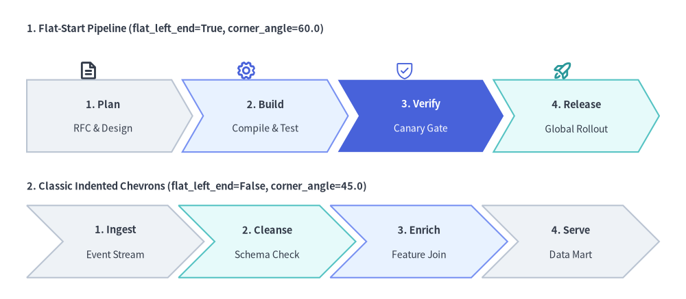
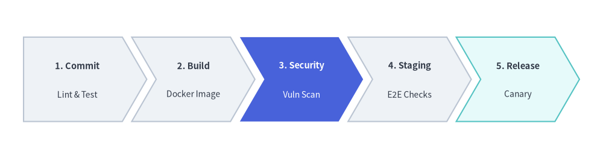
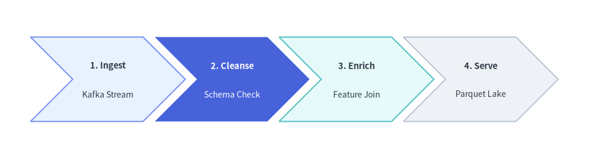

# ChevronProcess Component

The `ChevronProcess` component draws horizontal, sequential process pipelines consisting of interlocking arrowhead blocks (chevrons). 
It is the premier component for CI/CD delivery pipelines, phased development milestones, fulfillment lifecycles, and multi-step workflows.


<figure class="drawlib-image" style="text-align: center;">
  
  <figcaption class="drawlib-caption">Overview of ChevronProcess: Standard Flat-Start vs. Indented Multi-Line Pipelines</figcaption>
</figure>

<details class="drawlib-code-details">
<summary>Source Code</summary>

```python
from drawlib.canvas import save, setup
from drawlib.icons import phosphor
from drawlib.smartarts import ChevronProcess
from drawlib.styles import Styles
from drawlib.text import text

setup(width=128, height=56)

# 1. Top Row: Flat-Start Chevron Pipeline (flat_left_end=True, corner_angle=60.0)
text((5, 50.5), "1. Flat-Start Pipeline (flat_left_end=True, corner_angle=60.0)", style=Styles.DarkBold.patch(text_size=10.5, halign="left"))

# Stage icons above each chevron
phosphor.file_text(xy=(16.5, 42.8), width=3.8, style=Styles.DarkBold)
phosphor.gear(xy=(46.0, 42.8), width=3.8, style=Styles.PrimaryBold)
phosphor.shield_check(xy=(75.5, 42.8), width=3.8, style=Styles.PrimaryFlat)
phosphor.rocket_launch(xy=(105.0, 42.8), width=3.8, style=Styles.SecondaryBold)

flat_pipe = ChevronProcess(
    style=Styles.Neutral,
    text_style=Styles.DarkBold.patch(text_size=10.5),
    description_style=Styles.Dark.patch(text_size=10.0),
    corner_angle=60.0,
    spacing=2.0,
    flat_left_end=True,
)
flat_pipe.add("1. Plan", description="RFC & Design")
flat_pipe.add("2. Build", description="Compile & Test", style=Styles.PrimaryNeutral)
flat_pipe.add(
    "3. Verify",
    description="Canary Gate",
    style=Styles.PrimaryFlat,
    text_style=Styles.WhiteBold.patch(text_size=10.5),
    description_style=Styles.White.patch(text_size=10.0),
)
flat_pipe.add("4. Release", description="Global Rollout", style=Styles.SecondaryNeutral)
flat_pipe.draw(xy=(5, 27.5), width=118.0, height=13.5)

# 2. Bottom Row: Classic Indented Chevrons (flat_left_end=False, corner_angle=45.0)
text((5, 21.0), "2. Classic Indented Chevrons (flat_left_end=False, corner_angle=45.0)", style=Styles.DarkBold.patch(text_size=10.5, halign="left"))

indented_pipe = ChevronProcess(
    style=Styles.Neutral,
    text_style=Styles.DarkBold.patch(text_size=10.5),
    description_style=Styles.Dark.patch(text_size=10.0),
    corner_angle=45.0,
    spacing=2.0,
    flat_left_end=False,
)
indented_pipe.add("1. Ingest", description="Event Stream")
indented_pipe.add("2. Cleanse", description="Schema Check", style=Styles.SecondaryNeutral)
indented_pipe.add("3. Enrich", description="Feature Join", style=Styles.PrimaryNeutral)
indented_pipe.add("4. Serve", description="Data Mart")
indented_pipe.draw(xy=(5, 4.0), width=118.0, height=13.5)

save()
```

</details>


---

## 1. Quick Example: CI/CD Pipeline


```python
from drawlib.canvas import setup
from drawlib.smartarts import ChevronProcess
from drawlib.styles import Styles

setup(width=128, height=34)

pipeline = ChevronProcess(
    style=Styles.Neutral,
    text_style=Styles.DarkBold.patch(text_size=10.5),
    description_style=Styles.Dark.patch(text_size=10.0),
    corner_angle=60.0,
    spacing=2.0,
    flat_left_end=True,
)
pipeline.add("1. Commit", description="Lint & Test")
pipeline.add("2. Build", description="Docker Image")
pipeline.add(
    "3. Security",
    description="Vuln Scan",
    style=Styles.PrimaryFlat,
    text_style=Styles.WhiteBold.patch(text_size=10.5),
    description_style=Styles.White.patch(text_size=10.0),
)
pipeline.add("4. Staging", description="E2E Checks")
pipeline.add("5. Release", description="Canary", style=Styles.SecondaryNeutral)

pipeline.draw(xy=(5, 8), width=118.0, height=18.0)
```

<figure class="drawlib-image" style="text-align: center;">
  
  <figcaption class="drawlib-caption">Continuous Delivery Pipeline with ChevronProcess</figcaption>
</figure>


---

## 2. Classic Indented Chevrons with Explicit `item_width` & `corner_angle`

Setting `flat_left_end=False` (the default) renders every stage—including the first—as a classic indented chevron, while passing an explicit `item_width` to `draw(...)` gives every stage an exact fixed body width instead of auto-dividing a bounding container width. You can also adjust `corner_angle` (valid range: `10.0` to `80.0` degrees) to control arrowhead sharpness, and mutate returned `ChevronItem` instances before drawing.


```python
from drawlib.canvas import save, setup
from drawlib.smartarts import ChevronProcess
from drawlib.styles import Styles

setup(width=126, height=34)

etl = ChevronProcess(
    style=Styles.Neutral,
    text_style=Styles.DarkBold.patch(text_size=10.5),
    description_style=Styles.Dark.patch(text_size=10.0),
    corner_angle=45.0,
    spacing=2.5,
    flat_left_end=False,
)

etl.add("1. Ingest", description="Kafka Stream", style=Styles.PrimaryNeutral)
transform_stage = etl.add("2. Cleanse", description="Schema Check")
etl.add("3. Enrich", description="Feature Join", style=Styles.SecondaryNeutral)
etl.add("4. Serve", description="Parquet Lake")

# Mutate a ChevronItem (or access via etl.items[1]) before calling draw()
transform_stage.style = Styles.PrimaryFlat
transform_stage.text_style = Styles.WhiteBold.patch(text_size=10.5)
transform_stage.description_style = Styles.White.patch(text_size=10.0)

etl.draw(xy=(6.5, 8.0), height=18.0, item_width=24.0)
save()
```

<figure class="drawlib-image" style="text-align: center;">
  
  <figcaption class="drawlib-caption">Classic Indented Chevrons (flat_left_end=False, corner_angle=45.0, explicit item_width)</figcaption>
</figure>


---

## 3. Geometry & Coordinate Anchor

- **Bottom-Left Anchor `(x, y)`**: The coordinate passed to `draw(xy=...)` represents the **bottom-left corner** of the entire process bounding box.
- **`flat_left_end`**:
  - `False` *(default)*: All stages—including the first—have an indented left notch matching the arrowhead tip angle.
  - `True`: The first chevron is drawn as a flat-backed pentagon with a clean vertical left border.
- **`corner_angle`**: Angle of the arrowhead tip in degrees (**valid range: `10.0` to `80.0`**, default `60.0`). Lower angles (`45.0`) produce deeper, sharper arrowheads; higher angles (`70.0`) produce flatter tips.
- **Automatic vs. Explicit Stage Width (`width` vs. `item_width`)**:
  - When `item_width=None` *(default)*, `draw()` automatically calculates each stage's body width from the total `width`, `spacing`, and arrowhead indent ($x_{\text{indent}} = \frac{\text{height}/2}{\tan(\text{corner\_angle})}$):
    $$\text{item\_width} = \frac{\text{width} - (N - 1) \cdot \text{spacing} - x_{\text{indent}}}{N}$$
  - When `item_width` is explicitly provided, `width` is ignored and each stage uses `item_width` directly.

---

## 4. API Reference

### Constructor (`ChevronProcess`)
```python
ChevronProcess(
    *,
    style: Style,
    text_style: Style,
    description_style: Style,
    corner_angle: float = 60.0,
    spacing: float = 1.5,
    flat_left_end: bool = False,
)
```

| Parameter | Type | Default | Description |
| :--- | :--- | :--- | :--- |
| **`style`** | `Style` | *(Required)* | Default shape style applied to chevron blocks. |
| **`text_style`** | `Style` | *(Required)* | Default text style for primary stage titles. |
| **`description_style`** | `Style` | *(Required)* | Default text style for secondary description lines. |
| **`corner_angle`** | `float` | `60.0` | Arrowhead tip angle in degrees (`10.0 <= corner_angle <= 80.0`). |
| **`spacing`** | `float` | `1.5` | Horizontal gap between consecutive chevrons (`> 0`). |
| **`flat_left_end`** | `bool` | `False` | If `True`, replaces the first chevron's left indent with a flat vertical edge. |

### Adding & Inspecting Stages (`.add()` & `.items`)
```python
pipeline.add(
    text: str,
    *,
    description: str = "",
    style: Style | None = None,
    text_style: Style | None = None,
    description_style: Style | None = None,
    show: bool = True,
) -> ChevronItem
```

| Parameter | Type | Default | Description |
| :--- | :--- | :--- | :--- |
| **`text`** | `str` | *(Required)* | Primary stage title displayed inside the chevron. |
| **`description`** | `str` | `""` | Optional secondary description line displayed below `text`. |
| **`style`** | `Style \| None` | `None` | Custom shape style for this stage (falls back to constructor `style`). |
| **`text_style`** | `Style \| None` | `None` | Custom title text style for this stage (falls back to constructor `text_style`). |
| **`description_style`** | `Style \| None` | `None` | Custom description text style (falls back to constructor `description_style`). |
| **`show`** | `bool` | `True` | Whether to render this stage. Setting `False` hides the chevron while preserving layout slots for sibling stages. |

- **`pipeline.items -> list[ChevronItem]`**: Returns the list of registered `ChevronItem` instances in order.
- **`ChevronItem` Model Fields**: Each returned item exposes mutable attributes resolved at `draw()` time:
  - `text: str`
  - `style: Style`
  - `text_style: Style`
  - `description_style: Style`
  - `description: str = ""`
  - `show: bool = True`

### Drawing (`.draw()`)
```python
pipeline.draw(
    xy: tuple[float, float],
    width: float = 90.0,
    height: float = 12.0,
    item_width: float | None = None,
    scale: float = 1.0,
) -> None
```

| Parameter | Type | Default | Description |
| :--- | :--- | :--- | :--- |
| **`xy`** | `tuple[float, float]` | *(Required)* | Bottom-left coordinate `(x, y)` of the process bounding box. |
| **`width`** | `float` | `90.0` | Total bounding width allocated across all stages (used when `item_width=None`). |
| **`height`** | `float` | `12.0` | Vertical height of each chevron block (`> 0`). |
| **`item_width`** | `float \| None` | `None` | Explicit body width per chevron block. Overrides automatic `width` division when set. |
| **`scale`** | `float` | `1.0` | Proportional scale factor around anchor `xy` (`> 0`). |

