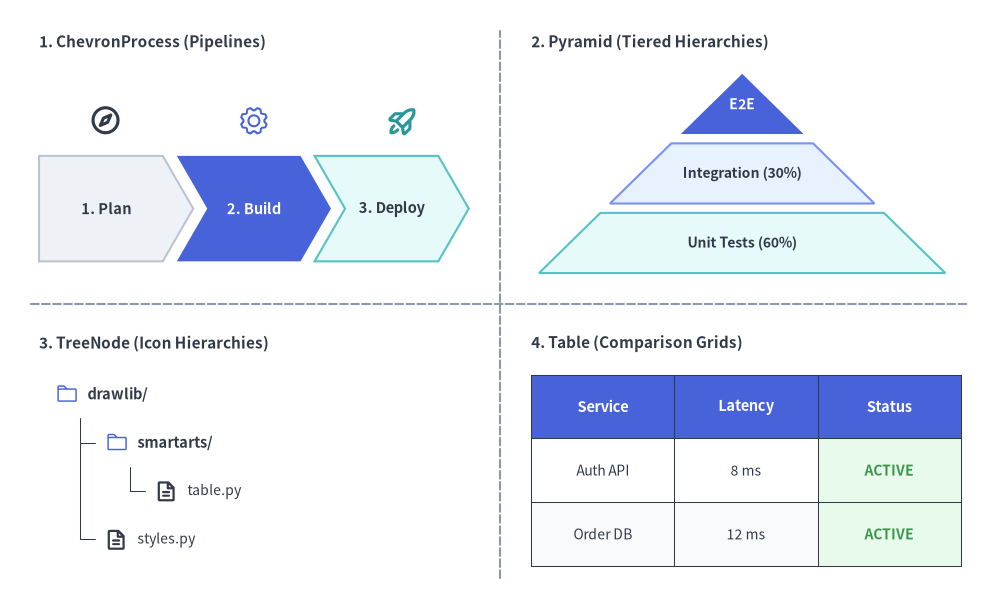
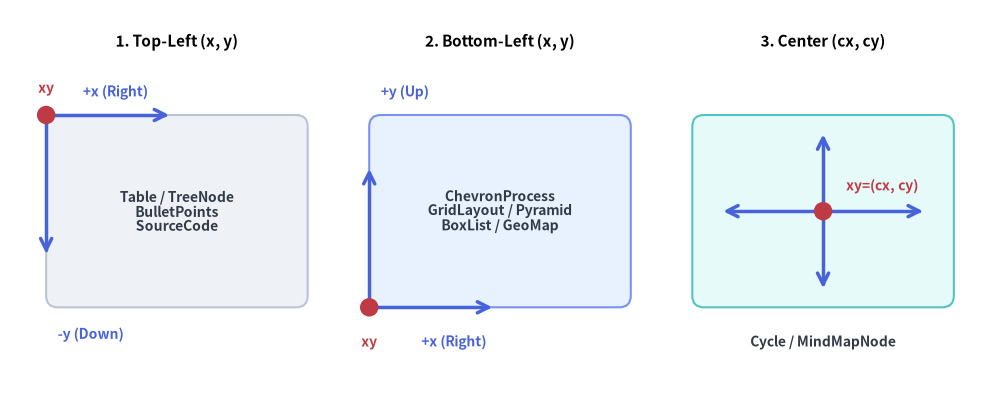
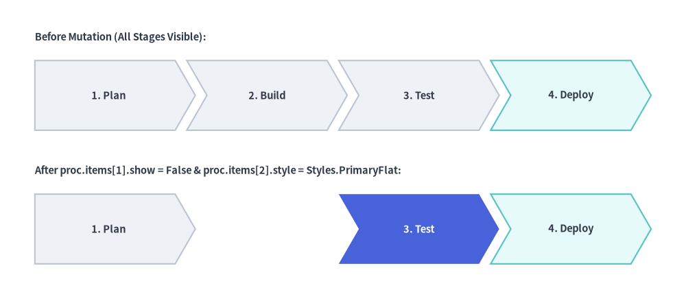

# SmartArts Overview

Drawing structured diagrams (such as process flows, comparison tables, directory trees, or mindmaps) using raw shapes and lines often requires calculating hundreds of manual coordinates. 
The `drawlib.smartarts` module eliminates this boilerplate by providing **high-level, declarative layout components**.

---

## 1. What SmartArts Can Do


<figure class="drawlib-image" style="text-align: center;">
  
  <figcaption class="drawlib-caption">SmartArts High-Level Component Showcase</figcaption>
</figure>

<details class="drawlib-code-details">
<summary>Source Code</summary>

```python
from drawlib.canvas import save, setup
from drawlib.icons import phosphor
from drawlib.lines import line
from drawlib.smartarts import ChevronProcess, Pyramid, Table, TreeNode
from drawlib.styles import Colors, Styles
from drawlib.text import text

setup(width=128, height=78)

# Subtle 2x2 quadrant dividers
line((64, 4), (64, 74), style=Styles.MutedDashed)
line((4, 39), (124, 39), style=Styles.MutedDashed)

# 1. Top-Left: ChevronProcess (Sequential Pipelines + Stage Icons)
text((5, 72.5), "1. ChevronProcess (Pipelines)", style=Styles.DarkBold.patch(text_size=11.0, halign="left"))
proc = ChevronProcess(
    style=Styles.Neutral,
    text_style=Styles.DarkBold.patch(text_size=10.5),
    description_style=Styles.Dark.patch(text_size=10.0),
    flat_left_end=True,
    spacing=1.8,
)
proc.add("1. Plan")
proc.add("2. Build", style=Styles.PrimaryFlat, text_style=Styles.WhiteBold.patch(text_size=10.5))
proc.add("3. Deploy", style=Styles.SecondaryNeutral)
proc.draw(xy=(5, 44.5), width=55, height=13.5)

phosphor.compass(xy=(13.5, 62.5), width=4.2, style=Styles.DarkBold)
phosphor.gear(xy=(32.5, 62.5), width=4.2, style=Styles.PrimaryFlat)
phosphor.rocket_launch(xy=(51.5, 62.5), width=4.2, style=Styles.SecondaryBold)

# 2. Top-Right: Pyramid (Tiered Hierarchies)
text((68, 72.5), "2. Pyramid (Tiered Hierarchies)", style=Styles.DarkBold.patch(text_size=11.0, halign="left"))
pyr = Pyramid(
    style=Styles.Neutral,
    text_style=Styles.DarkBold.patch(text_size=10.0),
)
pyr.add("E2E", style=Styles.PrimaryFlat, text_style=Styles.WhiteBold.patch(text_size=10.0))
pyr.add("Integration (30%)", style=Styles.PrimaryNeutral)
pyr.add("Unit Tests (60%)", style=Styles.SecondaryNeutral)
pyr.draw(xy=(69, 43.0), width=52, height=25.5, margin=1.2)

# 3. Bottom-Left: TreeNode (Hierarchies with Phosphor Icons)
text((5, 34.0), "3. TreeNode (Icon Hierarchies)", style=Styles.DarkBold.patch(text_size=11.0, halign="left"))
TreeNode.register_drawing_item(
    name="sc_dir",
    location="before",
    padding_width=4.2,
    function=phosphor.folder,
    style=Styles.PrimaryFlat,
    args={"width": 3.0},
)
TreeNode.register_drawing_item(
    name="sc_file",
    location="before",
    padding_width=4.2,
    function=phosphor.file_text,
    style=Styles.DarkBold,
    args={"width": 3.0},
)
tree = TreeNode(
    "drawlib/",
    text_style=Styles.DarkBold.patch(text_size=10.5),
    line_style=Styles.DarkThin,
    line_horizontal_margin=3.2,
    line_horizontal_length=3.0,
    line_vertical_margin=6.2,
    children=[
        TreeNode(
            "smartarts/",
            children=[
                TreeNode("table.py", text_style=Styles.Dark.patch(text_size=10.0)).set_drawing_item("sc_file"),
            ],
        ).set_drawing_item("sc_dir"),
        TreeNode("styles.py", text_style=Styles.Dark.patch(text_size=10.0)).set_drawing_item("sc_file"),
    ],
).set_drawing_item("sc_dir")
tree.draw(xy=(7, 27.5))

# 4. Bottom-Right: Table (Comparison & Status Grids)
text((68, 34.0), "4. Table (Comparison Grids)", style=Styles.DarkBold.patch(text_size=11.0, halign="left"))
tbl = Table(
    cell_style=Styles.White,
    text_style=Styles.Dark.patch(text_size=10.0),
    header_cell_style=Styles.PrimaryFlat,
    header_text_style=Styles.WhiteBold.patch(text_size=10.5),
    border_style=Styles.DarkThin,
)
tbl.set_style_cell_evenodd(
    even_color=Colors.Muted1,
    even_text_style=Styles.Dark.patch(text_size=10.0),
    odd_color=Colors.White,
    odd_text_style=Styles.Dark.patch(text_size=10.0),
)
tbl.set_style_cell_header(
    background_color=Colors.Primary,
    text_style=Styles.WhiteBold.patch(text_size=10.5),
)
tbl.set_style_cell(
    background_color=Colors.Success1,
    text_style=Styles.SuccessBold.patch(text_size=10.0),
    rows=[1, 2],
    columns=[2],
)
data = [
    ["Service", "Latency", "Status"],
    ["Auth API", "8 ms", "ACTIVE"],
    ["Order DB", "12 ms", "ACTIVE"],
]
tbl.draw(xy=(68, 30.0), width=55, height=24.5, data=data)
save()
```

</details>


---

## 2. Public Exports (`drawlib.smartarts`)

All SmartArts components, mutable item/configuration models, and helper function aliases are exported directly from `drawlib.smartarts`:

```python
from drawlib.smartarts import (
    # Primary SmartArt Components
    BoxList,
    BulletPoints,
    ChevronProcess,
    Cycle,
    GeoMap,
    GridLayout,
    MindMapNode,
    Pyramid,
    SourceCode,
    Table,
    TreeNode,
    # Mutable Item & Style Models
    BoxListItem,
    BulletPointItem,
    ChevronItem,
    CycleCenter,
    CycleItem,
    GridItem,
    PyramidItem,
    SourceCodeStyles,
    # Function Aliases
    get_source_code_styles,
    sourcecode,
)
```

---

## 3. Component Catalog Matrix

| Component | Primary Use Case | Anchor System | Key Methods & Item Models |
| :--- | :--- | :--- | :--- |
| **[`ChevronProcess`](./chevron_process.md)** | Phased pipelines, CI/CD stages, migration roadmaps | Bottom-Left `(x, y)` | `add(...) -> ChevronItem`, `items`, `draw(..., scale=1.0)` |
| **[`Cycle`](./cycle.md)** | PDCA devops loops, circular lifecycles, state loops | Center `(cx, cy)` or Bottom-Left | `add(...) -> CycleItem`, `set_center() -> CycleCenter`, `items`, `center`, `draw(...)` |
| **[`Table`](./table.md)** | Service SLAs, specification matrices, DB schemas | Top-Left `(x, y)` | `set_style_cell_*()`, `set_style_border()`, `reset_styles()`, `draw(...)`, `draw_flexible(...)` |
| **[`TreeNode`](./tree.md)** | Directory hierarchies, org charts, taxonomy trees | Top-Left `(x, y)` | `add(...) -> TreeNode`, `register_drawing_item()`, `set_drawing_item()`, `draw(...)` |
| **[`MindMapNode`](./mindmap.md)** | Brainstorming nodes, radial feature maps, org trees | Center `(cx, cy)` | `add(...) -> MindMapNode`, `draw(xy, branch="bottom", scale=1.0)` |
| **[`GridLayout`](./grid_layout.md)** | Layered architectures, dashboard card grids | Bottom-Left `(x, y)` | `add(...) -> GridItem`, `items`, `draw(...)`, `draw_flexible(...)` |
| **[`Pyramid`](./pyramid.md)** | Testing pyramids, tiered memory/cache hierarchies | Bottom-Left `(x, y)` | `add(...) -> PyramidItem`, `items`, `draw(...)`, `draw_flexible(...)` |
| **[`BoxList`](./box_list.md)** | Linear horizontal or vertical card sequences | Directional `(x, y)` | `add(...) -> BoxListItem`, `items`, `draw(..., scale=1.0)` |
| **[`BulletPoints`](./bullet_points.md)** | Architectural takeaways, RFC key points, checklists | Top-Left `(x, y)` | `set_indent()`, `set_bullet_style()`, `add(...) -> BulletPointItem`, `items`, `draw(...)` |
| **[`SourceCode`](./source_code.md)** | Syntax-highlighted code blocks in diagrams | Top-Left `(x, y)` | `SourceCode.draw(...)` / `sourcecode(...)`, `SourceCode.get_text()`, `SourceCodeStyles.get()` |
| **[`GeoMap`](./geomap.md)** | Geographical maps (`GeoMap.World.*`, `GeoMap.Countries.*`, `GeoMap.Cities.*`) | Bottom-Left `(x, y)` | `get_areas()`, `set_area_styles()`, `draw()`, `get_area_xy()`, `lonlat_to_xy()`, `data` |

> **Looking for speech bubbles & callouts?** The `bubblespeech()` primitive is part of `drawlib.shapes` and is documented in **[Cylinders, Faces & Callouts](../02_drawing_primitives/shapes_domain.md)**.

---

## 4. Coordinate Anchor & Normalization Cheat Sheet

Understanding anchor conventions is essential when combining multiple SmartArts onto a single canvas:
- **Top-Left Anchored (`Table`, `TreeNode`, `BulletPoints`, `SourceCode`)**:  
  You specify the top-left coordinate `(x, y)`. Content flows horizontally to the right (`+x`) and vertically downward (`-y`).
- **Bottom-Left Anchored (`ChevronProcess`, `GridLayout`, `Pyramid`, `BoxList`, `GeoMap`)**:  
  You specify the bottom-left coordinate `(x, y)` (for `BoxList` with default `align="left"` or `"bottom"`). The bounding container extends rightward (`+x`) and upward (`+y`).
- **Center Anchored (`Cycle`, `MindMapNode`)**:  
  You specify the center coordinate `(cx, cy)` (or pass `align="bottom_left"` to `Cycle.draw()`). The diagram expands symmetrically or radially around the center.


<figure class="drawlib-image" style="text-align: center;">
  
  <figcaption class="drawlib-caption">The Three SmartArt Coordinate Anchor Conventions</figcaption>
</figure>

<details class="drawlib-code-details">
<summary>Source Code</summary>

```python
from drawlib.canvas import save, setup
from drawlib.lines import line
from drawlib.shapes import circle, rectangle
from drawlib.styles import Styles
from drawlib.text import text

setup(width=130, height=54)

# 1. Left Panel: Top-Left Anchored (x, y)
text((23.0, 48.5), "1. Top-Left (x, y)", style=Styles.BlackBold.patch(text_size=11.0))
rectangle(
    (23.0, 26.5),
    width=34.0,
    height=25.0,
    style=Styles.Neutral.patch(shape_r=1.5),
    text="Table / TreeNode\nBulletPoints\nSourceCode",
    text_style=Styles.DarkBold.patch(text_size=10.0),
)
# Growth arrows from top-left (6.0, 39.0)
line((6.0, 39.0), (22.0, 39.0), arrow_head="->", style=Styles.PrimaryBold)
text((15.0, 42.0), "+x (Right)", style=Styles.PrimaryBold.patch(text_size=10.0))
line((6.0, 39.0), (6.0, 21.0), arrow_head="->", style=Styles.PrimaryBold)
text((7.5, 10.5), "-y (Down)", style=Styles.PrimaryBold.patch(text_size=10.0, halign="left"))
circle((6.0, 39.0), radius=1.2, style=Styles.DangerFlat)
text((6.0, 42.5), "xy", style=Styles.DangerBold.patch(text_size=10.0))

# 2. Middle Panel: Bottom-Left Anchored (x, y)
text((65.0, 48.5), "2. Bottom-Left (x, y)", style=Styles.BlackBold.patch(text_size=11.0))
rectangle(
    (65.0, 26.5),
    width=34.0,
    height=25.0,
    style=Styles.PrimaryNeutral.patch(shape_r=1.5),
    text="ChevronProcess\nGridLayout / Pyramid\nBoxList / GeoMap",
    text_style=Styles.DarkBold.patch(text_size=10.0),
)
# Growth arrows from bottom-left (48.0, 14.0)
line((48.0, 14.0), (64.0, 14.0), arrow_head="->", style=Styles.PrimaryBold)
text((59.0, 9.5), "+x (Right)", style=Styles.PrimaryBold.patch(text_size=10.0))
line((48.0, 14.0), (48.0, 32.0), arrow_head="->", style=Styles.PrimaryBold)
text((49.5, 42.0), "+y (Up)", style=Styles.PrimaryBold.patch(text_size=10.0, halign="left"))
circle((48.0, 14.0), radius=1.2, style=Styles.DangerFlat)
text((48.0, 9.5), "xy", style=Styles.DangerBold.patch(text_size=10.0))

# 3. Right Panel: Center Anchored (cx, cy)
text((107.0, 48.5), "3. Center (cx, cy)", style=Styles.BlackBold.patch(text_size=11.0))
rectangle(
    (107.0, 26.5),
    width=34.0,
    height=25.0,
    style=Styles.SecondaryNeutral.patch(shape_r=1.5),
)
# Radial expansion arrows from center (107.0, 26.5)
line((107.0, 26.5), (120.0, 26.5), arrow_head="->", style=Styles.PrimaryBold)
line((107.0, 26.5), (94.0, 26.5), arrow_head="->", style=Styles.PrimaryBold)
line((107.0, 26.5), (107.0, 36.5), arrow_head="->", style=Styles.PrimaryBold)
line((107.0, 26.5), (107.0, 16.5), arrow_head="->", style=Styles.PrimaryBold)
circle((107.0, 26.5), radius=1.2, style=Styles.DangerFlat)
text((110.0, 29.8), "xy=(cx, cy)", style=Styles.DangerBold.patch(text_size=10.0, halign="left"))
text((107.0, 9.5), "Cycle / MindMapNode", style=Styles.DarkBold.patch(text_size=10.0))

save()
```

</details>


To align components of size `(W, H)` on the same canvas grid, convert between Top-Left `(left_x, top_left_y)`, Bottom-Left `(left_x, bottom_y)`, and Center `(center_x, center_y)` anchors using:

```python
center_x = left_x + W / 2.0
center_y = bottom_y + H / 2.0
top_left_y = bottom_y + H
```

| Component | Input `xy` Meaning | To Align with Top-Left `(X, Y)` | To Align with Bottom-Left `(X, Y)` |
| :--- | :--- | :--- | :--- |
| **`Table`**, **`TreeNode`**, **`BulletPoints`**, **`SourceCode`** | Top-Left `(x, y)` | Pass `(X, Y)` directly | Pass `(X, Y + H)` |
| **`ChevronProcess`**, **`GridLayout`**, **`Pyramid`**, **`GeoMap`** | Bottom-Left `(x, y)` | Pass `(X, Y - H)` | Pass `(X, Y)` directly |
| **`BoxList`** (`align="left"` or `"bottom"`) | Bottom-Left `(x, y)` | Pass `(X, Y - H)` | Pass `(X, Y)` directly |
| **`MindMapNode`** | Root Center `(cx, cy)` | Pass `(X + W/2, Y - H/2)` | Pass `(X + W/2, Y + H/2)` |
| **`Cycle`** (`align="center"`) | Orbit Center `(cx, cy)` | Pass `(X + R, Y - R)` | Pass `(X + R, Y + R)` |
| **`Cycle`** (`align="bottom_left"`) | Bottom-Left `(x, y)` | Pass `(X, Y - H)` | Pass `(X, Y)` directly |

---

## 5. Unified Deferred Mutation Lifecycle (`add()`, `items`, `show`, and `scale`)

Stateful SmartArt components follow a unified **4-phase deferred mutation lifecycle**:

1. **Instantiate (`__init__`)**: Initialize the component with default styles, spacing, and layout parameters.
2. **Register Content (`add(..., show: bool = True)`)**: Populate stages, cells, tiers, cards, or child nodes. Every `.add(...)` call returns a **mutable item instance** (`ChevronItem`, `CycleItem`, `GridItem`, `PyramidItem`, `BoxListItem`, `BulletPointItem`, `TreeNode`, or `MindMapNode`), and all registered items remain accessible via `.items` (or `.children` for trees/mindmaps, and `.center` for `CycleCenter`).
3. **Mutate Before or Between `draw()` Calls**: Because item attributes (`.style`, `.text_style`, `.text`, `.description`, `.show`) are evaluated lazily inside `draw()`, you can mutate any item's style, label, or visibility before calling `draw()`—or between multiple `draw()` frames (such as step-by-step animations or multi-state diagrams) without reconstructing the component:


```python
from drawlib.canvas import save, setup
from drawlib.smartarts import ChevronProcess
from drawlib.styles import Styles
from drawlib.text import text

setup(width=118, height=50)

proc = ChevronProcess(
    style=Styles.Neutral,
    text_style=Styles.DarkBold.patch(text_size=10.5),
    description_style=Styles.Dark.patch(text_size=10.0),
    flat_left_end=True,
    spacing=2.0,
)
proc.add("1. Plan")
proc.add("2. Build")
proc.add("3. Test")
proc.add("4. Deploy", style=Styles.SecondaryNeutral)

# Top Row: Initial Render (All 4 stages visible)
text((6, 43.5), "Before Mutation (All Stages Visible):", style=Styles.DarkBold.patch(text_size=10.5, halign="left"))
proc.draw(xy=(6, 27.5), width=106, height=12)

# Mutate items in-place between draw() calls—sibling coordinates never shift!
proc.items[1].show = False
proc.items[2].style = Styles.PrimaryFlat
proc.items[2].text_style = Styles.WhiteBold.patch(text_size=10.5)

# Bottom Row: Re-render after mutating items[1] and items[2]
text((6, 20.5), "After proc.items[1].show = False & proc.items[2].style = Styles.PrimaryFlat:", style=Styles.DarkBold.patch(text_size=10.5, halign="left"))
proc.draw(xy=(6, 4.5), width=106, height=12)
save()
```

<figure class="drawlib-image" style="text-align: center;">
  
  <figcaption class="drawlib-caption">Deferred Item Mutation: Hiding a Stage Without Shifting Sibling Coordinates</figcaption>
</figure>


4. **Render (`draw(xy=..., ..., scale: float = 1.0)`)**: Render the component onto the canvas at anchor `xy` (or statelessly via `SourceCode.draw(xy, width, ...)`). Passing `scale` (e.g. `scale=0.8` or `scale=1.2`) proportionally scales all dimensions, margins, corner radii, line widths, and font sizes relative to `xy`.

