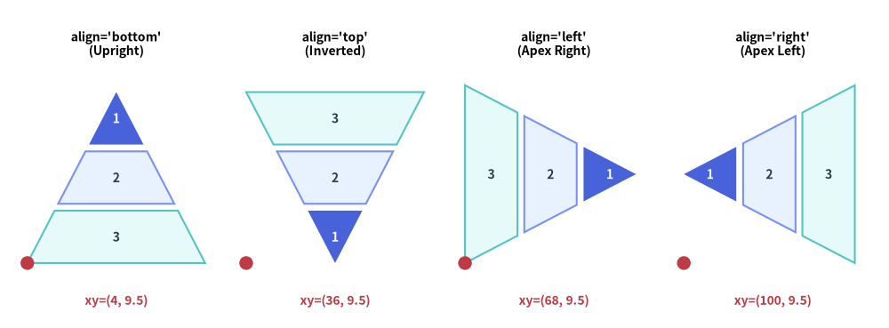
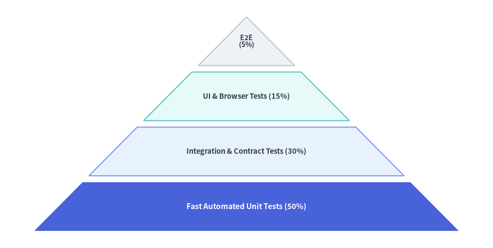
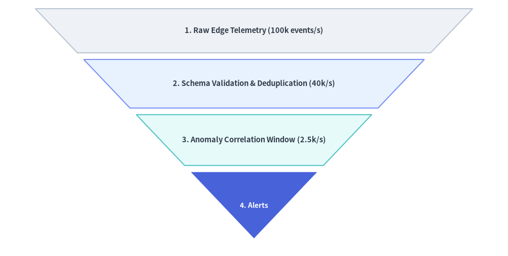

# Pyramid

The `Pyramid` component renders tiered hierarchical trapezoids crowned by an apex triangle.
It supports standard upright pyramids, inverted funnels, horizontal orientations, and custom per-tier heights—making it ideal for software testing pyramids, DIKW knowledge hierarchies, defense-in-depth tiers, and conversion funnels.


<figure class="drawlib-image" style="text-align: center;">
  
  <figcaption class="drawlib-caption">All Four Pyramid Alignments: bottom, top, left, and right</figcaption>
</figure>

<details class="drawlib-code-details">
<summary>Source Code</summary>

```python
from drawlib.canvas import save, setup
from drawlib.shapes import circle
from drawlib.smartarts import Pyramid
from drawlib.styles import Styles
from drawlib.text import text

setup(width=130, height=48)

p = Pyramid(
    style=Styles.Neutral,
    text_style=Styles.DarkBold.patch(text_size=10.0),
)
p.add("1", style=Styles.PrimaryFlat, text_style=Styles.WhiteBold.patch(text_size=10.0))
p.add("2", style=Styles.PrimaryNeutral)
p.add("3", style=Styles.SecondaryNeutral)

panels = [
    ("bottom", (4.0, 9.5), "align='bottom'\n(Upright)"),
    ("top", (36.0, 9.5), "align='top'\n(Inverted)"),
    ("left", (68.0, 9.5), "align='left'\n(Apex Right)"),
    ("right", (100.0, 9.5), "align='right'\n(Apex Left)"),
]

for align_val, (px, py), label in panels:
    text((px + 13.0, 41.5), label, style=Styles.BlackBold.patch(text_size=10.0))
    p.draw(xy=(px, py), width=26.0, height=25.0, margin=1.0, align=align_val, order="vertex_to_base")
    circle((px, py), radius=1.0, style=Styles.DangerFlat)
    text((px + 13.0, 4.0), f"xy=({int(px)}, 9.5)", style=Styles.DangerBold.patch(text_size=10.0))

save()
```

</details>


---

## 1. Upward Hierarchy Pyramid (`align="bottom"`)

By default (`align="bottom", order="vertex_to_base"`), the first added item is placed at the top apex triangle, and subsequent items form progressively wider trapezoidal tiers toward the base.


```python
from drawlib.canvas import save, setup
from drawlib.smartarts import Pyramid
from drawlib.styles import Styles

setup(width=115, height=58)

pyramid = Pyramid(
    style=Styles.Neutral,
    text_style=Styles.DarkBold.patch(text_size=10.5),
)

# Added from apex (top) to base (bottom) when order="vertex_to_base"
pyramid.add(
    "E2E\n(5%)",
    style=Styles.Neutral,
    text_style=Styles.DarkBold.patch(text_size=10.0),
)
pyramid.add(
    "UI & Browser Tests (15%)",
    style=Styles.SecondaryNeutral,
)
pyramid.add(
    "Integration & Contract Tests (30%)",
    style=Styles.PrimaryNeutral,
)
pyramid.add(
    "Fast Automated Unit Tests (50%)",
    style=Styles.PrimaryFlat,
    text_style=Styles.WhiteBold.patch(text_size=11.0),
)

pyramid.draw(
    xy=(8, 4),
    width=99,
    height=50,
    margin=1.5,
    align="bottom",
    order="vertex_to_base",
)
save()
```

<figure class="drawlib-image" style="text-align: center;">
  
  <figcaption class="drawlib-caption">Software Testing Pyramid (Upright Hierarchy)</figcaption>
</figure>


---

## 2. Inverted Conversion Funnel with Custom Tier Heights (`draw_flexible`)

Setting `align="top"` and `order="base_to_vertex"` inverts the pyramid into a top-down funnel where the first item is the wide top intake and the last item is the bottom apex. Using `draw_flexible(...)` lets you assign custom `item_heights` and `margins` to each stage.


```python
from drawlib.canvas import save, setup
from drawlib.smartarts import Pyramid
from drawlib.styles import Styles

setup(width=115, height=58)

funnel = Pyramid(
    style=Styles.Neutral,
    text_style=Styles.DarkBold.patch(text_size=10.5),
)

# Added from wide top base to bottom apex when align="top", order="base_to_vertex"
funnel.add("1. Raw Edge Telemetry (100k events/s)", style=Styles.Neutral)
funnel.add("2. Schema Validation & Deduplication (40k/s)", style=Styles.PrimaryNeutral)
funnel.add("3. Anomaly Correlation Window (2.5k/s)", style=Styles.SecondaryNeutral)
funnel.add(
    "4. Alerts",
    style=Styles.PrimaryFlat,
    text_style=Styles.WhiteBold.patch(text_size=10.0),
)

funnel.draw_flexible(
    xy=(8, 4),
    width=99,
    item_heights=[10.0, 11.0, 11.5, 15.0],
    margins=[1.5, 1.5, 1.5],
    align="top",
    order="base_to_vertex",
)
save()
```

<figure class="drawlib-image" style="text-align: center;">
  
  <figcaption class="drawlib-caption">Telemetry Ingestion & Filtering Funnel (align='top' with draw_flexible)</figcaption>
</figure>


---

## 3. Geometry, Orientations & Ordering

As illustrated in the opening diagram at the top of this page:

- **Bottom-Left Anchor `(x, y)`**: The `xy` coordinate passed to `draw()` or `draw_flexible()` specifies the **bottom-left corner** of the pyramid's bounding box.
- **Alignment (`align`)**:
  - `"bottom"` *(default)*: Upright pyramid—wide base at the bottom, apex pointing up.
  - `"top"`: Inverted funnel—wide base at the top, apex pointing down.
  - `"left"`: Horizontal pyramid—wide base on the left, apex pointing right.
  - `"right"`: Horizontal pyramid—wide base on the right, apex pointing left.
- **Item Ordering (`order`)**:
  - `"vertex_to_base"` *(default)*: First added item is placed at the triangular apex; last added item is at the wide base.
  - `"base_to_vertex"`: First added item is placed at the wide base; last added item is at the triangular apex.

---

## 4. API Reference

### Constructor
```python
Pyramid(
    *,
    style: Style,
    text_style: Style,
)
```

### Methods & Properties
- **`add(text: str, *, style: Style | None = None, text_style: Style | None = None, show: bool = True) -> PyramidItem`**:
  Appends a tier to the pyramid and returns a mutable `PyramidItem` (`style`, `text`, `text_style`, `show`). Setting `show=False` hides that tier while preserving its slice geometry so sibling tiers never shift.
- **`pyramid.items -> list[PyramidItem]`**:
  Returns the list of all registered `PyramidItem` instances (`style: Style`, `text: str`, `text_style: Style`, `show: bool`), allowing deferred mutation before or between `draw()` calls.
- **`draw(xy: tuple[float, float], width: float, height: float, margin: float, align: Literal["bottom", "top", "left", "right"] = "bottom", order: Literal["vertex_to_base", "base_to_vertex"] = "vertex_to_base", scale: float = 1.0) -> None`**:
  Renders the pyramid with uniform tier heights separated by `margin`, with optional proportional scaling around `xy`.
- **`draw_flexible(xy: tuple[float, float], width: float, item_heights: list[float], margins: list[float], align: Literal["bottom", "top", "left", "right"] = "bottom", order: Literal["vertex_to_base", "base_to_vertex"] = "vertex_to_base", scale: float = 1.0) -> None`**:
  Renders the pyramid with explicit per-tier heights (`len(item_heights) == len(items)`) and inter-tier margins (`len(margins) == len(items) - 1`). Notice that `item_heights` are ordered from the base toward the vertex.

