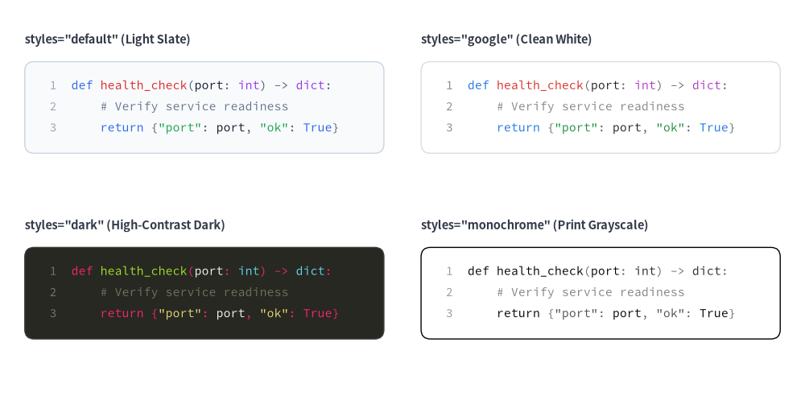
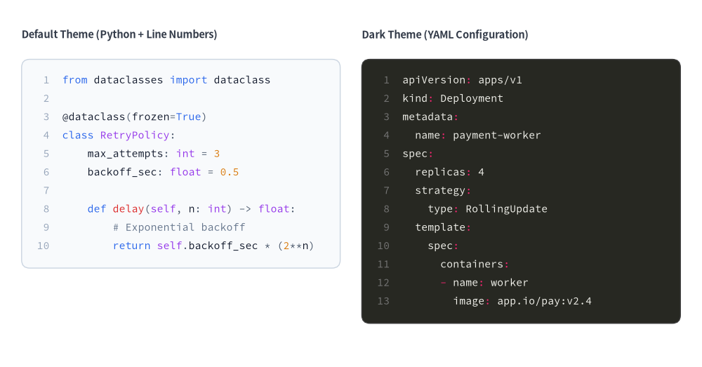
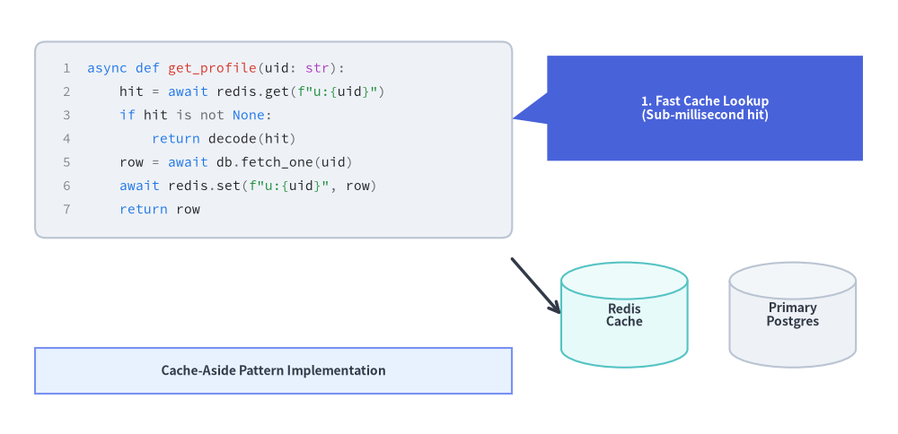

# SourceCode

The `SourceCode` component renders syntax-highlighted source code snippets directly onto the Drawlib canvas as crisp vector shapes and typography powered by Pygments.
It supports built-in syntax themes, optional line-number gutters, CJK monospace fonts, and custom token color overrides.


<figure class="drawlib-image" style="text-align: center;">
  
  <figcaption class="drawlib-caption">Overview of SourceCode: Built-In Syntax Themes (default, google, dark, monochrome)</figcaption>
</figure>

<details class="drawlib-code-details">
<summary>Source Code</summary>

```python
from drawlib.canvas import save, setup
from drawlib.smartarts import SourceCode, SourceCodeStyles
from drawlib.styles import Styles
from drawlib.text import text

setup(width=130, height=64)

snippet = """def health_check(port: int) -> dict:
    # Verify service readiness
    return {"port": port, "ok": True}"""

themes = [
    ("default", (4, 54), 'styles="default" (Light Slate)'),
    ("google", (68, 54), 'styles="google" (Clean White)'),
    ("dark", (4, 24), 'styles="dark" (High-Contrast Dark)'),
    ("monochrome", (68, 24), 'styles="monochrome" (Print Grayscale)'),
]

for theme_name, (x, y), label in themes:
    text((x, y + 3.5), label, style=Styles.DarkBold.patch(text_size=10.5, halign="left"))
    sc_styles = SourceCodeStyles.get(theme_name, font_lang="en", text_size=10.5)
    SourceCode.draw(
        xy=(x, y),
        width=58,
        code=snippet,
        styles=sc_styles,
        code_lang="python",
        show_linenum=True,
    )

save()
```

</details>


> **Looking for speech bubbles & callouts?** The `bubblespeech()` primitive is documented in **[Cylinders, Faces & Callouts](../02_drawing_primitives/shapes_domain.md)**.

---

## 1. Syntax-Highlighted Code with Line Numbers (`SourceCode.draw`)

`SourceCode.draw(...)` (or its function alias `sourcecode(...)`) renders a syntax-highlighted code block anchored at its **top-left corner `xy=(x, y)`**. You configure token colors, container styles, font size, and CJK language fonts using `SourceCodeStyles.get(...)`.


```python
from drawlib.canvas import save, setup
from drawlib.smartarts import SourceCode, SourceCodeStyles
from drawlib.styles import Styles
from drawlib.text import text

setup(width=130, height=68)

# 1. Left: Default Light Theme with Python Code
text((4, 61.5), "Default Theme (Python + Line Numbers)", style=Styles.DarkBold.patch(text_size=10.5, halign="left"))

py_code = """from dataclasses import dataclass

@dataclass(frozen=True)
class RetryPolicy:
    max_attempts: int = 3
    backoff_sec: float = 0.5

    def delay(self, n: int) -> float:
        # Exponential backoff
        return self.backoff_sec * (2**n)"""

light_styles = SourceCodeStyles.get("default", font_lang="en", text_size=10.5)
SourceCode.draw(
    xy=(4, 57),
    width=59,
    code=py_code,
    styles=light_styles,
    code_lang="python",
    show_linenum=True,
)

# 2. Right: Dark Theme with Kubernetes YAML Config
text((67, 61.5), "Dark Theme (YAML Configuration)", style=Styles.DarkBold.patch(text_size=10.5, halign="left"))

yaml_code = """apiVersion: apps/v1
kind: Deployment
metadata:
  name: payment-worker
spec:
  replicas: 4
  strategy:
    type: RollingUpdate
  template:
    spec:
      containers:
      - name: worker
        image: app.io/pay:v2.4"""

dark_styles = SourceCodeStyles.get("dark", font_lang="en", text_size=10.5)
SourceCode.draw(
    xy=(67, 57),
    width=59,
    code=yaml_code,
    styles=dark_styles,
    code_lang="yaml",
    show_linenum=True,
)
save()
```

<figure class="drawlib-image" style="text-align: center;">
  
  <figcaption class="drawlib-caption">Syntax-Highlighted Python and YAML Blocks with Line Numbers</figcaption>
</figure>


---

## 2. Annotating Code Blocks in Architecture & Tutorial Diagrams

Because `SourceCode.draw()` renders directly onto the shared vector canvas, you can combine code containers with callout bubbles (`bubblespeech`), architecture nodes, and arrows to create annotated code walkthroughs.


```python
from drawlib.canvas import save, setup
from drawlib.lines import line
from drawlib.shapes import bubblespeech, cylinder, rectangle
from drawlib.smartarts import SourceCode, SourceCodeStyles
from drawlib.styles import Styles

setup(width=128, height=62)

# 1. Left: Syntax-Highlighted Code Block
snippet = """async def get_profile(uid: str):
    hit = await redis.get(f"u:{uid}")
    if hit is not None:
        return decode(hit)
    row = await db.fetch_one(uid)
    await redis.set(f"u:{uid}", row)
    return row"""

code_styles = SourceCodeStyles.get("google", font_lang="en", text_size=10.5).patch(
    box_style=Styles.Neutral.patch(shape_r=1.5),
)
SourceCode.draw(
    xy=(5, 56),
    width=68,
    code=snippet,
    styles=code_styles,
    code_lang="python",
    show_linenum=True,
)

# 2. Callout Bubble pointing to the cache-aside lookup line
bubblespeech(
    xy=(78, 39),
    width=45,
    height=15,
    tail_edge="left",
    tail_start_ratio=0.35,
    tail_end_ratio=0.65,
    tail_vertex_xy=(73, 45),
    style=Styles.PrimaryFlat.patch(shape_r=1.2),
    text="1. Fast Cache Lookup\n(Sub-millisecond hit)",
    text_style=Styles.WhiteBold.patch(text_size=10.0),
)

# 3. Downstream Persistence Nodes referenced by the code
cylinder(
    xy=(89, 17),
    width=18,
    height=15,
    style=Styles.SecondaryNeutral,
    text="Redis\nCache",
    text_style=Styles.DarkBold.patch(text_size=10.0),
)
cylinder(
    xy=(113, 17),
    width=18,
    height=15,
    style=Styles.Neutral,
    text="Primary\nPostgres",
    text_style=Styles.DarkBold.patch(text_size=10.0),
)

line((73, 25), (80, 17), arrow_head="->", style=Styles.DarkBold)
rectangle(
    (39, 9),
    width=68,
    height=6.5,
    style=Styles.PrimaryNeutral,
    text="Cache-Aside Pattern Implementation",
    text_style=Styles.DarkBold.patch(text_size=10.0),
)
save()
```

<figure class="drawlib-image" style="text-align: center;">
  
  <figcaption class="drawlib-caption">Annotated SourceCode Walkthrough with Callout Bubbles and Architecture Target</figcaption>
</figure>


---

## 3. Themes, Languages & Token Customization (`SourceCodeStyles`)

### Built-in Themes & CJK Font Selection
Use `SourceCodeStyles.get(styles, font_lang, *, font=None, text_size=12.0)` (or `get_source_code_styles(...)`):
- **`styles` (Theme Name)**:
  - `"default"`: Clean light slate background with blue/green/red syntax colors.
  - `"google"`: Crisp white card with Google-inspired syntax palette.
  - `"dark"` (or `"monokai"`, `"github-dark"`): High-contrast dark theme.
  - `"monochrome"`: Grayscale print-safe theme.
- **`font_lang`**:
  - `"en"` *(default)*: Uses `FontSourceCode.SOURCECODEPRO`.
  - `"ja"`, `"zh-cn"`, `"zh-tw"`, `"ko"`: Automatically selects `FontSourceCode.SOURCEHANCODEJP` so CJK comments and strings render without missing-glyph tofu boxes.
- **`code_lang`**:
  - Supports `"python"`, `"yaml"`, `"json"`, `"sql"`, `"bash"`, `"go"`, `"rust"`, `"typescript"`, `"javascript"`, `"html"`, `"css"`, `"dockerfile"`, `"toml"`, `"protobuf"`, `"c"`, `"cpp"`, `"java"`, `"kotlin"`, `"swift"`, `"markdown"`, or `None` (auto-detected from `file` extension or content).

### Customizing Token Styles (`SourceCodeStyles` & `.patch()`)
`SourceCodeStyles` is an immutable Pydantic model defining the outer container, gutter line numbers, and 8 syntax token categories. Calling `styles.patch(...)` returns a new `SourceCodeStyles` instance with specified fields updated:

```python
from drawlib.smartarts import SourceCodeStyles
from drawlib.styles import Styles

custom_styles = SourceCodeStyles.get("default", font_lang="en", text_size=10.5).patch(
    box_style=Styles.Neutral.patch(shape_r=2.0),
    keyword=Styles.PrimaryBold,
    comment=Styles.Muted,
    text_size=10.5,  # Updates font size across all token types and line numbers
)
```

| Field / `.patch()` Argument | Type | Description |
| :--- | :--- | :--- |
| **`box_style`** | `Style` | Shape style for the outer code container rectangle (corner radius controlled via `shape_r`, default `1.5`). |
| **`linenum_style`** | `Style` | Text style for right-aligned line numbers in the left gutter (`show_linenum=True`). |
| **`default`** | `Style` | Text style for standard code text and unclassified identifiers. |
| **`keyword`** | `Style` | Text style for language keywords (e.g. `def`, `class`, `return`, `if`, `import`). |
| **`string`** | `Style` | Text style for string literals. |
| **`comment`** | `Style` | Text style for single-line and multi-line comments. |
| **`number`** | `Style` | Text style for integer and floating-point numeric literals. |
| **`function`** | `Style` | Text style for function and method names. |
| **`type_`** *(or `type` in `.patch()`)* | `Style` | Text style for class names, type annotations, and builtin identifiers. |
| **`operator`** | `Style` | Text style for operators and punctuation symbols. |
| **`text_size`** *(in `.patch()`)* | `float \| None` | Convenience parameter in `.patch(text_size=...)` that updates `text_size` across `linenum_style` and all 8 token styles simultaneously. |

---

## 4. API Reference

### Drawing Code (`SourceCode.draw` / `sourcecode`)
```python
SourceCode.draw(
    xy: tuple[float, float],           # Top-left corner (x, y) of the code container
    width: float,                      # Total container width in canvas units
    code: str | None = None,           # Source code string (mutually exclusive with `file`)
    *,
    styles: SourceCodeStyles,          # Required style configuration
    file: str | Path | None = None,    # Path to external source file (mutually exclusive with `code`)
    code_lang: str | None = None,      # Lexer language name (e.g. "python", "yaml")
    show_linenum: bool = False,        # Render line numbers in a left gutter
    scale: float = 1.0,                # Proportional scale factor anchored at `xy`
) -> None
```
- **Function Aliases**: `sourcecode(...)` is a top-level function alias for `SourceCode.draw(...)`, and `get_source_code_styles(...)` is a top-level function alias for `SourceCodeStyles.get(...)`.
- **Height Calculation**: Container height is computed automatically from the number of lines in `code` (or `file`) and `styles.default.text_size`.
- **Loading External Files**: Pass `file="path/to/example.py"` directly to `SourceCode.draw(...)`, or read the file string via `SourceCode.get_text(file, strip=True)`.

