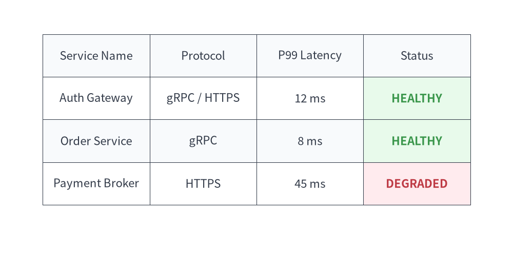
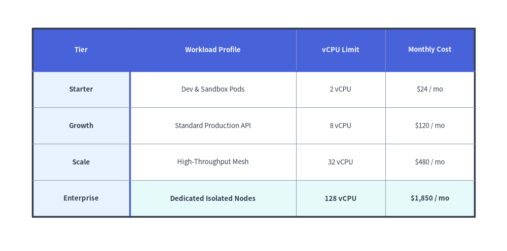

# Table Component

The `Table` component renders 2D tabular data, comparison matrices, and database schemas with fine-grained styling control over borders, headers, alternating even/odd row backgrounds, and specific cell highlights.

---

## 1. Quick Example: Service SLA & Status Matrix


```python
from drawlib.canvas import setup
from drawlib.smartarts import Table
from drawlib.styles import Colors, Styles

setup(width=120, height=60)

table = Table(
    cell_style=Styles.White,
    text_style=Styles.Dark,
    header_cell_style=Styles.PrimaryFlat,
    header_text_style=Styles.WhiteBold,
    border_style=Styles.DarkThin,
)

# Custom even/odd row styling using semantic tokens
table.set_style_cell_evenodd(
    even_color=Colors.Muted1,
    even_text_style=Styles.Dark,
    odd_color=Colors.White,
    odd_text_style=Styles.Dark,
)

# SLA highlight on HEALTHY rows using Success tint
table.set_style_cell(
    background_color=Colors.Success1,
    text_style=Styles.SuccessBold,
    rows=[1, 2],
    columns=[3],
)

# SLA highlight on DEGRADED row using Danger tint
table.set_style_cell(
    background_color=Colors.Danger1,
    text_style=Styles.DangerBold,
    rows=[3],
    columns=[3],
)

data = [
    ["Service Name", "Protocol", "P99 Latency", "Status"],
    ["Auth Gateway", "gRPC / HTTPS", "12 ms", "HEALTHY"],
    ["Order Service", "gRPC", "8 ms", "HEALTHY"],
    ["Payment Broker", "HTTPS", "45 ms", "DEGRADED"],
]

table.draw(xy=(10, 52), width=100, height=40, data=data)
```

<figure class="drawlib-image" style="text-align: center;">
  
  <figcaption class="drawlib-caption">Service Status Matrix with Table</figcaption>
</figure>


---

## 2. Flexible Column/Row Sizing, Row Headers & Custom Borders (`draw_flexible`)

When columns have different content lengths (such as a wide description column next to compact numeric metrics), use `table.draw_flexible(xy, column_widths=[...], row_heights=[...], data=...)`. You can style both the top header row and left row-header column simultaneously with `set_style_cell_headers(...)` (or independently with `set_style_cell_rowheader(...)`), customize per-column text styles (`set_style_cell(..., columns=[...], text_style=Styles.Dark.patch(halign="left"|"right"))`), and place accented divider lines after row 0 (`top2`) and column 0 (`left2`) via `set_style_border(...)`.


```python
from drawlib.canvas import save, setup
from drawlib.smartarts import Table
from drawlib.styles import Colors, Styles

setup(width=125, height=62)

table = Table(
    cell_style=Styles.White,
    text_style=Styles.Dark.patch(text_size=9.5),
    header_cell_style=Styles.PrimaryFlat,
    header_text_style=Styles.WhiteBold.patch(text_size=9.5),
    border_style=Styles.MutedThin,
    has_header=True,
)

# Zebra-stripe data rows first
table.set_style_cell_evenodd(
    even_color=Colors.Muted1,
    even_text_style=Styles.Dark.patch(text_size=9.5),
    odd_color=Colors.White,
    odd_text_style=Styles.Dark.patch(text_size=9.5),
)

# Left-aligned workload profile column and right-aligned numeric columns
table.set_style_cell(
    background_color=Colors.White,
    text_style=Styles.Dark.patch(text_size=9.5, halign="left"),
    rows=[1, 2, 3],
    columns=[1],
)
table.set_style_cell(
    background_color=Colors.White,
    text_style=Styles.Dark.patch(text_size=9.5, halign="right"),
    rows=[1, 2, 3],
    columns=[2, 3],
)
# Highlight the Enterprise row with right-aligned numeric metrics
table.set_style_cell(
    background_color=Colors.Secondary1,
    text_style=Styles.DarkBold.patch(text_size=9.5, halign="left"),
    rows=[4],
    columns=[1],
)
table.set_style_cell(
    background_color=Colors.Secondary1,
    text_style=Styles.DarkBold.patch(text_size=9.5, halign="right"),
    rows=[4],
    columns=[2, 3],
)

# Style both row 0 and column 0 headers, then refine row-header column 0 and top header row 0
table.set_style_cell_headers(
    background_color=Colors.Primary1,
    text_style=Styles.DarkBold.patch(text_size=9.5),
)
table.set_style_cell_rowheader(
    background_color=Colors.Primary1,
    text_style=Styles.DarkBold.patch(text_size=9.5, halign="left"),
)
table.set_style_cell_header(
    background_color=Colors.Primary,
    text_style=Styles.WhiteBold.patch(text_size=9.5),
)

# Emphasize outer perimeter plus header dividers (top2 beneath row 0, left2 right of column 0)
table.set_style_border(
    top=Styles.DarkBold,
    top2=Styles.PrimaryBold,
    bottom=Styles.DarkBold,
    left=Styles.DarkBold,
    left2=Styles.PrimaryBold,
    right=Styles.DarkBold,
    between_columns=Styles.MutedThin,
    between_rows=Styles.MutedThin,
)

quota_data = [
    ["Tier", "Workload Profile", "vCPU Limit", "Monthly Cost"],
    ["Starter", "Dev & Sandbox Pods", "2 vCPU", "$24 / mo"],
    ["Growth", "Standard Production API", "8 vCPU", "$120 / mo"],
    ["Scale", "High-Throughput Mesh", "32 vCPU", "$480 / mo"],
    ["Enterprise", "Dedicated Isolated Nodes", "128 vCPU", "$1,850 / mo"],
]

table.draw_flexible(
    xy=(8, 55),
    column_widths=[24.0, 41.0, 22.0, 22.0],
    row_heights=[10.5, 9.0, 9.0, 9.0, 9.0],
    data=quota_data,
)
save()
```

<figure class="drawlib-image" style="text-align: center;">
  
  <figcaption class="drawlib-caption">Flexible Column/Row Sizing, Row Headers, and Custom Borders (top2, left2)</figcaption>
</figure>


---

## 3. Geometry, Data Matrix & Coordinate Mechanics

- **Top-Left Anchor `(x, y)`**: The coordinate passed to `draw(xy=...)` or `draw_flexible(xy=...)` specifies the **top-left corner** of the first table cell (`row=0, col=0`).
- **Downward & Rightward Flow**: Rows step downward (`y - row_height`), while columns step rightward (`x + col_width`).
- **2D Data Matrix (`data`)**: Passed as `list[list[Any]]` (all cell values are converted with `str(...)`). When `has_header=True` *(default)*, row `0` is automatically styled using `header_cell_style` and `header_text_style`.
- **Order-Dependent Style Layering**: Cell styling calls (`set_style_cell_evenodd`, `set_style_cell_headers`, `set_style_cell_rowheader`, `set_style_cell_header`, `set_style_cell`) are recorded in order and applied sequentially at `draw()` time. Call broad rules (such as `set_style_cell_evenodd`) first, and specific row/column overrides afterward.

---

## 4. API Reference

### Constructor (`Table`)
```python
Table(
    *,
    cell_style: Style,
    text_style: Style,
    header_cell_style: Style,
    header_text_style: Style,
    border_style: Style,
    has_header: bool = True,
)
```

| Parameter | Type | Default | Description |
| :--- | :--- | :--- | :--- |
| **`cell_style`** | `Style` | *(Required)* | Default cell style (uses `shape_fill_color` for cell background). |
| **`text_style`** | `Style` | *(Required)* | Default text style for data cell contents. |
| **`header_cell_style`** | `Style` | *(Required)* | Default cell style for the header row (`row 0`). |
| **`header_text_style`** | `Style` | *(Required)* | Default text style for the header row (`row 0`). |
| **`border_style`** | `Style` | *(Required)* | Default line style applied to table borders and grid lines. |
| **`has_header`** | `bool` | `True` | Whether row `0` is automatically styled as a header row on initialization. |

### Cell & Text Styling Methods
- **`set_style_cell_headers(background_color: ColorType, text_style: Style) -> None`**:
  Applies `background_color` and `text_style` to **both** the column header row (`row 0`) and the row header column (`column 0`).
- **`set_style_cell_header(background_color: ColorType, text_style: Style) -> None`**:
  Applies `background_color` and `text_style` exclusively to the top column header row (`row 0`).
- **`set_style_cell_rowheader(background_color: ColorType, text_style: Style) -> None`**:
  Applies `background_color` and `text_style` exclusively to the left row header column (`column 0`).
- **`set_style_cell_evenodd(even_color: ColorType, even_text_style: Style, odd_color: ColorType, odd_text_style: Style) -> None`**:
  Applies alternating zebra-stripe background colors and text styles to even (`0, 2, 4, ...`) and odd (`1, 3, 5, ...`) row indices.
- **`set_style_cell(background_color: ColorType, text_style: Style, rows: list[int] | None = None, columns: list[int] | None = None) -> None`**:
  Applies `background_color` and `text_style` to the intersection of 0-indexed `rows` and `columns` (`None` targets all rows or all columns). Use this to customize per-column or per-cell typography and alignment (`text_style=Styles.Dark.patch(halign="left"|"right")`).
- **`reset_styles() -> None`**:
  Clears all custom cell and border style overrides and restores the initial constructor styles.

### Border Styling Method
```python
table.set_style_border(
    top: Style | None = None,
    top2: Style | None = None,
    bottom: Style | None = None,
    left: Style | None = None,
    left2: Style | None = None,
    right: Style | None = None,
    between_columns: Style | None = None,
    between_rows: Style | None = None,
) -> None
```

| Parameter | Type | Default | Description |
| :--- | :--- | :--- | :--- |
| **`top`**, **`bottom`**, **`left`**, **`right`** | `Style \| None` | `None` | Outer perimeter border line styles. |
| **`top2`** | `Style \| None` | `None` | Horizontal divider line directly beneath the header row (between row `0` and row `1`). |
| **`left2`** | `Style \| None` | `None` | Vertical divider line directly to the right of the row-header column (between column `0` and column `1`). |
| **`between_columns`** | `Style \| None` | `None` | Vertical separator lines between inner columns. |
| **`between_rows`** | `Style \| None` | `None` | Horizontal separator lines between inner rows. |

### Drawing Methods (`draw` & `draw_flexible`)
- **`draw(xy: tuple[float, float], width: float, height: float, data: list[list[Any]], scale: float = 1.0) -> None`**:
  Renders the table anchored at top-left `xy` with uniform column widths (`width / num_cols`) and uniform row heights (`height / num_rows`), scaled proportionally by `scale`.
- **`draw_flexible(xy: tuple[float, float], column_widths: list[float], row_heights: list[float], data: list[list[Any]], scale: float = 1.0) -> None`**:
  Renders the table anchored at top-left `xy` using explicit per-column widths (`len(column_widths) == len(data[0])`) and per-row heights (`len(row_heights) == len(data)`), scaled proportionally by `scale`.

