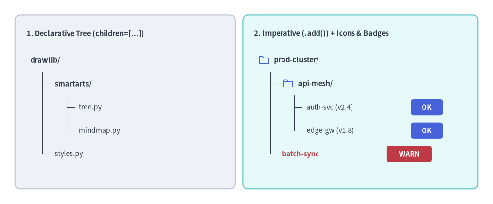

# Tree Component

The `TreeNode` component renders hierarchical tree structures, such as codebase directory trees, organizational hierarchy charts, and taxonomy categorizations. 
It automates vertical branch alignment, indentation levels, and tree connector lines.


<figure class="drawlib-image" style="text-align: center;">
  
  <figcaption class="drawlib-caption">Overview of TreeNode: Declarative Hierarchy and Icon/Badge Annotations</figcaption>
</figure>

<details class="drawlib-code-details">
<summary>Source Code</summary>

```python
from drawlib.canvas import save, setup
from drawlib.icons import phosphor
from drawlib.shapes import rectangle
from drawlib.smartarts import TreeNode
from drawlib.styles import Styles
from drawlib.text import text

setup(width=130, height=54)

# 1. Left Card: Declarative Nested Hierarchy (children=[...])
rectangle((33, 27), width=58, height=46, style=Styles.Neutral.patch(shape_r=1.5))
text((7, 45.0), "1. Declarative Tree (children=[...])", style=Styles.DarkBold.patch(text_size=10.5, halign="left"))

decl_root = TreeNode(
    "drawlib/",
    text_style=Styles.DarkBold.patch(text_size=10.5),
    line_style=Styles.DarkThin,
    line_horizontal_margin=3.2,
    line_horizontal_length=3.0,
    line_vertical_margin=6.2,
    children=[
        TreeNode(
            "smartarts/",
            children=[
                TreeNode("tree.py", text_style=Styles.Dark.patch(text_size=10.0)),
                TreeNode("mindmap.py", text_style=Styles.Dark.patch(text_size=10.0)),
            ],
        ),
        TreeNode("styles.py", text_style=Styles.Dark.patch(text_size=10.0)),
    ],
)
decl_root.draw(xy=(8, 38.0))

# 2. Right Card: Imperative (.add()) with Vector Icons & Trailing Badges
rectangle((95, 27), width=62, height=46, style=Styles.SecondaryNeutral.patch(shape_r=1.5))
text((67, 45.0), "2. Imperative (.add()) + Icons & Badges", style=Styles.DarkBold.patch(text_size=10.5, halign="left"))

TreeNode.register_drawing_item(
    name="hero_dir",
    location="before",
    padding_width=4.2,
    function=phosphor.folder,
    style=Styles.PrimaryFlat,
    args={"width": 3.0},
)
TreeNode.register_drawing_item(
    name="hero_ok",
    location="after",
    padding_width=27.5,
    function=rectangle,
    style=Styles.PrimaryFlat.patch(shape_r=0.8),
    args={"width": 8.5, "height": 4.2, "text": "OK", "text_style": Styles.WhiteBold.patch(text_size=10.0)},
)
TreeNode.register_drawing_item(
    name="hero_warn",
    location="after",
    padding_width=27.5,
    function=rectangle,
    style=Styles.DangerFlat.patch(shape_r=0.8),
    args={"width": 12.0, "height": 4.2, "text": "WARN", "text_style": Styles.WhiteBold.patch(text_size=10.0)},
)

imp_root = TreeNode(
    "prod-cluster/",
    text_style=Styles.DarkBold.patch(text_size=10.5),
    line_style=Styles.DarkThin,
    line_horizontal_margin=3.2,
    line_horizontal_length=3.0,
    line_vertical_margin=6.2,
).set_drawing_item("hero_dir")

api_group = imp_root.add("api-mesh/").set_drawing_item("hero_dir")
api_group.add("auth-svc (v2.4)", text_style=Styles.Dark.patch(text_size=10.0)).set_drawing_item("hero_ok")
api_group.add("edge-gw (v1.8)", text_style=Styles.Dark.patch(text_size=10.0)).set_drawing_item("hero_ok")
imp_root.add("batch-sync", text_style=Styles.DangerBold.patch(text_size=10.0), line_style=Styles.MutedDashed).set_drawing_item("hero_warn")

imp_root.draw(xy=(68, 38.0))
save()
```

</details>


---

## 1. Quick Example: Project Directory Hierarchy


```python
from drawlib.canvas import setup
from drawlib.smartarts import TreeNode
from drawlib.icons import phosphor
from drawlib.styles import Styles

setup(width=115, height=44)

# Register custom icons for folders and files
TreeNode.register_drawing_item(
    name="folder", location="before", padding_width=4.5, function=phosphor.folder,
    style=Styles.PrimaryFlat, args={"width": 3.2}
)
TreeNode.register_drawing_item(
    name="file", location="before", padding_width=4.5, function=phosphor.file_text,
    style=Styles.Dark, args={"width": 3.2}
)

root = TreeNode(
    "src/",
    text_style=Styles.DarkBold.patch(text_size=11.0),
    line_style=Styles.DarkThin,
    line_horizontal_margin=3.5,
    line_horizontal_length=3.2,
    line_vertical_margin=6.8,
    children=[
        TreeNode("components/", children=[
            TreeNode("Button.py", text_style=Styles.Dark.patch(text_size=10.5)).set_drawing_item("file"),
            TreeNode("Modal.py", text_style=Styles.Dark.patch(text_size=10.5)).set_drawing_item("file"),
        ]).set_drawing_item("folder"),
        TreeNode("utils.py", text_style=Styles.Dark.patch(text_size=10.5)).set_drawing_item("file"),
    ]
).set_drawing_item("folder")

root.draw(xy=(8, 37))
```

<figure class="drawlib-image" style="text-align: center;">
  
  <figcaption class="drawlib-caption">Project File Structure with TreeNode</figcaption>
</figure>


---

## 2. Imperative Construction (`.add()`), Cascading Overrides & `"after"` Status Badges

Instead of nesting `children=[...]` inside the constructor, you can build trees imperatively using `parent.add(text, ...) -> TreeNode`. Any style or margin parameter specified on an intermediate node automatically **cascades down to its subtree** unless overridden again. You can also register status badges or icons with `location="after"` (where `padding_width` specifies the horizontal offset from the node's left `x` coordinate to the badge).


```python
from drawlib.canvas import save, setup
from drawlib.icons import phosphor
from drawlib.shapes import rectangle
from drawlib.smartarts import TreeNode
from drawlib.styles import Styles

setup(width=115, height=58)

# Register trailing status badges (location="after" places the item at x + padding_width)
TreeNode.register_drawing_item(
    name="badge_live",
    location="after",
    padding_width=32.0,
    function=rectangle,
    style=Styles.PrimaryFlat.patch(shape_r=0.8),
    args={"width": 13.5, "height": 4.5, "text": "ACTIVE", "text_style": Styles.WhiteBold.patch(text_size=10.0)},
)
TreeNode.register_drawing_item(
    name="badge_warn",
    location="after",
    padding_width=33.5,
    function=phosphor.warning_circle,
    style=Styles.DangerFlat,
    args={"width": 3.8},
)

root = TreeNode(
    "production-cluster/",
    text_style=Styles.DarkBold.patch(text_size=11.0),
    line_style=Styles.DarkThin,
    line_horizontal_margin=3.8,
    line_horizontal_length=3.6,
    line_vertical_margin=6.8,
)

# 1. Core Services Subtree (inherits root margins, overrides text_style)
core = root.add("core-services/", text_style=Styles.DarkBold.patch(text_size=10.5))
core.add("auth-gateway (v2.4)", text_style=Styles.Dark.patch(text_size=10.0)).set_drawing_item("badge_live")
core.add("billing-worker (v1.9)", text_style=Styles.Dark.patch(text_size=10.0)).set_drawing_item("badge_live")

# 2. Legacy Subtree (overrides line_style and tighter vertical spacing for all its children)
legacy = root.add(
    "legacy-workers/",
    text_style=Styles.DarkBold.patch(text_size=10.5),
    line_style=Styles.MutedDashed,
    line_vertical_margin=6.2,
)
batch = legacy.add("nightly-sync (degraded)", text_style=Styles.DangerBold.patch(text_size=10.0))
batch.set_drawing_item("badge_warn")
legacy.add("csv-exporter (standby)", text_style=Styles.Muted.patch(text_size=10.0))

root.draw(xy=(8, 51))
save()
```

<figure class="drawlib-image" style="text-align: center;">
  
  <figcaption class="drawlib-caption">Imperative TreeNode Construction with Cascading Subtree Overrides and 'after' Status Badges</figcaption>
</figure>


---

## 3. Geometry, Lifecycle & Coordinate Mechanics

- **Top-Left Anchor `(x, y)`**: The coordinate passed to `root.draw(xy=..., scale=1.0)` represents the **left edge and vertical center** of the root node label. Passing `scale` proportionally scales indentation, vertical spacing, icons, and text sizes relative to `xy`.
- **Downward & Rightward Flow**: Child nodes step downward (`child_y = current_y - line_vertical_margin`) and indent rightward (`child_x = parent_x + 2 * line_horizontal_margin`).
- **Layout-Preserving Visibility (`show: bool = True`)**:
  - Both `TreeNode(text, ..., show=True)` and `node.add(text, ..., show=True)` control node visibility.
  - Setting `node.show = False` hides the node, its incoming connector tick, and its descendants while **preserving the exact vertical Y-coordinates of all subsequent sibling nodes**.
- **Root Node Style & Margin Requirements**:  
  The root `TreeNode` must define all five baseline style and spacing attributes (`text_style`, `line_style`, `line_horizontal_margin`, `line_horizontal_length`, and `line_vertical_margin`). Descendant nodes inherit these settings automatically via cascading unless overridden on a child node.

---

## 4. API Reference

### Constructor (`TreeNode`)
```python
TreeNode(
    text: str,
    *,
    text_style: Style | None = None,
    line_style: Style | None = None,
    line_horizontal_margin: float | None = None,
    line_horizontal_length: float | None = None,
    line_vertical_margin: float | None = None,
    children: list[TreeNode] | None = None,
    show: bool = True,
)
```

| Parameter | Type | Default | Description |
| :--- | :--- | :--- | :--- |
| **`text`** | `str` | *(Required)* | Label text displayed for this tree node. |
| **`text_style`** | `Style \| None` | `None` | Text style for the node label (**required on root**; inherited by children if `None`). |
| **`line_style`** | `Style \| None` | `None` | Line style for branch connectors (**required on root**; inherited by children if `None`). |
| **`line_horizontal_margin`** | `float \| None` | `None` | Horizontal offset from parent `x` to vertical connector line (`> 0`, **required on root**). |
| **`line_horizontal_length`** | `float \| None` | `None` | Base length parameter for the horizontal connector tick (`> 0`, **required on root**). |
| **`line_vertical_margin`** | `float \| None` | `None` | Vertical step distance between consecutive rows (`> 0`, **required on root**). |
| **`children`** | `list[TreeNode] \| None` | `None` | Initial list of child `TreeNode` instances. |
| **`show`** | `bool` | `True` | Whether to render this node and its connectors (preserves vertical row slots when `False`). |

### Adding Child Nodes (`.add()`)
```python
node.add(
    text: str,
    *,
    text_style: Style | None = None,
    line_style: Style | None = None,
    line_horizontal_margin: float | None = None,
    line_horizontal_length: float | None = None,
    line_vertical_margin: float | None = None,
    show: bool = True,
) -> TreeNode
```
Creates a new child `TreeNode` with label `text: str`, appends it to `node.children`, and returns the newly created child `TreeNode` instance.

### Custom Icons & Badges (`register_drawing_item` & `set_drawing_item`)
```python
TreeNode.register_drawing_item(
    name: str,
    location: Literal["before", "after"],
    padding_width: float,
    function: Callable,
    style: Style,
    args: dict,
) -> None
```

| Parameter | Type | Description |
| :--- | :--- | :--- |
| **`name`** | `str` | Unique identifier used when calling `node.set_drawing_item(name)`. |
| **`location`** | `Literal["before", "after"]` | `"before"` draws the icon at `xy` and shifts the text right by `padding_width`; `"after"` draws the text at `xy` and places the icon/badge at `x + padding_width`. |
| **`padding_width`** | `float` | Horizontal spacing offset (`> 0`). |
| **`function`** | `Callable` | Any Drawlib shape or icon callable accepting `xy` and `style` (e.g. `phosphor.folder`, `rectangle`). |
| **`style`** | `Style` | Style passed to `function` (patched with `halign="left", valign="center"`). |
| **`args`** | `dict` | Additional keyword arguments passed to `function` (e.g. `{"width": 3.0}`). |

- **`node.set_drawing_item(name: str) -> TreeNode`**: Links a registered drawing item to `node` and returns `self` for method chaining.

### Drawing & Mutable Properties
- **`node.draw(xy: tuple[float, float], scale: float = 1.0) -> None`**: Renders the tree rooted at top-left `xy` with optional proportional scaling `scale`.
- **Mutable Node Properties**:
  - `node.text: str` — Get or set the node label string.
  - `node.text_style: Style | None` — Get or set the node text style.
  - `node.line_style: Style | None` — Get or set the node connector line style.
  - `node.children -> list[TreeNode]` — Access the list of child `TreeNode` instances.
  - `node.show: bool` — Toggle layout-preserving visibility before or between `draw()` calls.

