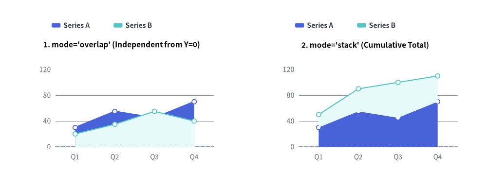
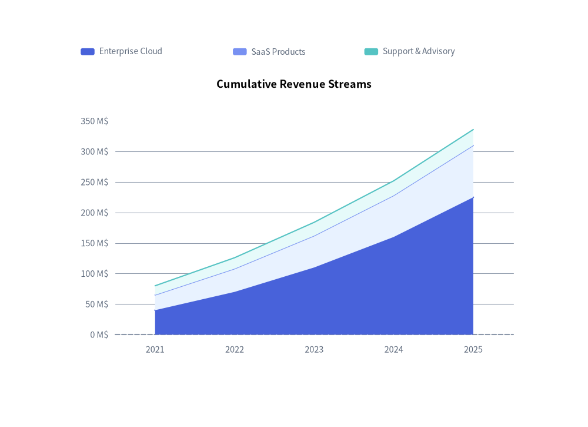
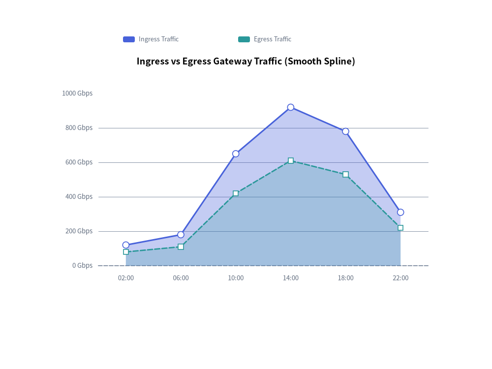

# AreaChart: Overlapping & Stacked Quantitative Volumes

`AreaChart` (`drawlib.charts.area`) visualizes cumulative volumes, capacity distributions, and continuous trends over categorical intervals or time periods. By filling the geometric area between data series contours and the baseline ($Y=0$), it highlights both the total volume and individual series contributions.

---

## 1. Overview & Key Modes


<figure class="drawlib-image" style="text-align: center;">
  
  <figcaption class="drawlib-caption">AreaChart Modes: Overlapping Series (overlap) vs. Cumulative Stacked (stack)</figcaption>
</figure>

<details class="drawlib-code-details">
<summary>Source Code</summary>

```python
from drawlib.canvas import save, setup
from drawlib.charts.area import AreaChart
from drawlib.styles import Styles

setup(width=132, height=52)

categories = ["Q1", "Q2", "Q3", "Q4"]
series_a = [30.0, 55.0, 45.0, 70.0]
series_b = [20.0, 35.0, 55.0, 40.0]

# Left: mode="overlap" (Independent from Y=0)
overlap_chart = AreaChart(
    axis_line_style=Styles.MutedDashed,
    categories=categories,
    axis_text_style=Styles.Muted.patch(text_size=10.0),
    grid_style=Styles.MutedThin,
    width=56.0,
    height=36.0,
    title="1. mode='overlap' (Independent from Y=0)",
    title_style=Styles.BlackBold.patch(text_size=11.0),
    mode="overlap",
    fill_alpha=0.35,
    show_points=True,
    point_shape="circle",
    point_size=0.6,
)
overlap_chart.add_series("Series A", series_a, style=Styles.PrimaryFlat)
overlap_chart.add_series("Series B", series_b, style=Styles.SecondaryNeutral, line_style="dashed")
overlap_chart.configure_y_axis(min_value=0, max_value=120, tick_step=40)
overlap_chart.draw(xy=(5.0, 6.0))
overlap_chart.draw_legend(xy=(14.0, 45.0), text_style=Styles.DarkBold.patch(text_size=10.0), orientation="horizontal")

# Right: mode="stack" (Cumulative Total)
stack_chart = AreaChart(
    axis_line_style=Styles.MutedDashed,
    categories=categories,
    axis_text_style=Styles.Muted.patch(text_size=10.0),
    grid_style=Styles.MutedThin,
    width=56.0,
    height=36.0,
    title="2. mode='stack' (Cumulative Total)",
    title_style=Styles.BlackBold.patch(text_size=11.0),
    mode="stack",
    fill_alpha=0.65,
    show_points=True,
    point_shape="circle",
    point_size=0.6,
)
stack_chart.add_series("Series A", series_a, style=Styles.PrimaryFlat)
stack_chart.add_series("Series B", series_b, style=Styles.SecondaryNeutral)
stack_chart.configure_y_axis(min_value=0, max_value=120, tick_step=40)
stack_chart.draw(xy=(71.0, 6.0))
stack_chart.draw_legend(xy=(80.0, 45.0), text_style=Styles.DarkBold.patch(text_size=10.0), orientation="horizontal")

save()
```

</details>


Area charts support two core operational modes:
- **`mode="overlap"` *(default)***: Each series polygon starts at the baseline ($Y=0$) and overlaps with preceding series. Use a semi-transparent opacity (`fill_alpha=0.25` to `0.45`) or per-series `fill_alpha` overrides so underlying curves remain clearly visible.
- **`mode="stack"`**: Each series rests directly on top of the preceding one, showing cumulative totals (e.g., total gross revenue broken down by product line).

---

## 2. Cumulative Stacked Area Chart

Stacked area charts (`mode="stack"`) are ideal for displaying aggregate metrics and showing the proportional contribution of each stream over time:


```python
from drawlib.canvas import save, setup
from drawlib.charts.area import AreaChart
from drawlib.styles import Styles

setup(width=102, height=74)

chart = AreaChart(
    axis_line_style=Styles.MutedDashed,
    categories=["2021", "2022", "2023", "2024", "2025"],
    axis_text_style=Styles.Muted.patch(text_size=10.5),
    grid_style=Styles.MutedThin,
    width=82.0,
    height=52.0,
    title="Cumulative Revenue Streams",
    title_style=Styles.BlackBold.patch(text_size=13.0),
    mode="stack",
    fill_alpha=0.65,
)
chart.add_series("Enterprise Cloud", [40.0, 70.0, 110.0, 160.0, 225.0], style=Styles.PrimaryFlat)
chart.add_series("SaaS Products", [25.0, 38.0, 52.0, 68.0, 85.0], style=Styles.PrimaryNeutral)
chart.add_series("Support & Advisory", [15.0, 18.0, 22.0, 24.0, 26.0], style=Styles.SecondaryNeutral)

chart.configure_y_axis(unit="M$", label="Gross Revenue (USD Millions)")
chart.draw(xy=(10.0, 10.0))
chart.draw_legend(xy=(14.0, 65.0), text_style=Styles.Muted.patch(text_size=10.0), orientation="horizontal")
save()
```

<figure class="drawlib-image" style="text-align: center;">
  
  <figcaption class="drawlib-caption">Cumulative Stacked Revenue Streams</figcaption>
</figure>


---

## 3. Smooth Overlapping Area Chart with Per-Series Alpha & Stroke Styles

When comparing independent metrics that share the same scale (such as network ingress and egress traffic), combine `mode="overlap"` and `smooth=True` with per-series `fill_alpha`, `line_style`, and vertex markers (`show_points=True`):


```python
from drawlib.canvas import save, setup
from drawlib.charts.area import AreaChart
from drawlib.styles import Colors, Style, Styles

setup(width=102, height=72)

chart = AreaChart(
    axis_line_style=Styles.MutedDashed,
    categories=["02:00", "06:00", "10:00", "14:00", "18:00", "22:00"],
    axis_text_style=Styles.Muted.patch(text_size=10.5),
    grid_style=Styles.MutedThin,
    width=82.0,
    height=50.0,
    title="Ingress vs Egress Gateway Traffic (Smooth Spline)",
    title_style=Styles.BlackBold.patch(text_size=13.0),
    mode="overlap",
    fill_alpha=0.35,
    smooth=True,
    show_points=True,
    point_shape="circle",
    point_size=0.65,
)
chart.add_series(
    "Ingress Traffic",
    [120.0, 180.0, 650.0, 920.0, 780.0, 310.0],
    style=Style(line_color=Colors.Primary),
    fill_alpha=0.32,
    line_width=2.2,
)
chart.add_series(
    "Egress Traffic",
    [80.0, 110.0, 420.0, 610.0, 530.0, 220.0],
    style=Style(line_color=Colors.Secondary),
    fill_alpha=0.22,
    line_width=2.0,
    line_style="dashed",
    point_shape="square",
)

chart.configure_y_axis(unit="Gbps", label="Throughput (Gbps)")
chart.draw(xy=(10.0, 10.0))
chart.draw_legend(xy=(24.0, 63.0), text_style=Styles.Muted.patch(text_size=10.5), orientation="horizontal")
save()
```

<figure class="drawlib-image" style="text-align: center;">
  
  <figcaption class="drawlib-caption">Smooth Overlapping Gateway Traffic with Per-Series fill_alpha and line_style</figcaption>
</figure>


---

## 4. API Reference

### Constructor (`AreaChart`)

All constructor arguments are **keyword-only** (`*`):

```python
from drawlib.charts.area import AreaChart, Axis, DrawDirection, FormatterType, Mode, Series

chart = AreaChart(
    *,
    axis_line_style: Style,
    categories: list[str],
    width: float = 80.0,
    height: float = 50.0,
    mode: Mode = "overlap",
    fill_alpha: float = 0.35,
    show_points: bool = False,
    point_shape: PointShape = "none",
    point_size: float = 1.0,
    smooth: bool = False,
    axis_text_style: Style | None = None,
    grid_style: Style | None = None,
    value_text_style: Style | None = None,
    background_style: Style | None = None,
    title: str = "",
    title_style: Style | None = None,
)
```

| Parameter | Type | Default | Description |
| :--- | :--- | :--- | :--- |
| **`axis_line_style`** | `Style` | **Required** | Mandatory style anchor for the coordinate baseline stroke. |
| **`categories`** | `list[str]` | **Required** | Ordered category labels along the horizontal X-axis. |
| `width` / `height` | `float` | `80.0` / `50.0` | Total bounding box dimensions of the chart in canvas units. |
| `mode` | `"overlap"` \| `"stack"` | `"overlap"` | Area polygon composition mode (`Mode`). |
| `fill_alpha` | `float` | `0.35` | Default transparency opacity for area fill polygons (`0.0` to `1.0`). |
| `show_points` | `bool` | `False` | Whether to render markers along the upper boundary contour. |
| `point_shape` | `"circle"` \| `"square"` \| `"none"` | `"none"` | Default marker shape at data vertices when `show_points=True`. |
| `point_size` | `float` | `1.0` | Default marker radius (or half-width for squares) in canvas units. |
| `smooth` | `bool` | `False` | When `True`, interpolates smooth curved top contours and filled polygons. |
| `axis_text_style` | `Style \| None` | `None` | Style for Y-axis tick labels and X-axis category names. If `None`, labels are omitted. |
| `grid_style` | `Style \| None` | `None` | Style for horizontal Y-axis gridlines. If `None`, gridlines are omitted. |
| `value_text_style` | `Style \| None` | `None` | Style for numeric labels drawn above vertex markers (when `show_points=True` and `point_shape != "none"`). |
| `background_style` | `Style \| None` | `None` | Style for the outer chart background card. If `None`, card is omitted. |
| `title` | `str` | `""` | Chart title text rendered at the top of the container. |
| `title_style` | `Style \| None` | `None` | Typography style for `title`. Required for the title to render. |

### Methods & Properties

- **`add_series(name: str, values: list[float], style: Style, fill_alpha: float | None = None, line_width: float = 2.0, line_style: LineStyle = "solid", point_shape: PointShape | None = None, point_size: float | None = None, legend_text_style: Style | None = None, *, show: bool = True, draw_ratio: float = 1.0, draw_direction: DrawDirection = "left_to_right") -> Series`**:
  Registers an area series and returns the mutable `Series` instance.
  - `fill_alpha`: Per-series polygon fill opacity override (inherits `chart.fill_alpha` when `None`).
  - `line_width` / `line_style`: Controls the upper boundary contour stroke (`"solid"`, `"dashed"`, `"dotted"`, `"dashdot"`).
  - `point_shape` / `point_size`: Per-series vertex marker overrides (`"circle"`, `"square"`, `"none"`).
  - `legend_text_style`: Optional custom `Style` for this series label in `draw_legend()`.
  - `show`, `draw_ratio`, `draw_direction`: Lifecycle visibility and partial spatial rendering controls (`"left_to_right"` sweeps horizontally; `"bottom_to_top"` rises vertically from the baseline or lower stack boundary).
- **`configure_y_axis(...) -> Axis`** / **`configure_x_axis(...) -> Axis`**:
  Configures the vertical value axis or horizontal category axis. See **[Axes, Scales & Legends](./axes_and_legends.md)**.
- **`get_size() -> tuple[float, float]`**:
  Returns `(width, height)` of the chart container.
- **`draw(xy: tuple[float, float] = (0.0, 0.0), *, width: float | None = None, height: float | None = None, scale: float = 1.0) -> None`**:
  Renders the chart anchored at bottom-left `xy`, with optional temporary size overrides and proportional `scale`.
- **`draw_legend(xy: tuple[float, float], text_style: Style, orientation: Literal["vertical", "horizontal"] = "vertical", swatch_width: float = 2.4, swatch_height: float = 1.2, item_gap: float = 4.0, *, scale: float = 1.0) -> None`**:
  Renders the decoupled series legend at `xy`.
- **Properties**:
  - **`chart.series -> list[Series]`**: Returns a copy of registered `Series` objects.
  - **`chart.x_axis -> Axis`** / **`chart.y_axis -> Axis`**: Direct access to the horizontal and vertical `Axis` instances.

