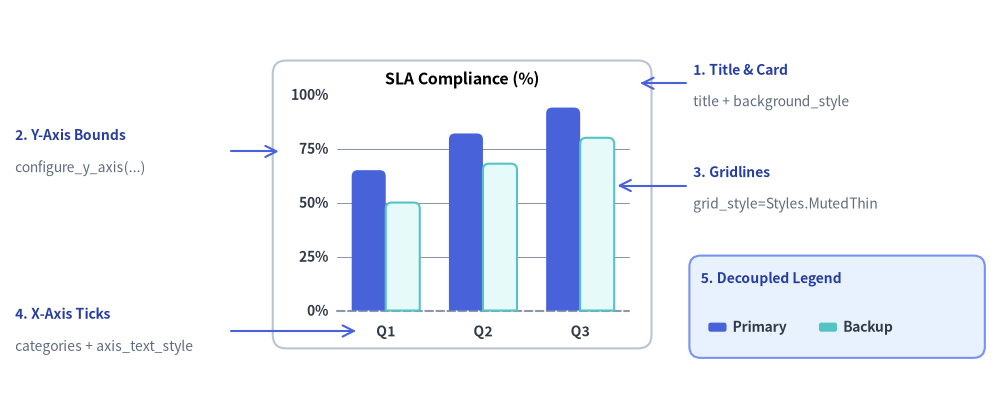
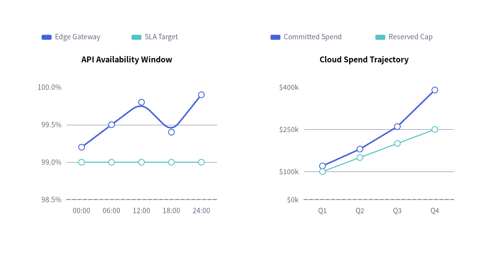
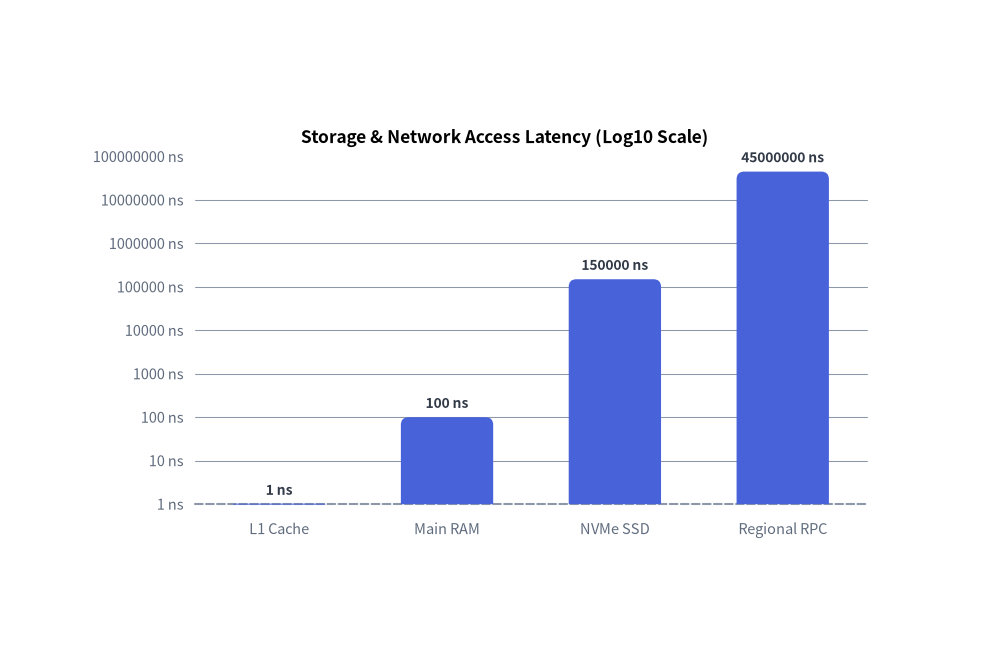
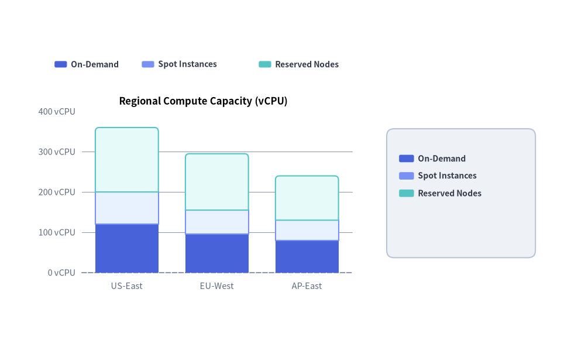

# Axes, Scales & Legends

All Cartesian charts (`BarChart`, `LineChart`, `AreaChart`, `ScatterChart`) and multi-series/slice charts (`PieChart`, `RadarChart`) share a unified foundation for **coordinate axis scaling**, **tick and unit formatting**, **decoupled legend placement**, and **bounding-box measurement**.

Every visual axis element follows Drawlib's presence-based styling model, giving you independent control over domain bounds, gridlines, tick formatters, and legend coordinates.


<figure class="drawlib-image" style="text-align: center;">
  
  <figcaption class="drawlib-caption">Anatomy of Drawlib Chart Axes, Gridlines, Tick Formatters, and Decoupled Legends</figcaption>
</figure>

<details class="drawlib-code-details">
<summary>Source Code</summary>

```python
from drawlib.canvas import save, setup
from drawlib.charts.bar import BarChart
from drawlib.lines import line
from drawlib.shapes import rectangle
from drawlib.styles import Colors, Styles
from drawlib.text import text

setup(width=132, height=54)

chart = BarChart(
    categories=["Q1", "Q2", "Q3"],
    axis_line_style=Styles.MutedDashed,
    axis_text_style=Styles.DarkBold.patch(text_size=10.0),
    grid_style=Styles.MutedThin,
    background_style=Styles.Neutral.patch(shape_r=1.8, shape_fill_color=Colors.White, shape_line_color=Colors.Gray4),
    width=50.0,
    height=38.0,
    title="SLA Compliance (%)",
    title_style=Styles.BlackBold.patch(text_size=11.5),
    bar_mode="group",
    bar_r=0.8,
)
chart.add_series("Primary", [65.0, 82.0, 94.0], style=Styles.PrimaryFlat)
chart.add_series("Backup", [50.0, 68.0, 80.0], style=Styles.SecondaryNeutral)
chart.configure_y_axis(min_value=0, max_value=100, tick_step=25, format="{:.0f}%")
chart.draw(xy=(36.0, 8.0))

callout_title = Styles.DarkBold.patch(text_size=10.0, halign="left", text_color=Colors.Primary5)
callout_sub = Styles.Muted.patch(text_size=10.0, halign="left")
arrow_style = Styles.Primary.patch(shape_line_width=1.2)

# 1. Title & Background Card (Top-Right Callout)
line((90.5, 43.0), (84.5, 43.0), arrow_head="->", style=arrow_style)
text((91.5, 44.8), "1. Title & Card", style=callout_title)
text((91.5, 40.5), "title + background_style", style=callout_sub)

# 2. Y-Axis Bounds & Format (Top-Left Callout)
line((30.5, 34.0), (36.8, 34.0), arrow_head="->", style=arrow_style)
text((2.0, 36.2), "2. Y-Axis Bounds", style=callout_title)
text((2.0, 31.8), "configure_y_axis(...)", style=callout_sub)

# 3. Horizontal Gridlines (Middle-Right Callout)
line((90.5, 29.5), (81.5, 29.5), arrow_head="->", style=arrow_style)
text((91.5, 31.3), "3. Gridlines", style=callout_title)
text((91.5, 27.0), "grid_style=Styles.MutedThin", style=callout_sub)

# 4. X-Axis Category Ticks (Bottom-Left Callout)
line((30.5, 10.3), (47.0, 10.3), arrow_head="->", style=arrow_style)
text((2.0, 12.6), "4. X-Axis Ticks", style=callout_title)
text((2.0, 8.2), "categories + axis_text_style", style=callout_sub)

# 5. Decoupled Legend (Bottom-Right Box & Callout)
rectangle((110.5, 13.5), width=39.0, height=13.5, style=Styles.PrimaryNeutral.patch(shape_r=1.5))
text((92.5, 17.2), "5. Decoupled Legend", style=callout_title)
chart.draw_legend(
    xy=(93.5, 10.8),
    text_style=Styles.DarkBold.patch(text_size=10.0),
    orientation="horizontal",
    swatch_size=(2.4, 1.2),
    item_gap=3.0,
)

save()
```

</details>


---

## 1. Custom Axis Bounds, Tick Steps & Value Formatting

Cartesian charts expose `chart.configure_x_axis(...)` and `chart.configure_y_axis(...)` (backed by the `Axis` model) to customize domain bounds (`min_value`, `max_value`), explicit ticks (`ticks` or `tick_step`), format strings or callables (`format`), unit suffixes (`unit`), and axis titles (`label`).


```python
from drawlib.canvas import save, setup
from drawlib.charts.line import LineChart
from drawlib.styles import Styles

setup(width=118, height=62)

# Left Chart: Explicit tick_step, format string, and unit suffix
sla_chart = LineChart(
    axis_line_style=Styles.MutedDashed,
    categories=["00:00", "06:00", "12:00", "18:00", "24:00"],
    axis_text_style=Styles.Muted.patch(text_size=10.0),
    grid_style=Styles.MutedThin,
    width=49.0,
    height=42.0,
    title="API Availability Window",
    title_style=Styles.BlackBold.patch(text_size=11.5),
    smooth=True,
    show_points=True,
)
sla_chart.add_series("Edge Gateway", [99.2, 99.5, 99.8, 99.4, 99.9], style=Styles.PrimaryFlat, line_width=2.2)
sla_chart.add_series("SLA Target", [99.0, 99.0, 99.0, 99.0, 99.0], style=Styles.SecondaryNeutral, line_style="dashed")

sla_chart.configure_y_axis(
    min_value=98.5,
    max_value=100.0,
    tick_step=0.5,
    format="{:.1f}%",
    label="Uptime (%)",
)
sla_chart.draw(xy=(6.0, 8.0))
sla_chart.draw_legend(xy=(10.0, 53.0), text_style=Styles.Muted.patch(text_size=10.0), orientation="horizontal")

# Right Chart: Custom callable formatter and explicit ticks list
cost_chart = LineChart(
    axis_line_style=Styles.MutedDashed,
    categories=["Q1", "Q2", "Q3", "Q4"],
    axis_text_style=Styles.Muted.patch(text_size=10.0),
    grid_style=Styles.MutedThin,
    width=49.0,
    height=42.0,
    title="Cloud Spend Trajectory",
    title_style=Styles.BlackBold.patch(text_size=11.5),
    show_points=True,
)
cost_chart.add_series("Committed Spend", [120, 180, 260, 390], style=Styles.PrimaryFlat, line_width=2.2)
cost_chart.add_series("Reserved Cap", [100, 150, 200, 250], style=Styles.SecondaryNeutral, line_style="dotted")

cost_chart.configure_y_axis(
    ticks=[0, 100, 250, 400],
    format=lambda v: f"${v:,.0f}k",
    label="Quarterly Cost (USD)",
)
cost_chart.draw(xy=(63.0, 8.0))
cost_chart.draw_legend(xy=(65.0, 53.0), text_style=Styles.Muted.patch(text_size=10.0), orientation="horizontal")
save()
```

<figure class="drawlib-image" style="text-align: center;">
  
  <figcaption class="drawlib-caption">Custom Axis Bounds, Tick Steps, Format Specifiers, and Units</figcaption>
</figure>


---

## 2. Linear ("Nice Numbers") vs. Logarithmic (`scale="log"`) Scaling

Each `Axis` supports two scaling engines via `scale`:
- **`scale="linear"` *(default)***: Uses the **Nice Numbers algorithm** to automatically select human-readable step intervals ($1, 2, 5 \times 10^k$) across the data range when `tick_step` and `ticks` are omitted.
- **`scale="log"`**: Maps positive values onto a base-10 logarithmic axis ($\log_{10}$). Bounds automatically snap to powers of 10 ($10^0, 10^1, 10^2, \dots$), and intermediate ticks ($1, 2, 5 \times 10^k$) are generated automatically when the span covers $\le 2$ orders of magnitude.


```python
from drawlib.canvas import save, setup
from drawlib.charts.bar import BarChart
from drawlib.styles import Styles

setup(width=105, height=68)

chart = BarChart(
    axis_line_style=Styles.MutedDashed,
    categories=["L1 Cache", "Main RAM", "NVMe SSD", "Regional RPC"],
    axis_text_style=Styles.Muted.patch(text_size=10.5),
    grid_style=Styles.MutedThin,
    value_text_style=Styles.DarkBold.patch(text_size=10.0),
    value_format="{:g} ns",
    width=82.0,
    height=46.0,
    title="Storage & Network Access Latency (Log10 Scale)",
    title_style=Styles.BlackBold.patch(text_size=12.5),
    bar_width_ratio=0.55,
    bar_r=0.8,
)
chart.add_series("Median Read Latency", [1.0, 100.0, 150000.0, 45000000.0], style=Styles.PrimaryFlat)

chart.configure_y_axis(
    scale="log",
    unit="ns",
    label="Access Time in Nanoseconds (log10)",
)
chart.draw(xy=(12.0, 10.0))
save()
```

<figure class="drawlib-image" style="text-align: center;">
  
  <figcaption class="drawlib-caption">Logarithmic Y-Axis Scale (scale='log') Across Storage Hierarchy Latencies</figcaption>
</figure>


---

## 3. Decoupled Legends (`draw_legend`) & Bounding Sizing (`get_size`)

Instead of hardcoding legends inside a rigid chart box, Drawlib decouples legend rendering via `chart.draw_legend(...)`. You can place horizontal or vertical legends anywhere on the canvas, customize `swatch_size` and `item_gap`, and query `chart.get_size() -> (width, height)` to align legends or surrounding cards relative to the chart's dimensions.


```python
from drawlib.canvas import save, setup
from drawlib.charts.bar import BarChart
from drawlib.shapes import rectangle
from drawlib.styles import Styles

setup(width=118, height=68)

chart = BarChart(
    categories=["US-East", "EU-West", "AP-East"],
    axis_line_style=Styles.MutedDashed,
    axis_text_style=Styles.Muted.patch(text_size=10.5),
    grid_style=Styles.MutedThin,
    width=66.0,
    height=42.0,
    title="Regional Compute Capacity (vCPU)",
    title_style=Styles.BlackBold.patch(text_size=12.0),
    bar_mode="stack",
    bar_r=0.8,
)
chart.add_series("On-Demand", [120, 95, 80], style=Styles.PrimaryFlat)
chart.add_series("Spot Instances", [80, 60, 50], style=Styles.PrimaryNeutral)
chart.add_series("Reserved Nodes", [160, 140, 110], style=Styles.SecondaryNeutral)
chart.configure_y_axis(unit="vCPU")

chart_x, chart_y = 8.0, 8.0
chart.draw(xy=(chart_x, chart_y))

# 1. Horizontal Legend placed above the chart plot area
chart.draw_legend(
    xy=(11.0, 55.0),
    orientation="horizontal",
    item_gap=3.5,
    swatch_size=(2.5, 1.3),
    text_style=Styles.DarkBold.patch(text_size=10.0),
)

# 2. Vertical Legend inside a Sidebar Card aligned via chart.get_size()
chart_w, chart_h = chart.get_size()
legend_card_cx = chart_x + chart_w + 19.0
rectangle(
    xy=(legend_card_cx, chart_y + chart_h / 2.0),
    width=30.0,
    height=26.0,
    style=Styles.Neutral.patch(shape_r=1.5),
)

chart.draw_legend(
    xy=(legend_card_cx - 12.5, chart_y + chart_h / 2.0 + 7.0),
    text_style=Styles.DarkBold.patch(text_size=10.0),
    orientation="vertical",
    swatch_size=(3.0, 1.5),
)
save()
```

<figure class="drawlib-image" style="text-align: center;">
  
  <figcaption class="drawlib-caption">Decoupled Horizontal and Vertical Legends with Custom Swatches and get_size() Alignment</figcaption>
</figure>


---

## 4. API Reference

### Axis Configuration (`configure_x_axis` / `configure_y_axis` & `Axis`)

Available on `BarChart`, `LineChart`, `AreaChart`, and `ScatterChart` (returns the underlying `Axis` instance):

```python
chart.configure_x_axis(
    scale: Literal["linear", "log"] | None = None,
    min_value: float | None = None,
    max_value: float | None = None,
    ticks: list[float] | None = None,
    tick_step: float | None = None,
    format: str | Callable[[float], str] | None = None,
    unit: str | None = None,
    label: str | None = None,
    show_grid: bool | None = None,
    grid_style: Style | None = None,
    show_axis_line: bool | None = None,
    line_style: Style | None = None,
    show_ticks: bool | None = None,
    tick_label_style: Style | None = None,
) -> Axis
```
*(Identical parameters are accepted by `chart.configure_y_axis(...)`. The underlying `Axis(...)` constructor and `axis.configure(...)` method also accept `label_style: Style | None = None`).*

| Parameter | Type | Default | Description |
| :--- | :--- | :--- | :--- |
| `scale` | `"linear"` \| `"log"` | `"linear"` | Coordinate scaling mode (linear Nice Numbers or base-10 logarithmic). |
| `min_value` / `max_value` | `float \| None` | `None` | Explicit minimum/maximum axis bounds. If `None`, derived from series data. |
| `ticks` | `list[float] \| None` | `None` | Explicit list of tick values (overrides automatic tick generation). |
| `tick_step` | `float \| None` | `None` | Explicit step interval between linear ticks. |
| `format` | `str \| Callable[[float], str] \| None` | `None` | Python format string (e.g. `"{:.1f}%"`, `"${:,.0f}"`) or callable `fn(val) -> str`. |
| `unit` | `str` | `""` | Unit suffix appended to formatted tick labels if not already present (e.g. `"ms"`, `"Gbps"`). |
| `label` | `str` | `""` | Axis title label rendered along the axis. |
| `show_grid` | `bool` | `True` | Whether to draw gridlines for this axis when `grid_style` is present. |
| `grid_style` | `Style \| None` | `None` | Per-axis gridline style override. |
| `show_axis_line` | `bool` | `True` | Whether to draw the axis baseline stroke. |
| `line_style` | `Style \| None` | `None` | Per-axis baseline stroke style override. |
| `show_ticks` | `bool` | `True` | Whether to draw tick labels along this axis. |
| `tick_label_style` | `Style \| None` | `None` | Per-axis tick label text style override. |
| `label_style` | `Style \| None` | `None` | Optional `Style` override on `Axis` for the axis title (`label`) typography (`axis.configure(label_style=...)` or `chart.y_axis.label_style = ...`). |

### Direct Axis Property Access & `Axis.format_value(val)`

In addition to `configure_x_axis()` and `configure_y_axis()`, you can inspect or mutate the underlying `Axis` objects directly via properties:

- **`chart.x_axis -> Axis`** and **`chart.y_axis -> Axis`**: Direct access to the horizontal and vertical `Axis` instances on `BarChart`, `LineChart`, `AreaChart`, and `ScatterChart`.
- **`bar_chart.value_axis -> Axis`**: Orientation-aware property on `BarChart` that returns `y_axis` when `orientation == "vertical"` and `x_axis` when `orientation == "horizontal"`.
- **`bar_chart.category_axis -> Axis`**: Orientation-aware property on `BarChart` that returns `x_axis` when `orientation == "vertical"` and `y_axis` when `orientation == "horizontal"`.
- **`axis.format_value(value: float) -> str`**: Formats any numeric value into a display string using the axis's configured `format` string/callable and `unit` suffix (automatically rounding near-integers when `format=None`).

```python
# Orientation-independent configuration on BarChart + custom label_style and format_value()
chart.value_axis.configure(min_value=0, max_value=100, unit="%", label="Utilization", label_style=Styles.DarkBold)
formatted = chart.value_axis.format_value(85.0)  # -> "85 %"
```

> **Radial Axis Configuration (`RadarChart`)**: `RadarChart` provides `chart.configure_axis(*, min_value=None, max_value=None, levels=None, scale_format=None) -> RadarChart` to configure concentric spoke rings.

### Decoupled Legend Rendering (`draw_legend`)

Available on `BarChart`, `LineChart`, `AreaChart`, `PieChart`, `RadarChart`, and `ScatterChart`:

```python
chart.draw_legend(
    xy: tuple[float, float],
    text_style: Style,
    orientation: Literal["vertical", "horizontal"] = "vertical",
    swatch_size: tuple[float, float] = (2.4, 1.2),
    item_gap: float = 4.0,
    *,
    scale: float = 1.0,
) -> None
```
- **Coordinate Anchor `xy`**: For `orientation="vertical"`, `xy` is the **top-left** starting point (items step downward). For `orientation="horizontal"`, `xy` is the **middle-left** starting point (items flow rightward separated by `item_gap`).
- **Per-Item Styling & Visibility**: Each `add_series(...)` or `add_slice(...)` call accepts `legend_text_style: Style | None = None` and `show: bool = True`. If an element has `show=False`, its legend entry is automatically hidden while preserving horizontal layout spacing.

### Layout Sizing (`get_size`)

Available on all 7 chart classes (`BarChart`, `LineChart`, `AreaChart`, `PieChart`, `RadarChart`, `ScatterChart`, `GanttChart`):

```python
width, height = chart.get_size()
```
Returns the unscaled `(width, height)` bounding box dimensions of the chart in canvas units.
