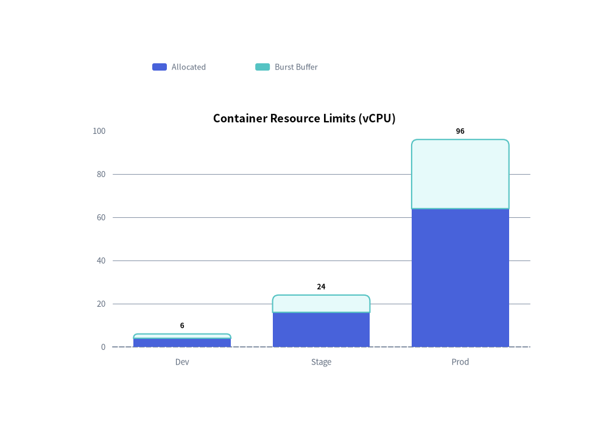

# Bar Chart

The `BarChart` component renders vertical or horizontal bar charts for comparing categorical metrics. 
It supports multi-series grouping, stacked bars, custom corner radii, value annotations, and decoupled legend rendering.

---

## 1. Quick Example: Stacked Resource Allocation


<figure class="drawlib-image" style="text-align: center;">
  
  <figcaption class="drawlib-caption">Stacked Resource Allocation with BarChart</figcaption>
</figure>


---

## 2. Modes and Orientations

- **`orientation`**:
  - `"vertical"` *(default)*: Columns grow upward from the bottom X-axis.
  - `"horizontal"`: Bars grow rightward from the left Y-axis.
- **`bar_mode`**:
  - `"group"` *(default)*: Side-by-side clustered bars for comparing distinct series across categories.
  - `"stack"`: Accumulates series vertically/horizontally to show part-to-whole proportions.
- **`bar_r`**: Corner rounding radius applied only to the outer tip corners of the bars (not the axis side or intermediate stacked boundaries).
- **`value_text_style`**: When provided (not `None`), numerical values are automatically printed directly on the bars.
- **`draw_legend`**: Decoupled legend rendering at any coordinate on the canvas.

---

## 3. Class API Reference

### Constructor
```python
BarChart(
    categories: list[str],
    axis_line_style: Style,
    axis_text_style: Style | None = None,
    grid_style: Style | None = None,
    value_text_style: Style | None = None,
    background_style: Style | None = None,
    title: str = "",
    title_style: Style | None = None,
    width: float = 60.0,
    height: float = 40.0,
    orientation: Literal["vertical", "horizontal"] = "vertical",
    bar_mode: Literal["group", "stack"] = "group",
    bar_width_ratio: float = 0.7,
    bar_r: float = 0.0,
)
```

### Adding Data & Rendering
- **`add_series(name: str, values: list[float], style: Style, legend_text_style: Style | None = None, *, show: bool = True, draw_ratio: float = 1.0, draw_direction: DrawDirection = "bottom_to_top") -> Series`**:  
  Registers a series and returns the mutable `Series` instance. `values` must align with the length of `categories`. Supports visibility toggling (`show`), partial rendering (`draw_ratio`), and growth direction (`"bottom_to_top"` or `"left_to_right"`).
- **`draw(xy=(0.0, 0.0), *, width: float | None = None, height: float | None = None, scale: float = 1.0)`**:  
  Renders the chart body anchored at bottom-left `xy`, with optional temporary dimension overrides (`width`, `height`) and proportional scaling (`scale`).
- **`draw_legend(xy, text_style, orientation="vertical", swatch_size=(2.4, 1.2), item_gap=4.0, *, scale: float = 1.0)`**:  
  Renders the series legend at coordinate `xy`.
