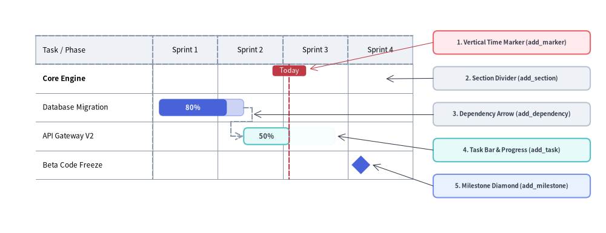
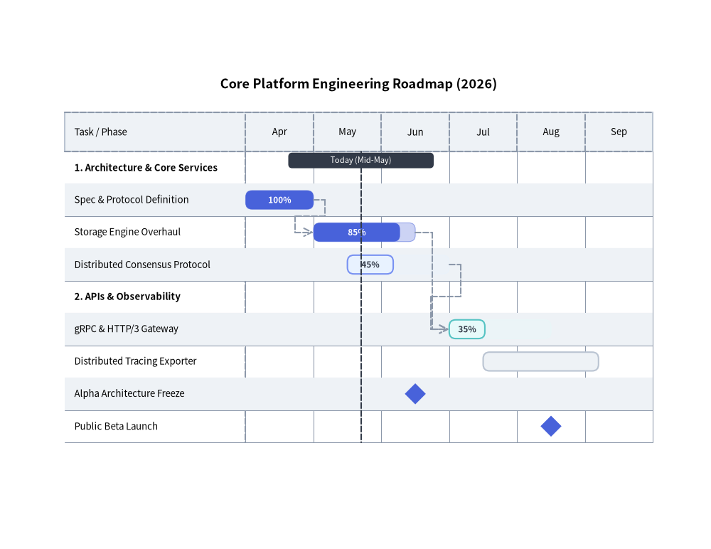
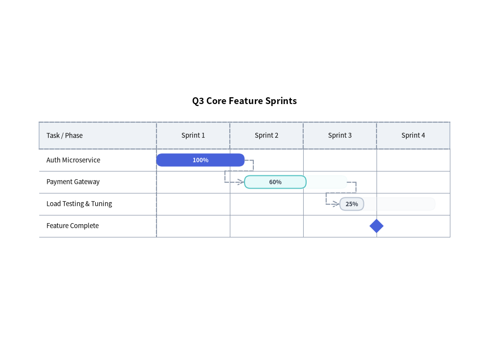

# GanttChart: Project Roadmaps, Milestones & Dependencies

`GanttChart` (`drawlib.charts.gantt`) provides declarative, vector-grade project roadmaps, sprint schedules, and milestone timelines. Timeline intervals are structured horizontally along the X-axis while section divider banners, task rows, and milestones stack sequentially downwards along the Y-axis.

---

## 1. Overview & Structural Hierarchy


<figure class="drawlib-image" style="text-align: center;">
  
  <figcaption class="drawlib-caption">Structural Anatomy of a Drawlib GanttChart</figcaption>
</figure>

<details class="drawlib-code-details">
<summary>Source Code</summary>

```python
from drawlib.canvas import save, setup
from drawlib.charts.gantt import GanttChart
from drawlib.lines import line
from drawlib.shapes import rectangle
from drawlib.styles import Styles

setup(width=135, height=52)

chart = GanttChart(
    columns=["Sprint 1", "Sprint 2", "Sprint 3", "Sprint 4"],
    axis_line_style=Styles.MutedDashed,
    axis_text_style=Styles.Black.patch(text_size=8.5),
    grid_style=Styles.MutedThin,
    header_style=Styles.Neutral,
    progress_text_style=Styles.WhiteBold.patch(text_size=8.0),
    width=88.0,
    label_width=26.0,
    header_height=6.4,
    row_height=6.4,
    bar_radius=0.9,
)

chart.add_section("Core Engine", text_style=Styles.BlackBold.patch(text_size=8.5))
t1 = chart.add_task("Database Migration", start=0.1, end=1.4, style=Styles.PrimaryFlat, progress=0.8)
t2 = chart.add_task(
    "API Gateway V2",
    start=1.4,
    end=2.8,
    style=Styles.SecondaryNeutral,
    progress=0.5,
    progress_text_style=Styles.DarkBold.patch(text_size=8.0),
)
chart.add_milestone("Beta Code Freeze", at=3.2, style=Styles.PrimaryFlat)
chart.add_dependency(t1, t2)
chart.add_marker(at=2.1, style=Styles.DangerDashed, label="Today")

chart.draw(xy=(6.0, 8.0))

# Compute exact row Y coordinates from chart.get_size()
_, chart_h = chart.get_size()
rows_top = 8.0 + chart_h - 2.0 - chart.header_height
row_cy = [rows_top - (i + 0.5) * chart.row_height for i in range(4)]

# Structural Callout Annotations on the Right
callouts = [
    (42.5, "1. Vertical Time Marker (add_marker)", Styles.DangerNeutral),
    (34.5, "2. Section Divider (add_section)", Styles.Neutral),
    (26.5, "3. Dependency Arrow (add_dependency)", Styles.Neutral),
    (18.5, "4. Task Bar & Progress (add_task)", Styles.SecondaryNeutral),
    (10.5, "5. Milestone Diamond (add_milestone)", Styles.PrimaryNeutral),
]
for cy, label_txt, box_style in callouts:
    rectangle(
        (114.0, cy),
        width=35.0,
        height=5.2,
        style=box_style.patch(shape_r=1.0),
        text=label_txt,
        text_style=Styles.DarkBold.patch(text_size=7.2),
    )

line((96.5, 42.5), (69.0, rows_top - 1.0), arrow_head="->", style=Styles.DangerThin)
line((96.5, 34.5), (86.0, row_cy[0]), arrow_head="->", style=Styles.DarkThin)
line((96.5, 26.5), (56.5, row_cy[1] - 1.5), arrow_head="->", style=Styles.DarkThin)
line((96.5, 18.5), (75.2, row_cy[2]), arrow_head="->", style=Styles.DarkThin)
line((96.5, 10.5), (83.0, row_cy[3]), arrow_head="->", style=Styles.DarkThin)

save()
```

</details>


- **Section Dividers (`add_section`)**: Full-width banner rows that categorize tasks into functional phases or teams.
- **Task Bars (`add_task`)**: Scheduled duration bars supporting completion ratios (`progress` in `0.0`–`1.0`) where the completed portion is filled at full opacity and the remaining span is tinted at reduced alpha.
- **Milestones (`add_milestone`)**: Zero-duration diamond (`rhombus`) markers anchored at a specific column or numeric time index.
- **Vertical Time Markers (`add_marker`)**: Full-height vertical reference lines with top badge labels (e.g., `"Today"`).
- **Dependency Connectors (`add_dependency`)**: Orthogonal routed arrows linking a predecessor task's end to a successor task's start.
- **Dependency Visibility Cascading (`show`)**: Hiding a `Task` (`task.show = False` or `task.draw_ratio = 0.0`) preserves its row slot in the schedule and **automatically hides any `Dependency` arrows** where `from_task` or `to_task` is that task.

---

## 2. Engineering Release Roadmap with Dependencies

The following example demonstrates sections, tasks with completion progress indicators, milestones, orthogonal dependency routing, and a vertical `"Today"` marker:


```python
from drawlib.canvas import save, setup
from drawlib.charts.gantt import GanttChart
from drawlib.styles import Styles

setup(width=110, height=85)

chart = GanttChart(
    columns=["Apr", "May", "Jun", "Jul", "Aug", "Sep"],
    axis_line_style=Styles.MutedDashed,
    axis_text_style=Styles.Black.patch(text_size=9.5),
    grid_style=Styles.MutedThin,
    header_style=Styles.Neutral,
    zebra_style=Styles.NeutralFlat,
    progress_text_style=Styles.WhiteBold.patch(text_size=8.5),
    width=95.0,
    label_width=28.0,
    title="Core Platform Engineering Roadmap (2026)",
    title_style=Styles.BlackBold.patch(text_size=13.0),
    header_height=6.0,
    row_height=5.0,
    bar_radius=1.0,
)

# 1. Core Services Section
chart.add_section("1. Architecture & Core Services", text_style=Styles.BlackBold.patch(text_size=9.5))
t1 = chart.add_task("Spec & Protocol Definition", start="Apr", end=1.0, style=Styles.PrimaryFlat, progress=1.0)
t2 = chart.add_task("Storage Engine Overhaul", start=1.0, end=2.5, style=Styles.PrimaryFlat, progress=0.85)
t3 = chart.add_task(
    "Distributed Consensus Protocol",
    start=1.5,
    end=3.0,
    style=Styles.PrimaryNeutral,
    progress=0.45,
    progress_text_style=Styles.DarkBold.patch(text_size=8.5),
)

# 2. APIs & Observability Section
chart.add_section("2. APIs & Observability", text_style=Styles.BlackBold.patch(text_size=9.5))
t4 = chart.add_task(
    "gRPC & HTTP/3 Gateway",
    start=3.0,
    end=4.5,
    style=Styles.SecondaryNeutral,
    progress=0.35,
    progress_text_style=Styles.DarkBold.patch(text_size=8.5),
)
t5 = chart.add_task("Distributed Tracing Exporter", start=3.5, end=5.2, style=Styles.Neutral, progress=0.0)

# 3. Milestones, Dependencies & Today Marker
chart.add_milestone("Alpha Architecture Freeze", at="Jun", style=Styles.PrimaryFlat)
chart.add_milestone("Public Beta Launch", at=4.5, style=Styles.PrimaryFlat)

chart.add_dependency(t1, t2)
chart.add_dependency(t2, t4)
chart.add_dependency(t3, t4)
chart.add_marker(at=1.7, style=Styles.DarkDashed, label="Today (Mid-May)")

chart.draw(xy=(8.0, 10.0))
save()
```

<figure class="drawlib-image" style="text-align: center;">
  
  <figcaption class="drawlib-caption">Engineering Release Roadmap with Dependencies</figcaption>
</figure>


---

## 3. Time Coordinate Indexing & Agile Sprint Schedule

In `GanttChart`, time coordinates (`start`, `end`, `at`) can be specified either as:
1. **Column Name String**: Matches an exact string in `columns` (`start="Apr"` resolves to the left edge of the `"Apr"` column, `end="Apr"` resolves to the right edge of `"Apr"`, and `at="Jun"` resolves to the midpoint of `"Jun"`).
2. **Floating-Point Offset**: `0.0` is the left edge of column `0`, `1.0` is the boundary between column `0` and column `1`, `1.5` is the midpoint of column `1`, etc.


```python
from drawlib.canvas import save, setup
from drawlib.charts.gantt import GanttChart
from drawlib.styles import Styles

setup(width=100, height=70)

chart = GanttChart(
    columns=["Sprint 1", "Sprint 2", "Sprint 3", "Sprint 4"],
    axis_line_style=Styles.MutedDashed,
    axis_text_style=Styles.Black.patch(text_size=9.5),
    grid_style=Styles.MutedThin,
    header_style=Styles.Neutral,
    progress_text_style=Styles.WhiteBold.patch(text_size=8.5),
    width=88.0,
    label_width=24.0,
    title="Q3 Core Feature Sprints",
    title_style=Styles.BlackBold.patch(text_size=13.0),
    bar_radius=1.2,
)

s1 = chart.add_task("Auth Microservice", start=0.0, end=1.2, style=Styles.PrimaryFlat, progress=1.0)
s2 = chart.add_task(
    "Payment Gateway",
    start=1.2,
    end=2.6,
    style=Styles.SecondaryNeutral,
    progress=0.6,
    progress_text_style=Styles.DarkBold.patch(text_size=8.5),
)
s3 = chart.add_task(
    "Load Testing & Tuning",
    start=2.5,
    end=3.8,
    style=Styles.Neutral,
    progress=0.25,
    progress_text_style=Styles.DarkBold.patch(text_size=8.5),
)

chart.add_dependency(s1, s2)
chart.add_dependency(s2, s3)
chart.add_milestone("Feature Complete", at=3.0, style=Styles.PrimaryFlat)

chart.draw(xy=(6.0, 15.0))
save()
```

<figure class="drawlib-image" style="text-align: center;">
  
  <figcaption class="drawlib-caption">Agile Sprint Schedule with Per-Task Progress Styling</figcaption>
</figure>


---

## 4. API Reference

### Constructor (`GanttChart`)

All constructor arguments are **keyword-only** (`*`):

```python
from drawlib.charts.gantt import Dependency, DrawDirection, GanttChart, Marker, Milestone, Section, Task

chart = GanttChart(
    *,
    columns: list[str],
    axis_line_style: Style,
    axis_text_style: Style | None = None,
    header_style: Style | None = None,
    grid_style: Style | None = None,
    zebra_style: Style | None = None,
    progress_text_style: Style | None = None,
    background_style: Style | None = None,
    title: str = "",
    title_style: Style | None = None,
    width: float = 90.0,
    height: float | None = None,
    row_height: float = 4.5,
    header_height: float = 5.5,
    label_width: float = 24.0,
    bar_radius: float = 0.8,
)
```

| Parameter | Type | Default | Description |
| :--- | :--- | :--- | :--- |
| **`columns`** | `list[str]` | **Required** | Ordered timeline interval names along the top header band (**at least 1 required**). |
| **`axis_line_style`** | `Style` | **Required** | Mandatory style anchor for header borders and column divider ticks. |
| `axis_text_style` | `Style \| None` | `None` | Style for column header titles and left-column row labels. If `None`, labels are omitted. |
| `header_style` | `Style \| None` | `None` | Style for the top timeline header band background card. If `None`, header fill is omitted. |
| `grid_style` | `Style \| None` | `None` | Style for vertical timeline column separator lines across rows. If `None`, gridlines are omitted. |
| `zebra_style` | `Style \| None` | `None` | Style for alternating horizontal row background stripes. If `None`, zebra striping is omitted. |
| `progress_text_style` | `Style \| None` | `None` | Default style for completion percentage labels (`"85%"`) on tasks with `progress > 0`. |
| `background_style` | `Style \| None` | `None` | Style for the outer chart background card. If `None`, card is omitted. |
| `title` | `str` | `""` | Chart title text rendered at the top of the container. |
| `title_style` | `Style \| None` | `None` | Typography style for `title`. Required for the title to render. |
| `width` | `float` | `90.0` | Total bounding box width of the chart in canvas units. |
| `height` | `float \| None` | `None` | Total bounding box height. If `None` *(default)*, auto-sized dynamically from `header_height + len(items) * row_height` (minimum `20.0`). |
| `row_height` | `float` | `4.5` | Vertical height allocated per task, section, or milestone row. |
| `header_height` | `float` | `5.5` | Height of the top column header band. |
| `label_width` | `float` | `24.0` | Horizontal width reserved for the left task/milestone name column. |
| `bar_radius` | `float` | `0.8` | Corner rounding radius for task bars (when `task.style.shape_r` is `None`). |

### Methods & Properties

- **`add_section(name: str, style: Style | None = None, text_style: Style | None = None, *, show: bool = True) -> Section`**:
  Appends a category section divider row and returns the mutable `Section` instance (`style` overrides the banner rectangle fill/border; `text_style` overrides `chart.axis_text_style` for the section title).
- **`add_task(name: str, start: str | float, end: str | float, style: Style, progress: float = 0.0, progress_text_style: Style | None = None, *, show: bool = True, draw_ratio: float = 1.0, draw_direction: DrawDirection = "left_to_right") -> Task`**:
  Appends a scheduled task bar row and returns the mutable `Task` instance.
  - `progress`: Completion ratio clamped to `[0.0, 1.0]`. When `progress > 0`, the full scheduled span is drawn as a translucent tint (`alpha=0.28`) of `style`'s fill color while the completed portion (`progress * width`) is drawn with the solid `style`.
  - `progress_text_style`: Per-task override for the percentage label typography (falls back to `chart.progress_text_style`).
  - `draw_ratio` & `draw_direction`: Partial spatial rendering (`"left_to_right"` extends the bar horizontally from `start` toward `end`; `"bottom_to_top"` grows the bar vertically from its bottom edge).
- **`add_milestone(name: str, at: str | float, style: Style, *, show: bool = True) -> Milestone`**:
  Appends a milestone row with a diamond marker anchored at time `at` and returns the mutable `Milestone` instance.
- **`add_marker(at: str | float, style: Style, label: str = "", label_style: Style | None = None, *, show: bool = True) -> Marker`**:
  Adds a full-height vertical reference line at time `at` with an optional top pill badge (`label` + `label_style`) and returns the mutable `Marker` instance.
- **`add_dependency(from_task: Task, to_task: Task, style: Style | None = None, *, show: bool = True) -> Dependency`**:
  Adds an orthogonal dependency arrow from `from_task` to `to_task` (falling back to `chart.axis_line_style` when `style=None`) and returns the mutable `Dependency` instance. Automatically hidden if `from_task.show`, `to_task.show`, or `dep.show` is `False` (or if either task's `draw_ratio <= 0.0`).
- **`get_size() -> tuple[float, float]`**:
  Returns `(width, height)`, computing `height` dynamically from the registered row count when `chart.height is None`.
- **`draw(xy: tuple[float, float] = (0.0, 0.0), *, width: float | None = None, height: float | None = None, scale: float = 1.0) -> None`**:
  Renders the Gantt chart anchored at bottom-left `xy`, with optional temporary size overrides and uniform `scale`.
- **Properties**:
  - **`chart.columns -> list[str]`**: Copy of timeline column labels.
  - **`chart.items -> list[Task | Section | Milestone]`**: Copy of registered schedule rows in top-to-bottom order.
  - **`chart.markers -> list[Marker]`**: Copy of registered vertical markers.
  - **`chart.dependencies -> list[Dependency]`**: Copy of registered dependency connectors.

