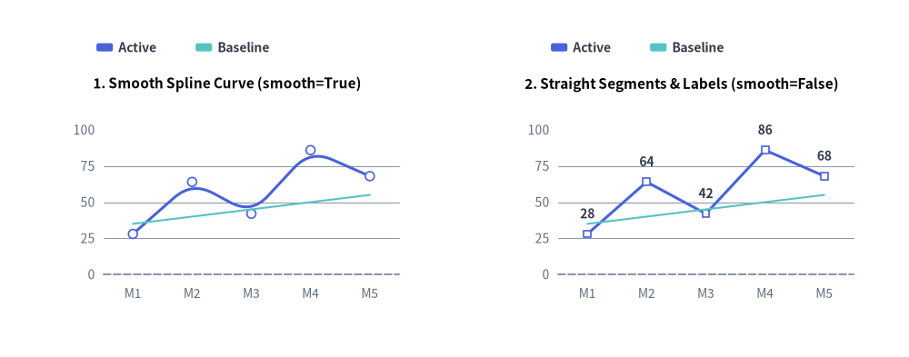
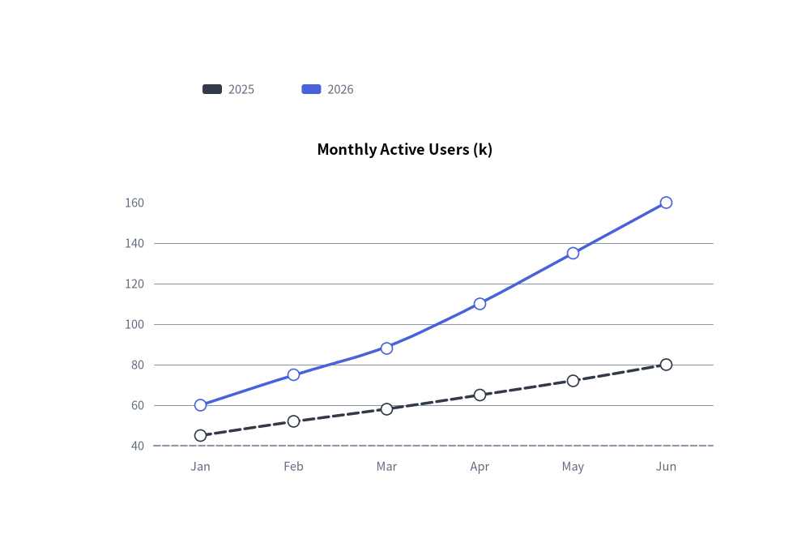
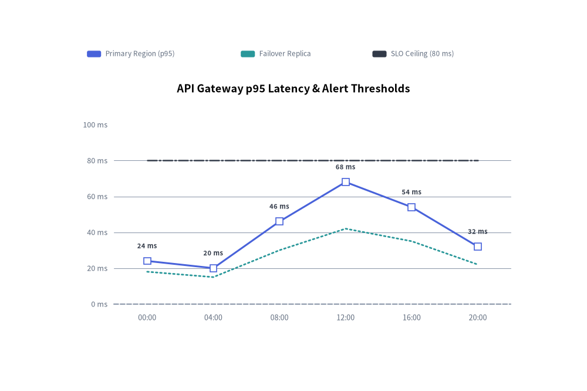

# LineChart: Continuous Trends, Markers & Splines

The `LineChart` component (`drawlib.charts.line`) visualizes numerical trends over ordered categories or time intervals. It supports straight polygonal segments (`smooth=False`), smoothed spline curves (`smooth=True`), per-series vertex marker shapes (`"circle"`, `"square"`, `"none"`), configurable stroke patterns (`"solid"`, `"dashed"`, `"dotted"`, `"dashdot"`), inline vertex value labels, and decoupled legend rendering.

---

## 1. Overview & Key Modes


<figure class="drawlib-image" style="text-align: center;">
  
  <figcaption class="drawlib-caption">LineChart Modes: Smooth Cubic Spline Interpolation (smooth=True) vs. Straight Polygonal Segments (smooth=False)</figcaption>
</figure>

<details class="drawlib-code-details">
<summary>Source Code</summary>

```python
from drawlib.canvas import save, setup
from drawlib.charts.line import LineChart
from drawlib.styles import Styles

setup(width=132, height=52)

categories = ["M1", "M2", "M3", "M4", "M5"]
active_vals = [28.0, 64.0, 42.0, 86.0, 68.0]
baseline_vals = [35.0, 40.0, 45.0, 50.0, 55.0]

# Left: Smooth Spline Curve (smooth=True)
smooth_chart = LineChart(
    axis_line_style=Styles.MutedDashed,
    categories=categories,
    axis_text_style=Styles.Muted.patch(text_size=10.0),
    grid_style=Styles.MutedThin,
    width=56.0,
    height=36.0,
    smooth=True,
    show_points=True,
    point_size=0.65,
    title="1. Smooth Spline Curve (smooth=True)",
    title_style=Styles.BlackBold.patch(text_size=11.0),
)
smooth_chart.add_series("Active", active_vals, style=Styles.PrimaryFlat, line_width=2.2)
smooth_chart.add_series("Baseline", baseline_vals, style=Styles.SecondaryNeutral, line_style="dashed", point_shape="none")
smooth_chart.configure_y_axis(min_value=0.0, max_value=100.0, tick_step=25.0)
smooth_chart.draw(xy=(5.0, 6.0))
smooth_chart.draw_legend(xy=(14.0, 45.0), text_style=Styles.DarkBold.patch(text_size=10.0), orientation="horizontal")

# Right: Straight Segments & Value Labels (smooth=False)
straight_chart = LineChart(
    axis_line_style=Styles.MutedDashed,
    categories=categories,
    axis_text_style=Styles.Muted.patch(text_size=10.0),
    grid_style=Styles.MutedThin,
    value_text_style=Styles.DarkBold.patch(text_size=10.0),
    width=56.0,
    height=36.0,
    smooth=False,
    show_points=True,
    point_shape="square",
    point_size=0.65,
    title="2. Straight Segments & Labels (smooth=False)",
    title_style=Styles.BlackBold.patch(text_size=11.0),
)
straight_chart.add_series("Active", active_vals, style=Styles.PrimaryFlat, line_width=2.2)
straight_chart.add_series("Baseline", baseline_vals, style=Styles.SecondaryNeutral, line_style="dashed", point_shape="none")
straight_chart.configure_y_axis(min_value=0.0, max_value=100.0, tick_step=25.0)
straight_chart.draw(xy=(71.0, 6.0))
straight_chart.draw_legend(xy=(80.0, 45.0), text_style=Styles.DarkBold.patch(text_size=10.0), orientation="horizontal")

save()
```

</details>


- **Straight vs. Smooth Curves (`smooth`)**:
  - `smooth=False` *(default)*: Connects category vertices with crisp, straight polygonal line segments.
  - `smooth=True`: Renders organic, rounded curves through data vertices (when 3 or more points are present).
- **Vertex Markers & Per-Series Overrides (`show_points`, `point_shape`, `point_size`)**:
  - Chart-level `point_shape` (`"circle"`, `"square"`, `"none"`) and `point_size` (`0.7` default) apply to all series unless overridden in `add_series(..., point_shape=..., point_size=...)`.
  - Setting `point_shape="none"` on a specific series suppresses both its vertex markers and its `value_text_style` labels—ideal for flat target or threshold reference lines.
- **Stroke Patterns (`line_style`)**: Supports `"solid"`, `"dashed"`, `"dotted"`, and `"dashdot"`.
- **Vertex Value Annotations (`value_text_style`)**: When provided (not `None`), formats each vertex value using `y_axis.format_value(v)` and renders it directly above the marker.

---

## 2. Quick Example: Smooth Spline User Growth Trends


```python
from drawlib.canvas import save, setup
from drawlib.charts.line import LineChart
from drawlib.styles import Styles

setup(width=100, height=68)

chart = LineChart(
    axis_line_style=Styles.MutedDashed,
    categories=["Jan", "Feb", "Mar", "Apr", "May", "Jun"],
    axis_text_style=Styles.Muted.patch(text_size=10.5),
    grid_style=Styles.MutedThin,
    width=82,
    height=45,
    title="Monthly Active Users (k)",
    title_style=Styles.BlackBold.patch(text_size=13.0),
    smooth=True,
    show_points=True,
)
chart.add_series("2025", [45, 52, 58, 65, 72, 80], style=Styles.DarkFlat, line_width=2.5, line_style="dashed")
chart.add_series("2026", [60, 75, 88, 110, 135, 160], style=Styles.PrimaryFlat, line_width=2.5)

chart.draw(xy=(9, 7))
chart.draw_legend(xy=(25, 57), text_style=Styles.Muted.patch(text_size=10.5), orientation="horizontal")
save()
```

<figure class="drawlib-image" style="text-align: center;">
  
  <figcaption class="drawlib-caption">User Growth Trends with LineChart</figcaption>
</figure>


---

## 3. Straight Segments, Custom Markers, Stroke Styles & Vertex Labels

By combining `smooth=False` (straight segments) with `value_text_style`, per-series `point_shape` (`"square"`, `"circle"`, `"none"`), and distinct `line_style` patterns (`"solid"`, `"dotted"`, `"dashdot"`), you can plot telemetry metrics alongside SLA thresholds:


```python
from drawlib.canvas import save, setup
from drawlib.charts.line import LineChart
from drawlib.styles import Styles

setup(width=110, height=70)

chart = LineChart(
    axis_line_style=Styles.MutedDashed,
    categories=["00:00", "04:00", "08:00", "12:00", "16:00", "20:00"],
    width=88.0,
    height=48.0,
    title="API Gateway p95 Latency & Alert Thresholds",
    title_style=Styles.BlackBold.patch(text_size=13.0),
    smooth=False,
    show_points=True,
    axis_text_style=Styles.Muted.patch(text_size=10.5),
    grid_style=Styles.MutedThin,
    value_text_style=Styles.DarkBold.patch(text_size=10.0),
)
chart.add_series(
    "Primary Region (p95)",
    [24.0, 20.0, 46.0, 68.0, 54.0, 32.0],
    style=Styles.PrimaryFlat,
    line_width=2.2,
    point_shape="square",
    point_size=0.8,
)
chart.add_series(
    "Failover Replica",
    [18.0, 15.0, 30.0, 42.0, 35.0, 22.0],
    style=Styles.SecondaryFlat,
    line_width=2.0,
    line_style="dotted",
    point_shape="none",
)
chart.add_series(
    "SLO Ceiling (80 ms)",
    [80.0, 80.0, 80.0, 80.0, 80.0, 80.0],
    style=Styles.DarkFlat,
    line_width=1.8,
    line_style="dashdot",
    point_shape="none",
)

chart.configure_y_axis(min_value=0.0, max_value=100.0, tick_step=20.0, format="{:.0f}", unit="ms")
chart.draw(xy=(11.0, 8.0))
chart.draw_legend(
    xy=(13.0, 60.5),
    text_style=Styles.Muted.patch(text_size=10.0),
    orientation="horizontal",
    swatch_width=2.6,
    swatch_height=1.2,
    item_gap=4.0,
)
save()
```

<figure class="drawlib-image" style="text-align: center;">
  
  <figcaption class="drawlib-caption">Straight Line Segments with Square Vertex Markers, Value Labels, and Dashdot/Dotted Thresholds</figcaption>
</figure>


---

## 4. API Reference

### Constructor (`LineChart`)

All constructor arguments are **keyword-only** (`*`):

```python
from drawlib.charts.line import Axis, DrawDirection, FormatterType, LineChart, LineStyle, PointShape, Series

chart = LineChart(
    *,
    axis_line_style: Style,
    categories: list[str],
    width: float = 80.0,
    height: float = 50.0,
    show_points: bool = True,
    point_shape: PointShape = "circle",
    point_size: float = 0.7,
    smooth: bool = False,
    axis_text_style: Style | None = None,
    grid_style: Style | None = None,
    value_text_style: Style | None = None,
    background_style: Style | None = None,
    title: str = "",
    title_style: Style | None = None,
)
```

| Parameter | Type | Default | Description |
| :--- | :--- | :--- | :--- |
| **`axis_line_style`** | `Style` | **Required** | Mandatory style anchor for the coordinate baseline stroke. |
| **`categories`** | `list[str]` | **Required** | Ordered category labels along the horizontal X-axis. |
| `width` / `height` | `float` | `80.0` / `50.0` | Total bounding box dimensions of the chart in canvas units. |
| `show_points` | `bool` | `True` | Whether to render markers at vertex coordinates. |
| `point_shape` | `"circle"` \| `"square"` \| `"none"` | `"circle"` | Default vertex marker shape (`PointShape`). |
| `point_size` | `float` | `0.7` | Default marker radius (or half-width for squares) in canvas units. |
| `smooth` | `bool` | `False` | When `True`, interpolates smooth curved segments through vertices. |
| `axis_text_style` | `Style \| None` | `None` | Style for Y-axis tick labels and X-axis category names. If `None`, labels are omitted. |
| `grid_style` | `Style \| None` | `None` | Style for horizontal Y-axis gridlines. If `None`, gridlines are omitted. |
| `value_text_style` | `Style \| None` | `None` | Style for numeric labels drawn above vertex markers. If `None`, value labels are omitted. |
| `background_style` | `Style \| None` | `None` | Style for the outer chart background card. If `None`, card is omitted. |
| `title` | `str` | `""` | Chart title text rendered at the top of the container. |
| `title_style` | `Style \| None` | `None` | Typography style for `title`. Required for the title to render. |

### Methods & Properties

- **`add_series(name: str, values: list[float], style: Style, line_width: float = 2.0, line_style: LineStyle = "solid", point_shape: PointShape | None = None, point_size: float | None = None, legend_text_style: Style | None = None, *, show: bool = True, draw_ratio: float = 1.0, draw_direction: DrawDirection = "left_to_right") -> Series`**:
  Registers a line series and returns the mutable `Series` instance. `line_style` accepts `"solid"`, `"dashed"`, `"dotted"`, or `"dashdot"`. `point_shape` and `point_size` override chart-level defaults for that series.
- **`configure_y_axis(...) -> Axis`** / **`configure_x_axis(...) -> Axis`**:
  Configures the vertical value axis (`scale`, `min_value`, `max_value`, `ticks`, `tick_step`, `format`, `unit`, `label`) or horizontal category axis (`show_axis_line`, `line_style`, `tick_label_style`). See **[Axes, Scales & Legends](./axes_and_legends.md)**.
- **`get_size() -> tuple[float, float]`**:
  Returns `(width, height)` of the chart container.
- **`draw(xy: tuple[float, float] = (0.0, 0.0), *, width: float | None = None, height: float | None = None, scale: float = 1.0) -> None`**:
  Renders the chart anchored at bottom-left `xy`, with optional temporary size overrides and proportional `scale`.
- **`draw_legend(xy: tuple[float, float], text_style: Style, orientation: Literal["vertical", "horizontal"] = "vertical", swatch_width: float = 2.4, swatch_height: float = 1.2, item_gap: float = 4.0, *, scale: float = 1.0) -> None`**:
  Renders the decoupled series legend at `xy`.
- **Properties**:
  - **`chart.series -> list[Series]`**: Returns a copy of registered `Series` objects.
  - **`chart.x_axis -> Axis`** / **`chart.y_axis -> Axis`**: Direct access to the horizontal and vertical `Axis` instances.

