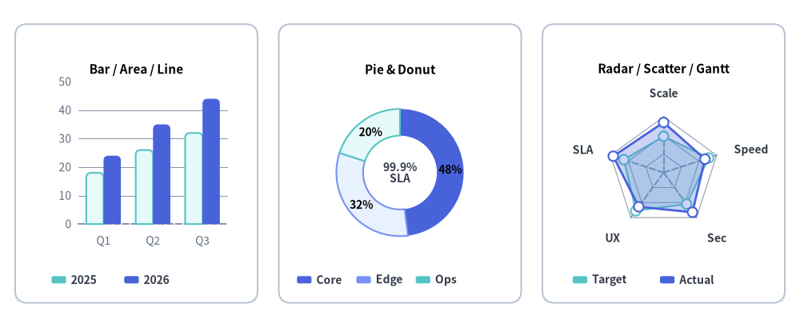
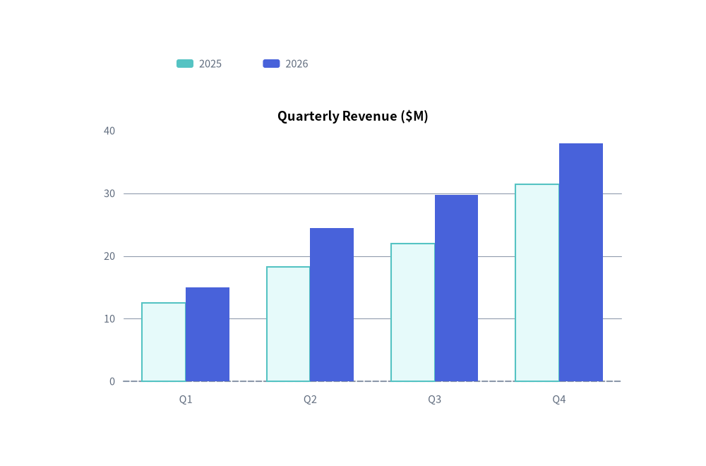
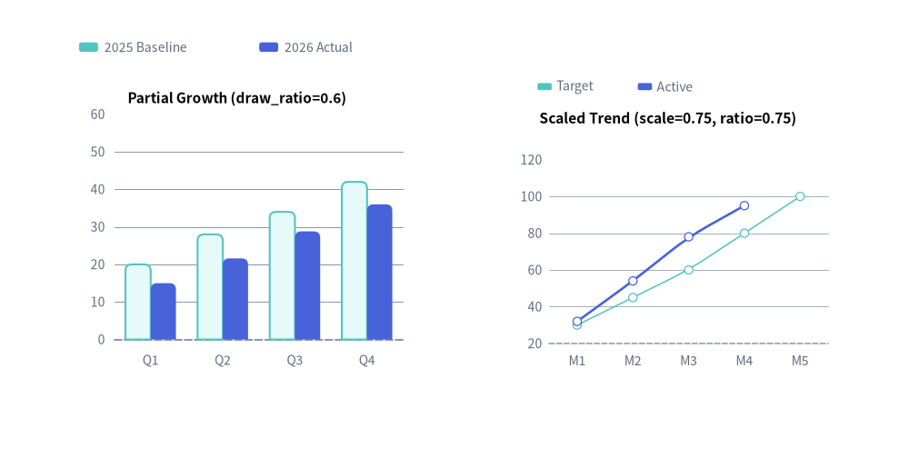

# Charts Overview

The `drawlib.charts` module provides a declarative, pure-Python data visualization engine for comparative, statistical, relational, and project schedule charts.

All seven chart families render as first-class vector canvas components that coexist on a unified coordinate plane alongside callouts, cards, and technical diagrams.


<figure class="drawlib-image" style="text-align: center;">
  
  <figcaption class="drawlib-caption">Drawlib Pure-Python Chart Ecosystem: Coexisting Bar, Line, Donut Pie, and Radar Charts on One Canvas</figcaption>
</figure>

<details class="drawlib-code-details">
<summary>Source Code</summary>

```python
from drawlib.canvas import save, setup
from drawlib.charts.bar import BarChart
from drawlib.charts.pie import PieChart
from drawlib.charts.radar import RadarChart
from drawlib.shapes import rectangle
from drawlib.styles import Colors, Styles

setup(width=132, height=54)

card_style = Styles.Neutral.patch(shape_r=2.0, shape_line_color=Colors.Gray4, shape_fill_color=Colors.White)
rectangle((22.5, 27.0), width=40.0, height=46.0, style=card_style)
rectangle((66.0, 27.0), width=40.0, height=46.0, style=card_style)
rectangle((109.5, 27.0), width=40.0, height=46.0, style=card_style)

# 1. Left: Compact BarChart (Bar / Area / Line Cartesian family)
bar = BarChart(
    categories=["Q1", "Q2", "Q3"],
    axis_line_style=Styles.MutedDashed,
    axis_text_style=Styles.Muted.patch(text_size=10.0),
    grid_style=Styles.MutedThin,
    width=36.0,
    height=33.0,
    bar_mode="group",
    bar_r=0.8,
    title="Bar / Area / Line",
    title_style=Styles.BlackBold.patch(text_size=11.0),
)
bar.add_series("2025", [18.0, 26.0, 32.0], style=Styles.SecondaryNeutral)
bar.add_series("2026", [24.0, 35.0, 44.0], style=Styles.PrimaryFlat)
bar.draw(xy=(4.5, 12.0))
bar.draw_legend(xy=(8.5, 7.8), text_style=Styles.DarkBold.patch(text_size=10.0), orientation="horizontal")

# 2. Center: Compact PieChart Donut
pie = PieChart(
    radius=10.5,
    width=36.0,
    height=33.0,
    hole_ratio=0.58,
    center_text="99.9%\nSLA",
    center_text_style=Styles.DarkBold.patch(text_size=10.0),
    title="Pie & Donut",
    title_style=Styles.BlackBold.patch(text_size=11.0),
    value_text_style=Styles.BlackBold.patch(text_size=10.0),
    value_format="{:.0f}%",
)
pie.add_slice("Core", 48.0, style=Styles.PrimaryFlat)
pie.add_slice("Edge", 32.0, style=Styles.PrimaryNeutral)
pie.add_slice("Ops", 20.0, style=Styles.SecondaryNeutral)
pie.draw(xy=(48.0, 12.0))
pie.draw_legend(xy=(49.0, 7.8), text_style=Styles.DarkBold.patch(text_size=10.0), orientation="horizontal", item_gap=1.8)

# 3. Right: Compact RadarChart (5 spokes)
radar = RadarChart(
    categories=["Scale", "Speed", "Sec", "UX", "SLA"],
    axis_line_style=Styles.MutedDashed,
    axis_text_style=Styles.DarkBold.patch(text_size=10.0),
    grid_style=Styles.MutedThin,
    radius=9.2,
    width=36.0,
    height=33.0,
    min_value=0.0,
    max_value=100.0,
    levels=3,
    grid_shape="polygon",
    title="Radar / Scatter / Gantt",
    title_style=Styles.BlackBold.patch(text_size=11.0),
)
radar.add_series("Target", [65, 85, 70, 85, 75], style=Styles.SecondaryNeutral, fill_alpha=0.25, line_style="dashed")
radar.add_series("Actual", [90, 78, 88, 76, 95], style=Styles.PrimaryFlat, fill_alpha=0.28)
radar.draw(xy=(91.5, 12.0))
radar.draw_legend(xy=(94.5, 7.8), text_style=Styles.DarkBold.patch(text_size=10.0), orientation="horizontal")

save()
```

</details>


---

## 1. Why Pure-Python Charts in Drawlib?

Unlike traditional Python visualization libraries (such as Matplotlib, Seaborn, or Plotly) that generate isolated image files or web-only canvases, Drawlib charts are **first-class vector canvas elements**:

- **Seamless Canvas Coexistence**: Charts can share the same canvas with architecture schemas, callout bubbles, and icons.
- **Deterministic Layouts**: All margins, tick spaces, and plot boxes are mathematically computed from explicit canvas dimensions (`width`, `height`).
- **Consistent Visual Theming & Style Presence**: Charts follow the "style-as-presence" philosophy. If an element has a style, it is drawn; if omitted (`None`), no fallback element or unwanted default grid/background is rendered. Legends are decoupled and rendered explicitly via `chart.draw_legend(...)`.


```python
from drawlib.canvas import save, setup
from drawlib.charts.bar import BarChart
from drawlib.styles import Styles

setup(width=100, height=66)

chart = BarChart(
    categories=["Q1", "Q2", "Q3", "Q4"],
    axis_line_style=Styles.MutedDashed,
    axis_text_style=Styles.Muted.patch(text_size=10.5),
    grid_style=Styles.MutedThin,
    width=82,
    height=45,
    title="Quarterly Revenue ($M)",
    title_style=Styles.BlackBold.patch(text_size=13.0),
)
chart.add_series("2025", [12.5, 18.2, 22.0, 31.4], style=Styles.SecondaryNeutral)
chart.add_series("2026", [15.0, 24.5, 29.8, 38.0], style=Styles.PrimaryFlat)

chart.draw(xy=(9, 7))
chart.draw_legend(xy=(25, 57), text_style=Styles.Muted.patch(text_size=10.5), orientation="horizontal")
save()
```

<figure class="drawlib-image" style="text-align: center;">
  
  <figcaption class="drawlib-caption">Declarative Multi-Series Bar Chart</figcaption>
</figure>


---

## 2. The Seven Chart Families & Submodule Exports

Drawlib organizes charts into seven specialized submodules under `drawlib.charts`, built on a shared foundation for **[Axes, Scales & Legends](./axes_and_legends.md)**:

| Module | Primary Class | Companion Data Models | Exported Type Literals & Aliases | Best Suited For |
| :--- | :--- | :--- | :--- | :--- |
| `drawlib.charts.bar` | **[`BarChart`](./bar.md)** | `Series`, `Axis` | `Mode`, `Orientation`, `FormatterType`, `DrawDirection`, `LegendPosition` | Categorical comparisons (vertical, horizontal, grouped, stacked). |
| `drawlib.charts.line` | **[`LineChart`](./line.md)** | `Series`, `Axis` | `LineStyle`, `PointShape`, `FormatterType`, `DrawDirection`, `LegendPosition` | Continuous metrics and trends over time (linear or spline smoothed). |
| `drawlib.charts.area` | **[`AreaChart`](./area.md)** | `Series`, `Axis` | `Mode`, `FormatterType`, `DrawDirection`, `LegendPosition` | Cumulative volume and part-to-whole trends over time. |
| `drawlib.charts.pie` | **[`PieChart`](./pie.md)** | `Slice` | `FormatterType`, `DrawDirection` | Proportional distributions, donut charts, and center KPI badges. |
| `drawlib.charts.radar` | **[`RadarChart`](./radar.md)** | `Series` | `GridShape`, `FormatterType`, `DrawDirection`, `LegendPosition` | Multi-attribute evaluation, skill matrices, and spiderweb plots. |
| `drawlib.charts.scatter` | **[`ScatterChart`](./scatter.md)** | `Series`, `Point`, `Axis` | `ScaleType`, `PointShape`, `DrawDirection`, `LegendPosition` | 2D correlations, cluster distributions, and 3D bubble plots. |
| `drawlib.charts.gantt` | **[`GanttChart`](./gantt.md)** | `Task`, `Section`, `Milestone`, `Marker`, `Dependency` | `DrawDirection` | Project roadmaps, phase tasks, milestones, and dependency arrows. |

### Exported Type Literals Reference

| Type Alias | Definition | Used By |
| :--- | :--- | :--- |
| **`Mode`** (`bar`) | `Literal["group", "stack"]` | `BarChart(bar_mode=...)` |
| **`Mode`** (`area`) | `Literal["overlap", "stack"]` | `AreaChart(mode=...)` |
| **`Orientation`** | `Literal["vertical", "horizontal"]` | `BarChart(orientation=...)`, `draw_legend(orientation=...)` |
| **`LineStyle`** | `Literal["solid", "dashed", "dotted", "dashdot"]` | `LineChart`, `AreaChart`, `RadarChart` series stroke patterns |
| **`PointShape`** | `Literal["circle", "square", "rhombus", "triangle", "none"]` | `ScatterChart` (all 5 shapes); `LineChart`, `AreaChart`, `RadarChart` (`"circle"`, `"square"`, `"none"`) |
| **`GridShape`** | `Literal["polygon", "circle"]` | `RadarChart(grid_shape=...)` concentric ring geometry |
| **`ScaleType`** | `Literal["linear", "log"]` | `Axis(scale=...)` linear Nice Numbers or $\log_{10}$ scaling |
| **`FormatterType`** | `str \| Callable[[float], str] \| None` | Value/tick formatting (`"{:.1f}%"`, `lambda v: f"${v:,.0f}"`) |
| **`DrawDirection`** | `Literal["bottom_to_top", "left_to_right"]` | Partial spatial rendering direction on `Series`, `Slice`, and `Task` (also exported at `drawlib.charts.DrawDirection`) |

---

## 3. Universal Chart Architecture & Presence-Based Styling

Every chart in Drawlib follows a consistent lifecycle and coordinate contract (see **[Axes, Scales & Legends](./axes_and_legends.md)** for full details on axis formatting, logarithmic scaling, legend customization, and `get_size()`):

### 1. Dimension Instantiation & Mandatory Anchor
Specify category labels and a mandatory `axis_line_style` (the structural anchor for Cartesian, Radar, and Gantt charts) during initialization:
```python
chart = BarChart(
    categories=["US", "EU", "APAC"],
    axis_line_style=Styles.Primary,
    axis_text_style=Styles.Black,
    grid_style=Styles.MutedThin,
    width=90,
    height=50,
    title="Regional Distribution",
    title_style=Styles.BlackBold,
)
```

### 2. Presence-Based Styling Summary (`Style | None = None`)
Drawlib charts enforce a strict **"Style-as-Presence"** rule: optional visual elements default to `None` and are only rendered when an explicit `Style` is provided:

| Optional Style Keyword | Default | Visual Elements Toggled When Provided (`Style`) | Applicable Chart Classes |
| :--- | :--- | :--- | :--- |
| **`axis_text_style`** | `None` | Axis tick labels, category names, spoke labels (`RadarChart`), and column/row labels (`GanttChart`). | `BarChart`, `LineChart`, `AreaChart`, `RadarChart`, `ScatterChart`, `GanttChart` |
| **`grid_style`** | `None` | Background value gridlines, concentric rings (`RadarChart`), or vertical column dividers (`GanttChart`). | `BarChart`, `LineChart`, `AreaChart`, `RadarChart`, `ScatterChart`, `GanttChart` |
| **`value_text_style`** | `None` | Inline numerical labels on bars, line/radar vertices, pie wedges, or scatter point callouts. | `BarChart`, `LineChart`, `AreaChart`, `PieChart`, `RadarChart`, `ScatterChart` |
| **`title_style`** | `None` | Top chart title text (requires non-empty `title` string). | All 7 chart classes |
| **`background_style`** | `None` | Outer chart container card background fill and border stroke. | All 7 chart classes |
| **`scale_text_style`** | `None` | Numeric ring scale labels along the vertical spoke of a radar web. | `RadarChart` |
| **`center_text_style`** | `None` | Center KPI badge text inside a donut hole (requires `hole_ratio > 0` and `center_text`). | `PieChart` |
| **`header_style`** | `None` | Background card fill/border for the top timeline column header band. | `GanttChart` |
| **`zebra_style`** | `None` | Alternating horizontal row background stripes across schedule rows. | `GanttChart` |
| **`progress_text_style`**| `None` | Completion percentage text (`"85%"`) inside or next to task bars. | `GanttChart` (chart-level or per-task) |

### 3. Adding Data Series & Configuring Axes
Add data series directly with explicit styles, and optionally configure axis bounds, ticks, units, or logarithmic scales via `configure_x_axis()` / `configure_y_axis()`:
```python
chart.add_series("Allocated", [120, 180, 240], style=Styles.PrimaryFlat)
chart.add_series("Available", [90, 150, 210], style=Styles.SecondaryFlat)
chart.configure_y_axis(min_value=0, max_value=300, tick_step=100, unit="TB")
```

### 4. Rendering via Bottom-Left Anchor & Decoupled Legend
All charts are anchored by their **bottom-left corner** via `draw(xy=(x, y))`. Legends are rendered independently wherever desired via `draw_legend(xy=(x, y), text_style=...)`:
```python
chart.draw(xy=(15, 10))
chart.draw_legend(xy=(85, 50), text_style=Styles.Black)
```

---

## 4. Component Lifecycle, Partial Rendering & Spatial Scaling

All Drawlib charts follow the unified 4-phase component lifecycle (**1. Instantiate -> 2. Register Elements -> 3. Mutate State -> 4. Render**), making it effortless to create step-by-step slide builds, progressive data reveals, and multi-chart dashboards:

### 1. Element Visibility (`show`) & Stable Axis Bounds
Every element registration method (`add_series`, `add_slice`, `add`, `add_task`, `add_section`, `add_milestone`, `add_marker`, `add_dependency`) accepts `show: bool = True` and returns the mutable element instance (`Series`, `Slice`, `Point`, `Task`, etc.).
- Toggling `elem.show = False` (or `draw_ratio = 0.0`) hides that element during rendering while **preserving the full 100% dataset's automatic axis scale, pie total proportion, and Gantt row layout**. Axes never jump when series are revealed sequentially across slides or animation frames.

### 2. Partial Spatial Rendering (`draw_ratio` & `draw_direction`)
`Series`, `Slice`, and `Task` objects support `draw_ratio: float = 1.0` (`0.0` to `1.0`) and `draw_direction: DrawDirection` (`"bottom_to_top"` or `"left_to_right"`):

| Chart Class | Default `draw_direction` | `"bottom_to_top"` Behavior | `"left_to_right"` Behavior |
| :--- | :--- | :--- | :--- |
| **`BarChart`** | `"bottom_to_top"` (`"vertical"`) / `"left_to_right"` (`"horizontal"`) | Vertical: all bars grow upward from baseline. Horizontal: bars reveal sequentially from bottom category to top. | Vertical: bars reveal sequentially across categories left-to-right. Horizontal: all bars grow rightward from baseline. |
| **`LineChart`** | `"left_to_right"` | All vertices rise simultaneously from the baseline toward target `y`. | Curve extends continuously from left to right along arc length. |
| **`AreaChart`** | `"left_to_right"` | Area polygon and top contour rise from the baseline / lower stack. | Area polygon and top contour sweep continuously from left to right. |
| **`ScatterChart`** | `"left_to_right"` | Points rise from the bottom axis toward target `y` (`radius * r`). | Points reveal left-to-right across the X-axis range. |
| **`PieChart`** | `"left_to_right"` | Wedge grows radially outward from inner hole to outer radius. | Wedge sweeps angularly from `start_angle` across `sweep_angle * r`. |
| **`RadarChart`** | `"bottom_to_top"` | Polygon expands radially outward from center `min_value`. | Polygon sweeps spoke-by-spoke around the perimeter. |
| **`GanttChart`** | `"left_to_right"` | Task bar grows vertically from its bottom edge to full height. | Task bar extends horizontally from `start` toward `end`. |

### 3. Spatial Overrides & Proportional Scaling (`scale`)
Every `draw()` call accepts optional temporary layout overrides (`width`, `height`, and `radius` on `PieChart`/`RadarChart`) as well as `scale: float = 1.0` (also supported on `draw_legend()`). Passing `scale != 1.0` scales the entire chart—including plot geometry, stroke widths, point markers, and font sizes—proportionally from `xy`:


```python
from drawlib.canvas import save, setup
from drawlib.charts.bar import BarChart
from drawlib.charts.line import LineChart
from drawlib.styles import Styles

setup(width=115, height=58)

# Left: BarChart with partial series rendering (draw_ratio)
bar = BarChart(
    categories=["Q1", "Q2", "Q3", "Q4"],
    axis_line_style=Styles.MutedDashed,
    axis_text_style=Styles.Muted.patch(text_size=10.0),
    grid_style=Styles.MutedThin,
    width=48,
    height=38,
    title="Partial Growth (draw_ratio=0.6)",
    title_style=Styles.BlackBold.patch(text_size=11.0),
    bar_r=0.8,
)
bar.add_series("2025 Baseline", [20, 28, 34, 42], style=Styles.SecondaryNeutral, draw_ratio=1.0)
bar.add_series("2026 Actual", [25, 36, 48, 60], style=Styles.PrimaryFlat, draw_ratio=0.6)
bar.draw(xy=(6, 10))
bar.draw_legend(xy=(10, 52), text_style=Styles.Muted.patch(text_size=10.0), orientation="horizontal")

# Right: LineChart rendered at compact 0.75x proportional scale
line = LineChart(
    categories=["M1", "M2", "M3", "M4", "M5"],
    axis_line_style=Styles.MutedDashed,
    axis_text_style=Styles.Muted.patch(text_size=13.5),
    grid_style=Styles.MutedThin,
    width=60,
    height=46,
    title="Scaled Trend (scale=0.75, ratio=0.75)",
    title_style=Styles.BlackBold.patch(text_size=15.0),
    smooth=True,
)
line.add_series("Target", [30, 45, 60, 80, 100], style=Styles.SecondaryNeutral, line_style="dashed")
line.add_series("Active", [32, 54, 78, 95, 120], style=Styles.PrimaryFlat, line_width=2.5, draw_ratio=0.75)
line.draw(xy=(62, 10), scale=0.75)
line.draw_legend(xy=(68, 47), text_style=Styles.Muted.patch(text_size=13.5), orientation="horizontal", scale=0.75)
save()
```

<figure class="drawlib-image" style="text-align: center;">
  
  <figcaption class="drawlib-caption">Partial Spatial Rendering (draw_ratio) and Proportional Scaling (scale)</figcaption>
</figure>


