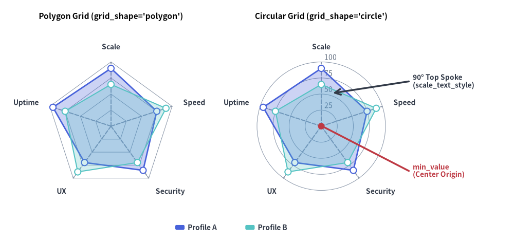
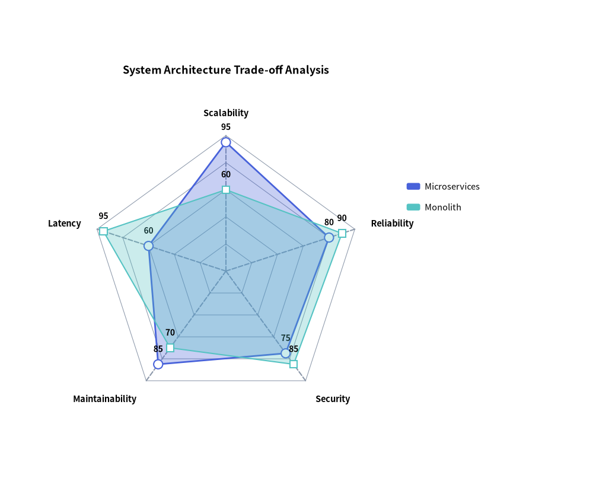
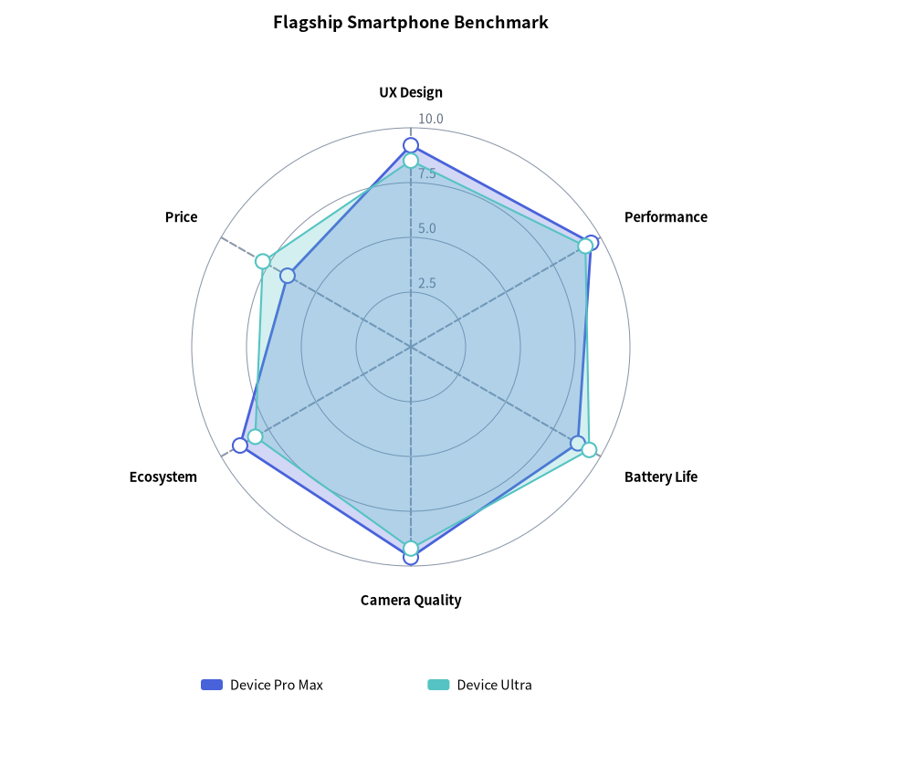

# RadarChart: Multivariate Radial Metrics & Spider Webs

`RadarChart` (`drawlib.charts.radar`, also known as a spider web or star chart) evaluates multivariate entities across three or more symmetric radial dimensions emanating from a common center origin point. It is widely used for skill matrices, competitive benchmark profiles, and system architectural trade-off evaluations.

---

## 1. Overview & Radial Geometry


<figure class="drawlib-image" style="text-align: center;">
  
  <figcaption class="drawlib-caption">RadarChart Radial Geometry: Polygon vs. Circular Contours</figcaption>
</figure>

<details class="drawlib-code-details">
<summary>Source Code</summary>

```python
from drawlib.canvas import save, setup
from drawlib.charts.radar import RadarChart
from drawlib.lines import line
from drawlib.shapes import circle
from drawlib.styles import Styles
from drawlib.text import text

setup(width=132, height=62)

dims = ["Scale", "Speed", "Security", "UX", "Uptime"]
vals_a = [90, 75, 85, 70, 95]
vals_b = [65, 90, 70, 88, 75]

# Left: Polygon Grid
poly_radar = RadarChart(
    categories=dims,
    axis_line_style=Styles.MutedDashed,
    axis_text_style=Styles.DarkBold.patch(text_size=10.0),
    grid_style=Styles.MutedThin,
    radius=16.5,
    min_value=0.0,
    max_value=100.0,
    levels=4,
    grid_shape="polygon",
    title="Polygon Grid (grid_shape='polygon')",
    title_style=Styles.BlackBold.patch(text_size=11.0),
)
poly_radar.add_series("Profile A", vals_a, style=Styles.PrimaryFlat, fill_alpha=0.28)
poly_radar.add_series("Profile B", vals_b, style=Styles.SecondaryNeutral, fill_alpha=0.25, line_style="dashed")
poly_radar.draw(xy=(4.0, 5.0))

# Right: Circular Grid with Scale Labels
circ_radar = RadarChart(
    categories=dims,
    axis_line_style=Styles.MutedDashed,
    axis_text_style=Styles.DarkBold.patch(text_size=10.0),
    grid_style=Styles.MutedThin,
    scale_text_style=Styles.Muted.patch(text_size=10.0),
    scale_format="{:.0f}",
    radius=16.5,
    min_value=0.0,
    max_value=100.0,
    levels=4,
    grid_shape="circle",
    title="Circular Grid (grid_shape='circle')",
    title_style=Styles.BlackBold.patch(text_size=11.0),
)
circ_radar.add_series("Profile A", vals_a, style=Styles.PrimaryFlat, fill_alpha=0.28)
circ_radar.add_series("Profile B", vals_b, style=Styles.SecondaryNeutral, fill_alpha=0.25, line_style="dashed")
circ_radar.draw(xy=(58.0, 5.0))

# Callout annotations on Right RadarChart using exact center coordinates
rw, rh = circ_radar.get_size()
rcx = 58.0 + rw / 2.0
rcy = 5.0 + (rh - 6.0) / 2.0

circle((rcx, rcy), radius=0.85, style=Styles.DangerFlat)
line((rcx + 0.8, rcy - 0.3), (105.0, 18.0), style=Styles.DangerBold)
text((106.0, 18.0), "min_value\n(Center Origin)", style=Styles.DangerBold.patch(text_size=10.0, halign="left"))

line((rcx + 3.0, rcy + 8.5), (105.0, 41.0), arrow_head="<-", style=Styles.DarkBold)
text((106.0, 41.0), "90° Top Spoke\n(scale_text_style)", style=Styles.DarkBold.patch(text_size=10.0, halign="left"))

circ_radar.draw_legend(xy=(45.0, 3.5), text_style=Styles.DarkBold.patch(text_size=10.0), orientation="horizontal")
save()
```

</details>


- **Minimum 3 Categories Required (`len(categories) >= 3`)**: A closed radial polygon mathematically requires at least 3 spokes; passing fewer than 3 categories raises a `ValueError`.
- **Symmetric Spoke Rays**: Each category forms a radial ray extending from `min_value` at the center to `max_value` at the outer perimeter (anchored by `axis_line_style`).
- **Concentric Grid Contours**: Rendered when `grid_style` is provided, supporting `grid_shape="polygon"` (straight web segments) or `grid_shape="circle"` (concentric rings) across `levels` rings.
- **Scale & Vertex Labels**: Provide `scale_text_style` (and `scale_format`) to label concentric ring values along the vertical spoke, and `value_text_style` (and `value_format`) to label series vertices.
- **Semi-Transparent Series Polygons**: Multiple series overlay cleanly using `fill_alpha` (default `0.25`), `line_style` (`"solid"`, `"dashed"`, `"dotted"`, `"dashdot"`), and vertex markers (`point_shape="circle" | "square" | "none"`).

---

## 2. Polygonal Grid Architecture Benchmark

Polygonal gridlines (`grid_shape="polygon"`) align with radial spokes, making it easy to compare architectural trade-offs across non-functional requirements:


```python
from drawlib.canvas import save, setup
from drawlib.charts.radar import RadarChart
from drawlib.styles import Styles

setup(width=105, height=88)

chart = RadarChart(
    categories=["Scalability", "Reliability", "Security", "Maintainability", "Latency"],
    axis_line_style=Styles.MutedDashed,
    axis_text_style=Styles.BlackBold.patch(text_size=10.5),
    grid_style=Styles.MutedThin,
    value_text_style=Styles.BlackBold.patch(text_size=10.0),
    radius=24.0,
    min_value=0.0,
    max_value=100.0,
    levels=5,
    grid_shape="polygon",
    title="System Architecture Trade-off Analysis",
    title_style=Styles.BlackBold.patch(text_size=13.0),
    value_format="{:.0f}",
)
chart.add_series("Microservices", [95, 80, 75, 85, 60], style=Styles.PrimaryFlat, fill_alpha=0.3)
chart.add_series(
    "Monolith",
    [60, 90, 85, 70, 95],
    style=Styles.SecondaryNeutral,
    fill_alpha=0.3,
    line_style="dashed",
    point_shape="square",
)

chart.draw(xy=(8.0, 8.0))
chart.draw_legend(xy=(72.0, 55.0), text_style=Styles.Black.patch(text_size=10.5))
save()
```

<figure class="drawlib-image" style="text-align: center;">
  
  <figcaption class="drawlib-caption">System Architecture Non-Functional Analysis</figcaption>
</figure>


---

## 3. Circular Grid Product Benchmark

Using `grid_shape="circle"` with `scale_text_style` and `configure_axis(...)` renders smooth concentric rings with numeric scale labels:


```python
from drawlib.canvas import save, setup
from drawlib.charts.radar import RadarChart
from drawlib.styles import Styles

setup(width=100, height=85)

chart = RadarChart(
    categories=["UX Design", "Performance", "Battery Life", "Camera Quality", "Ecosystem", "Price"],
    axis_line_style=Styles.MutedDashed,
    axis_text_style=Styles.BlackBold.patch(text_size=10.5),
    grid_style=Styles.MutedThin,
    scale_text_style=Styles.Muted.patch(text_size=10.0),
    radius=24.0,
    levels=4,
    grid_shape="circle",
    title="Flagship Smartphone Benchmark",
    title_style=Styles.BlackBold.patch(text_size=13.0),
)
chart.configure_axis(min_value=0.0, max_value=10.0, levels=4, scale_format="{:.1f}")
chart.add_series("Device Pro Max", [9.2, 9.5, 8.8, 9.6, 9.0, 6.5], style=Styles.PrimaryFlat)
chart.add_series("Device Ultra", [8.5, 9.2, 9.4, 9.2, 8.2, 7.8], style=Styles.SecondaryNeutral, line_style="dashed")

chart.draw(xy=(13.0, 15.0))
chart.draw_legend(xy=(22.0, 10.0), text_style=Styles.Black.patch(text_size=10.5), orientation="horizontal")
save()
```

<figure class="drawlib-image" style="text-align: center;">
  
  <figcaption class="drawlib-caption">Device Feature Matrix with Circular Contours</figcaption>
</figure>


---

## 4. API Reference

### Constructor (`RadarChart`)

All constructor arguments are **keyword-only** (`*`):

```python
from drawlib.charts.radar import DrawDirection, FormatterType, GridShape, RadarChart, Series

chart = RadarChart(
    *,
    categories: list[str],
    axis_line_style: Style,
    radius: float = 25.0,
    min_value: float = 0.0,
    max_value: float | None = None,
    levels: int = 5,
    grid_shape: GridShape = "polygon",
    axis_text_style: Style | None = None,
    grid_style: Style | None = None,
    scale_text_style: Style | None = None,
    scale_format: FormatterType = None,
    value_text_style: Style | None = None,
    value_format: FormatterType = None,
    background_style: Style | None = None,
    title: str = "",
    title_style: Style | None = None,
    width: float | None = None,
    height: float | None = None,
)
```

| Parameter | Type | Default | Description |
| :--- | :--- | :--- | :--- |
| **`categories`** | `list[str]` | **Required** | Radial dimension names around the perimeter (**minimum 3 required**; raises `ValueError` if `< 3`). |
| **`axis_line_style`** | `Style` | **Required** | Mandatory style anchor for radial spoke lines. |
| `radius` | `float` | `25.0` | Outer radius of the radar web in canvas units. |
| `min_value` | `float` | `0.0` | Baseline data value at the central origin point. |
| `max_value` | `float \| None` | `None` | Outer boundary scale value. If `None`, computed automatically from series values. |
| `levels` | `int` | `5` | Number of concentric grid rings (minimum `1`). |
| `grid_shape` | `"polygon"` \| `"circle"` | `"polygon"` | Concentric grid contour geometry (`GridShape`). |
| `axis_text_style` | `Style \| None` | `None` | Style for outer perimeter category labels. If `None`, category labels are omitted. |
| `grid_style` | `Style \| None` | `None` | Style for concentric grid rings. If `None`, grid rings are omitted. |
| `scale_text_style` | `Style \| None` | `None` | Style for numeric scale labels along the top spoke. If `None`, scale labels are omitted. |
| `scale_format` | `FormatterType` | `None` | Format string or `Callable[[float], str]` for concentric ring scale labels. |
| `value_text_style` | `Style \| None` | `None` | Style for numeric labels drawn next to series vertices. If `None`, vertex values are omitted. |
| `value_format` | `FormatterType` | `None` | Format string or `Callable[[float], str]` for series vertex values. |
| `background_style` | `Style \| None` | `None` | Style for the outer chart background card. If `None`, card is omitted. |
| `title` | `str` | `""` | Chart title text rendered at the top of the container. |
| `title_style` | `Style \| None` | `None` | Typography style for `title`. Required for the title to render. |
| `width` / `height` | `float \| None` | `None` | Explicit container dimensions. If `None`, computed automatically from `radius` and `title`. |

### Methods & Properties

- **`configure_axis(*, min_value: float | None = None, max_value: float | None = None, levels: int | None = None, scale_format: FormatterType = None) -> RadarChart`**:
  Updates radial scale bounds, concentric contour count, and scale label formatting in place (returns `self` for method chaining).
- **`add_series(name: str, values: list[float], style: Style, fill_alpha: float = 0.25, line_width: float = 2.0, line_style: LineStyle = "solid", point_shape: PointShape = "circle", point_size: float = 0.8, legend_text_style: Style | None = None, *, show: bool = True, draw_ratio: float = 1.0, draw_direction: DrawDirection = "bottom_to_top") -> Series`**:
  Registers a closed radar polygon series and returns the mutable `Series` instance.
  - `fill_alpha`: Transparency of the polygon fill (`0.0` to `1.0`; defaults to `0.25`).
  - `line_width` / `line_style`: Perimeter stroke width (`2.0`) and pattern (`"solid"`, `"dashed"`, `"dotted"`, `"dashdot"`).
  - `point_shape` / `point_size`: Vertex marker shape (`"circle"`, `"square"`, `"none"`) and radius (`0.8`).
  - `draw_ratio` & `draw_direction`: Partial spatial rendering (`"bottom_to_top"` expands all vertices radially outward from the center; `"left_to_right"` sweeps spoke-by-spoke around the perimeter).
- **`get_size() -> tuple[float, float]`**:
  Returns the computed `(width, height)` bounding box of the chart container.
- **`draw(xy: tuple[float, float] = (0.0, 0.0), *, radius: float | None = None, width: float | None = None, height: float | None = None, scale: float = 1.0) -> None`**:
  Renders the chart anchored at bottom-left `xy`, with optional temporary `radius`/`width`/`height` overrides and uniform `scale`.
- **`draw_legend(xy: tuple[float, float], text_style: Style, orientation: Literal["vertical", "horizontal"] = "vertical", swatch_size: tuple[float, float] = (2.4, 1.2), item_gap: float = 4.0, *, scale: float = 1.0) -> None`**:
  Renders the decoupled series legend at `xy`.
- **Properties**:
  - **`chart.categories -> list[str]`**: Returns a copy of the radial dimension names.
  - **`chart.series -> list[Series]`**: Returns a copy of registered `Series` objects.

