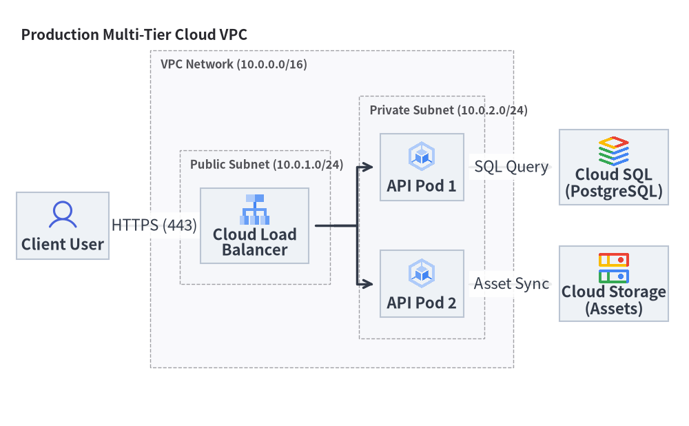
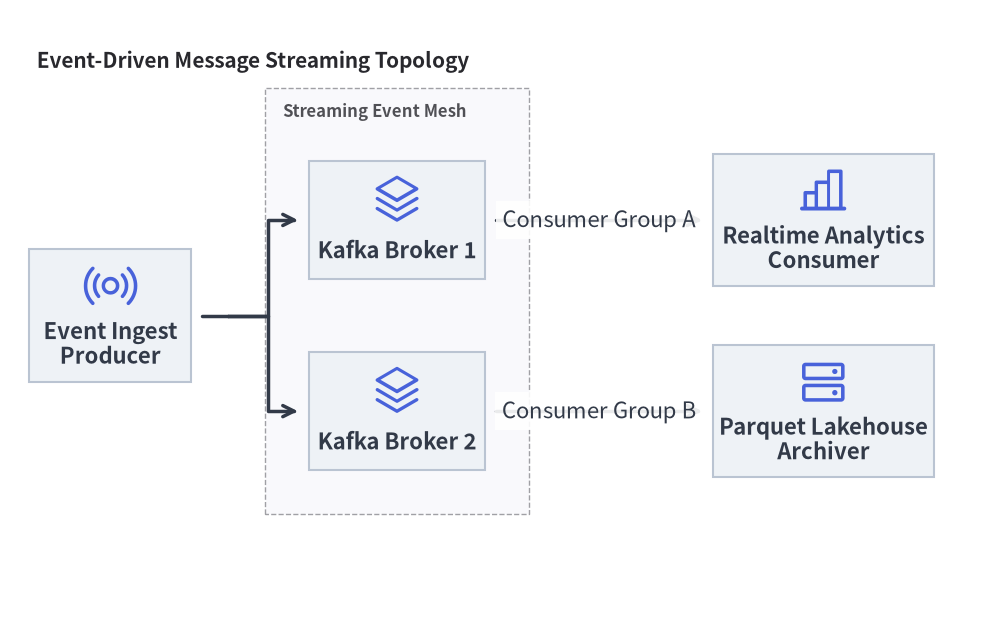

# Architecture Diagrams: Cloud Topologies, Microservices & VPC Boundaries

`ArchitectureDiagram` visualizes distributed systems, cloud networks, microservices topologies, and infrastructure boundaries. It pairs icon-centric nodes with automatic hierarchical boundary boxes (`NodeGroup`) and multi-way branch routing.

---

## 1. Overview & Key Concepts

```text
 ┌──────────────────────────────────────────────────────────────┐
 │ VPC Network (NodeGroup)                                      │
 │   ┌────────────────────────┐    ┌────────────────────────┐   │
 │   │ Public Subnet          │    │ Private Subnet         │   │
 │   │      ┌──────┐          │    │      ┌──────┐          │   │
 │   │      │ [LB] │──────────┼────┼─────►│[App1]│          │   │
 │   │      └──────┘          │    │      └──────┘          │   │
 │   └────────────────────────┘    └────────────────────────┘   │
 └──────────────────────────────────────────────────────────────┘
```

- **Card-Centric Coordinates**: When placing a node via `d.add(node, xy=(x, y))`, the coordinate defines the **center of the node card** `card_size=(width, height)`. When both `icon` and `text` are present, the icon is positioned in the upper middle and the text label in the lower portion (adjustable via `text_style=Styles.DarkBold.patch(xy_shift=...)`). If neither `node_card_style` nor `card_style` is provided, the card background is transparent.
- **Hierarchical Auto-Bounding (`NodeGroup`)**: Groups automatically compute their outer boundary boxes to enclose all enclosed nodes and nested sub-groups with configurable padding.
- **Connectable Boundaries**: You can connect edges directly to or from a group's perimeter box as well as individual nodes.
- **1-to-N Fan-Out (`fork`)**: Easily split a single connection line into multiple downstream destinations using an automatic intermediate bus line.

---

## 2. Constructor & Core Classes

```python
from drawlib.diagrams.architecture import ArchitectureDiagram, GcpIcon, Node, NodeGroup, PhosphorIcon
from drawlib.styles import Styles

d = ArchitectureDiagram(
    node_style=Styles.Primary,
    node_text_style=Styles.DarkBold,
    edge_style=Styles.DarkBold,
    edge_text_style=Styles.Dark,
    node_card_style=Styles.Neutral,
    title="Production Multi-Tier Cloud VPC",
)
```

### Parameter Reference

#### `ArchitectureDiagram` Class
| Parameter | Type | Default | Description |
|---|---|---|---|
| `node_style` | `Style` | *(Required)* | Default style for node icons and images. |
| `node_text_style` | `Style` | *(Required)* | Default style for node text labels. |
| `edge_style` | `Style` | *(Required)* | Default style for connection lines and arrowheads. |
| `edge_text_style` | `Style` | *(Required)* | Default style for connection text labels. |
| `node_card_style` | `Style \| None` | `None` | Default style for node card backgrounds (transparent if `None`). |
| `title` | `str` | `""` | Optional banner title for the diagram. |
| `title_style` | `Style \| None` | `None` | Optional style for diagram title. |
| `width` | `float \| None` | `None` | Explicit diagram canvas width, or `None` for auto-fit. |
| `height` | `float \| None` | `None` | Explicit diagram canvas height, or `None` for auto-fit. |
| `margin` | `float` | `5.0` | Outer margin around all elements. |
| `style` | `Style \| None` | `None` | Overall diagram background and border style. |

#### `Node` Class
| Parameter | Type | Default | Description |
|---|---|---|---|
| `card_size` | `tuple[float, float]` | *(Required)* | Card bounding box `(width, height)` in canvas units. |
| `text` | `str` | `""` | Node label text (supports `\n`). |
| `icon` | `IconType` | `None` | `PhosphorIcon`, `GcpIcon`, icon callable, `CustomIcon`, `Dimage`, `PIL.Image`, or path. |
| `icon_size` | `float` | `8.0` | Outer width and height of the icon/image. |
| `style` | `Style \| None` | `None` | Optional style override for the icon or image. |
| `text_style` | `Style \| None` | `None` | Optional style override for the label text (supports `xy_shift`, `angle`). |
| `card_style` | `Style \| None` | `None` | Optional style override for the card background/border (transparent if `None` and `node_card_style` is `None`). |
| `show` | `bool` | `True` | Visibility flag (connected edges auto-hide when `False`). |

#### `NodeGroup` Class
| Parameter | Type | Default | Description |
|---|---|---|---|
| `title` | `str` | `""` | Group banner title (e.g. `"VPC Network (10.0.0.0/16)"`). |
| `padding` | `float` | `6.0` | Inner margin around enclosed child nodes. |
| `style` | `Style \| None` | `None` | Style for group background fill and boundary border. |
| `show` | `bool` | `True` | Visibility flag (hides group box, child nodes, and connected edges when `False`, while preserving outer auto-bounds). |

#### Registration, Connection & Rendering Methods
- `d.add(item, xy=(x, y), *, show: bool = True) -> Node | NodeGroup | Junction` (also available on `group.add(...)`)
- `d.connect(src, dst, label="", ..., show: bool = True) -> Edge` (or `node.connect(dst, ..., show: bool = True) -> Edge`)
- `node.fork(targets, at_x=None, at_y=None, ..., show: bool = True) -> list[Edge]`
- `d.draw(xy=(0.0, 0.0), *, scale: float = 1.0) -> None`

---

## 3. Production Cloud VPC Architecture

The following complete example demonstrates public and private subnets, load balancing, GKE pods, Cloud SQL, and external users:


<figure class="drawlib-image" style="text-align: center;">
  
  <figcaption class="drawlib-caption">Production Multi-Tier Cloud VPC Topology</figcaption>
</figure>


---

## 4. Event-Driven Streaming Mesh

You can also use general architecture icons from `PhosphorIcon` to model messaging queues, Kafka clusters, and analytics engines:


<figure class="drawlib-image" style="text-align: center;">
  
  <figcaption class="drawlib-caption">Event-Driven Message Streaming Topology</figcaption>
</figure>


---

## 5. Best Practices & Guidelines

1. **Align Node Centers**: When aligning multiple nodes in a row or column, give them the exact same X or Y coordinate so horizontal and vertical connections stay straight.
2. **Use `fork` for Fan-Out**: Avoid drawing multiple crossing lines from a single node. Use `node.fork([n1, n2, ...], at_x=...)` to create clean right-angle bus routes.
3. **Padded Boundaries**: Always set `padding` on `NodeGroup` (typically `5.0` to `7.0`) to give enclosed components breathing room from the border lines.
