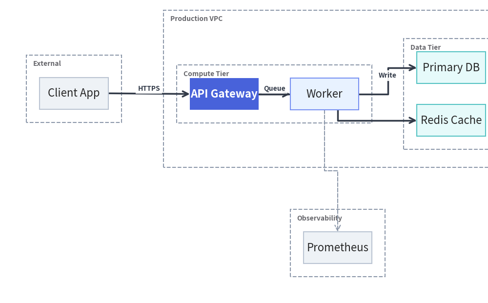
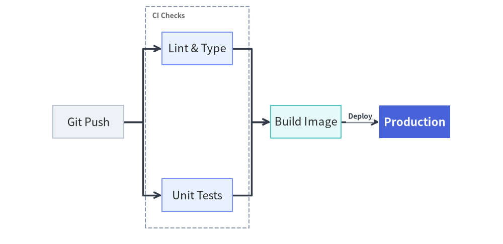
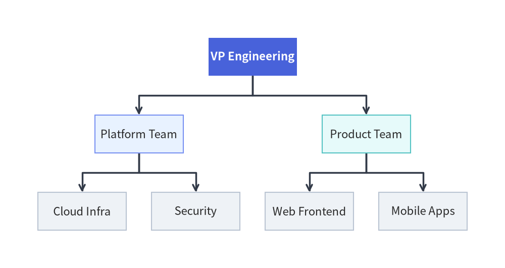
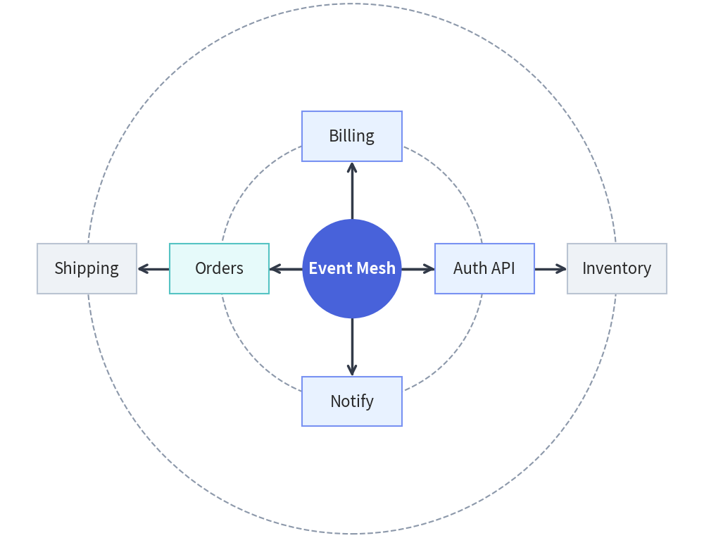
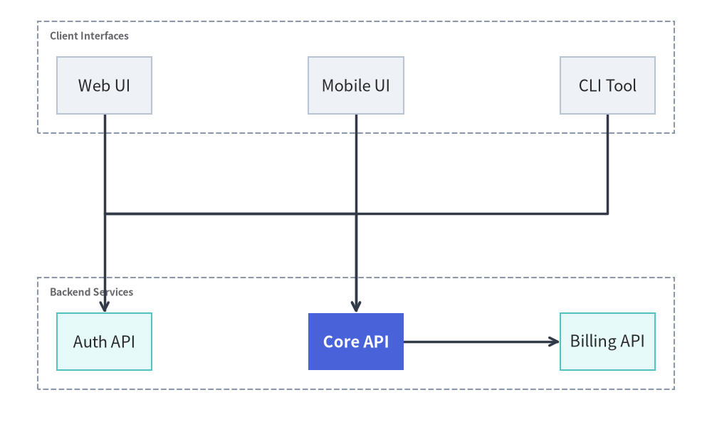
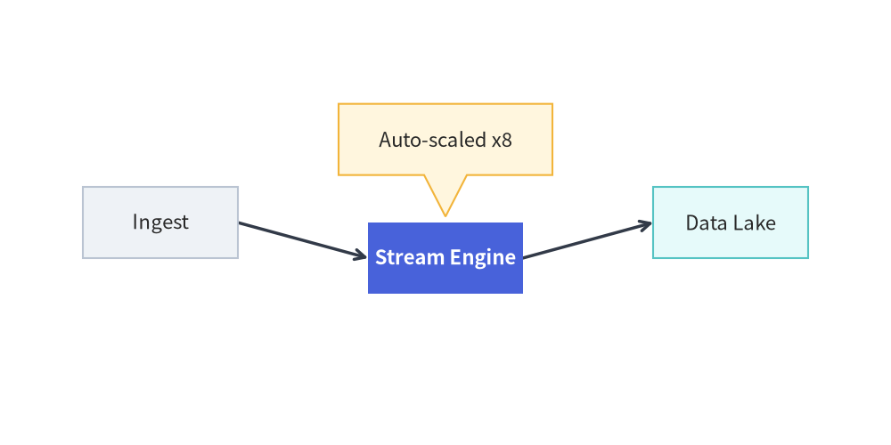

# Auto-Layout Graphs (`drawlib.graph`)

`drawlib.graph` provides a declarative **graph layout engine** with five specialized layout solvers (`ArchitectureGraph`, `LayerGraph`, `TreeGraph`, `RadialGraph`, and `GridGraph`).

Unlike black-box layout engines (such as Graphviz or Mermaid) that make it impossible to tweak an awkward node or attach custom annotations, `drawlib.graph` lets you:
1. **Render Declaratively (`g.draw()`)**: Declare nodes, edges, and nested clusters and let the solver compute coordinates and orthogonal routes automatically.
2. **Calculate, Tweak, and Overlay (`g.calc()` + `layout.offset()`)**: Compute the layout first, nudge specific nodes or clusters, and overlay custom `drawlib.shapes` at exact computed coordinates (`layout.nodes["db"].x`).
3. **Export to Standalone Primitives (`g.export_code()`)**: Generate clean, self-contained Python code using standard `drawlib.shapes` and `drawlib.lines` with all computed coordinates baked in.

---

## 1. Choosing the Right Graph Solver

| Solver Class | Layout Algorithm | Primary Use Case | Key Builder Methods |
| :--- | :--- | :--- | :--- |
| **`ArchitectureGraph`** | 2-Level Macro/Micro Packing + 5-Zone Compass | Cloud VPCs, nested subnets, multi-zone microservices | `.group()`, `.cluster(parent=..., pos=...)` |
| **`LayerGraph`** | Sugiyama Hierarchical DAG | CI/CD pipelines, dataflows, layered dependency graphs | `.tier(name, nodes, layer=...)` |
| **`TreeGraph`** | Reingold-Tilford / Buchheim Compact Tree | Org charts, taxonomies, ASTs, decision trees | `.child(parent, child_id, ...)` |
| **`RadialGraph`** | Concentric BFS Rings & Angular Sectors | Hub-and-spoke topologies, ecosystem rings | `.spoke(parent, spoke_id, ring=...)` |
| **`GridGraph`** | 2D Matrix & Smart Channel Routing | Service catalogs, state matrices, tabular networks | `.cell()`, `.cluster_row()`, `.cluster_column()` |

---

## 2. Common Graph Builder API (`BaseGraph`)

All five solvers inherit from `BaseGraph` and share a fluent builder interface:

```python
from drawlib.graph import (
    ArchitectureGraph,
    GridGraph,
    LayerGraph,
    RadialGraph,
    TreeGraph,
)
```

### Core Declaration & Execution Methods
- **`g.node(id, label=None, *, style=None, text_style=None, shape="rectangle", icon=None, width=None, height=None, ..., show: bool = True) -> Node`**
  - Supported `shape` values: `"rectangle"` *(default; corner radius controlled via `style.shape_r`)*, `"circle"`.
  - Setting `show=False` keeps the node in the layout calculation (`calc()`) so coordinates remain fixed, while skipping the node and its connected edges during rendering (`draw()`).
- **`g.edge(src, dst, label=None, *, style=None, text_style=None, arrow_head="->", line_style=None, show: bool = True) -> Edge`**
  - Connects `src` to `dst` (automatically creating undeclared nodes with default styling). Automatically hidden during rendering if `show=False` or if either endpoint node has `show=False`.
- **`g.cluster(id, nodes, label=None, *, style=None, text_style=None, padding=4.0, parent=None, order=None, pos=None, show: bool = True) -> Cluster`**
  - Encloses `nodes` inside a labeled boundary container (defaults to `Styles.MutedDashed`). Supports nesting via `parent="<cluster_id>"`.
- **`g.draw(xy=(0.0, 0.0), *, width=None, height=None, margin=10.0, scale: float = 1.0) -> GraphLayout`** and **`layout.draw(xy=(0.0, 0.0), *, scale: float = 1.0) -> None`**
  - Renders all visible clusters, edges, and nodes onto the active canvas, translated by `xy` and proportionally scaled by `scale`.

---

## 3. Cloud & System Topologies (`ArchitectureGraph`)

`ArchitectureGraph` uses a two-level macro/micro algorithm tailored for cloud infrastructure:
- **Nested Containers**: Place subnets or tiers inside a parent VPC (`parent="vpc"`, `order=1`).
- **5-Zone Compass Placement**: Pin external clients or monitoring clusters to `"left"`, `"right"`, `"top"`, `"bottom"`, or `"center"` via `pos=...`.


```python
from drawlib.canvas import save, setup
from drawlib.graph import ArchitectureGraph
from drawlib.styles import Styles

setup(width=185, height=115)

g = ArchitectureGraph(direction="LR", default_node_width=26.0)

# External client zone pinned to the left
g.cluster("clients", ["client"], label="External", pos="left", padding=5.0)
g.node("client", "Client App", style=Styles.Neutral)

# Cloud VPC with nested Compute and Data tiers in the center
g.group("vpc", "Production VPC", pos="center", padding=5.0)
g.cluster("app_tier", ["api", "worker"], label="Compute Tier", parent="vpc", order=1, padding=5.0)
g.cluster("data_tier", ["db", "cache"], label="Data Tier", parent="vpc", order=2, padding=5.0)

# Hero focal node in PrimaryFlat; supporting nodes in calm Neutral / Tinted-Neutral cards
g.node("api", "API Gateway", style=Styles.PrimaryFlat, text_style=Styles.WhiteBold)
g.node("worker", "Worker", style=Styles.PrimaryNeutral)
g.node("db", "Primary DB", style=Styles.SecondaryNeutral)
g.node("cache", "Redis Cache", style=Styles.SecondaryNeutral)

# Observability cluster pinned to the bottom
g.cluster("obs", ["metrics"], label="Observability", pos="bottom", padding=5.0)
g.node("metrics", "Prometheus", style=Styles.Neutral)

g.edge("client", "api", "HTTPS")
g.edge("api", "worker", "Queue")
g.edge("api", "cache", "Read")
g.edge("worker", "db", "Write")
g.edge("worker", "metrics", style=Styles.MutedDashed)

g.draw(margin=10)
save()
```

<figure class="drawlib-image" style="text-align: center;">
  
  <figcaption class="drawlib-caption">Cloud VPC Architecture with Nested Clusters and Compass Zones</figcaption>
</figure>


---

## 4. Layered DAGs & Pipelines (`LayerGraph`)

`LayerGraph` implements a Sugiyama-style hierarchical DAG solver (cycle removal, longest-path rank assignment, barycenter crossing reduction, and orthogonal routing). Use `.tier(name, nodes, layer=...)` to pin nodes to a specific rank:


```python
from drawlib.canvas import save, setup
from drawlib.graph import LayerGraph
from drawlib.styles import Styles

setup(width=185, height=90)

g = LayerGraph(direction="LR", rank_sep=14.0, default_node_width=26.0)

g.node("git", "Git Push", style=Styles.Neutral)
g.node("lint", "Lint & Type", style=Styles.PrimaryNeutral)
g.node("unit", "Unit Tests", style=Styles.PrimaryNeutral)
g.node("build", "Build Image", style=Styles.SecondaryNeutral)
g.node("prod", "Production", style=Styles.PrimaryFlat, text_style=Styles.WhiteBold)

g.tier("ci", ["lint", "unit"], layer=1)
g.cluster("ci_box", ["lint", "unit"], label="CI Checks", padding=6.0)

g.edge("git", "lint")
g.edge("git", "unit")
g.edge("lint", "build")
g.edge("unit", "build")
g.edge("build", "prod", "Deploy")

g.draw(margin=12)
save()
```

<figure class="drawlib-image" style="text-align: center;">
  
  <figcaption class="drawlib-caption">LayerGraph CI/CD Pipeline with Stage Tiers</figcaption>
</figure>


---

## 5. Hierarchies & Trees (`TreeGraph`)

`TreeGraph` computes proportional subtree widths so sibling branches never collide and parent nodes remain centered over their children:


```python
from drawlib.canvas import save, setup
from drawlib.graph import TreeGraph
from drawlib.styles import Styles

setup(width=160, height=85)

g = TreeGraph(root="vp", direction="TB", default_node_width=28.0)
g.node("vp", "VP Engineering", style=Styles.PrimaryFlat, text_style=Styles.WhiteBold)

g.child("vp", "plat", "Platform Team", style=Styles.PrimaryNeutral)
g.child("vp", "prod", "Product Team", style=Styles.SecondaryNeutral)

g.child("plat", "infra", "Cloud Infra", style=Styles.Neutral)
g.child("plat", "sec", "Security", style=Styles.Neutral)
g.child("prod", "web", "Web Frontend", style=Styles.Neutral)
g.child("prod", "mob", "Mobile Apps", style=Styles.Neutral)

g.draw(margin=12)
save()
```

<figure class="drawlib-image" style="text-align: center;">
  
  <figcaption class="drawlib-caption">TreeGraph Engineering Hierarchy</figcaption>
</figure>


---

## 6. Hub-and-Spoke Topologies (`RadialGraph`)

`RadialGraph` arranges nodes on concentric rings around a central hub (`ring=0, 1, 2, ...`) and optionally renders dashed ring guide circles (`draw_ring_guides=True`):


```python
from drawlib.canvas import save, setup
from drawlib.graph import RadialGraph
from drawlib.styles import Styles

setup(width=170, height=130)

g = RadialGraph(hub="core", draw_ring_guides=True, default_node_width=24.0)
g.node("core", "Event Mesh", shape="circle", width=24.0, height=24.0, style=Styles.PrimaryFlat, text_style=Styles.WhiteBold)

g.spoke("core", "auth", "Auth API", style=Styles.PrimaryNeutral)
g.spoke("core", "billing", "Billing", style=Styles.PrimaryNeutral)
g.spoke("core", "orders", "Orders", style=Styles.SecondaryNeutral)
g.spoke("core", "notify", "Notify", style=Styles.PrimaryNeutral)

g.spoke("orders", "inv", "Inventory", ring=2, style=Styles.Neutral)
g.spoke("orders", "ship", "Shipping", ring=2, style=Styles.Neutral)

g.draw(margin=18)
save()
```

<figure class="drawlib-image" style="text-align: center;">
  
  <figcaption class="drawlib-caption">RadialGraph Event Mesh Topology</figcaption>
</figure>


---

## 7. Matrix Layouts (`GridGraph`)

`GridGraph` places nodes into a 2D `(row, col)` matrix and routes non-adjacent connections through inter-row and inter-column channels:


```python
from drawlib.canvas import save, setup
from drawlib.graph import GridGraph
from drawlib.styles import Styles

setup(width=150, height=90)

g = GridGraph(columns=3)

g.cell("fe_web", row=0, col=0, label="Web UI", style=Styles.Neutral)
g.cell("fe_mob", row=0, col=1, label="Mobile UI", style=Styles.Neutral)
g.cell("fe_cli", row=0, col=2, label="CLI Tool", style=Styles.Neutral)

g.cell("svc_auth", row=1, col=0, label="Auth API", style=Styles.SecondaryNeutral)
g.cell("svc_core", row=1, col=1, label="Core API", style=Styles.PrimaryFlat, text_style=Styles.WhiteBold)
g.cell("svc_pay", row=1, col=2, label="Billing API", style=Styles.SecondaryNeutral)

g.cluster_row(0, "row_fe", label="Client Interfaces")
g.cluster_row(1, "row_be", label="Backend Services")

g.edge("fe_web", "svc_core")
g.edge("fe_mob", "svc_core")
g.edge("fe_cli", "svc_auth")
g.edge("svc_core", "svc_pay")

g.draw(margin=12)
save()
```

<figure class="drawlib-image" style="text-align: center;">
  
  <figcaption class="drawlib-caption">GridGraph Service Matrix with Row Clusters</figcaption>
</figure>


---

## 8. Post-Layout Adjustment (`calc()` + `offset()`) & Code Export (`export_code()`)

### Fine-Tuning with `calc()` and `offset()`
Call `layout = g.calc()` to inspect or adjust computed positions before rendering:


```python
from drawlib.canvas import save, setup
from drawlib.graph import LayerGraph
from drawlib.shapes import bubblespeech
from drawlib.styles import Styles

setup(width=150, height=75)

g = LayerGraph(direction="LR", default_node_width=26.0)
g.node("ingest", "Ingest", style=Styles.Neutral)
g.node("process", "Stream Engine", style=Styles.PrimaryFlat, text_style=Styles.WhiteBold)
g.node("store", "Data Lake", style=Styles.SecondaryNeutral)

g.edge("ingest", "process")
g.edge("process", "store")

# 1. Compute layout without drawing
layout = g.calc(margin=14)

# 2. Shift a node or cluster and draw
layout.offset("process", dy=-6.0)
layout.draw()

# 3. Attach a custom primitive using computed node coordinates
proc = layout.nodes["process"]
bubblespeech(
    (proc.x - 18, proc.y + 14),
    width=36,
    height=12,
    tail_edge="bottom",
    tail_start_ratio=0.4,
    tail_end_ratio=0.6,
    tail_vertex_xy=(proc.x, proc.y + proc.height / 2 + 1),
    style=Styles.WarningNeutral,
    text="Auto-scaled x8",
)

save()
```

<figure class="drawlib-image" style="text-align: center;">
  
  <figcaption class="drawlib-caption">Tweaking Computed Coordinates with offset() and Attaching Callouts</figcaption>
</figure>


### Scaffolding Standalone Primitive Code (`export_code()`)
To convert any graph layout into standalone `drawlib.shapes` and `drawlib.lines` Python code with explicit numeric coordinates:

```python
print(g.export_code(width=160, height=90))
```
