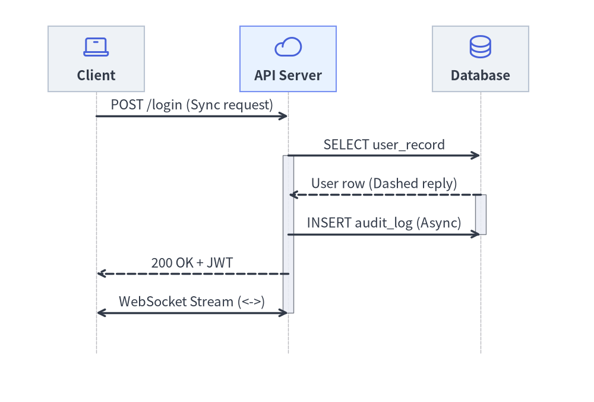
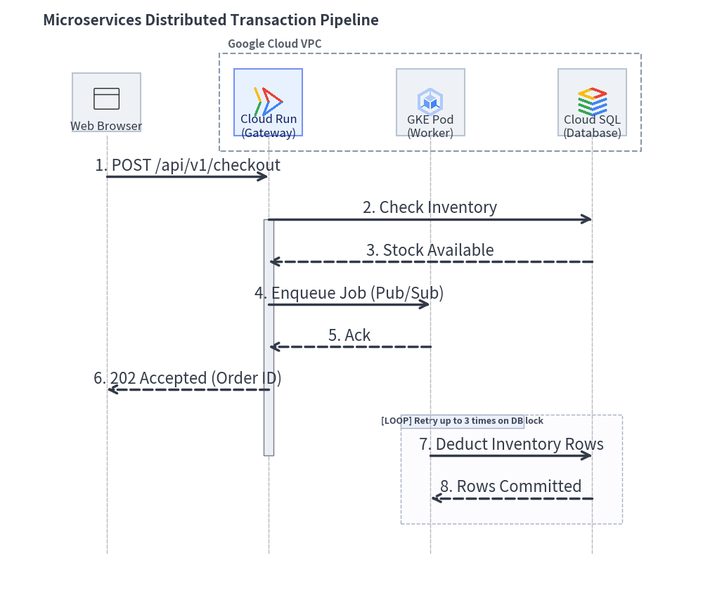
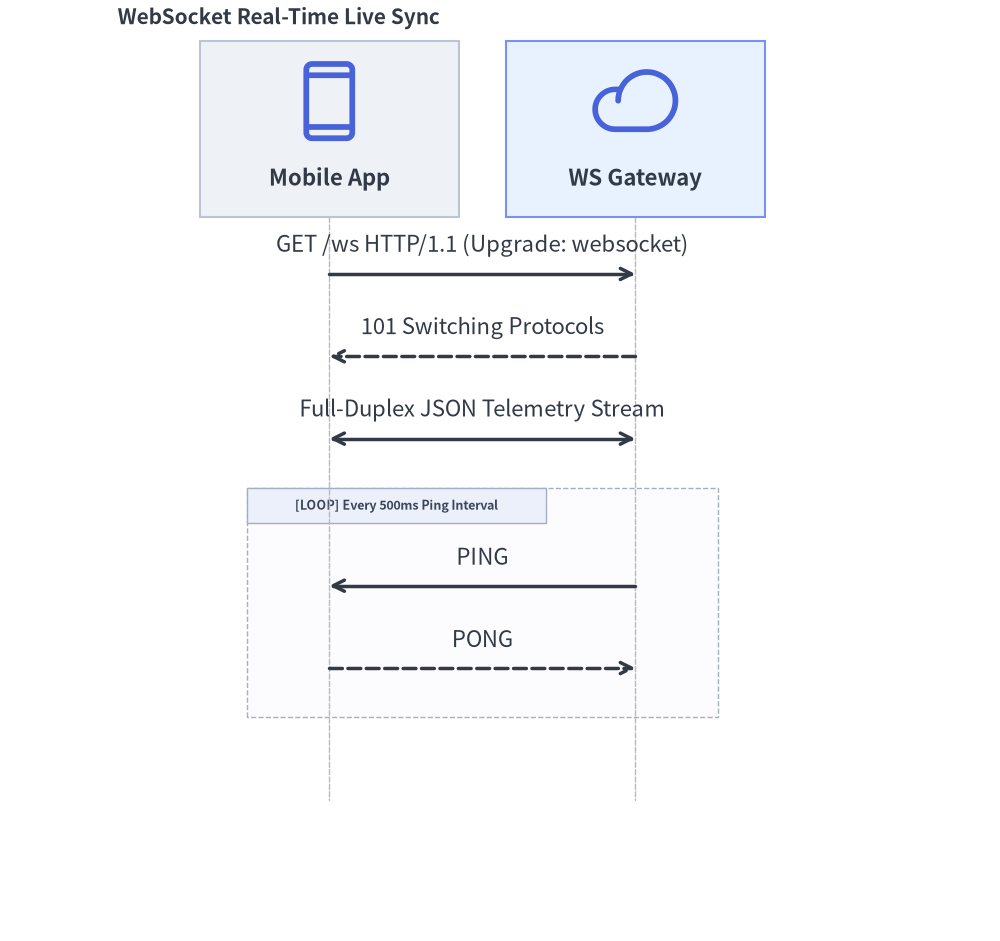
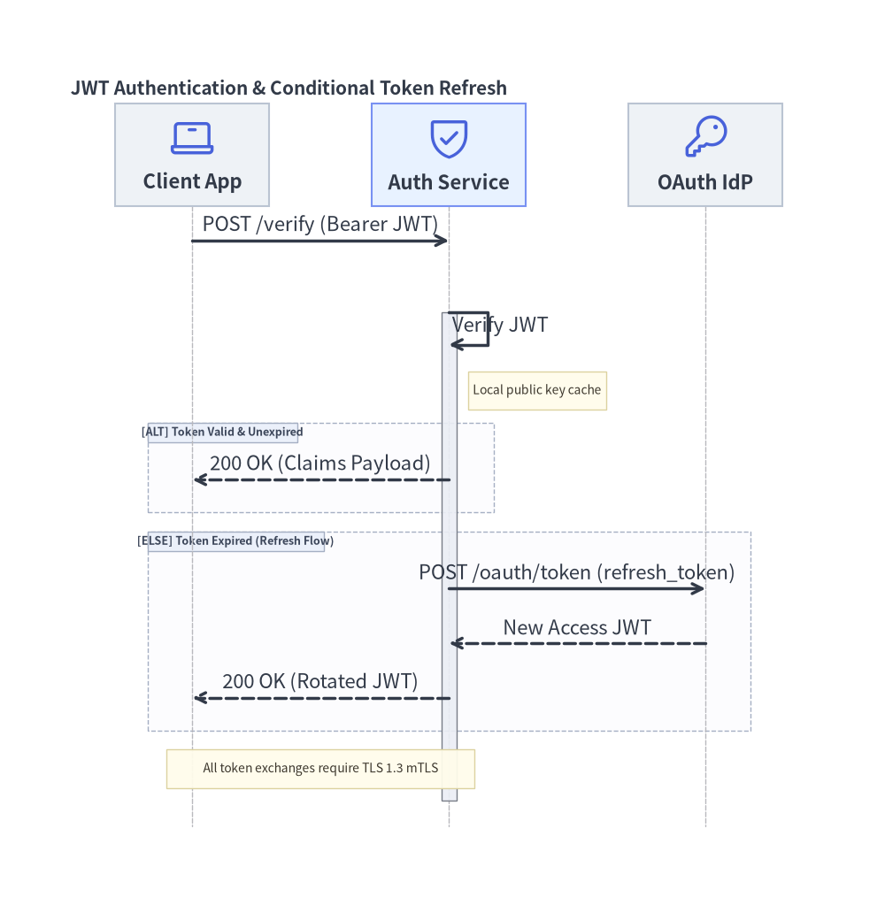

# SequenceDiagram: Lifelines, Synchronous Calls & Condition Blocks

`SequenceDiagram` models chronological interactions and communication protocols between collaborating participants over time. Time progresses strictly downwards along vertical lifelines, with horizontal arrows representing messages.

---

## 1. Overview & Key Concepts


<figure class="drawlib-image" style="text-align: center;">
  
  <figcaption class="drawlib-caption">SequenceDiagram Lifelines, Activation Bars, and Message Semantics</figcaption>
</figure>

<details class="drawlib-code-details">
<summary>Source Code</summary>

```python
from drawlib.canvas import save, setup
from drawlib.diagrams.sequence import Participant, PhosphorIcon, SequenceDiagram
from drawlib.styles import Styles

setup(width=126, height=88)

d = SequenceDiagram(
    node_style=Styles.Primary,
    node_text_style=Styles.DarkBold.patch(text_size=10.5),
    edge_style=Styles.DarkBold,
    edge_text_style=Styles.Dark.patch(text_size=10.5),
    node_card_style=Styles.Neutral,
    col_width=40.0,
    step_y=8.5,
)

client = d.add(Participant("Client", width=22, height=15, icon=PhosphorIcon.LAPTOP, icon_size=6.5))
api = d.add(
    Participant("API Server", width=22, height=15, icon=PhosphorIcon.CLOUD, icon_size=6.5, card_style=Styles.PrimaryNeutral)
)
db = d.add(Participant("Database", width=22, height=15, icon=PhosphorIcon.DATABASE, icon_size=6.5))

client.request(api, "POST /login (Sync request)")
api.activate()

api.request(db, "SELECT user_record")
db.activate()
db.reply(api, "User row (Dashed reply)")
db.deactivate()

api.request(db, "INSERT audit_log (Async)", is_async=True)
api.reply(client, "200 OK + JWT")
api.deactivate()

client.connect(api, "WebSocket Stream (<->)", arrow="<->")

d.draw(xy=(4.0, 3.0))
save()
```

</details>


- **Vertical Lifelines**: Participants are placed along the horizontal header band, with lifelines extending downwards.
- **Message Semantics** (illustrated in the diagram above):
  - `request()`: Solid line with a filled arrowhead for synchronous calls. With `is_async=True`, renders an open stick arrowhead.
  - `reply()`: Dashed line with a filled arrowhead for return responses.
  - `connect()`: Bidirectional communication (`arrow="<->"`), such as full-duplex WebSocket channels.
  - Self-Calls: `p.request(p, label)` loops back to the caller's own lifeline.
- **Activation Boxes**: `p.activate()` and `p.deactivate()` draw execution focus rectangles along lifelines.
- **Autonumbering**: Setting `autonumber=True` automatically numbers messages sequentially (`1.`, `2.`, `3.`, ...).
- **Pythonic Condition Frames (`with`)**: Use Python context managers (`with d.loop()`, `with d.alt()`, `with d.opt()`) to wrap structured interaction frames cleanly.

---

## 2. Constructor & Participant Management

```python
from drawlib.diagrams.sequence import (
    Block,
    GcpIcon,
    Participant,
    ParticipantGroup,
    PhosphorIcon,
    SequenceDiagram,
)
from drawlib.styles import Styles

d = SequenceDiagram(
    node_style=Styles.Primary,
    node_text_style=Styles.DarkBold,
    edge_style=Styles.DarkBold,
    edge_text_style=Styles.Dark,
    node_card_style=Styles.Neutral,
    title="Checkout Transaction Pipeline",
    autonumber=True,            # Auto-number messages (1., 2., 3., ...)
)

# Participant group for clustered backend services
vpc = d.add(ParticipantGroup(title="Google Cloud VPC", padding=4.0))
api = vpc.add(Participant("Cloud Run\n(Gateway)", width=22, height=16, icon=GcpIcon.CLOUD_RUN, card_style=Styles.PrimaryNeutral))
db = vpc.add(Participant("Cloud SQL", width=22, height=16, icon=GcpIcon.CLOUD_SQL))

# External participant
client = d.add(Participant("Web Browser", width=22, height=16, icon=PhosphorIcon.BROWSER))
```

### Parameter Reference Tables

#### `SequenceDiagram` Class
| Parameter | Type | Default | Description |
|---|---|---|---|
| `node_style` | `Style` | *(Required)* | Base `Style` object for participant icons and images. |
| `node_text_style` | `Style` | *(Required)* | Base `Style` object for participant text labels. |
| `edge_style` | `Style` | *(Required)* | Base `Style` object for message arrows and lifelines. |
| `edge_text_style` | `Style` | *(Required)* | Base `Style` object for message labels. |
| `node_card_style` | `Style \| None` | `None` | Optional base `Style` for participant header cards (transparent if `None`). |
| `title` | `str` | `""` | Optional banner title displayed above the diagram. |
| `autonumber` | `bool` | `False` | When `True`, prefixes message labels with sequential numbers (`1.`, `2.`, `3.`, ...). |
| `width` | `float \| None` | `None` | Optional fixed canvas width (auto-calculated from lifelines if `None`). |
| `height` | `float \| None` | `None` | Optional fixed canvas height (auto-calculated from timeline steps if `None`). |
| `col_width` | `float` | `20.0` | Default horizontal center-to-center spacing between participant lifelines. |
| `step_y` | `float` | `7.0` | Vertical distance advanced per chronological message or note step. |
| `margin` | `float` | `5.0` | Outer margin surrounding all lifelines and headers. |
| `style` | `Style \| None` | `None` | Optional `Style` for the overall diagram background card. |
| `title_style` | `Style \| None` | `None` | Optional `Style` override for the diagram title text. |

#### `Participant` Class
| Parameter | Type | Default | Description |
|---|---|---|---|
| `text` | `str` | `""` | Display name shown in the participant header card (supports `\n`). |
| `width` | `float` | `20.0` | Header card width in canvas units. |
| `height` | `float` | `16.0` | Header card height in canvas units. |
| `icon` | `IconType` | `None` | `GcpIcon`, `PhosphorIcon`, `CustomIcon`, `Dimage`, `PIL.Image`, path, or icon callable. |
| `icon_size` | `float` | `8.0` | Icon width/height in coordinate units. |
| `style` | `Style \| None` | `None` | Optional `Style` override for the participant icon/image. |
| `text_style` | `Style \| None` | `None` | Optional `Style` override for the participant label text. |
| `card_style` | `Style \| None` | `None` | Optional `Style` override for the participant header card background/border. |
| `lifeline_style` | `Style \| None` | `None` | Optional `Style` override for the vertical dashed lifeline. |
| `show` | `bool` | `True` | Visibility flag (hides header, lifeline, and attached messages/notes when `False`). |

- **Horizontal Lifeline Pinning & Sizing**:
  - `d.add(participant, x: float | None = None, *, show: bool | None = None) -> Participant`: Registers a participant, optionally pinning its lifeline to an explicit horizontal coordinate `x`.
  - `participant.set_x(x: float) -> Participant`: Explicitly pins the participant's horizontal lifeline position `x` and returns `self`.
  - `participant.activate() -> None` and `participant.deactivate() -> None`: Starts and ends an execution focus bar on the lifeline.
  - `participant.get_size() -> tuple[float, float]` and `participant.get_header_size() -> tuple[float, float]`: Returns `(width, height)`.

#### `ParticipantGroup` Class
| Parameter | Type | Default | Description |
|---|---|---|---|
| `title` | `str` | `""` | Header title for the participant group boundary box. |
| `padding` | `float` | `4.0` | Padding around enclosed participant header cards. |
| `style` | `Style \| None` | `None` | Optional `Style` for the group boundary box. |
| `text_style` | `Style \| None` | `None` | Optional `Style` for the group title text. |
| `show` | `bool` | `True` | Visibility flag (hides the group box when `False` while keeping column spacing fixed). |

- **`group.add(participant: Participant, *, show: bool | None = None) -> Participant`**: Adds a participant to the group (and registers it with the parent diagram).

---

### Messages, Notes, Spacing & Rendering API

- **Participant-Level & Diagram-Level Messages**:
  - **`a.request(b, label="", is_async=False, style=None, text_style=None, show=True) -> Message`** or **`d.request(a, b, ...) -> Message`**: Solid request arrow (`->`). Passing the same participant (`a.request(a, "...")`) renders a 3-segment **self-call** loop (`msg.is_self_call == True`).
  - **`b.reply(a, label="", is_async=False, style=None, text_style=None, show=True) -> Message`** or **`d.reply(b, a, ...) -> Message`**: Dashed return arrow (`-->`).
  - **`a.connect(b, label="", arrow="->", is_async=False, style=None, text_style=None, show=True) -> Message`** or **`d.connect(a, b, ...) -> Message`**: Custom directional or bidirectional (`arrow="<->" | "->" | "-"`) message.
- **`Message` Fluent Mutators**:
  - `msg.set_label(text: str) -> Message`
  - `msg.set_reply(is_reply: bool = True) -> Message`
  - `msg.set_async(is_async: bool = True) -> Message`
  - `msg.set_arrow(arrow: Literal["->", "<->", "-"]) -> Message`
  - `msg.set_style(style: Style) -> Message`
  - `msg.set_text_style(text_style: Style) -> Message`
  - `msg.set_padding(padding: float | tuple[float, float]) -> Message`
- **Sticky Notes (`d.note` & `p.note`)**:
  - **`d.note(text: str, on: Participant | None = None, over: list[Participant] | None = None, pos: Literal["left", "right", "over"] = "right", style: Style | None = None, show: bool = True) -> Note`**: Places a sticky note beside a single lifeline (`on=p, pos="left"|"right"`) or spanning across multiple lifelines (`over=[p1, p2]`).
  - **`p.note(text: str, pos: Literal["left", "right"] = "right", style: Style | None = None, show: bool = True) -> Note`**: Convenience shorthand for `d.note(text, on=p, pos=pos, ...)`.
  - **`Note` Mutators**: `note.set_text(text) -> Note`, `note.set_style(style) -> Note`, `note.set_text_style(text_style) -> Note`.
- **Timeline Spacing, Sizing & Rendering**:
  - **`d.space(dy: float = 5.0) -> None`**: Advances the vertical timeline by an extra `dy` units to add visual breathing room between phases.
  - **`d.get_size() -> tuple[float, float]`**: Computes the total `(width, height)` of the sequence diagram.
  - **`d.draw(xy=(0.0, 0.0), *, scale: float = 1.0) -> None`**: Renders the sequence diagram anchored at bottom-left `xy`, proportionally scaling column widths, vertical steps, icons, and typography by `scale`.

---

## 3. Distributed Transaction Pipeline

The following complete example showcases participant groups, cloud icons, activations, asynchronous dispatches, and a retry loop frame:


```python
from drawlib.canvas import save, setup
from drawlib.diagrams.sequence import GcpIcon, Participant, ParticipantGroup, PhosphorIcon, SequenceDiagram
from drawlib.styles import Styles

setup(width=132, height=128)

d = SequenceDiagram(
    node_style=Styles.Primary,
    node_text_style=Styles.DarkBold.patch(text_size=10.0),
    edge_style=Styles.DarkBold,
    edge_text_style=Styles.Dark.patch(text_size=10.0),
    node_card_style=Styles.Neutral,
    title="Microservices Distributed Transaction Pipeline",
    autonumber=True,
    col_width=30.5,
    step_y=9.0,
)

# 1. Participants: Client on the left, Backend services in VPC group on the right
client = d.add(Participant("Web Browser", width=22, height=16, icon=PhosphorIcon.BROWSER, icon_size=6.5))

backend = d.add(
    ParticipantGroup(
        title="Google Cloud VPC",
        padding=3.0,
        style=Styles.MutedDashed,
        text_style=Styles.DarkBold.patch(text_size=10.5, halign="left", valign="top"),
    )
)
api = backend.add(
    Participant("Cloud Run\n(Gateway)", width=22, height=16, icon=GcpIcon.CLOUD_RUN, icon_size=6.5, card_style=Styles.PrimaryNeutral)
)
worker = backend.add(Participant("GKE Pod\n(Worker)", width=22, height=16, icon=GcpIcon.GOOGLE_KUBERNETES_ENGINE, icon_size=6.5))
db = backend.add(Participant("Cloud SQL\n(Database)", width=22, height=16, icon=GcpIcon.CLOUD_SQL, icon_size=6.5))

# 2. Interactions
client.request(api, "POST /api/v1/checkout")
api.activate()

api.request(db, "Check Inventory")
db.reply(api, "Stock Available")

api.request(worker, "Enqueue Job (Pub/Sub)", is_async=True)
worker.reply(api, "Ack", is_async=True)

api.reply(client, "202 Accepted (Order ID)")
api.deactivate()

with d.loop("Retry up to 3 times on DB lock"):
    worker.request(db, "Deduct Inventory Rows")
    db.reply(worker, "Rows Committed")

d.draw(xy=(3.0, 2.5))
save()
```

<figure class="drawlib-image" style="text-align: center;">
  
  <figcaption class="drawlib-caption">Microservices Distributed Transaction Pipeline</figcaption>
</figure>


---

## 4. WebSocket Full-Duplex Streaming

For real-time bidirectional streams, use `connect()` with `arrow="<->"`:


```python
from drawlib.canvas import save, setup
from drawlib.diagrams.sequence import Participant, PhosphorIcon, SequenceDiagram
from drawlib.styles import Styles

setup(width=92, height=82)

d = SequenceDiagram(
    node_style=Styles.Primary,
    node_text_style=Styles.DarkBold.patch(text_size=10.5),
    edge_style=Styles.DarkBold,
    edge_text_style=Styles.Dark.patch(text_size=10.5),
    node_card_style=Styles.Neutral,
    title="WebSocket Real-Time Live Sync",
    col_width=40.0,
)

app = d.add(Participant("Mobile App", width=22, height=15, icon=PhosphorIcon.DEVICE_MOBILE, icon_size=7.0))
gateway = d.add(
    Participant("WS Gateway", width=22, height=15, icon=PhosphorIcon.CLOUD, icon_size=7.0, card_style=Styles.PrimaryNeutral)
)

app.request(gateway, "GET /ws HTTP/1.1 (Upgrade: websocket)")
gateway.reply(app, "101 Switching Protocols")

# Bidirectional streaming channel
app.connect(gateway, "Full-Duplex JSON Telemetry Stream", arrow="<->")

with d.loop("Every 500ms Ping Interval"):
    gateway.request(app, "PING", is_async=True)
    app.reply(gateway, "PONG", is_async=True)

d.draw(xy=(6.0, 4.0))
save()
```

<figure class="drawlib-image" style="text-align: center;">
  
  <figcaption class="drawlib-caption">WebSocket Full-Duplex Telemetry Stream</figcaption>
</figure>


---

## 5. Condition Frames (`alt` / `else_`), Self-Calls & Sticky Notes

Drawlib supports all 7 standard UML interaction operators (`BlockType = Literal["loop", "alt", "else", "opt", "par", "critical", "break"]`) via context managers on `SequenceDiagram` or direct `Block(block_type, label="", diagram=d, style=None, text_style=None, show=True)` instantiation:

| Frame Type | Context Manager / Constructor | Standard UML Operator |
|---|---|---|
| **Loop** | `with d.loop("condition", show=True):` | `loop` |
| **Alternative** | `with d.alt("condition", show=True):`<br>`with d.else_("fallback", show=True):` | `alt` / `else` |
| **Option** | `with d.opt("condition", show=True):` | `opt` |
| **Parallel** | `with d.par("description", show=True):` | `par` |
| **Critical Region** | `with Block("critical", "atomic lock", diagram=d):` | `critical` |
| **Break** | `with Block("break", "fatal error", diagram=d):` | `break` |

Frames automatically compute their enclosing bounding box around all enclosed messages and notes, drawing the `[OPERATOR] label` tag in the top-left corner.

The following example demonstrates **self-calls** (`auth.request(auth, ...)`), **sticky notes** (`auth.note(...)` and `d.note(..., over=[...])`), and conditional **`alt` / `else_`** branches:


```python
from drawlib.canvas import save, setup
from drawlib.diagrams.sequence import Participant, PhosphorIcon, SequenceDiagram
from drawlib.styles import Styles

setup(width=128, height=134)

d = SequenceDiagram(
    node_style=Styles.Primary,
    node_text_style=Styles.DarkBold.patch(text_size=10.5),
    edge_style=Styles.DarkBold,
    edge_text_style=Styles.Dark.patch(text_size=10.0),
    node_card_style=Styles.Neutral,
    title="JWT Authentication & Conditional Token Refresh",
    col_width=37.0,
    step_y=8.2,
)

client = d.add(Participant("Client App", width=23, height=16, icon=PhosphorIcon.LAPTOP, icon_size=7.0))
auth = d.add(
    Participant("Auth Service", width=23, height=16, icon=PhosphorIcon.SHIELD_CHECK, icon_size=7.0, card_style=Styles.PrimaryNeutral)
)
idp = d.add(Participant("OAuth IdP", width=23, height=16, icon=PhosphorIcon.KEY, icon_size=7.0))

client.request(auth, "POST /verify (Bearer JWT)")
auth.activate()

# Self-call for local signature verification + attached participant note
auth.request(auth, "Verify JWT")
auth.note("Local public key cache", pos="right")

# Conditional alt / else_ blocks
with d.alt("Token Valid & Unexpired"):
    auth.reply(client, "200 OK (Claims Payload)")

with d.else_("Token Expired (Refresh Flow)"):
    auth.request(idp, "POST /oauth/token (refresh_token)")
    idp.reply(auth, "New Access JWT")
    auth.reply(client, "200 OK (Rotated JWT)")

auth.deactivate()

# Spanning note across multiple participants
d.note("All token exchanges require TLS 1.3 mTLS", over=[client, auth])

d.draw(xy=(4.0, 3.5))
save()
```

<figure class="drawlib-image" style="text-align: center;">
  
  <figcaption class="drawlib-caption">Authentication Flow with Self-Calls, Sticky Notes, and alt/else_ Condition Frames</figcaption>
</figure>


