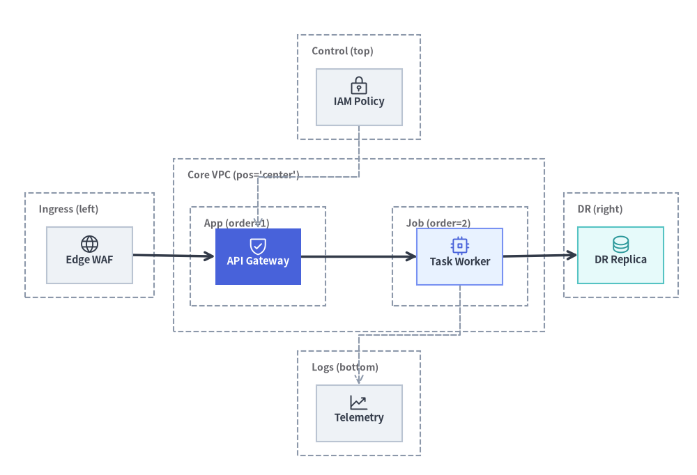
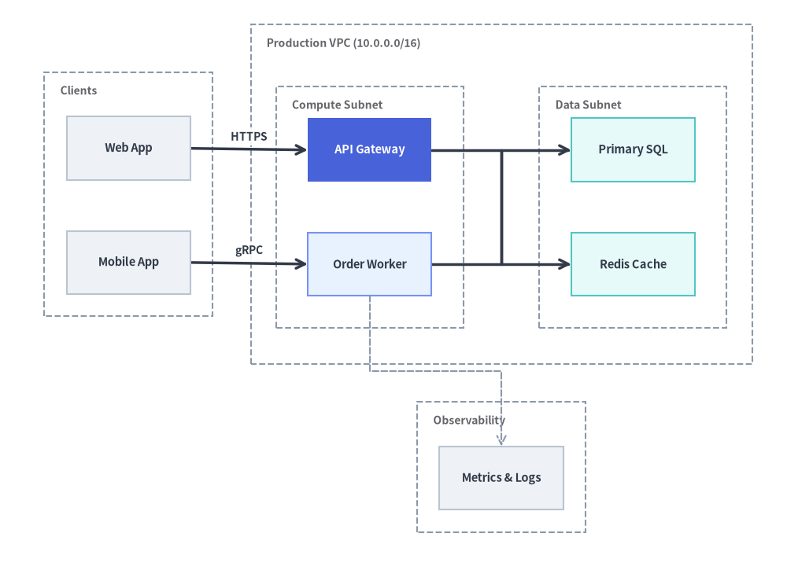
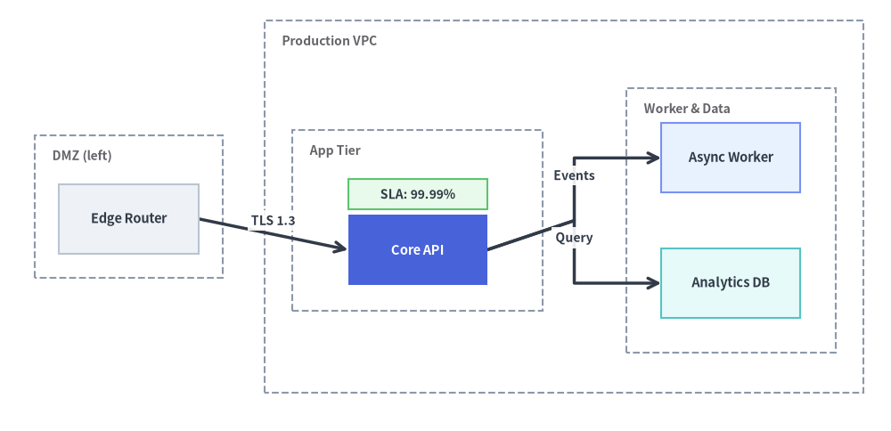

# ArchitectureGraph: Cloud Topologies & Nested Containers

`ArchitectureGraph` is a declarative **two-level macro/micro layout solver** purpose-built for cloud infrastructure, VPC topologies, and multi-zone microservice architectures.

Unlike generic DAG solvers that flatten nested groups or scramble boundary boxes, `ArchitectureGraph` solves layouts in two hierarchical phases: packing internal nodes and child clusters inside parent containers (**Micro Layout**), then arranging top-level containers across a **5-zone compass** (`pos="left" | "center" | "right" | "top" | "bottom"`) with orthogonal highway routing (**Macro Layout**).


<figure class="drawlib-image" style="text-align: center;">
  
  <figcaption class="drawlib-caption">ArchitectureGraph 5-Zone Compass Layout (top, left, center, right, bottom) and Nested Sub-Clusters</figcaption>
</figure>

<details class="drawlib-code-details">
<summary>Source Code</summary>

```python
from drawlib.canvas import save, setup
from drawlib.graph import ArchitectureGraph
from drawlib.icons import phosphor
from drawlib.styles import Styles

setup(width=126, height=86)

g = ArchitectureGraph(
    direction="LR",
    container_sep=3.5,
    default_node_text_style=Styles.DarkBold.patch(text_size=10.5),
    default_node_width=15.5,
    default_node_height=10.2,
)

# 1. Top Zone (pos="top")
g.cluster("top_zone", ["iam"], label="Control (top)", pos="top", padding=2.6)
g.node("iam", "\nIAM Policy", style=Styles.Neutral)

# 2. Left Zone (pos="left")
g.cluster("left_zone", ["waf"], label="Ingress (left)", pos="left", padding=2.6)
g.node("waf", "\nEdge WAF", style=Styles.Neutral)

# 3. Center Zone (pos="center") with two nested sub-clusters (parent="core", order=1 & 2)
g.group("core", "Core VPC (pos='center')", pos="center", padding=3.0)
g.cluster("tier1", ["api"], label="App (order=1)", parent="core", order=1, padding=3.8)
g.cluster("tier2", ["worker"], label="Job (order=2)", parent="core", order=2, padding=3.8)
g.node("api", "\nAPI Gateway", style=Styles.PrimaryFlat, text_style=Styles.WhiteBold.patch(text_size=10.5))
g.node("worker", "\nTask Worker", style=Styles.PrimaryNeutral)

# 4. Right Zone (pos="right")
g.cluster("right_zone", ["dr_replica"], label="DR (right)", pos="right", padding=2.6)
g.node("dr_replica", "\nDR Replica", style=Styles.SecondaryNeutral)

# 5. Bottom Zone (pos="bottom")
g.cluster("bottom_zone", ["obs"], label="Logs (bottom)", pos="bottom", padding=2.6)
g.node("obs", "\nTelemetry", style=Styles.Neutral)

# Connect across all 5 compass zones
g.edge("waf", "api")
g.edge("api", "worker")
g.edge("worker", "dr_replica")
g.edge("iam", "api", style=Styles.MutedDashed)
g.edge("worker", "obs", style=Styles.MutedDashed)

ox, oy = -5.5, -6.5
layout = g.draw(xy=(ox, oy), width=126.0, height=86.0)

for nid, icon_fn, st in [
    ("iam", phosphor.lock_key, Styles.Dark),
    ("waf", phosphor.globe, Styles.Dark),
    ("api", phosphor.shield_check, Styles.White),
    ("worker", phosphor.cpu, Styles.Primary),
    ("dr_replica", phosphor.database, Styles.Secondary),
    ("obs", phosphor.chart_line_up, Styles.Dark),
]:
    n = layout.nodes[nid]
    icon_fn((n.x + ox, n.y + oy + 1.9), width=3.8, style=st)

save()
```

</details>


---

## 1. Constructor & Container Methods

```python
from drawlib.graph import ArchitectureGraph
from drawlib.styles import Styles

g = ArchitectureGraph(
    direction="LR",                  # "LR" (Left-to-Right) or "TB" (Top-to-Bottom)
    container_sep=None,              # Gap between top-level containers (auto-scales if None)
    edge_routing="orthogonal",       # "orthogonal" or "straight"
    default_node_style=Styles.Neutral,
    default_node_text_style=None,
    default_edge_style=Styles.DarkBold,
    default_container_style=Styles.MutedDashed,
    default_node_width=24.0,
    default_node_height=12.0,
)
```

### Parameter Reference

| Parameter | Type | Default | Description |
| :--- | :--- | :--- | :--- |
| `direction` | `Literal["LR", "TB"]` | `"LR"` | Primary macro flow axis (`"LR"` left-to-right or `"TB"` top-to-bottom). |
| `container_sep` | `float \| None` | `None` | Fixed separation between top-level containers (auto-scales to fit canvas if `None`). |
| `edge_routing` | `Literal["orthogonal", "straight"]` | `"orthogonal"` | Edge path routing strategy (`"orthogonal"` right-angled highway routing or `"straight"`). |
| `default_node_style` | `Style \| None` | `None` | Default style applied to nodes without an explicit `style` (defaults to `Styles.PrimaryFlat`). |
| `default_node_text_style` | `Style \| None` | `None` | Default typography style for node labels. |
| `default_edge_style` | `Style \| None` | `None` | Default line style for edges (defaults to `Styles.DarkBold`). |
| `default_edge_text_style` | `Style \| None` | `None` | Default text style for edge labels. |
| `default_container_style` | `Style \| None` | `None` | Default boundary box style for clusters and groups (defaults to `Styles.MutedDashed`). |
| `default_node_width` | `float` | `24.0` | Default node width in canvas units. |
| `default_node_height` | `float` | `12.0` | Default node height in canvas units. |

### Nested Clusters & 5-Zone Compass Placement

You can organize nodes into single-level or nested two-level containers using `g.group()` and `g.cluster()`, or by passing `group="..."` and `subgroup="..."` directly on `g.node()`:

- **`g.group(id, label=None, *, nodes=None, style=None, text_style=None, padding=4.0, parent=None, order=None, pos=None, show=True) -> Cluster`**:
  Creates a top-level or parent container (such as a Cloud VPC) that can hold child clusters (`parent=id`).
- **`g.cluster(id, nodes, label=None, *, style=None, text_style=None, padding=4.0, parent=None, order=None, pos=None, show=True) -> Cluster`**:
  Encloses a list of `nodes` inside a labeled boundary rectangle.
  - **`parent`**: ID of the enclosing parent group (e.g. `parent="vpc"`).
  - **`order`**: Integer rank (`1`, `2`, ...) controlling the sequence of sibling tiers inside a parent container.
  - **`pos`**: Compass zone (`"left"`, `"center"`, `"right"`, `"top"`, `"bottom"`) for macro placement on the canvas.
- **Inline Node Membership (`g.node(..., group="...", subgroup="...")`)**:
  During `calc()`, `ArchitectureGraph` inspects each node's `group` and `subgroup` attributes. Any referenced cluster ID that has not been explicitly created via `g.group()` or `g.cluster()` is **automatically registered** (using its ID as the label and `default_container_style`), the node is appended to the innermost container, and if both `group` and `subgroup` are provided, `subgroup.parent` is automatically linked to `group` (`subgroup.parent = node.group`). You can still call `g.group()` or `g.cluster()` before or after `g.node()` to customize labels, `pos`, `order`, or `padding`.

---

## 2. Multi-VPC / Multi-Tier Cloud Topology with Nested Clusters

The following example builds a complete cloud architecture featuring an external client zone (`pos="left"`), a central production VPC (`pos="center"`) with nested Compute and Data tiers (`parent="prod_vpc"`, `order=1, 2`), and an observability zone (`pos="bottom"`):


```python
from drawlib.canvas import save, setup
from drawlib.graph import ArchitectureGraph
from drawlib.styles import Styles

setup(width=124, height=90)

g = ArchitectureGraph(
    direction="LR",
    container_sep=6.0,
    default_node_width=19.5,
    default_node_height=10.0,
    default_node_text_style=Styles.DarkBold.patch(text_size=10.5),
)

# 1. External client zone pinned to the left (vertically stacked)
g.cluster("ext_zone", ["web_client", "mobile_client"], label="Clients", pos="left", padding=3.5)
g.node("web_client", "Web App", style=Styles.Neutral)
g.node("mobile_client", "Mobile App", style=Styles.Neutral)

# 2. Central Production VPC with nested Compute and Data tiers
g.group("prod_vpc", "Production VPC (10.0.0.0/16)", pos="center", padding=4.0)
g.cluster(
    "compute_subnet",
    ["api_gw", "order_svc"],
    label="Compute Subnet",
    parent="prod_vpc",
    order=1,
    padding=5.0,
)
g.cluster(
    "data_subnet",
    ["orders_db", "redis_cache"],
    label="Data Subnet",
    parent="prod_vpc",
    order=2,
    padding=5.0,
)

# 50%+ Neutral baseline; single PrimaryFlat hero node for the API Gateway
g.node("api_gw", "API Gateway", style=Styles.PrimaryFlat, text_style=Styles.WhiteBold.patch(text_size=10.5))
g.node("order_svc", "Order Worker", style=Styles.PrimaryNeutral)
g.node("orders_db", "Primary SQL", style=Styles.SecondaryNeutral)
g.node("redis_cache", "Redis Cache", style=Styles.SecondaryNeutral)

# 3. Shared observability platform pinned to the bottom
g.cluster("obs_zone", ["prometheus"], label="Observability", pos="bottom", padding=3.5)
g.node("prometheus", "Metrics & Logs", style=Styles.Neutral)

# 4. Orthogonal highway edges
g.edge("web_client", "api_gw", "HTTPS")
g.edge("mobile_client", "order_svc", "gRPC")
g.edge("api_gw", "redis_cache")
g.edge("order_svc", "orders_db")
g.edge("order_svc", "prometheus", style=Styles.MutedDashed)

g.draw(xy=(-3.0, -4.0), width=124.0, height=90.0)
save()
```

<figure class="drawlib-image" style="text-align: center;">
  
  <figcaption class="drawlib-caption">Multi-Tier Cloud VPC Topology with Nested Clusters and 5-Zone Compass Placement</figcaption>
</figure>


---

## 3. Post-Layout Fine-Tuning with `calc()` and `offset()`

When an automatically calculated topology needs a subtle visual adjustment—or when you want to attach custom [`drawlib.shapes`](../02_drawing_primitives/shapes_basic.md) badges at exact node coordinates—call `layout = g.calc()`, apply `layout.offset(node_id, dx=..., dy=...)`, and then render via `layout.draw()`:


```python
from drawlib.canvas import save, setup
from drawlib.graph import ArchitectureGraph
from drawlib.shapes import rectangle
from drawlib.styles import Styles

setup(width=128, height=62)

g = ArchitectureGraph(
    direction="LR",
    container_sep=6.0,
    default_node_width=20.0,
    default_node_height=10.0,
    default_node_text_style=Styles.DarkBold.patch(text_size=10.5),
)

# Declare containers with subgroup padding and inline node membership
g.cluster("dmz", ["edge_lb"], label="DMZ (left)", pos="left", padding=3.5)
g.group("vpc", "Production VPC", pos="center", padding=4.0)
g.cluster("app", ["core_api"], label="App Tier", parent="vpc", order=1, padding=8.0)
g.cluster("storage", ["worker", "AnalyticsDB"], label="Worker & Data", parent="vpc", order=2, padding=5.0)

g.node("edge_lb", "Edge Router", group="dmz", style=Styles.Neutral)
g.node(
    "core_api",
    "Core API",
    group="vpc",
    subgroup="app",
    style=Styles.PrimaryFlat,
    text_style=Styles.WhiteBold.patch(text_size=10.5),
)
g.node("worker", "Async Worker", group="vpc", subgroup="storage", style=Styles.PrimaryNeutral)
g.node("AnalyticsDB", "Analytics DB", group="vpc", subgroup="storage", style=Styles.SecondaryNeutral)

g.edge("edge_lb", "core_api", "TLS 1.3")
g.edge("core_api", "worker", "Events")
g.edge("core_api", "AnalyticsDB", "Query")

# 1. Compute layout geometry without drawing
ox, oy = -5.0, -4.5
layout = g.calc(width=128.0, height=62.0)

# 2. Nudge the Core API node slightly downward so a badge fits cleanly inside the App Tier
layout.offset("core_api", dx=0.0, dy=-4.2)
layout.draw(xy=(ox, oy))

# 3. Overlay a SLA status badge right above the Core API node using computed coordinates
api_box = layout.nodes["core_api"]
rectangle(
    (api_box.x + ox, api_box.top + oy + 3.0),
    width=20.0,
    height=4.4,
    style=Styles.SuccessNeutral,
    text="SLA: 99.99%",
    text_style=Styles.DarkBold.patch(text_size=10.0),
)

save()
```

<figure class="drawlib-image" style="text-align: center;">
  
  <figcaption class="drawlib-caption">Fine-Tuning ArchitectureGraph Coordinates with calc() and layout.offset()</figcaption>
</figure>


---

## 4. Best Practices

1. **Use `pos` for Peripheral Zones**: Keep the main request pipeline in `pos="center"` (or `pos="left"` -> `pos="center"` -> `pos="right"`) and place cross-cutting concerns like CI/CD, IAM, or Observability in `pos="bottom"` or `pos="top"`.
2. **Ground Containers in Subtle Dashed Borders**: Leave container styles at their default `Styles.MutedDashed` (or a very light tint) so foreground service cards maintain crisp contrast.
3. **When You Need Cloud Icons**: If your diagram requires official `GcpIcon` or `PhosphorIcon` inside every node card, use [`ArchitectureDiagram`](../05_diagrams/architecture.md) in Chapter 5, or use `g.calc()` to compute node positions and place icons at `layout.nodes[id].xy`.
