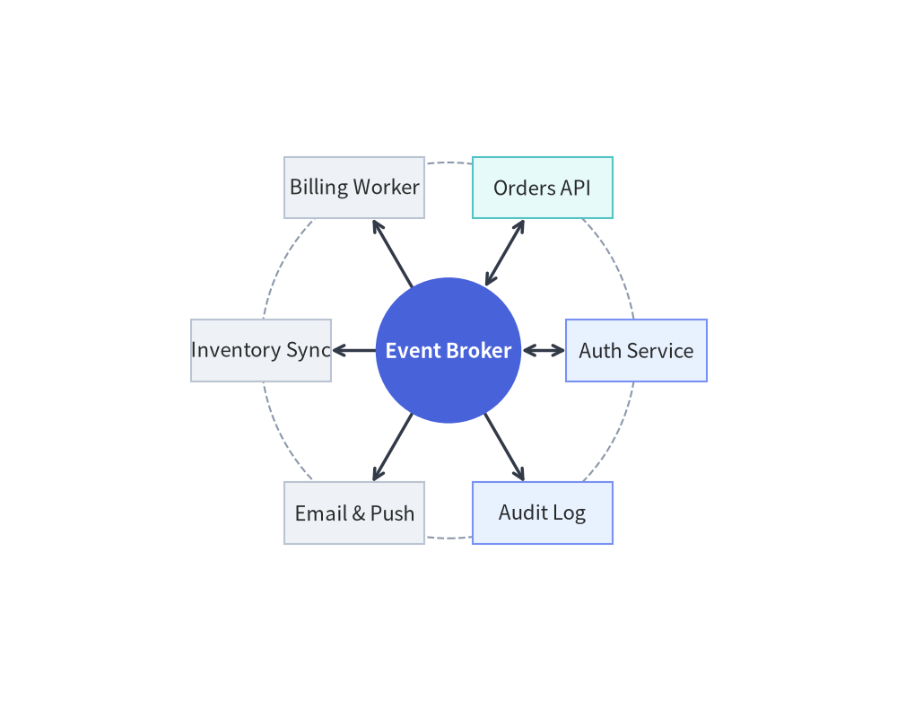
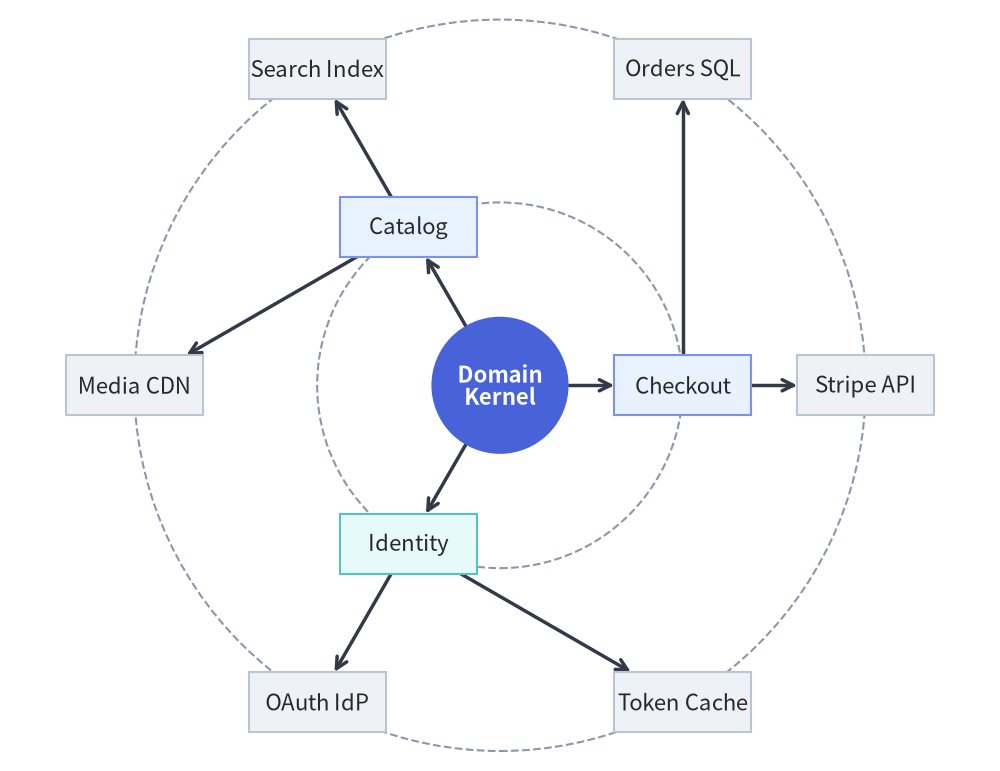
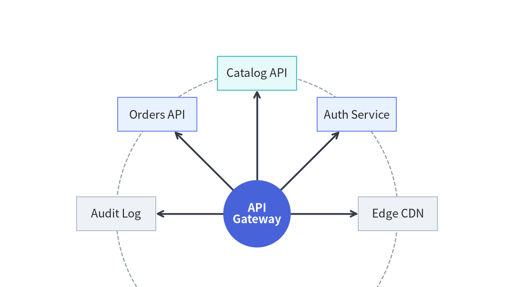

# RadialGraph: Concentric Orbits & Hub-and-Spoke Topologies

`RadialGraph` places a central hub node at the origin (`ring=0`) and arranges connected nodes on **concentric orbital rings** (`ring=1, 2, ...`). Angular sectors are allocated proportionally to subtree sizes so multi-hop spokes radiate outward without crossing lines.

It is purpose-built for event-driven message meshes, Pub/Sub broker topologies, microservice hub-and-spoke networks, and concentric dependency radars.

---

## 1. Constructor & `.spoke()` Builder API

```python
from drawlib.graph import RadialGraph
from drawlib.styles import Styles

g = RadialGraph(
    hub="core",                      # Central hub node ID (auto-detects highest degree if None)
    center=None,                     # Explicit (cx, cy) origin (defaults to canvas center)
    radius_step=36.0,                # Radial distance between rings (auto-scales if None)
    start_angle=0.0,                 # Starting angle in degrees (0.0 = East, 90.0 = North)
    angle_range=360.0,               # Total angular sweep (e.g. 360.0 full circle, 180.0 arc)
    draw_ring_guides=True,           # Render dashed circular orbit guides for each ring
    ring_guide_style=Styles.MutedDashed,
    default_node_style=Styles.Neutral,
    default_node_width=22.0,
    default_node_height=11.0,
)
```

### Parameter Reference

| Parameter | Type | Default | Description |
| :--- | :--- | :--- | :--- |
| `hub` | `str \| None` | `None` | ID of the central `ring=0` hub node. If `None`, selects the node with highest connectivity. |
| `center` | `tuple[float, float] \| None` | `None` | Center `(cx, cy)` of the concentric rings. Defaults to `(width / 2, height / 2)`. |
| `radius_step` | `float \| None` | `None` | Fixed radial gap between successive rings. Auto-scales to canvas if `None`. |
| `start_angle` | `float` | `0.0` | Starting angle in degrees (`0.0` = right/east, `90.0` = top/north). |
| `angle_range` | `float` | `360.0` | Total angular sweep in degrees (`360.0` for full orbit, `180.0` for semicircular fan). |
| `draw_ring_guides` | `bool` | `False` | When `True`, draws subtle dashed circular orbit guidelines behind each ring. |
| `ring_guide_style` | `Style \| None` | `None` | Custom `Style` for the ring guide circles (defaults to `Styles.MutedDashed`). |
| `default_node_style` | `Style \| None` | `None` | Default style for nodes (defaults to `Styles.PrimaryFlat`). |
| `default_node_text_style` | `Style \| None` | `None` | Default typography style for node labels. |
| `default_edge_style` | `Style \| None` | `None` | Default style for radial spoke edges (defaults to `Styles.DarkBold`). |
| `default_edge_text_style` | `Style \| None` | `None` | Default text style for edge labels. |
| `default_node_width` | `float` | `20.0` | Default node width in canvas units. |
| `default_node_height` | `float` | `12.0` | Default node height in canvas units. |

### Assigning Orbits with `g.spoke(...)` and `ring=`

In addition to `g.node()` and `g.edge()`, `RadialGraph` provides `.spoke()` to register a satellite node and connect it from `parent` in a single call:

```python
g.spoke(
    parent: str,
    spoke_id: str,
    label: str | None = None,
    *,
    ring: int | None = None,
    style: Style | None = None,
    text_style: Style | None = None,
    shape: Literal["rectangle", "circle"] = "rectangle",
    width: float | None = None,
    height: float | None = None,
    edge_label: str | None = None,
    edge_style: Style | None = None,
    arrow_head: Literal["->", "<-", "<->", "-"] = "->",
    show: bool = True,
    edge_show: bool = True,
) -> Node
```

- **Automatic BFS Ring Assignment**: By default (`ring=None`), each node's ring index equals its shortest hop distance from `hub` (`ring=0` for the hub, `ring=1` for direct neighbors, `ring=2` for second-hop neighbors).
- **Explicit Ring Assignment (`ring=int`)**: Pass `ring=1` or `ring=2` to `g.node(id, label, ring=...)` or `g.spoke(parent, spoke_id, label, ring=...)` to pin a node to a specific concentric orbit.

---

## 2. Single-Ring Hub-and-Spoke Microservice Mesh

A single-ring `RadialGraph` arranges satellite services evenly around a central broker or API gateway:


```python
from drawlib.canvas import save, setup
from drawlib.graph import RadialGraph
from drawlib.styles import Styles

setup(width=160, height=125)

g = RadialGraph(
    hub="broker",
    draw_ring_guides=True,
    default_node_width=25.0,
    default_node_height=11.0,
)

# Central Hub (ring=0) in PrimaryFlat circle
g.node(
    "broker",
    "Event Broker",
    shape="circle",
    width=26.0,
    height=26.0,
    style=Styles.PrimaryFlat,
    text_style=Styles.WhiteBold,
)

# 6 Spoke Microservices on Ring 1 (calm Neutral & Tinted-Neutral cards)
g.spoke("broker", "auth", "Auth Service", style=Styles.PrimaryNeutral, arrow_head="<->")
g.spoke("broker", "orders", "Orders API", style=Styles.SecondaryNeutral, arrow_head="<->")
g.spoke("broker", "billing", "Billing Worker", style=Styles.Neutral)
g.spoke("broker", "inventory", "Inventory Sync", style=Styles.Neutral)
g.spoke("broker", "notify", "Email & Push", style=Styles.Neutral)
g.spoke("broker", "audit", "Audit Log", style=Styles.PrimaryNeutral)

g.draw(margin=16.0)
save()
```

<figure class="drawlib-image" style="text-align: center;">
  
  <figcaption class="drawlib-caption">Single-Ring Hub-and-Spoke Microservice Mesh Around an Event Broker</figcaption>
</figure>


---

## 3. Multi-Ring Concentric Dependency Radar (`ring=0, 1, 2`)

By connecting second-hop spokes or explicitly passing `ring=2`, `RadialGraph` constructs multi-ring concentric architectures where inner rings represent core domain services (`ring=1`) and outer rings represent external adapters or storage engines (`ring=2`):


```python
from drawlib.canvas import save, setup
from drawlib.graph import RadialGraph
from drawlib.styles import Styles

setup(width=175, height=135)

g = RadialGraph(
    hub="domain_core",
    draw_ring_guides=True,
    default_node_width=24.0,
    default_node_height=10.5,
)

# Ring 0: Central Domain Kernel
g.node(
    "domain_core",
    "Domain\nKernel",
    shape="circle",
    width=24.0,
    height=24.0,
    style=Styles.PrimaryFlat,
    text_style=Styles.WhiteBold,
)

# Ring 1: Application Services
g.spoke("domain_core", "checkout", "Checkout", ring=1, style=Styles.PrimaryNeutral)
g.spoke("domain_core", "catalog", "Catalog", ring=1, style=Styles.PrimaryNeutral)
g.spoke("domain_core", "identity", "Identity", ring=1, style=Styles.SecondaryNeutral)

# Ring 2: External Infrastructure Adapters
g.spoke("checkout", "stripe", "Stripe API", ring=2, style=Styles.Neutral)
g.spoke("checkout", "orders_db", "Orders SQL", ring=2, style=Styles.Neutral)
g.spoke("catalog", "elastic", "Search Index", ring=2, style=Styles.Neutral)
g.spoke("catalog", "cdn", "Media CDN", ring=2, style=Styles.Neutral)
g.spoke("identity", "oauth", "OAuth IdP", ring=2, style=Styles.Neutral)
g.spoke("identity", "redis", "Token Cache", ring=2, style=Styles.Neutral)

g.draw(margin=16.0)
save()
```

<figure class="drawlib-image" style="text-align: center;">
  
  <figcaption class="drawlib-caption">Multi-Ring Concentric Dependency Radar (Ring 0 Core, Ring 1 Domain, Ring 2 Adapters)</figcaption>
</figure>


---

## 4. Semicircular Dependency Fan (`angle_range=180.0`, `start_angle=0.0`)

Instead of a full `360.0` degree orbit, you can restrict spokes to a semicircular or quadrant fan using `start_angle` and `angle_range` (along with an explicit `center=(cx, cy)` and `radius_step`):


```python
from drawlib.canvas import save, setup
from drawlib.graph import RadialGraph
from drawlib.styles import Styles

setup(width=175, height=98)

g = RadialGraph(
    hub="gateway",
    center=(87.5, 25.0),
    radius_step=48.0,
    start_angle=0.0,
    angle_range=180.0,
    draw_ring_guides=True,
    default_node_width=27.0,
    default_node_height=11.5,
)

# Hub anchored near the bottom center
g.node(
    "gateway",
    "API\nGateway",
    shape="circle",
    width=23.0,
    height=23.0,
    style=Styles.PrimaryFlat,
    text_style=Styles.WhiteBold,
)

# 5 downstream services fanned across the upper 0°..180° arc
g.spoke("gateway", "cdn", "Edge CDN", style=Styles.Neutral)
g.spoke("gateway", "auth", "Auth Service", style=Styles.PrimaryNeutral)
g.spoke("gateway", "catalog", "Catalog API", style=Styles.SecondaryNeutral)
g.spoke("gateway", "orders", "Orders API", style=Styles.PrimaryNeutral)
g.spoke("gateway", "audit", "Audit Log", style=Styles.Neutral)

g.draw(margin=12.0)
save()
```

<figure class="drawlib-image" style="text-align: center;">
  
  <figcaption class="drawlib-caption">Semicircular Dependency Fan Using angle_range=180.0 and start_angle=0.0</figcaption>
</figure>


---

## 5. Best Practices

1. **Enable `draw_ring_guides=True` for Multi-Ring Graphs**: Subtle dashed orbit circles make concentric hierarchy levels (`ring=1` vs. `ring=2`) immediately legible at a glance.
2. **Use `shape="circle"` for the Central Hub**: Making the center hub a circle (`shape="circle"`, `width=24.0`, `height=24.0`) with `Styles.PrimaryFlat` creates a natural visual anchor for radial spokes.
3. **Give Outer Rings Generous Canvas Margin**: Pass `margin=16.0` (or higher) to `g.draw(margin=16.0)` so rectangular cards at the top, bottom, left, and right extremes of the outer ring have comfortable breathing room.
