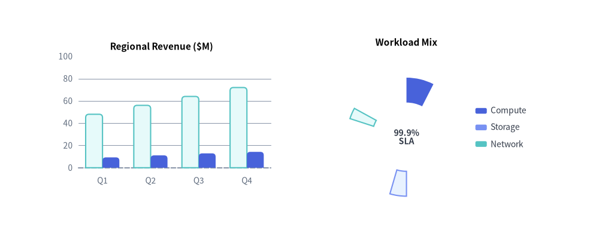
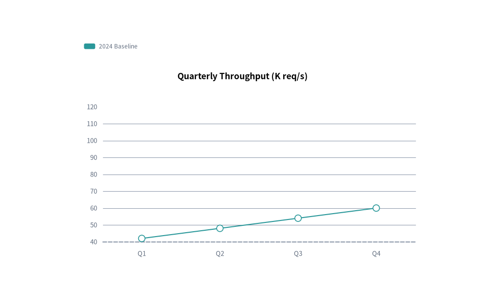
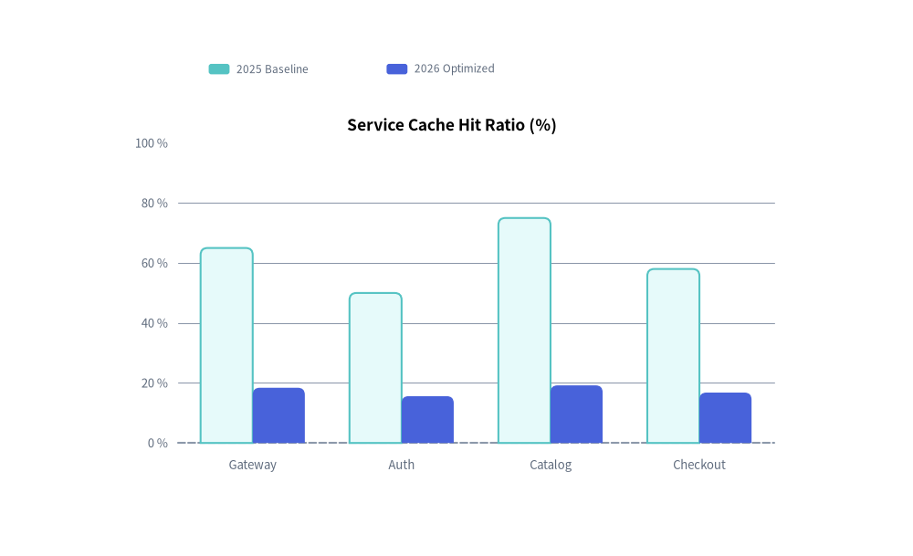
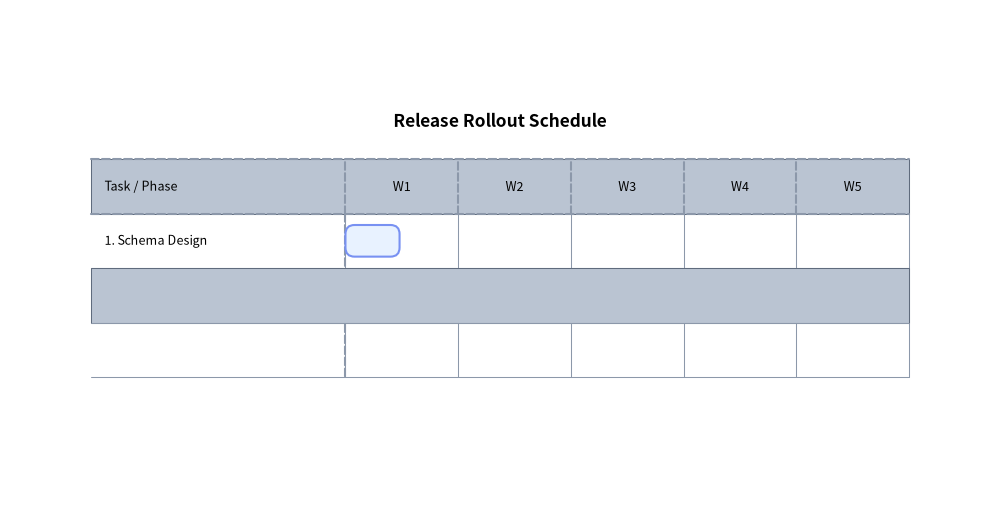

# Animating Charts

All 7 chart classes in `drawlib.charts` (`BarChart`, `LineChart`, `AreaChart`, `PieChart`, `RadarChart`, `ScatterChart`, `GanttChart`) follow the **Pre-Build & Mutate** lifecycle:


<figure class="drawlib-image" style="text-align: center;">
  
  <figcaption class="drawlib-caption">Chart Animation Overview: Locked Axes with Progressive Spatial Growth (draw_ratio)</figcaption>
</figure>

<details class="drawlib-code-details">
<summary>Source Code</summary>

```python
from drawlib.anim import Animation
from drawlib.canvas import save, setup
from drawlib.charts.bar import BarChart
from drawlib.charts.pie import PieChart
from drawlib.styles import Styles

setup(width=126, height=48)
anim = Animation(fps=10.0)

bar = BarChart(
    categories=["Q1", "Q2", "Q3", "Q4"],
    axis_line_style=Styles.MutedDashed,
    axis_text_style=Styles.Muted.patch(text_size=10.0),
    grid_style=Styles.MutedThin,
    width=52,
    height=33,
    title="Regional Revenue ($M)",
    title_style=Styles.BlackBold.patch(text_size=11.0),
    bar_r=0.7,
)
bar.configure_y_axis(min_value=0, max_value=100)
s_base = bar.add_series("2025", [48, 56, 64, 72], style=Styles.SecondaryNeutral)
s_curr = bar.add_series("2026", [62, 74, 86, 95], style=Styles.PrimaryFlat)

pie = PieChart(
    radius=12.5,
    hole_ratio=0.58,
    center_text="99.9%\nSLA",
    center_text_style=Styles.DarkBold.patch(text_size=10.0),
    title="Workload Mix",
    title_style=Styles.BlackBold.patch(text_size=11.0),
)
sl1 = pie.add_slice("Compute", 50.0, style=Styles.PrimaryFlat)
sl2 = pie.add_slice("Storage", 30.0, style=Styles.PrimaryNeutral)
sl3 = pie.add_slice("Network", 20.0, style=Styles.SecondaryNeutral)
slices = [sl1, sl2, sl3]

for r in [0.15, 0.35, 0.55, 0.80, 1.0]:
    s_curr.draw_ratio = r
    for sl in slices:
        sl.draw_ratio = r
    is_last = (r == 1.0)
    with anim.frame(duration=2.2 if is_last else 0.12):
        bar.draw(xy=(8.0, 7.5))
        pie.draw(xy=(69.0, 2.5))
        pie.draw_legend(xy=(100.0, 24.5), text_style=Styles.Dark.patch(text_size=10.0))

save()
```

</details>


1. Instantiate the chart and register all series, slices, or tasks **once** outside the loop (`s = chart.add_series(...)`, `sl = chart.add_slice(...)`, `t = chart.add_task(...)`).
2. Inside `with anim.frame():`, mutate `.show`, `.draw_ratio` (`0.0` to `1.0`), or `.draw_direction` (`"bottom_to_top"` or `"left_to_right"`), and call `chart.draw(xy=..., scale=1.0)`.

---

## 1. Progressive Series Reveal (`s.show`)

Because Drawlib computes automatic axis bounds (`min_value`, `max_value`, `tick_step`), pie proportions, and Gantt row heights across **all registered elements regardless of `show=False`**, toggling `s.show = True` across frames reveals series one by one without ever shifting or rescaling the chart axes:


```python
from drawlib.anim import Animation
from drawlib.canvas import save, setup
from drawlib.charts.line import LineChart
from drawlib.styles import Styles

setup(width=105, height=66)
anim = Animation(fps=1.2)

chart = LineChart(
    categories=["Q1", "Q2", "Q3", "Q4"],
    axis_line_style=Styles.MutedDashed,
    axis_text_style=Styles.Muted.patch(text_size=10.0),
    grid_style=Styles.MutedThin,
    width=82,
    height=44,
    title="Quarterly Throughput (K req/s)",
    title_style=Styles.BlackBold.patch(text_size=12.0),
    smooth=True,
)

s1 = chart.add_series("2024 Baseline", [42, 48, 54, 60], style=Styles.Secondary, line_style="dashed")
s2 = chart.add_series("2025 Target", [50, 65, 78, 92], style=Styles.Accent)
s3 = chart.add_series("2026 Actual", [55, 76, 94, 115], style=Styles.Primary, line_width=2.5)
series_list = [s1, s2, s3]

for step in range(len(series_list)):
    for i, s in enumerate(series_list):
        s.show = (i <= step)
    is_last = (step == len(series_list) - 1)
    with anim.frame(duration=2.5 if is_last else 0.9):
        chart.draw(xy=(11, 8))
        chart.draw_legend(xy=(15, 56), text_style=Styles.Muted.patch(text_size=10.0), orientation="horizontal")

save()
```

<figure class="drawlib-image" style="text-align: center;">
  
  <figcaption class="drawlib-caption">Progressive Multi-Series LineChart Reveal with Locked Y-Axis</figcaption>
</figure>


---

## 2. Partial Spatial Growth (`s.draw_ratio` & `s.draw_direction`)

Every `Series`, `Slice`, and `Task` supports built-in partial spatial rendering via `draw_ratio: float` (`0.0` to `1.0`) and `draw_direction: DrawDirection` (`"bottom_to_top"` or `"left_to_right"`):
- **`BarChart`**: `"bottom_to_top"` *(default)* grows all bars vertically from the baseline; `"left_to_right"` reveals bars sequentially category-by-category.
- **`LineChart` / `AreaChart`**: `"left_to_right"` *(default)* sweeps the curve continuously from left to right; `"bottom_to_top"` rises vertically from the baseline.
- **`ScatterChart`**: `"left_to_right"` *(default)* sweeps series points across the X-axis range (`x <= x_min + (x_max - x_min) * r`); `"bottom_to_top"` rises from the bottom axis toward target `y` while scaling marker `radius` by `r`. Individual standalone points registered via `pt = chart.add(x, y, ...)` also expose `pt.show: bool` and `pt.style: Style`.
- **`PieChart`**: `"left_to_right"` *(default)* sweeps the wedge angularly; `"bottom_to_top"` expands radially outward.
- **`RadarChart`**: `"bottom_to_top"` *(default)* expands the polygon radially from the center; `"left_to_right"` sweeps spoke-by-spoke.
- **`GanttChart`**: `"left_to_right"` *(default)* extends task bars horizontally from `start` toward `end`; `"bottom_to_top"` grows task bars vertically from their bottom edge.


```python
from drawlib.anim import Animation
from drawlib.canvas import save, setup
from drawlib.charts.bar import BarChart
from drawlib.styles import Styles

setup(width=105, height=64)
anim = Animation(fps=10.0)

chart = BarChart(
    categories=["Gateway", "Auth", "Catalog", "Checkout"],
    axis_line_style=Styles.MutedDashed,
    axis_text_style=Styles.Muted.patch(text_size=10.0),
    grid_style=Styles.MutedThin,
    width=82,
    height=44,
    title="Service Cache Hit Ratio (%)",
    title_style=Styles.BlackBold.patch(text_size=12.0),
    bar_r=0.8,
)
chart.configure_y_axis(min_value=0, max_value=100, unit="%")

s1 = chart.add_series("2025 Baseline", [65, 50, 75, 58], style=Styles.SecondaryNeutral)
s2 = chart.add_series("2026 Optimized", [92, 78, 96, 84], style=Styles.PrimaryFlat)

for r in [0.2, 0.4, 0.6, 0.8, 1.0]:
    s2.draw_ratio = r
    is_last = (r == 1.0)
    with anim.frame(duration=2.2 if is_last else 0.12):
        chart.draw(xy=(11, 8))
        chart.draw_legend(xy=(21, 56), text_style=Styles.Muted.patch(text_size=10.0), orientation="horizontal")

save()
```

<figure class="drawlib-image" style="text-align: center;">
  
  <figcaption class="drawlib-caption">Smooth BarChart Growth via s.draw_ratio</figcaption>
</figure>


---

## 3. Project Schedule Reveal (`GanttChart`)

In `GanttChart`, every registration method returns a mutable model object:
- **`Task`** (`gantt.add_task(...)`): `.show`, `.style`, `.text_style`, `.draw_ratio`, `.draw_direction` (`"left_to_right"` or `"bottom_to_top"`). Hiding a `Task` (`task.show = False`) also **automatically hides any `Dependency` arrows** connected to `from_task` or `to_task`.
- **`Section`** (`gantt.add_section(...)`): `.show`, `.style`, `.text_style`.
- **`Milestone`** (`gantt.add_milestone(...)`): `.show`, `.style`, `.text_style`.
- **`Marker`** (`gantt.add_marker(...)`): `.show`, `.style`, `.text_style`.
- **`Dependency`** (`gantt.add_dependency(...)`): `.show`, `.style`.

Mutating `task.show` and `task.draw_ratio` reveals and extends task bars along the timeline while keeping all row lanes and column headers fixed:


```python
from drawlib.anim import Animation
from drawlib.canvas import save, setup
from drawlib.charts.gantt import GanttChart
from drawlib.styles import Styles

setup(width=110, height=54)
anim = Animation(fps=8.0)

gantt = GanttChart(
    columns=["W1", "W2", "W3", "W4", "W5"],
    axis_line_style=Styles.MutedDashed,
    axis_text_style=Styles.Black.patch(text_size=10.0),
    grid_style=Styles.MutedThin,
    header_style=Styles.MutedThin,
    zebra_style=Styles.MutedThin,
    width=96.0,
    label_width=30.0,
    header_height=6.2,
    row_height=6.2,
    title="Release Rollout Schedule",
    title_style=Styles.BlackBold.patch(text_size=12.0),
    bar_radius=1.0,
)

t1 = gantt.add_task("1. Schema Design", start="W1", end=1.2, style=Styles.PrimaryNeutral)
t2 = gantt.add_task("2. Core Engine", start="W2", end=3.2, style=Styles.PrimaryFlat, show=False)
t3 = gantt.add_task("3. Production GA", start="W4", end=4.8, style=Styles.SecondaryNeutral, show=False)
tasks = [t1, t2, t3]

for idx, active_task in enumerate(tasks):
    active_task.show = True
    for r in [0.4, 0.8, 1.0]:
        active_task.draw_ratio = r
        is_final = (idx == len(tasks) - 1 and r == 1.0)
        with anim.frame(duration=2.5 if is_final else 0.14):
            gantt.draw(xy=(7, 7))

save()
```

<figure class="drawlib-image" style="text-align: center;">
  
  <figcaption class="drawlib-caption">GanttChart Progressive Task Schedule Reveal</figcaption>
</figure>


---

## 4. Spatial Overrides & Proportional Scaling (`draw` & `draw_legend`)

Every chart's `draw()` and `draw_legend()` methods accept temporary spatial overrides and a uniform proportional `scale: float = 1.0` factor anchored at `xy`:
- **Cartesian & Gantt Charts** (`BarChart`, `LineChart`, `AreaChart`, `ScatterChart`, `GanttChart`):
  `chart.draw(xy=(x, y), *, width=None, height=None, scale=1.0)`
- **Radial Charts** (`PieChart`, `RadarChart`):
  `chart.draw(xy=(x, y), *, radius=None, width=None, height=None, scale=1.0)`
- **Standalone Legend**:
  `chart.draw_legend(xy=(x, y), text_style=..., orientation="vertical"|"horizontal", swatch_size=(2.4, 1.2), item_gap=4.0, *, scale=1.0)`

Passing `scale != 1.0` scales the entire chart container, axis lines, bars/curves, markers, and typography proportionally without mutating the underlying chart configuration.
