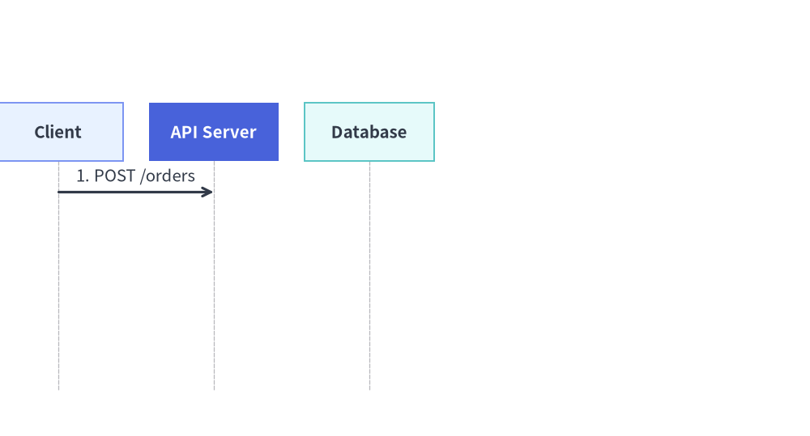

# Animating Technical Diagrams

All 6 coordinate-controlled diagram engines in [`drawlib.diagrams`](../05_diagrams/overview.md) (`FlowDiagram`, `ArchitectureDiagram`, `SequenceDiagram`, `StateDiagram`, `ClassDiagram`, and `ERDiagram`) follow **Pattern B (Pre-Build & Mutate)**:


<figure class="drawlib-image" style="text-align: center;">
  
  <figcaption class="drawlib-caption">Technical Diagram Animation: Step-by-Step Node, Container, and Edge Walkthrough</figcaption>
</figure>

<details class="drawlib-code-details">
<summary>Source Code</summary>

```python
from drawlib.anim import Animation
from drawlib.canvas import save, setup
from drawlib.diagrams.architecture import ArchitectureDiagram, Node, NodeGroup, PhosphorIcon
from drawlib.styles import Styles

setup(width=124, height=46)
anim = Animation(fps=2.0)

d = ArchitectureDiagram(
    node_style=Styles.Primary,
    node_text_style=Styles.DarkBold.patch(text_size=10.5),
    edge_style=Styles.DarkBold,
    edge_text_style=Styles.Dark.patch(text_size=10.0),
    node_card_style=Styles.Neutral,
)

client = d.add(
    Node((24, 15), "Client App", icon=PhosphorIcon.LAPTOP, icon_size=6.2, card_style=Styles.Neutral),
    xy=(15.0, 21.0),
)
vpc = d.add(NodeGroup(title="Production VPC", padding=4.2, show=False), xy=(46.0, 5.0))
gw = vpc.add(
    Node(
        (24, 15),
        "API Gateway",
        icon=PhosphorIcon.SHIELD_CHECK,
        icon_size=6.2,
        card_style=Styles.PrimaryFlat,
        style=Styles.White,
        text_style=Styles.WhiteBold.patch(text_size=10.5),
        show=False,
    ),
    xy=(16.0, 16.0),
)
svc = vpc.add(
    Node(
        (24, 15),
        "Order Service",
        icon=PhosphorIcon.CPU,
        icon_size=6.2,
        card_style=Styles.PrimaryNeutral,
        show=False,
    ),
    xy=(54.0, 16.0),
)

e1 = d.connect(client, gw, label="HTTPS")
e2 = d.connect(gw, svc, label="gRPC")

# Frame 1: Client entry point
with anim.frame(duration=0.7):
    d.draw(xy=(2.0, 1.0))

# Frame 2: Reveal VPC container and API Gateway (active focal node)
vpc.show = True
gw.show = True
e1.style = Styles.PrimaryBold
with anim.frame(duration=0.7):
    d.draw(xy=(2.0, 1.0))

# Frame 3: Settle Gateway into PrimaryNeutral and highlight Order Service
e1.style = Styles.DarkBold
gw.card_style = Styles.PrimaryNeutral
gw.style = Styles.Primary
gw.text_style = Styles.DarkBold.patch(text_size=10.5)
svc.show = True
svc.card_style = Styles.PrimaryFlat
svc.style = Styles.White
svc.text_style = Styles.WhiteBold.patch(text_size=10.5)
e2.style = Styles.PrimaryBold
with anim.frame(duration=0.7):
    d.draw(xy=(2.0, 1.0))

# Frame 4: Completed topology settled with Gateway as primary focal point
e2.style = Styles.DarkBold
svc.card_style = Styles.SecondaryNeutral
svc.style = Styles.Primary
svc.text_style = Styles.DarkBold.patch(text_size=10.5)
gw.card_style = Styles.PrimaryFlat
gw.style = Styles.White
gw.text_style = Styles.WhiteBold.patch(text_size=10.5)
with anim.frame(duration=2.5):
    d.draw(xy=(2.0, 1.0))

save()
```

</details>


1. **Construct Topology Once**: Instantiate the diagram and register all nodes, containers, lanes, blocks, notes, and connections **once** outside the animation loop, keeping references to the returned objects.
2. **Mutate & Redraw Per Frame**: Inside `with anim.frame():`, mutate `.show`, `.style`, `.text_style`, `.label` / `.set_label()`, or `.set_style()`, and call `d.draw(xy=..., scale=...)`.

*(For declarative auto-layout solvers in `drawlib.graph`, see [Animating Auto-Layout Graphs](./graphs.md).)*

---

## 1. Key Animation Capabilities Across Diagram Engines

| Capability | Target Properties & Objects | How It Works |
| :--- | :--- | :--- |
| **Visibility & Automatic Edge / Junction Hiding** | `node.show`, `edge.show`, `group.show`, `lane.show`, `block.show`, `note.show` | Setting `node.show = False` hides the node **and automatically hides all edges connected to it** (`Edge`, `Transition`, `Relationship`). For `Junction` routing points (such as `node.fork([t1, t2])`) in `FlowDiagram` and `ArchitectureDiagram`, the upstream wire entering the junction stays hidden until at least one downstream target from that junction is visible. |
| **Dynamic Active-Path Highlighting** | `node.style`, `node.text_style`, `edge.style`, `edge.text_style` | Reassign `node.style = Styles.PrimaryFlat` (with `Styles.WhiteBold` text) and `edge.style = Styles.PrimaryBold` between frames to highlight active execution paths, then settle visited nodes into calm `Styles.PrimaryNeutral`. |
| **In-Place Label & Style Mutation** | `msg.set_label(...)`, `msg.set_style(...)`, `note.set_text(...)`, `note.set_style(...)`, `edge.label` | Mutate message labels, note text, or connector styles dynamically across frames without shifting lifelines or node coordinates. |
| **Structured Containers (`Lane`, `Block`, `Note`)** | `flow.add_lane(...) -> Lane`, `with seq.loop(...) as blk:`, `seq.note(...) -> Note` | Swimlanes (`Lane`), sequence condition frames (`Block` from `loop`, `alt`, `opt`, `par`), and sticky notes (`Note`) also return mutable objects with `.show` and `.style`. |
| **Camera Pan & Zoom** | `d.draw(xy=(ox, oy), scale=s)` | Passing `xy=(ox, oy)` and `scale=s` to `draw()` translates the diagram origin and scales all coordinates, box dimensions, stroke widths, icons, and font sizes uniformly. |

---

## 2. Step-by-Step Node, Junction & Active-Path Walkthrough (`FlowDiagram`)

By combining `node.show` (which automatically reveals incident edges and `Junction` fan-out stems only when targets become visible), `node.style`, and `edge.style` mutation, you can animate a request flowing through a pipeline step by step while preserving the **50%+ Neutral** color discipline:


```python
from drawlib.anim import Animation
from drawlib.canvas import save, setup
from drawlib.diagrams.flow import Decision, End, FlowDiagram, Process, Start
from drawlib.styles import Styles

setup(width=120, height=34)
anim = Animation(fps=1.5)

# 1. Build topology once outside the loop
flow = FlowDiagram(
    node_style=Styles.Neutral,
    edge_style=Styles.DarkBold,
    edge_text_style=Styles.Dark.patch(text_size=10.0),
)
n1 = flow.add(
    Start("Request", width=22, height=11.5, text_style=Styles.DarkBold.patch(text_size=10.5)),
    xy=(16, 17),
)
n2 = flow.add(
    Process("Authorize", width=25, height=12.5, style=Styles.PrimaryFlat, text_style=Styles.WhiteBold.patch(text_size=10.5)),
    xy=(49, 17),
    show=False,
)
n3 = flow.add(
    Decision("Valid?", width=22, height=13.5, style=Styles.SecondaryNeutral, text_style=Styles.DarkBold.patch(text_size=10.5)),
    xy=(80, 17),
    show=False,
)
n4 = flow.add(
    End("200 OK", width=20, height=11.5, style=Styles.PrimaryFlat, text_style=Styles.WhiteBold.patch(text_size=10.5)),
    xy=(106, 17),
    show=False,
)
e1 = n1.connect(n2)
e2 = n2.connect(n3)
e3 = n3.connect(n4, label="Yes")

# 2. Frame 1: Initial entry point (e1, e2, e3 are automatically hidden)
with anim.frame(duration=0.8):
    flow.draw()

# 3. Frame 2: Reveal Authorize node and highlight incoming edge e1
n2.show = True
e1.style = Styles.PrimaryBold
with anim.frame(duration=0.8):
    flow.draw()

# 4. Frame 3: Settle Authorize into PrimaryNeutral, reveal Decision gate, highlight e2
e1.style = Styles.DarkBold
n2.style = Styles.PrimaryNeutral
n2.text_style = Styles.DarkBold.patch(text_size=10.5)
n3.show = True
n3.style = Styles.PrimaryFlat
n3.text_style = Styles.WhiteBold.patch(text_size=10.5)
e2.style = Styles.PrimaryBold
with anim.frame(duration=0.8):
    flow.draw()

# 5. Frame 4: Settle Decision gate, reveal 200 OK, highlight e3 (hold final frame)
e2.style = Styles.DarkBold
n3.style = Styles.SecondaryNeutral
n3.text_style = Styles.DarkBold.patch(text_size=10.5)
n4.show = True
e3.style = Styles.PrimaryBold
with anim.frame(duration=2.5):
    flow.draw()

save()
```

<figure class="drawlib-image" style="text-align: center;">
  
  <figcaption class="drawlib-caption">FlowDiagram Walkthrough with Automatic Edge/Junction Reveal and Active-Path Highlighting</figcaption>
</figure>


---

## 3. Camera Pan, Zoom & Progressive Message/Block Reveal (`SequenceDiagram`)

Every diagram's `draw(xy=(x, y), *, scale=s)` method shifts the diagram origin to `(x, y)` and multiplies all coordinates, box sizes, line widths, and font sizes by `scale`. In `SequenceDiagram`, participant lifelines and vertical timeline spacing remain 100% locked across frames even when later `Message`, `Block` (`loop`, `alt`, `opt`, `par`), or `Note` objects have `show=False`:


```python
from drawlib.anim import Animation
from drawlib.canvas import save, setup
from drawlib.diagrams.sequence import Participant, SequenceDiagram
from drawlib.styles import Styles

setup(width=115, height=62)
anim = Animation(fps=8.0)

seq = SequenceDiagram(
    node_style=Styles.Primary,
    node_text_style=Styles.DarkBold.patch(text_size=10.5),
    edge_style=Styles.DarkBold,
    edge_text_style=Styles.Dark.patch(text_size=10.0),
    node_card_style=Styles.Neutral,
    autonumber=True,
)
client = seq.add(Participant((21, 9.5), "Client", card_style=Styles.PrimaryNeutral, text_style=Styles.DarkBold.patch(text_size=10.5)))
api = seq.add(Participant((21, 9.5), "API Server", card_style=Styles.PrimaryFlat, text_style=Styles.WhiteBold.patch(text_size=10.5)))
db = seq.add(Participant((21, 9.5), "Database", card_style=Styles.SecondaryNeutral, text_style=Styles.DarkBold.patch(text_size=10.5)))

m1 = client.request(api, "POST /orders")
with seq.opt("Idempotent Write", show=False) as blk:
    m2 = api.request(db, "INSERT order", show=False)
m3 = api.reply(client, "201 Created", show=False)

# Phase 1: Camera pan & zoom-in onto stage via draw(xy=..., scale=...)
for ox, sc in [(-12, 0.92), (-6, 0.96), (0, 1.0)]:
    with anim.frame(duration=0.14):
        seq.draw(xy=(ox, 0), scale=sc)

# Phase 2: Reveal opt Block and DB write message with active highlight
blk.show = True
m2.show = True
m2.set_style(Styles.PrimaryBold)
with anim.frame(duration=0.7):
    seq.draw()

# Phase 3: Settle m2 and reveal final reply m3 with updated label
m2.set_style(Styles.DarkBold)
m3.show = True
m3.set_label("201 Created (Committed)").set_style(Styles.PrimaryBold)
with anim.frame(duration=2.5):
    seq.draw()

save()
```

<figure class="drawlib-image" style="text-align: center;">
  
  <figcaption class="drawlib-caption">Sliding, Scaling, and Revealing a SequenceDiagram via draw(xy, scale) and .show / .set_style()</figcaption>
</figure>


---

## 4. Tips for `ArchitectureDiagram`, `StateDiagram`, `ClassDiagram` & `ERDiagram`

- **`ArchitectureDiagram`**: Toggle `group.show` and `node.show` to reveal VPCs, subnets, and microservices tier by tier. When `node.show = False`, any attached `Edge` is hidden automatically, and for `lb.fork([pod1, pod2])` fan-outs, the upstream trunk entering the `Junction` stays hidden until at least one target pod is visible.
- **`StateDiagram`**: Toggle `state.show` / `note.show` and mutate `state.style` and `transition.style` to walk through state machine lifecycles while keeping all states anchored at their exact coordinates.
- **`ClassDiagram` & `ERDiagram`**: Reveal domain classes or database tables progressively by toggling `cls.show` or `entity.show` (which automatically reveals their UML or Crow's Foot `Relationship` lines as both endpoints become visible) and highlighting `rel.style = Styles.PrimaryBold`.


```python
from drawlib.anim import Animation
from drawlib.canvas import save, setup
from drawlib.diagrams.architecture import ArchitectureDiagram, Node, NodeGroup, PhosphorIcon
from drawlib.styles import Styles

setup(width=122, height=62)
anim = Animation(fps=1.5)

d = ArchitectureDiagram(
    node_style=Styles.Primary,
    node_text_style=Styles.DarkBold.patch(text_size=10.5),
    edge_style=Styles.DarkBold,
    edge_text_style=Styles.Dark.patch(text_size=10.0),
    node_card_style=Styles.Neutral,
)

# 1. External Load Balancer (Visible on Frame 1)
lb = d.add(
    Node(
        (26, 16),
        "Load Balancer",
        icon=PhosphorIcon.GLOBE,
        icon_size=6.5,
        card_style=Styles.PrimaryFlat,
        style=Styles.White,
        text_style=Styles.WhiteBold.patch(text_size=10.5),
    ),
    xy=(18.0, 31.0),
)

# 2. Private Subnet Group & App Pods (Revealed progressively across frames)
group = d.add(NodeGroup(title="Compute Subnet (group.show)", padding=5.0, show=False), xy=(52.0, 4.0))
app1 = group.add(
    Node((24, 15.5), "App Pod 1", icon=PhosphorIcon.CPU, icon_size=6.5, card_style=Styles.PrimaryNeutral, show=False),
    xy=(28.0, 35.0),
)
app2 = group.add(
    Node((24, 15.5), "App Pod 2", icon=PhosphorIcon.CPU, icon_size=6.5, card_style=Styles.SecondaryNeutral, show=False),
    xy=(28.0, 12.5),
)

# Junction fan-out (automatically stays hidden while app1 & app2 have show=False)
lb.fork([app1, app2], at_x=42.0, padding=1.5)

# Frame 1: Only Load Balancer visible (Junction trunk is automatically hidden)
with anim.frame(duration=0.8):
    d.draw(xy=(2.0, 1.0))

# Frame 2: Reveal Subnet container + App Pod 1 (upper fork branch appears automatically)
group.show = True
app1.show = True
with anim.frame(duration=0.8):
    d.draw(xy=(2.0, 1.0))

# Frame 3: Reveal App Pod 2 (full 1-to-2 fan-out completed)
app2.show = True
with anim.frame(duration=2.5):
    d.draw(xy=(2.0, 1.0))

save()
```

<figure class="drawlib-image" style="text-align: center;">
  
  <figcaption class="drawlib-caption">ArchitectureDiagram Tier-by-Tier Container Reveal and Automatic Junction Fan-Out Hiding</figcaption>
</figure>


