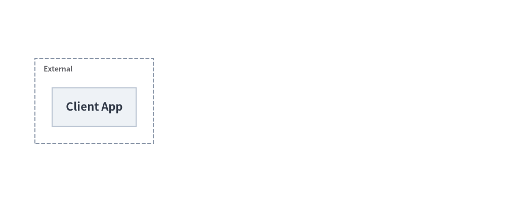
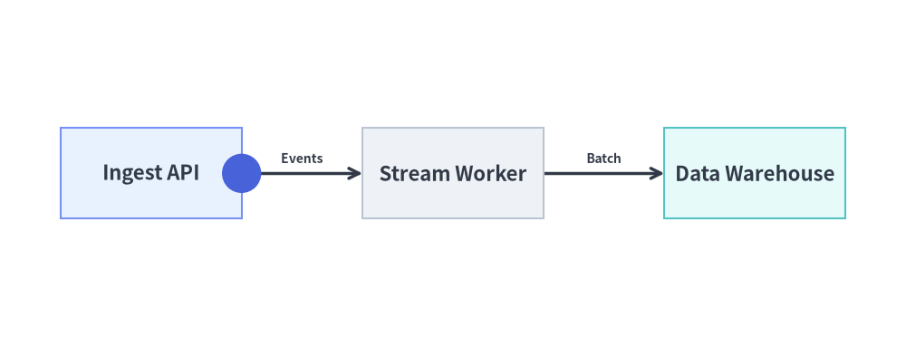

# Animating Auto-Layout Graphs

All 5 declarative auto-layout graph solvers in [`drawlib.graph`](../06_graph/overview.md) (`ArchitectureGraph`, `LayerGraph`, `TreeGraph`, `RadialGraph`, and `GridGraph`) follow **Pattern B (Pre-Build & Mutate)**:

1. **Declare Full Topology Once**: Register all nodes (`g.node()`), clusters (`g.cluster()` / `g.group()`), and edges (`g.edge()`) **once** outside the animation loop.
2. **Mutate & Redraw Per Frame**: Inside `with anim.frame():`, mutate `node.show`, `node.style`, `cluster.show`, `edge.show`, or `edge.style`, and call `g.draw(margin=..., scale=...)` (or pre-compute `layout = g.calc()` and call `layout.draw()`).

*(For coordinate-controlled diagrams in `drawlib.diagrams`, see [Animating Technical Diagrams](./diagrams.md).)*

---

## 1. Deterministic Layout Locking (`g.calc()` & `.show = False`)

A core challenge when animating auto-layout graphs in traditional tools is **layout jumping**: adding a node on Frame 2 causes the layout engine to recompute all positions and shift Frame 1's nodes unpredictably.

Drawlib eliminates layout jumping by separating **layout solving (`g.calc()`)** from **visibility filtering (`show=False`)**:
- `g.calc()` always solves node coordinates, cluster bounding boxes, and orthogonal edge ports across the **entire declared topology**, regardless of whether `node.show`, `cluster.show`, or `edge.show` is `False`.
- During rendering (`g.draw()` or `layout.draw()`), hidden elements (`show=False`) are skipped while visible elements render at their locked final coordinates.
- Setting `node.show = False` also **automatically hides any edges connected to that node**, so edges appear cleanly as soon as both endpoint nodes become visible.

| Declaration / Layout Property | Description |
| :--- | :--- |
| **`node.show` / `cluster.show` / `edge.show`** | Toggle visibility per frame while keeping all computed coordinates and container bounding boxes 100% stationary. |
| **`node.style` / `node.text_style`** | Highlight the newly revealed or active node with `Styles.PrimaryFlat` (`Styles.WhiteBold` text) and settle previous steps into `Styles.PrimaryNeutral` or `Styles.Neutral`. |
| **`edge.style` / `edge.text_style`** | Mutate `edge.style = Styles.PrimaryBold` to highlight active data paths, or pass `edge_layout.points` (`list[tuple[float, float]]`) from `layout = g.calc()` to `get_intermediate_path_points()` to animate packets along auto-routed edges. |
| **`g.draw(*, xy=(0, 0), width=None, height=None, margin=10.0, scale=1.0)`** | Solves and renders the layout with configurable origin translation `xy`, target `width`/`height`, outer `margin`, and uniform proportional `scale`. |

---

## 2. Step-by-Step Pipeline Reveal (`LayerGraph`)

In `LayerGraph`, `g.node(id, label, ...)` returns a mutable `Node` declaration. Toggling `node.show = (i <= step)` and updating `node.style` inside the frame loop reveals each pipeline rank sequentially while keeping the horizontal layout locked:


```python
from drawlib.anim import Animation
from drawlib.canvas import save, setup
from drawlib.graph import LayerGraph
from drawlib.styles import Styles

setup(width=125, height=42)
anim = Animation(fps=1.5)

g = LayerGraph(direction="LR", default_node_width=22.0, default_node_height=11.0)
nodes = [
    g.node("edge", "Edge Router", layer=0),
    g.node("auth", "Auth Guard", layer=1),
    g.node("core", "Core API", layer=2),
    g.node("db", "Primary DB", layer=3),
]

g.edge("edge", "auth")
g.edge("auth", "core")
g.edge("core", "db")

for step in range(len(nodes)):
    for i, node in enumerate(nodes):
        node.show = (i <= step)
        node.style = Styles.PrimaryFlat if i == step else Styles.PrimaryNeutral
        node.text_style = Styles.WhiteBold if i == step else Styles.DarkBold

    is_last = (step == len(nodes) - 1)
    with anim.frame(duration=2.5 if is_last else 0.8):
        g.draw(margin=8.0)

save()
```

<figure class="drawlib-image" style="text-align: center;">
  
  <figcaption class="drawlib-caption">Auto-Layout LayerGraph Step-by-Step Reveal</figcaption>
</figure>


---

## 3. Progressive Cluster & Edge Reveal (`ArchitectureGraph`)

In `ArchitectureGraph`, you can combine `cluster.show`, `node.show`, `node.style`, and `edge.style` to reveal cloud zones and highlight active request routing step by step across nested VPC tiers:


```python
from drawlib.anim import Animation
from drawlib.canvas import save, setup
from drawlib.graph import ArchitectureGraph
from drawlib.styles import Styles

setup(width=145, height=58)
anim = Animation(fps=1.5)

g = ArchitectureGraph(direction="LR", default_node_width=24.0, default_node_height=11.0)

# 1. Declare clusters and nodes across 3 zones
c_ext = g.cluster("ext", ["client"], label="External", pos="left", padding=5.0)
n_client = g.node("client", "Client App", style=Styles.Neutral, text_style=Styles.DarkBold)

c_app = g.cluster("app", ["gw", "worker"], label="Compute VPC", pos="center", padding=5.0, show=False)
n_gw = g.node("gw", "API Gateway", style=Styles.PrimaryFlat, text_style=Styles.WhiteBold, show=False)
n_worker = g.node("worker", "Task Worker", style=Styles.PrimaryNeutral, text_style=Styles.DarkBold, show=False)

c_data = g.cluster("data", ["db"], label="Data Tier", pos="right", padding=5.0, show=False)
n_db = g.node("db", "Primary DB", style=Styles.SecondaryNeutral, text_style=Styles.DarkBold, show=False)

e1 = g.edge("client", "gw", "HTTPS")
e2 = g.edge("gw", "worker", "Dispatch")
e3 = g.edge("worker", "db", "Write")

# Frame 1: External Client entry point
with anim.frame(duration=0.8):
    g.draw(margin=8.0)

# Frame 2: Reveal Compute VPC & API Gateway with active incoming edge
c_app.show = True
n_gw.show = True
e1.style = Styles.PrimaryBold
with anim.frame(duration=0.8):
    g.draw(margin=8.0)

# Frame 3: Reveal Task Worker inside Compute VPC
e1.style = Styles.DarkBold
n_gw.style = Styles.PrimaryNeutral
n_gw.text_style = Styles.DarkBold
n_worker.show = True
n_worker.style = Styles.PrimaryFlat
n_worker.text_style = Styles.WhiteBold
e2.style = Styles.PrimaryBold
with anim.frame(duration=0.8):
    g.draw(margin=8.0)

# Frame 4: Reveal Data Tier and complete architecture (hold final frame)
e2.style = Styles.DarkBold
n_worker.style = Styles.PrimaryNeutral
n_worker.text_style = Styles.DarkBold
c_data.show = True
n_db.show = True
n_gw.style = Styles.PrimaryFlat
n_gw.text_style = Styles.WhiteBold
e3.style = Styles.PrimaryBold
with anim.frame(duration=2.5):
    g.draw(margin=8.0)

save()
```

<figure class="drawlib-image" style="text-align: center;">
  
  <figcaption class="drawlib-caption">ArchitectureGraph Progressive Cluster, Node, and Edge Reveal</figcaption>
</figure>


---

## 4. Animating Packets Along Auto-Routed Edges (`g.calc()` & `edge_layout.points`)

Calling `layout = g.calc(width=None, height=None, margin=10.0)` **once** before the animation loop computes the exact `GraphLayout` without drawing anything:
- Every `EdgeLayout` in `layout.edges` exposes `edge_layout.points: list[tuple[float, float]]` (`[src_port, *waypoints, dst_port]`), representing the complete auto-routed polyline trajectory.
- Pass `edge_layout.points` to `get_intermediate_path_points(edge_layout.points, num=..., include_ends=True)` (or `get_intermediate_paths()`) to animate a data packet (`circle`) traveling smoothly along an auto-routed graph edge while calling `layout.draw(*, xy=(0, 0), scale=1.0)` on each frame:


```python
from drawlib.anim import Animation
from drawlib.canvas import save, setup
from drawlib.graph import LayerGraph
from drawlib.math import get_intermediate_path_points
from drawlib.shapes import circle
from drawlib.styles import Styles

setup(width=120, height=46)
anim = Animation(fps=10.0)

g = LayerGraph(direction="LR", default_node_width=24.0, default_node_height=12.0)
g.node("ingest", "Ingest API", layer=0, style=Styles.PrimaryNeutral, text_style=Styles.DarkBold)
g.node("worker", "Stream Worker", layer=1, style=Styles.Neutral, text_style=Styles.DarkBold)
g.node("store", "Data Warehouse", layer=2, style=Styles.SecondaryNeutral, text_style=Styles.DarkBold)
g.edge("ingest", "worker", "Events")
g.edge("worker", "store", "Batch")

# 1. Solve layout once to inspect auto-routed edge polylines
layout = g.calc(margin=10.0)
pts_e0 = get_intermediate_path_points(layout.edges[0].points, num=3, include_ends=True)
pts_e1 = get_intermediate_path_points(layout.edges[1].points, num=3, include_ends=True)

# 2. Hop 1: Packet travels along layout.edges[0].points
for pkt_xy in pts_e0:
    with anim.frame(duration=0.12):
        layout.draw()
        circle(pkt_xy, radius=2.6, style=Styles.PrimaryFlat)

# 3. Hop 2: Highlight worker and move packet along layout.edges[1].points
layout.nodes["worker"].style = Styles.PrimaryFlat
layout.nodes["worker"].text_style = Styles.WhiteBold
for i, pkt_xy in enumerate(pts_e1):
    is_last = (i == len(pts_e1) - 1)
    if is_last:
        layout.nodes["worker"].style = Styles.PrimaryNeutral
        layout.nodes["worker"].text_style = Styles.DarkBold
        layout.nodes["store"].style = Styles.PrimaryFlat
        layout.nodes["store"].text_style = Styles.WhiteBold
    with anim.frame(duration=2.2 if is_last else 0.12):
        layout.draw()
        if not is_last:
            circle(pkt_xy, radius=2.6, style=Styles.PrimaryFlat)

save()
```

<figure class="drawlib-image" style="text-align: center;">
  
  <figcaption class="drawlib-caption">Animating a Data Packet Along an Auto-Routed Graph Edge via layout = g.calc() and edge_layout.points</figcaption>
</figure>


