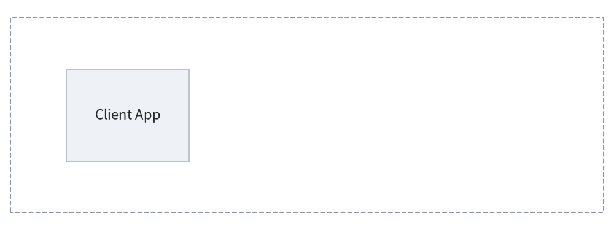
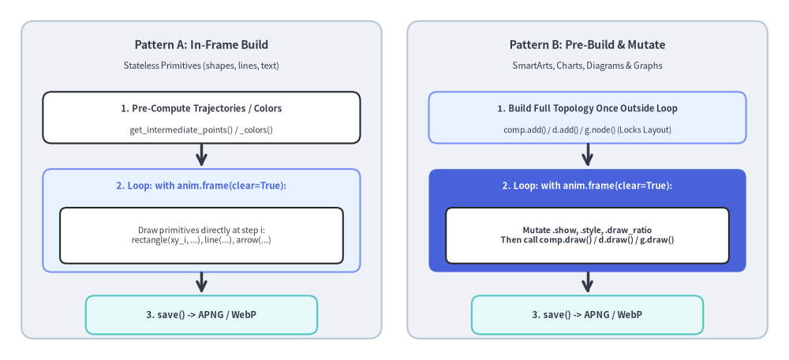
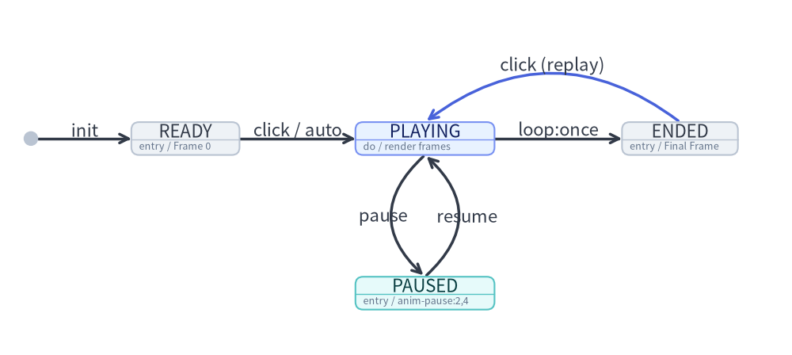

# Animations Overview (APNG & WebP)

Drawlib provides native support for generating multi-frame animations in both **Animated Portable Network Graphics (APNG)** and **Animated WebP** formats.  
Animations empower developers and AI coding agents to create clean, high-framerate, multi-step architectural illustrations, data visualizations, and interactive walkthroughs using declarative Python code.

---

## 1. Supported Animation Formats

| Format | Extension | Primary Advantage | Best Use Cases |
| :--- | :--- | :--- | :--- |
| **APNG** | `.png`, `.apng` | **Universal Compatibility**: Renders natively in all modern web browsers and GitHub Markdown previews. Safe static fallback to Frame 1 in PDF compilers and legacy viewers. | GitHub READMEs, markdown documentation, printable technical documents. |
| **Animated WebP** | `.webp` | **Ultra-Compact File Size**: Typically ~50% smaller than APNG with lossless quality. | Web-hosted documentation sites, high-performance web applications, mobile platforms. |


<figure class="drawlib-image" style="text-align: center;">
  
  <figcaption class="drawlib-caption">Step-by-Step Architecture Reveal</figcaption>
</figure>

<details class="drawlib-code-details">
<summary>Source Code</summary>

```python
from drawlib.anim import Animation
from drawlib.canvas import save, setup
from drawlib.lines import line
from drawlib.shapes import rectangle
from drawlib.styles import Styles

setup(width=120, height=45)
anim = Animation(fps=1.0, loop=0)

# Step 1: Base Client
with anim.frame(clear=True, duration=1.0):
    rectangle((60, 22.5), width=116, height=38, style=Styles.MutedDashed)
    rectangle((25, 22.5), width=24, height=18, style=Styles.Neutral, text="Client App")

# Step 2: Gateway appears (Hero node)
with anim.frame(clear=False, duration=1.0):
    rectangle((60, 22.5), width=24, height=18, style=Styles.PrimaryFlat, text="API Gateway", text_style=Styles.WhiteBold)
    line((37, 22.5), (48, 22.5), arrow_head="->", style=Styles.DarkBold)

# Step 3: Backend Services appear
with anim.frame(clear=False, duration=1.0):
    rectangle((95, 22.5), width=24, height=18, style=Styles.SecondaryNeutral, text="Service Cluster")
    line((72, 22.5), (83, 22.5), arrow_head="->", style=Styles.DarkBold)

# Step 4: Completed State (Held for 2.5 seconds before looping)
with anim.frame(clear=False, duration=2.5):
    rectangle((60, 6.0), width=60, height=7, style=Styles.PrimaryNeutral, text="Architecture Completed")

save()
```

</details>


---

## 2. Imports & Canvas Lifecycle

All animation functionality is centered around the `Animation` class in `drawlib.anim`:

```python
from drawlib.anim import Animation
from drawlib.canvas import save, setup
from drawlib.shapes import circle, rectangle
from drawlib.styles import Styles
```

### Automatic Canvas Coordination & Saving (`save()`)
When an `Animation` instance is initialized, it automatically registers itself with the active Drawlib canvas (`canvas._active_animation`). Calling standard `save()` captures all accumulated frames into an animated file without requiring separate export methods:

```python
anim = Animation(fps=10.0)

with anim.frame():
    circle((50, 50), radius=10, style=Styles.Primary)

# Saves as APNG (.png or .apng):
save("animation.png")
save("animation.apng")

# Saves as Animated WebP (.webp):
save("animation.webp")

# Or specify format explicitly ("webp", "png", or "apng"):
save("pipeline", format="webp")
```

> **Note**: Animations are raster frame sequences and cannot be exported as SVG. Calling `save("out.svg")` or `save("out", format="svg")` while an `Animation` is active raises a `ValueError`. Calling `save()` when zero frames have been captured also raises a `ValueError`.

---

## 3. The `Animation` Class API

### 3.1. Initialization & Read-Only Properties

```python
anim = Animation(
    fps: float | None = None,
    frame_rate: float | None = None,
    loop: int = 0,
)
```

| Parameter / Property | Type | Default | Description |
| :--- | :--- | :--- | :--- |
| `fps` | `float \| None` | `10.0` | Target playback frame rate in frames per second (e.g. `10.0` means 10 fps). Must be `> 0`. |
| `frame_rate` | `float \| None` | `10.0` | Alias for `fps`. If both are specified, `fps` takes precedence. |
| `loop` | `int` | `0` | Number of animation loops (`>= 0`). `0` means continuous infinite looping. |
| `anim.fps` | `float` *(read-only)* | — | Returns the active playback frame rate in frames per second. |
| `anim.frame_rate` | `float` *(read-only)* | — | Read-only alias for `anim.fps`. |

---

## 4. Defining Frames

### 4.1. Context Manager: `with anim.frame()` (Recommended)

The `with anim.frame()` context manager clears the canvas at the start of the block (when `clear=True`) and captures the rendered frame at the end of the block:

```python
with anim.frame(
    duration: float | None = None,
    clear: bool = True,
):
    # Standard Drawlib drawing calls
    circle((50, 50), radius=10, style=Styles.Primary)
```

| Parameter | Type | Default | Description |
| :--- | :--- | :--- | :--- |
| `duration` | `float \| None` | `None` | Display duration for this frame in **seconds** (e.g. `1.5` for 1.5 seconds). If `None`, defaults to `1 / fps` (e.g. 0.1s for 10fps). |
| `clear` | `bool` | `True` | Whether to clear existing canvas shapes before drawing this frame. Defaults to `True`. |

### 4.2. Imperative Method: `anim.add_frame()`

For procedural code where context managers are less convenient:

```python
circle((x, y), radius=5, style=Styles.Primary)
anim.add_frame(duration=0.5, clear=True)
```

---

## 5. Two Standard Animation Loop Idioms

When animating technical illustrations, **prefer `clear=True` (default per-frame redraw)** over `clear=False` whenever elements move, change styles, or toggle highlights. Drawlib's unified component lifecycle (`add()` -> `draw()`) provides two clean loop patterns depending on the module:

| Target Module | Recommended Loop Pattern | Guide |
| :--- | :--- | :--- |
| **Primitives** (`shapes`, `lines`, `text`, `icons`, `styles`) | **Pattern A: In-Frame Build**<br>Compute per-frame coordinates (`get_intermediate_points`, `get_intermediate_paths`) or interpolated colors (`get_intermediate_colors`) and draw inside `with anim.frame():`. | [Animating Primitives & Colors](./primitives.md) |
| **SmartArts** (`ChevronProcess`, `Table`, `TreeNode`, etc.) | **Pattern B: Pre-Build & Mutate** (or Pattern A)<br>Register items once via `item = comp.add(...)` and mutate `item.show`, `item.style`, `item.text_style`, or `item.text` before `draw(..., scale=1.0)`. Hidden items still reserve layout slots. | [Animating SmartArts](./smartarts.md) |
| **Charts** (`BarChart`, `LineChart`, `PieChart`, `GanttChart`, etc.) | **Pattern B: Pre-Build & Mutate**<br>Register series/slices/tasks once outside the loop (`s = chart.add_series(...)`), then mutate `s.show`, `s.draw_ratio`, `s.draw_direction`, or `s.style` inside `with anim.frame():` before `chart.draw()`. Auto-scales remain 100% locked. | [Animating Charts](./charts.md) |
| **Technical Diagrams** (`FlowDiagram`, `ArchitectureDiagram`, `SequenceDiagram`, etc.) | **Pattern B: Pre-Build & Mutate**<br>Build topology once outside the loop, then mutate `.show` (auto-hides incident edges and dangling `Junction` wires), `.style`, `.text_style`, or `.set_label()` and call `draw(xy, scale)` in each frame. | [Animating Technical Diagrams](./diagrams.md) |
| **Auto-Layout Graphs** (`ArchitectureGraph`, `LayerGraph`, `TreeGraph`, etc.) | **Pattern B: Pre-Build & Mutate**<br>`g.calc()` solves coordinates across the full topology regardless of `show=False`; mutate `node.show`, `cluster.show`, or `edge.style` and call `g.draw()`, or animate packets along `edge_layout.points`. | [Animating Auto-Layout Graphs](./graphs.md) |


<figure class="drawlib-image" style="text-align: center;">
  
  <figcaption class="drawlib-caption">Pattern A (In-Frame Build) vs. Pattern B (Pre-Build Outside Loop & Mutate Inside Frame)</figcaption>
</figure>

<details class="drawlib-code-details">
<summary>Source Code</summary>

```python
from drawlib.canvas import save, setup
from drawlib.lines import line
from drawlib.shapes import rectangle
from drawlib.styles import Styles
from drawlib.text import text

setup(width=184, height=84)

# Left Panel: Pattern A (In-Frame Build)
rectangle((47, 42), width=84, height=74, style=Styles.Neutral.patch(shape_r=3.0))
text((47, 73.5), "Pattern A: In-Frame Build", style=Styles.DarkBold.patch(text_size=10.0))
text((47, 68.5), "Stateless Primitives (shapes, lines, text)", style=Styles.Dark.patch(text_size=8.0))

rectangle((47, 56.5), width=74, height=12.0, style=Styles.White.patch(shape_r=2.0))
text((47, 58.5), "1. Pre-Compute Trajectories / Colors", style=Styles.DarkBold.patch(text_size=8.2))
text((47, 53.5), "get_intermediate_points() / _colors()", style=Styles.Dark.patch(text_size=7.6))

line((47, 50.5), (47, 45.0), arrow_head="->", style=Styles.DarkBold)

rectangle((47, 32.5), width=74, height=24.0, style=Styles.PrimaryNeutral.patch(shape_r=2.0))
text((47, 40.5), "2. Loop: with anim.frame(clear=True):", style=Styles.PrimaryBold.patch(text_size=8.2))
rectangle((47, 29.0), width=66, height=13.0, style=Styles.White.patch(shape_r=1.5))
text((47, 29.0), "Draw primitives directly at step i:\nrectangle(xy_i, ...), line(...), arrow(...)", style=Styles.Dark.patch(text_size=7.6))

line((47, 20.5), (47, 15.5), arrow_head="->", style=Styles.DarkBold)

rectangle((47, 10.5), width=54, height=9.0, style=Styles.SecondaryNeutral.patch(shape_r=2.0))
text((47, 10.5), "3. save() -> APNG / WebP", style=Styles.DarkBold.patch(text_size=8.2))

# Right Panel: Pattern B (Pre-Build & Mutate)
rectangle((137, 42), width=84, height=74, style=Styles.Neutral.patch(shape_r=3.0))
text((137, 73.5), "Pattern B: Pre-Build & Mutate", style=Styles.DarkBold.patch(text_size=10.0))
text((137, 68.5), "SmartArts, Charts, Diagrams & Graphs", style=Styles.Dark.patch(text_size=8.0))

rectangle((137, 56.5), width=74, height=12.0, style=Styles.PrimaryNeutral.patch(shape_r=2.0))
text((137, 58.5), "1. Build Full Topology Once Outside Loop", style=Styles.DarkBold.patch(text_size=8.0))
text((137, 53.5), "comp.add() / d.add() / g.node() (Locks Layout)", style=Styles.Dark.patch(text_size=7.4))

line((137, 50.5), (137, 45.0), arrow_head="->", style=Styles.DarkBold)

rectangle((137, 32.5), width=74, height=24.0, style=Styles.PrimaryFlat.patch(shape_r=2.0))
text((137, 40.5), "2. Loop: with anim.frame(clear=True):", style=Styles.WhiteBold.patch(text_size=8.2))
rectangle((137, 29.0), width=66, height=13.0, style=Styles.White.patch(shape_r=1.5))
text(
    (137, 29.0),
    "Mutate .show, .style, .draw_ratio\nThen call comp.draw() / d.draw() / g.draw()",
    style=Styles.DarkBold.patch(text_size=7.5),
)

line((137, 20.5), (137, 15.5), arrow_head="->", style=Styles.DarkBold)

rectangle((137, 10.5), width=54, height=9.0, style=Styles.SecondaryNeutral.patch(shape_r=2.0))
text((137, 10.5), "3. save() -> APNG / WebP", style=Styles.DarkBold.patch(text_size=8.2))

save()
```

</details>


---

## 6. Design Principles & Recommended `fps` / Frame `duration` Strategy

| Animation Type | Recommended `fps` | Frame `duration` Strategy | Final Hold `duration` |
| :--- | :--- | :--- | :--- |
| **Continuous Motion / Transitions** (moving packets, growing chart series via `draw_ratio`, color fades, camera pan/zoom) | `fps=8.0` – `12.0` | `0.08s` – `0.14s` per motion frame (or default `1 / fps`) | `duration=2.0` – `3.0` |
| **Step-by-Step Architectural Walkthrough** (revealing pipeline stages, chart series, or diagram/graph nodes one by one) | `fps=1.0` – `2.0` | `0.6s` – `1.0s` per step | `duration=2.5` – `3.0` |

1. **Poster Frame Principle (Static & PDF Compatibility)**:
   Standard image viewers and vector PDF exports render **Frame 1** as a static fallback image. Never leave Frame 1 completely blank—always show the baseline container or initial node on Frame 1.
2. **Hold the Final Completed Frame**:
   To give readers time to absorb the completed diagram before the loop restarts, set an extended `duration` (`2.0` to `3.0` seconds) on the final frame.
3. **Embedded Markdown Blocks**:
   Any ````drawlib```` block that initializes `Animation()` automatically outputs an animated `.png` (APNG) or `.webp` file during `drawlib build`.
4. **Built-in Lossless Compression**:
   - **APNG (`.png` / `.apng`)**: Automatically crops sub-frame delta bounding boxes and applies maximum Zlib (`compress_level=9`) + Huffman (`optimize=True`) compression.
   - **Animated WebP (`.webp`)**: Encodes with lossless sub-frame minimization (`lossless=True`, `minimize_size=True`), typically ~50% smaller than APNG.

---

## 7. Interactive Playback Control in Presentation Slides (`slide`)

In 16:9 presentation slide decks (`drawlib init slide`), animated `.png` (APNG) and `.webp` blocks can be controlled interactively via `<canvas>` playback options on the ````drawlib```` fence:

````markdown
```drawlib file:pipeline.webp anim-trigger:click anim-loop:once anim-pause:2,4
from drawlib.anim import Animation
...
```
````

| Option | Values | Default | Description |
| :--- | :--- | :--- | :--- |
| **`anim-trigger`** | `auto` \| `click` | `auto` | `auto` starts playback as soon as the slide appears; `click` holds on Frame 0 (`READY`) until the presenter clicks the diagram. |
| **`anim-loop`** | `once` \| `infinite` | `infinite` (`once` when `anim-pause` is set) | `once` stops on the final frame (`ENDED`, click to replay from Frame 0); `infinite` loops continuously. |
| **`anim-pause`** | Comma-separated 0-based frame indices (e.g. `2,4`) | `None` | Pauses playback (`PAUSED`) immediately upon rendering each listed frame index. Clicking the diagram resumes playback from `frame + 1` until the next pause point or end. |


<figure class="drawlib-image" style="text-align: center;">
  
  <figcaption class="drawlib-caption">Interactive Slide Animation Playback State Machine (READY, PLAYING, PAUSED, ENDED)</figcaption>
</figure>

<details class="drawlib-code-details">
<summary>Source Code</summary>

```python
from drawlib.canvas import save, setup
from drawlib.diagrams.state import InitialState, State, StateDiagram
from drawlib.styles import Styles

setup(width=205, height=92)

sd = StateDiagram(
    node_style=Styles.Neutral,
    edge_style=Styles.DarkBold,
    edge_text_style=Styles.Dark,
)

init = sd.add(InitialState(), xy=(8.0, 56.0))
ready = sd.add(
    State("READY", shape="box", entry="Frame 0", width=28.0, style=Styles.Neutral),
    xy=(48.0, 56.0),
)
playing = sd.add(
    State("PLAYING", shape="box", do="render frames", width=36.0, style=Styles.PrimaryNeutral),
    xy=(110.0, 56.0),
)
paused = sd.add(
    State("PAUSED", shape="box", entry="anim-pause:2,4", width=36.0, style=Styles.SecondaryNeutral),
    xy=(110.0, 16.0),
)
ended = sd.add(
    State("ENDED", shape="box", entry="Final Frame", width=30.0, style=Styles.Neutral),
    xy=(176.0, 56.0),
)

sd.connect(init, ready, label="init")
sd.connect(ready, playing, label="click / auto")
sd.connect(
    playing,
    paused,
    label="pause",
    bend=0.55,
    start_side="bottom_left",
    end_side="top_left",
)
sd.connect(
    paused,
    playing,
    label="resume",
    bend=0.55,
    start_side="top_right",
    end_side="bottom_right",
)
sd.connect(playing, ended, label="loop:once")
sd.connect(
    ended,
    playing,
    label="click (replay)",
    bend=0.38,
    start_side="top",
    end_side="top",
    style=Styles.PrimaryBold,
)

sd.draw()
save()
```

</details>


