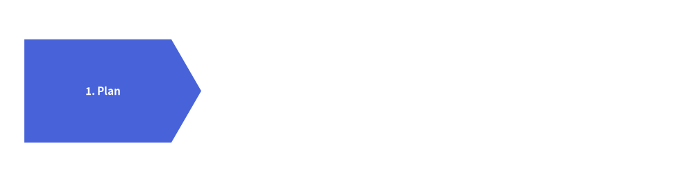
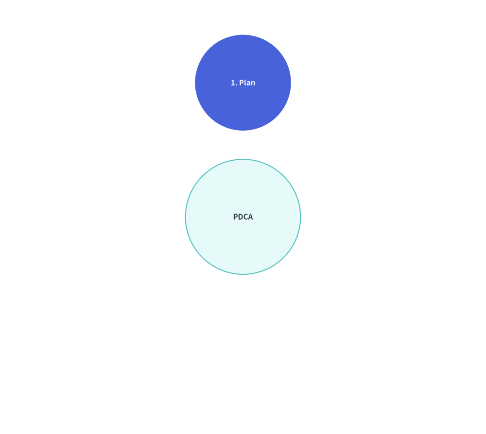
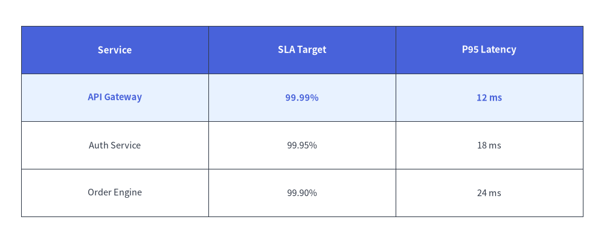

# Animating SmartArts

All item-based SmartArt components (`ChevronProcess`, `Cycle`, `GridLayout`, `Pyramid`, `BoxList`, `BulletPoints`, `TreeNode`, `MindMapNode`) follow the unified **Pre-Build & Mutate** lifecycle:
1. Instantiate the component and register all items **once** via `item = comp.add(..., show=...)` outside the loop.
2. Inside `with anim.frame():`, mutate `item.show`, `item.style`, or `item.text_style`, and call `comp.draw(xy=..., scale=1.0)`.

---

## 1. Mutable Item Classes, `item.show = False` & Proportional Scaling (`scale=1.0`)

Every item-based SmartArt returns a mutable item model from `.add(..., show=True)` (and `cycle.center` exposes `CycleCenter`), allowing you to mutate visibility, styles, and text across frames before calling `draw(..., scale=1.0)` or `draw_flexible(..., scale=1.0)`:

| SmartArt Component | Returned Item Class | Mutable Attributes | Rendering Method & `scale` Support |
| :--- | :--- | :--- | :--- |
| **`ChevronProcess`** | `ChevronItem` | `.show`, `.style`, `.text_style`, `.description_style`, `.text`, `.description` | `draw(xy, width, height, scale=1.0)` |
| **`Cycle`** | `CycleItem`, `CycleCenter` (`cycle.center`) | `.show`, `.style`, `.text_style`, `.description_style`, `.arrow_style`, `.text`, `.description` | `draw(xy, radius, align="center", scale=1.0)` |
| **`GridLayout`** | `GridItem` | `.show`, `.style`, `.text_style`, `.text`, `.position`, `.width`, `.height` | `draw(xy, width, height, margin, scale=1.0)`, `draw_flexible(..., scale=1.0)` |
| **`Pyramid`** | `PyramidItem` | `.show`, `.style`, `.text_style`, `.text` | `draw(xy, width, height, margin, scale=1.0)`, `draw_flexible(..., scale=1.0)` |
| **`BoxList`** | `BoxListItem` | `.show`, `.style`, `.text_style`, `.text` | `draw(xy, box_width, box_height, margin, direction, scale=1.0)` |
| **`BulletPoints`** | `BulletPointItem` | `.show`, `.style` (alias for `.text_style`), `.text_style`, `.text`, `.indent` | `draw(xy, scale=1.0)` |
| **`TreeNode`** | `TreeNode` | `.show`, `.text_style`, `.line_style`, `.text` | `draw(xy, scale=1.0)` |
| **`MindMapNode`** | `MindMapNode` | `.show`, `.style`, `.text_style`, `.line_style`, `.text` | `draw(xy, branch=..., scale=1.0)` |
| **`Table`** | *(Stateful `Table`)* | `reset_styles()`, `set_style_cell(..., rows=..., columns=...)` | `draw(xy, width, height, data, scale=1.0)`, `draw_flexible(..., scale=1.0)` |

When `item.show = False` on any SmartArt item:
- The hidden item **still reserves its exact spatial slot** (chevron width, orbit angle, grid cell, pyramid tier, or tree row).
- Revealing items step by step via `item.show = (i <= step)` never causes already-visible items to jump or resize.
- Passing `scale != 1.0` to `draw(..., scale=s)` or `draw_flexible(..., scale=s)` uniformly scales all shapes, margins, line widths, and font sizes relative to the anchor coordinate `xy`.

---

## 2. Linear Pipelines & Cycles (`ChevronProcess`, `Cycle`)

Build a `ChevronProcess` or `Cycle` once outside the loop, keep the list of returned `ChevronItem` or `CycleItem` objects (plus `cycle.center` (`CycleCenter`) for radial cycles), and mutate `.show`, `.style`, and `.text_style` across frames. In `Cycle`, hidden steps (`item.show = False`) preserve their angular orbit positions and automatically hide their outgoing connecting arrows:


```python
from drawlib.anim import Animation
from drawlib.canvas import save, setup
from drawlib.smartarts import ChevronProcess
from drawlib.styles import Styles

setup(width=115, height=34)
anim = Animation(fps=1.5)

proc = ChevronProcess(
    style=Styles.Neutral,
    text_style=Styles.DarkBold,
    description_style=Styles.Dark,
    flat_left_end=True,
)
items = [
    proc.add("1. Plan"),
    proc.add("2. Build"),
    proc.add("3. Verify"),
    proc.add("4. Deploy"),
]

for step in range(len(items)):
    for i, item in enumerate(items):
        item.show = (i <= step)
        item.style = Styles.PrimaryFlat if i == step else Styles.PrimaryNeutral
        item.text_style = Styles.WhiteBold if i == step else Styles.DarkBold

    is_last = (step == len(items) - 1)
    with anim.frame(duration=2.5 if is_last else 0.8):
        proc.draw(xy=(7.5, 9.5), width=100, height=15)

save()
```

<figure class="drawlib-image" style="text-align: center;">
  
  <figcaption class="drawlib-caption">Step-by-Step Pipeline Reveal with Active Stage Highlight</figcaption>
</figure>


Similarly, for `Cycle`:


```python
from drawlib.anim import Animation
from drawlib.canvas import save, setup
from drawlib.smartarts import Cycle
from drawlib.styles import Styles

setup(width=76, height=68)
anim = Animation(fps=1.5)

cycle = Cycle(
    style=Styles.Neutral,
    text_style=Styles.DarkBold.patch(text_size=10.5),
    arrow_style=Styles.DarkBold,
    node_shape="circle",
    node_radius=7.5,
)
cycle.set_center(
    text="PDCA",
    radius=9.0,
    style=Styles.SecondaryNeutral,
    text_style=Styles.DarkBold.patch(text_size=11.0),
)
steps = [
    cycle.add("1. Plan"),
    cycle.add("2. Do"),
    cycle.add("3. Check"),
    cycle.add("4. Act"),
]

for step_idx in range(len(steps)):
    for i, item in enumerate(steps):
        item.show = (i <= step_idx)
        item.style = Styles.PrimaryFlat if i == step_idx else Styles.PrimaryNeutral
        item.text_style = (
            Styles.WhiteBold.patch(text_size=10.5) if i == step_idx else Styles.DarkBold.patch(text_size=10.5)
        )

    is_last = (step_idx == len(steps) - 1)
    with anim.frame(duration=2.5 if is_last else 0.8):
        cycle.draw(xy=(38.0, 34.0), radius=21.0)

save()
```

<figure class="drawlib-image" style="text-align: center;">
  
  <figcaption class="drawlib-caption">Progressive Step Reveal and Active Highlighting on a Cycle SmartArt</figcaption>
</figure>


---

## 3. Matrix Grids & Tables (`GridLayout`, `Table`)

In `GridLayout`, `grid.add((col, row), width, height, ...)` returns a mutable `GridItem` (`cell.show`, `cell.style`, `cell.text_style`). In `Table`, call `table.reset_styles()` and `table.set_style_cell(..., rows=[active_row])` before `table.draw(xy, width, height, data)` to sweep row highlights down a matrix:


```python
from drawlib.anim import Animation
from drawlib.canvas import save, setup
from drawlib.smartarts import Table
from drawlib.styles import Colors, Styles

setup(width=115, height=52)
anim = Animation(fps=1.5)

tbl = Table(
    cell_style=Styles.White,
    text_style=Styles.Dark,
    header_cell_style=Styles.PrimaryFlat,
    header_text_style=Styles.WhiteBold,
    border_style=Styles.DarkThin,
)

data = [
    ["Service", "SLA Target", "P95 Latency"],
    ["API Gateway", "99.99%", "12 ms"],
    ["Auth Service", "99.95%", "18 ms"],
    ["Order Engine", "99.90%", "24 ms"],
]

for row_idx in [1, 2, 3]:
    tbl.reset_styles()
    tbl.set_style_cell(
        background_color=Colors.Primary1,
        text_style=Styles.PrimaryBold,
        rows=[row_idx],
    )
    is_last = (row_idx == 3)
    with anim.frame(duration=2.5 if is_last else 0.8):
        tbl.draw(xy=(7.5, 44), width=100, height=34, data=data)

save()
```

<figure class="drawlib-image" style="text-align: center;">
  
  <figcaption class="drawlib-caption">Table Row Highlight Sweep Across Frames</figcaption>
</figure>


---

## 4. Hierarchical Trees & MindMaps (`TreeNode`, `MindMapNode`)

For `TreeNode` and `MindMapNode`, instantiate the hierarchy **once outside the loop** and mutate `.show` across frames before calling `root.draw(xy=..., scale=1.0)`:
- Setting `child.show = False` hides the child label, the incoming branch line from its parent, and its entire subtree, while preserving the exact vertical Y-coordinates of all subsequent sibling nodes:


```python
from drawlib.anim import Animation
from drawlib.canvas import save, setup
from drawlib.icons import phosphor
from drawlib.smartarts import TreeNode
from drawlib.styles import Styles

setup(width=100, height=56)
anim = Animation(fps=1.5)

TreeNode.register_drawing_item(
    name="folder", location="before", padding_width=4.0, function=phosphor.folder,
    style=Styles.PrimaryFlat, args={"width": 3.0},
)
TreeNode.register_drawing_item(
    name="file", location="before", padding_width=4.0, function=phosphor.file_text,
    style=Styles.Dark, args={"width": 3.0},
)

n_api = TreeNode("api.py", show=False).set_drawing_item("file")
n_auth = TreeNode("auth.py", show=False).set_drawing_item("file")
n_services = TreeNode("services/", children=[n_api, n_auth], show=False).set_drawing_item("folder")
n_main = TreeNode("main.py", show=False).set_drawing_item("file")

root = TreeNode(
    "src/",
    text_style=Styles.DarkBold,
    line_style=Styles.DarkThin,
    line_horizontal_margin=3.0,
    line_horizontal_length=3.0,
    line_vertical_margin=6.0,
    children=[n_services, n_main],
).set_drawing_item("folder")

steps = [
    (False, False, False, False),
    (True, False, False, False),
    (True, True, True, False),
    (True, True, True, True),
]

for idx, (s_svc, s_api, s_auth, s_main) in enumerate(steps):
    n_services.show = s_svc
    n_api.show = s_api
    n_auth.show = s_auth
    n_main.show = s_main
    is_last = (idx == len(steps) - 1)
    with anim.frame(duration=2.5 if is_last else 0.8):
        root.draw(xy=(22, 48))

save()
```

<figure class="drawlib-image" style="text-align: center;">
  
  <figcaption class="drawlib-caption">Progressive TreeNode Hierarchy Reveal</figcaption>
</figure>


