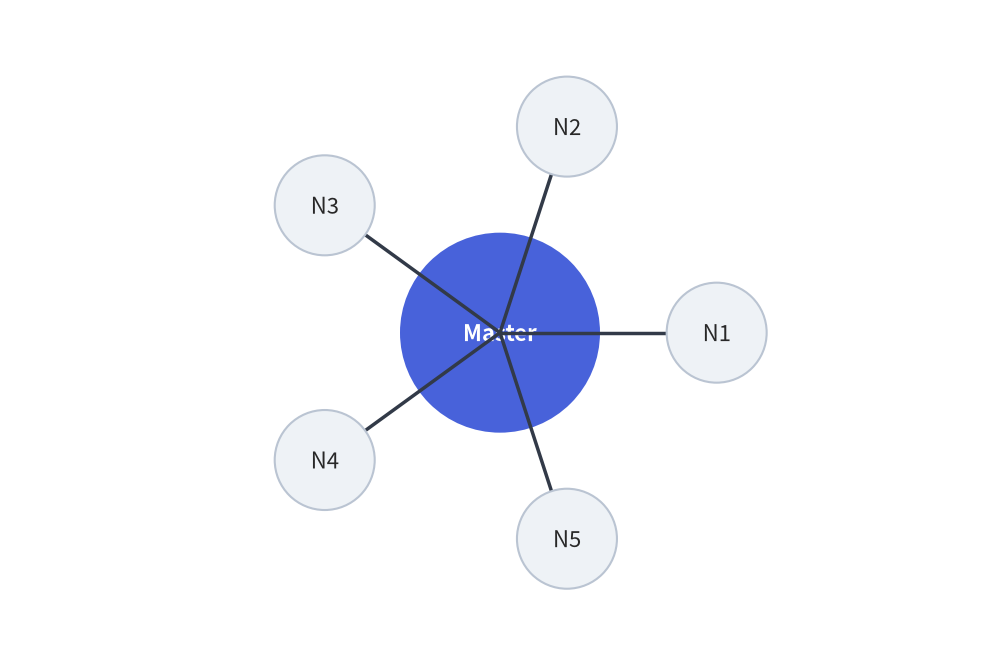
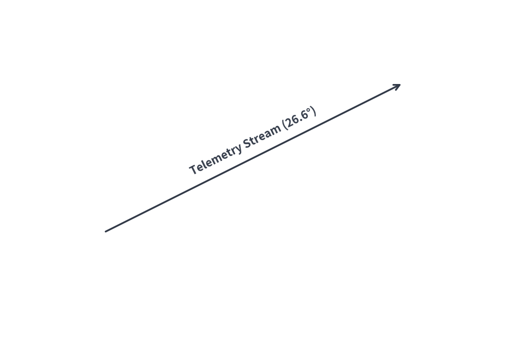

# Mathematical Utilities & Dynamic Geometric Layouts (`drawlib.math`)

Drawlib provides geometric and mathematical calculation utilities to streamline coordinate positioning, angle derivations, distance measurements, and dynamic bounding box computations for technical diagrams.

---

## 1. Imports & Core Functions

All public math utilities are imported from `drawlib.math`:

```python
from drawlib.math import (
    get_angle,            # Calculate angle in degrees from point A to point B
    get_center_and_size,  # Compute center coordinates and bounding box dimensions
    get_distance,         # Compute Euclidean distance between two points
)
```

---

## 2. Function Specifications

### 2.1 `get_angle(xy1, xy2) -> float`
Calculates the counter-clockwise angle in degrees from point `xy1` to point `xy2`:
- **Reference**: 0° points horizontally along the positive X-axis (East).
- **Range**: `[0.0, 360.0)`.
  - Point to the right: `0.0°`
  - Point directly above: `90.0°`
  - Point to the left: `180.0°`
  - Point directly below: `270.0°`
- **Primary Use Case**: Aligning text labels or rotating directional icons parallel to slanted connection lines.

### 2.2 `get_distance(xy1, xy2) -> float`
Calculates the Euclidean distance $\sqrt{(x_2 - x_1)^2 + (y_2 - y_1)^2}$ between two points:
- **Primary Use Case**: Determining line lengths, collision thresholds, and radial distribution spacing.

### 2.3 `get_center_and_size(xys) -> tuple[tuple[float, float], tuple[float, float]]`
Computes the geometric midpoint and outer bounding box dimensions for an arbitrary collection of coordinates:
- **Returns**: `((center_x, center_y), (width, height))`.
- **Primary Use Case**: Dynamically enclosing multiple service nodes inside an automated background container rectangle with uniform padding.

---

## 3. Dynamic Automated Grouping Box

Using `get_center_and_size()`, you can calculate the exact boundary of a cluster of service nodes and draw an encompassing card behind them:


```python
from drawlib.canvas import save, setup
from drawlib.math import get_center_and_size
from drawlib.shapes import circle, rectangle
from drawlib.styles import Styles

setup(width=140, height=70)

# 1. Define service node positions
nodes = [(40, 45), (70, 50), (100, 40), (60, 25)]

# 2. Calculate dynamic bounding box
(cx, cy), (bw, bh) = get_center_and_size(nodes)

# 3. Draw background container with +28 width and +22 height padding
rectangle(
    (cx, cy),
    width=bw + 28,
    height=bh + 22,
    r=4,
    style=Styles.MutedDashed,
    text="Kubernetes Worker Cluster",
    text_style=Styles.DarkBold,
)

# 4. Render nodes
for i, (x, y) in enumerate(nodes, start=1):
    st = Styles.PrimaryFlat if i == 1 else Styles.Neutral
    t_st = Styles.WhiteBold if i == 1 else Styles.DarkBold
    circle((x, y), radius=7, style=st, text=f"Pod {i}", text_style=t_st)
save()
```

<figure class="drawlib-image" style="text-align: center;">
  
  <figcaption class="drawlib-caption">Automated Grouping Box via get_center_and_size()</figcaption>
</figure>


---

## 4. Radial Circular Node Distribution

To distribute $N$ worker nodes symmetrically around a central hub:


```python
import math
from drawlib.canvas import save, setup
from drawlib.lines import line
from drawlib.math import get_angle, get_distance
from drawlib.shapes import circle
from drawlib.styles import Styles

setup(width=120, height=80)

hub = (60, 40)
radius = 26
num_clients = 5

# Central Hub
circle(hub, radius=12, style=Styles.PrimaryFlat, text="Master", text_style=Styles.WhiteBold)

# Surrounding Worker Nodes
for i in range(num_clients):
    angle_rad = 2 * math.pi * i / num_clients
    node_xy = (hub[0] + radius * math.cos(angle_rad), hub[1] + radius * math.sin(angle_rad))
    
    # Calculate connection angle and distance
    dist = get_distance(hub, node_xy)
    angle_deg = get_angle(hub, node_xy)
    
    line(hub, node_xy, style=Styles.DarkBold)
    circle(node_xy, radius=6, style=Styles.Neutral, text=f"N{i+1}")
save()
```

<figure class="drawlib-image" style="text-align: center;">
  
  <figcaption class="drawlib-caption">Radial Topology with Polar Math Distribution</figcaption>
</figure>


---

## 5. Slanted Connection Line Text Alignment

Align text labels parallel to angled lines using `get_angle()`:


```python
from drawlib.canvas import save, setup
from drawlib.lines import line
from drawlib.math import get_angle
from drawlib.styles import Styles
from drawlib.text import text

setup(width=120, height=80)

p1 = (25, 25)
p2 = (95, 60)

# Draw slanted wire
line(p1, p2, arrow_head="->", style=Styles.DarkBold)

# Calculate rotation angle and midpoint
angle = get_angle(p1, p2)
midpoint = ((p1[0] + p2[0]) / 2, (p1[1] + p2[1]) / 2 + 4)

# Render rotated text parallel to the connection
text(midpoint, f"Telemetry Stream ({angle:.1f}°)", style=Styles.DarkBold.patch(angle=angle))
save()
```

<figure class="drawlib-image" style="text-align: center;">
  
  <figcaption class="drawlib-caption">Parallel Text on Angled Line</figcaption>
</figure>


