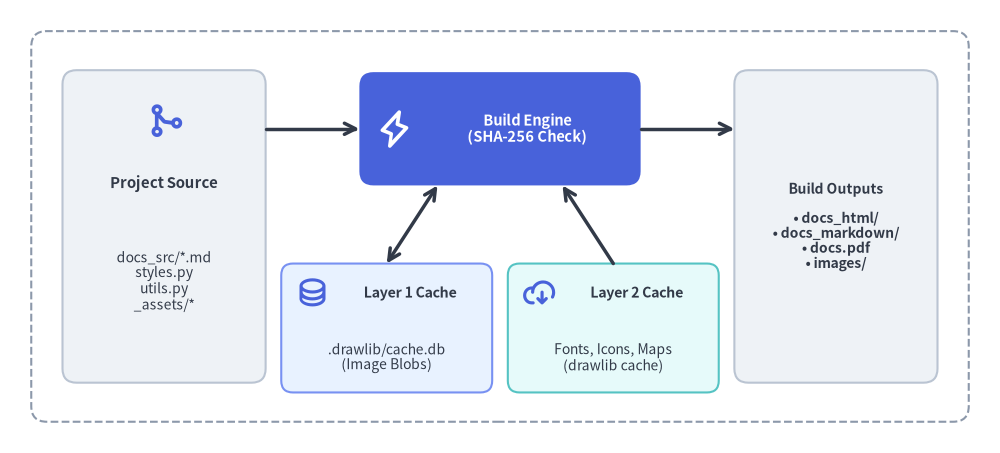
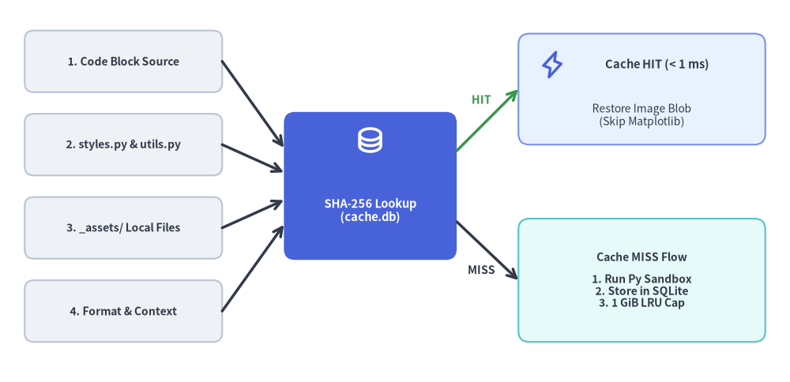

# Caching Architecture & CI/CD

Drawlib uses a **two-tier caching architecture** to make local iterative builds instantaneous and CI/CD pipelines deterministic, fast, and offline-capable:


<figure class="drawlib-image" style="text-align: center;">
  
  <figcaption class="drawlib-caption">Drawlib Two-Tier Caching Architecture and CI/CD Pipeline</figcaption>
</figure>

<details class="drawlib-code-details">
<summary>Source Code</summary>

```python
from drawlib.canvas import save, setup
from drawlib.icons import phosphor
from drawlib.lines import line
from drawlib.shapes import rectangle
from drawlib.styles import Styles
from drawlib.text import text

setup(width=128, height=58)

# Outer pipeline boundary
rectangle((64, 29), width=120, height=50, style=Styles.MutedDashed.patch(shape_r=2.0))

# Left: Source inputs
rectangle((21, 29), width=26, height=40, style=Styles.Neutral.patch(shape_r=1.8))
phosphor.git_merge((21, 42.5), width=4.8, style=Styles.PrimaryBold)
text((21, 34.5), "Project Source", style=Styles.DarkBold.patch(text_size=10.8))
text((21, 22.0), "docs_src/*.md\nstyles.py\nutils.py\n_assets/*", style=Styles.Dark.patch(text_size=10.0))

# Center: Drawlib Compiler (Hero focal point)
rectangle((64, 41.5), width=36, height=14.5, style=Styles.PrimaryFlat.patch(shape_r=1.8))
phosphor.lightning((50.5, 41.5), width=4.8, style=Styles.WhiteBold)
text((67.5, 41.5), "Build Engine\n(SHA-256 Check)", style=Styles.WhiteBold.patch(text_size=10.5))

# Bottom Center: Two Cache Tiers
rectangle((49.5, 16.0), width=27, height=16.5, style=Styles.PrimaryNeutral.patch(shape_r=1.5))
phosphor.database((40.0, 20.5), width=4.2, style=Styles.PrimaryBold)
text((52.5, 20.5), "Layer 1 Cache", style=Styles.DarkBold.patch(text_size=10.2))
text((49.5, 12.2), ".drawlib/cache.db\n(Image Blobs)", style=Styles.Dark.patch(text_size=10.0))

rectangle((78.5, 16.0), width=27, height=16.5, style=Styles.SecondaryNeutral.patch(shape_r=1.5))
phosphor.cloud_arrow_down((69.0, 20.5), width=4.2, style=Styles.PrimaryBold)
text((81.5, 20.5), "Layer 2 Cache", style=Styles.DarkBold.patch(text_size=10.2))
text((78.5, 12.2), "Fonts, Icons, Maps\n(drawlib cache)", style=Styles.Dark.patch(text_size=10.0))

# Right: Published Artifacts
rectangle(
    (107, 29),
    width=26,
    height=40,
    style=Styles.Neutral.patch(shape_r=1.8),
    text="Build Outputs\n\n• docs_html/\n• docs_markdown/\n• docs.pdf\n• images/",
    text_style=Styles.DarkBold.patch(text_size=10.0),
)

# Connectors
line((34, 41.5), (46, 41.5), arrow_head="->", style=Styles.DarkBold)
line((82, 41.5), (94, 41.5), arrow_head="->", style=Styles.DarkBold)
line((56, 34.25), (49.5, 24.25), arrow_head="<->", style=Styles.DarkBold)
line((72, 34.25), (78.5, 24.25), arrow_head="<-", style=Styles.DarkBold)

save()
```

</details>


1. **Layer 1 — Incremental Build Cache (`.drawlib/cache.db`)**: A project-local SQLite database that caches rendered diagram binaries by SHA-256 content hash, restoring unchanged diagrams in sub-millisecond time.
2. **Layer 2 — Release Asset Cache (`drawlib cache`)**: A package cache for external font families, vector/PNG icon packs, and Natural Earth map datasets downloaded from official GitHub Releases.

---

## 1. Layer 1: SQLite Incremental Build Cache (`.drawlib/cache.db`)

Whenever you run `drawlib build` or `drawlib show`, Drawlib creates a local SQLite database at `.drawlib/cache.db` (alongside an automatic `.drawlib/.gitignore` containing `*` and `.drawlib/CACHEDIR.TAG` so cache binaries are never committed to Git).

### 1.1. What Is Included in the SHA-256 Cache Key?
Before executing any embedded ````drawlib```` block or standalone `.py` script, Drawlib computes a deterministic SHA-256 digest over:
1. **Drawing Code Content**: The exact Python code inside the block or script.
2. **Project `styles.py` & `utils.py`**: Full file contents of the active `--styles` and `--utils` scripts.
3. **Referenced Local Assets**: Any local files referenced as string literals in the code (resolved relative to the Markdown file, project root, or `_assets/`).
4. **Execution Context**: Source/target paths, output format (`png`, `webp`, `svg`), and presentation slide count (`total_slides`).

If the digest matches an entry in `.drawlib/cache.db`, Drawlib restores the rendered image binary directly from SQLite in **< 1 ms** without invoking Python or Matplotlib.


<figure class="drawlib-image" style="text-align: center;">
  
  <figcaption class="drawlib-caption">Incremental Build Cache SHA-256 Digest Computation and Hit/Miss Workflow</figcaption>
</figure>

<details class="drawlib-code-details">
<summary>Source Code</summary>

```python
from drawlib.canvas import save, setup
from drawlib.icons import phosphor
from drawlib.lines import line
from drawlib.shapes import rectangle
from drawlib.styles import Styles
from drawlib.text import text

setup(width=128, height=62)

# Left Stack: 4 Input Cards
inputs = [
    (52.0, "1. Code Block Source"),
    (38.5, "2. styles.py & utils.py"),
    (25.0, "3. _assets/ Local Files"),
    (11.5, "4. Format & Context"),
]
for iy, ilabel in inputs:
    rectangle(
        (20, iy),
        width=32,
        height=10.0,
        style=Styles.Neutral.patch(shape_r=1.5),
        text=ilabel,
        text_style=Styles.DarkBold.patch(text_size=10.0),
    )

# Center Focal Card: SHA-256 Digest Lookup
rectangle((60, 31.8), width=28, height=24, style=Styles.PrimaryFlat.patch(shape_r=1.8))
phosphor.database((60, 39.2), width=4.8, style=Styles.WhiteBold)
text((60, 27.8), "SHA-256 Lookup\n(cache.db)", style=Styles.WhiteBold.patch(text_size=10.5))

# Converging arrows from 4 inputs to SHA-256 Digest Lookup
line((36, 52.0), (46, 38.0), arrow_head="->", style=Styles.DarkBold)
line((36, 38.5), (46, 34.0), arrow_head="->", style=Styles.DarkBold)
line((36, 25.0), (46, 29.5), arrow_head="->", style=Styles.DarkBold)
line((36, 11.5), (46, 25.5), arrow_head="->", style=Styles.DarkBold)

# Top Branch: Cache HIT
line((74, 37.5), (84, 47.5), arrow_head="->", style=Styles.SuccessBold)
text((78.0, 45.8), "HIT", style=Styles.SuccessBold.patch(text_size=10.2))
rectangle((104, 47.5), width=40, height=18, style=Styles.PrimaryNeutral.patch(shape_r=1.8))
phosphor.lightning((89.5, 51.5), width=4.6, style=Styles.PrimaryBold)
text((106.5, 51.5), "Cache HIT (< 1 ms)", style=Styles.DarkBold.patch(text_size=10.5))
text((104, 43.2), "Restore Image Blob\n(Skip Matplotlib)", style=Styles.Dark.patch(text_size=10.0))

# Bottom Branch: Cache MISS
line((74, 26.0), (84, 16.5), arrow_head="->", style=Styles.DarkBold)
text((78.0, 18.2), "MISS", style=Styles.DarkBold.patch(text_size=10.2))
rectangle(
    (104, 16.5),
    width=40,
    height=20,
    style=Styles.SecondaryNeutral.patch(shape_r=1.8),
    text="Cache MISS Flow\n\n1. Run Py Sandbox\n2. Store in SQLite\n3. 1 GiB LRU Cap",
    text_style=Styles.DarkBold.patch(text_size=10.0),
)

save()
```

</details>


### 1.2. Automatic Cache Maintenance & Environment Variables
- **Library Version Invalidation**: Cache tables are automatically invalidated whenever the installed `drawlib` or `matplotlib` version changes.
- **1 GiB Size Cap**: When cached image blobs exceed `1 GiB`, Drawlib automatically evicts the oldest 50% of entries.
- **Custom Cache Path**: Override the SQLite database location in CI/CD runners via `DRAWLIB_CACHE_DB=/path/to/cache.db` or `DRAWLIB_CACHE_DIR=/path/to/dir`.

### 1.3. When to Bypass or Clear Layer 1 Cache
If a drawing script imports a custom external Python module *outside* `styles.py` and `utils.py`, editing that external module will not alter the block's SHA-256 hash automatically. Force a fresh render using `--no-cache` or `drawlib cache clear --images`:

```bash
# Force full re-rendering for a single build or preview command:
uv run drawlib build html docs_src/ -o docs_html/ --no-cache
uv run drawlib show docs_src/index.md arch.png -g -o .drawlib/scratch/preview.png --no-cache

# Or purge all cached diagram binaries from .drawlib/cache.db:
uv run drawlib cache clear --images
```

---

## 2. Layer 2: Global Asset Cache (`drawlib cache`) & Rules Cache

To keep the core `drawlib` PyPI wheel lightweight, external binary assets are packaged as deterministic archives in official GitHub Releases and cached locally inside `drawlib/_cached_assets/`:
- **Font Packages (`font_*`)**: Western & technical families (`font_roboto`, `font_roboto_condensed`, `font_roboto_mono`, `font_roboto_serif`, `font_roboto_slab`, `font_mono_source_code_pro`, `font_mono_courier`, `font_sans_*`, `font_serif_*`) and multilingual CJK/regional families (`font_cjk_japanese_noto_sans`, `font_japanese_noto_sans`, `font_japanese_mplus_1p`, `font_chinese_simplified_noto_sans`, `font_chinese_traditional_noto_sans`, `font_korean_noto_sans`, `font_arabic_noto_sans`, `font_thai_noto_sans`, `font_brahmic_*`).
- **Icon Packages (`icon_*`)**: Vector font icons (`icon_phosphor`) and official cloud architecture icons (`icon_gcp`).
- **GeoMap Packages (`map_*`)**: Natural Earth vector boundaries and populated places (`map_world`, `map_countries`, `map_cities`).
- **AI Rules Illustration Cache (`_cached_assets/rules/`)**: Companion PNG diagrams generated on-demand by `drawlib rules show <topic>` or pre-built via `drawlib rules build --all` (cleared via `drawlib rules clear`).

### 2.1. Asset Cache CLI Commands

```bash
# Inspect all 51 font, icon, and map packages and their local cache status:
uv run drawlib cache list

# Pre-download all font, icon, and map packages (recommended for CI & offline use):
uv run drawlib cache download --all

# Pre-download only font packages or only icon packages:
uv run drawlib cache download --fonts
uv run drawlib cache download --icons

# Clear downloaded font/icon/map packages, or clear everything including SQLite image cache:
uv run drawlib cache clear
uv run drawlib cache clear --all
```

---

## 3. Running Drawlib in CI/CD Pipelines & Headless Containers

### 3.1. GitHub Actions Workflow Example
In GitHub Actions or GitLab CI, persist both the asset cache and `.drawlib/cache.db` across workflow runs, pre-download assets once, and run `drawlib serve --check` as a broken-link quality gate:

```yaml
name: Build Documentation & Verify Links

on:
  push:
    branches: [main]
  pull_request:

jobs:
  docs:
    runs-on: ubuntu-latest
    steps:
      - uses: actions/checkout@v4

      - name: Install uv and Python 3.12
        uses: astral-sh/setup-uv@v4
        with:
          python-version: "3.12"

      - name: Install dependencies (with optional PDF export support)
        run: |
          uv sync
          uv run playwright install --with-deps chromium

      - name: Restore Drawlib Caches
        uses: actions/cache@v4
        with:
          path: |
            .drawlib/
            ~/.cache/drawlib/
          key: drawlib-cache-${{ runner.os }}-${{ hashFiles('uv.lock') }}
          restore-keys: |
            drawlib-cache-${{ runner.os }}-

      - name: Warm Font & Icon Asset Cache
        run: uv run drawlib cache download --all

      - name: Build HTML Site, Vector PDF, and Audit Links
        run: |
          uv run drawlib build html docs_src/ -o docs_html/
          uv run drawlib build pdf docs_src/ -o docs.pdf --toc
          uv run drawlib serve docs_html/ --check
```

### 3.2. Offline & Air-Gapped Docker Containers
For air-gapped environments or production container images where outbound network requests are disabled at runtime, bake the asset cache and Chromium binary directly into the Docker image during `docker build`:

```dockerfile
FROM python:3.12-slim

WORKDIR /workspace
RUN pip install --no-cache-dir "drawlib[pdf]" \
    && playwright install --with-deps chromium \
    && drawlib cache download --all
```

With `drawlib cache download --all` and `playwright install --with-deps chromium` executed at image build time, every font family, Phosphor/GCP icon set, GeoMap shapefile, and headless PDF renderer runs 100% offline.
