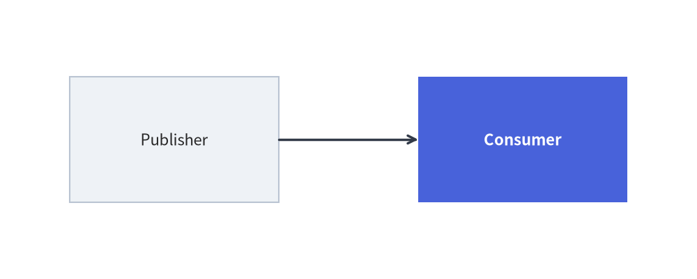
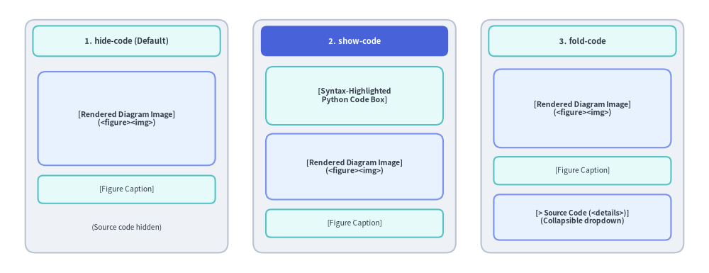

# Embedded Code Blocks (````drawlib````)

Drawlib allows you to embed Python drawing scripts directly into Markdown documents using the ````drawlib```` code fence. The builder compiles these blocks into vector images during site or document builds, automatically generating HTML elements, companion image files, and syntax-highlighted code blocks.

---

## 1. Basic Code Fence Syntax

Embedded drawing blocks use the `drawlib` language identifier:


```python
from drawlib.canvas import save, setup
from drawlib.shapes import rectangle
from drawlib.lines import line
from drawlib.styles import Styles

setup(width=100, height=40)
rectangle((25, 20), width=30, height=18, style=Styles.Neutral, text="Publisher")
rectangle((75, 20), width=30, height=18, style=Styles.PrimaryFlat, text="Consumer", text_style=Styles.WhiteBold)
line((40, 20), (60, 20), arrow_head="->", style=Styles.DarkBold)
save()
```

<figure class="drawlib-image" style="text-align: center;">
  
  <figcaption class="drawlib-caption">Service Architecture Example</figcaption>
</figure>


---

## 2. Header Attributes Reference

Options are specified space-delimited on the opening code fence line (supporting both positional shorthand tokens and `key:value` / `key=value` pairs):

```text
``` drawlib [DISPLAY_MODE] [WIDTH] [ALIGNMENT] [file:NAME] [caption:"TEXT"] [OPTIONS...]
```

*(Note: In authoring, replace the brackets with your desired configuration options without the space after the backticks.)*

### 2.1 Code Display Modes

| Option / Key-Value | HTML Rendering Behavior | Markdown Rendering Behavior |
|---|---|---|
| `hide-code` / `code:hide` *(default)* | Displays image only (`<figure></figure>`). | Replaces block with standard Markdown image link. |
| `show-code` / `code:show` | Displays syntax-highlighted code block followed immediately by the image. | Renders code block followed by image link. |
| `fold-code` / `code:fold` | Displays image followed by a collapsible dropdown (`<details><summary>Source Code</summary>...</details>`). | Displays image followed by collapsed details dropdown. |


<figure class="drawlib-image" style="text-align: center;">
  
  <figcaption class="drawlib-caption">Visual Comparison of hide-code, show-code, and fold-code Display Modes</figcaption>
</figure>

<details class="drawlib-code-details">
<summary>Source Code</summary>

```python
from drawlib.canvas import save, setup
from drawlib.shapes import rectangle
from drawlib.styles import Styles
from drawlib.text import text

setup(width=140, height=54)

# 1. Left Card: hide-code (Default)
rectangle((25, 27), width=40, height=46, style=Styles.Neutral.patch(shape_r=2.0))
rectangle(
    (25, 45.8),
    width=37,
    height=6.0,
    style=Styles.SecondaryNeutral.patch(shape_r=1.2),
    text="1. hide-code (Default)",
    text_style=Styles.DarkBold.patch(text_size=8.0),
)
rectangle(
    (25, 30.5),
    width=35,
    height=18.5,
    style=Styles.PrimaryNeutral.patch(shape_r=1.5),
    text="[Rendered Diagram Image]\n(<figure>)",
    text_style=Styles.DarkBold.patch(text_size=7.6),
)
rectangle(
    (25, 16.5),
    width=35,
    height=5.5,
    style=Styles.SecondaryNeutral.patch(shape_r=1.0),
    text="[Figure Caption]",
    text_style=Styles.Dark.patch(text_size=7.4),
)
text((25, 9.0), "(Source code hidden)", style=Styles.Dark.patch(text_size=7.2))

# 2. Center Card: show-code (PrimaryFlat header banner)
rectangle((70, 27), width=40, height=46, style=Styles.Neutral.patch(shape_r=2.0))
rectangle(
    (70, 45.8),
    width=37,
    height=6.0,
    style=Styles.PrimaryFlat.patch(shape_r=1.2),
    text="2. show-code",
    text_style=Styles.WhiteBold.patch(text_size=8.0),
)
rectangle(
    (70, 35.0),
    width=35,
    height=11.5,
    style=Styles.SecondaryNeutral.patch(shape_r=1.5),
    text="[Syntax-Highlighted\nPython Code Box]",
    text_style=Styles.DarkBold.patch(text_size=7.5),
)
rectangle(
    (70, 21.0),
    width=35,
    height=13.0,
    style=Styles.PrimaryNeutral.patch(shape_r=1.5),
    text="[Rendered Diagram Image]\n(<figure>)",
    text_style=Styles.DarkBold.patch(text_size=7.5),
)
rectangle(
    (70, 9.8),
    width=35,
    height=5.5,
    style=Styles.SecondaryNeutral.patch(shape_r=1.0),
    text="[Figure Caption]",
    text_style=Styles.Dark.patch(text_size=7.4),
)

# 3. Right Card: fold-code
rectangle((115, 27), width=40, height=46, style=Styles.Neutral.patch(shape_r=2.0))
rectangle(
    (115, 45.8),
    width=37,
    height=6.0,
    style=Styles.SecondaryNeutral.patch(shape_r=1.2),
    text="3. fold-code",
    text_style=Styles.DarkBold.patch(text_size=8.0),
)
rectangle(
    (115, 32.5),
    width=35,
    height=15.5,
    style=Styles.PrimaryNeutral.patch(shape_r=1.5),
    text="[Rendered Diagram Image]\n(<figure>)",
    text_style=Styles.DarkBold.patch(text_size=7.6),
)
rectangle(
    (115, 20.2),
    width=35,
    height=5.5,
    style=Styles.SecondaryNeutral.patch(shape_r=1.0),
    text="[Figure Caption]",
    text_style=Styles.Dark.patch(text_size=7.4),
)
rectangle(
    (115, 11.0),
    width=35,
    height=9.0,
    style=Styles.PrimaryNeutral.patch(shape_r=1.2),
    text="[> Source Code (<details>)]\n(Collapsible dropdown)",
    text_style=Styles.DarkBold.patch(text_size=7.3),
)

save()
```

</details>


### 2.2 Complete Fence Attributes Reference

| Category | Attribute Syntax | Default | Description |
|---|---|---|---|
| **Filename** | `file:<name.png>` | *(Required in docs)* | Explicit output filename in `<doc_stem>_images/<name.png>` (or `images/<slide_stem>/<name>` in slides). |
| **Image Format** | `format:<fmt>`, `fmt:<fmt>` | `png` (`svg` in slides) | Output image format (`png`, `webp`, `svg`, `apng`) if not inferred from `file:` extension. |
| **Width** | `650px`, `80%`, `width:650px`, `w:80%` | `None` (natural size) | CSS display width (`px`, `%`, `rem`, `vw`, or bare number → `px`). |
| **Height** | `height:400px`, `h:300` | `None` | Optional CSS display height override. |
| **Alignment** | `center`, `left`, `right`, `align:center`, `a:left` | `center` | Horizontal figure alignment on the page (`left`, `center`, `right`). |
| **Caption** | `caption:"Text"` or `caption:'Text'` | `None` | Wraps the figure in semantic `<figure>` and `<figcaption>` elements. |
| **CSS Class** | `class:hero-fig`, `css_class:"card shadow"` | `None` | Appends custom CSS classes to the figure wrapper. |
| **Cache Control** | `no-cache`, `cache:false` | `False` | Forces this specific block to re-execute on every build, bypassing `.drawlib/cache.db`. |
| **Slide Stage Placement** | `slot:<name>`, `xy:(x,y)` / `pos:(x,y)`, `size:(w,h)` / `dim:(w,h)`, `z:<int>` / `z-index:<int>` | `None` | Stage slot, explicit `(x, y)` pixel position, `(w, h)` pixel size, and `z-index` layer depth for 16:9 slides. |
| **Slide Animation Controls** | `anim-trigger:auto\|click`, `anim-loop:once\|infinite`, `anim-pause:2,4` | `auto`, `infinite`, `[]` | Controls interactive `<canvas>` animation playback in HTML slide decks (see [Slide Deck Project Guide](./project_slide.md)). |

> [!TIP]
> **Best Practice for AI & Automation**:
> Always specify an explicit `file:<name>.png` attribute for every embedded block. Named blocks prevent numbering shifts when diagrams are inserted or removed, produce clean asset directories, and allow individual diagrams to be verified deterministically via `drawlib show <file.md> <image_name.png>`.

> [!NOTE]
> **Animations in Code Blocks (APNG & WebP)**:
> Embedded `drawlib` blocks fully support generating multi-frame animated illustrations using `from drawlib.anim import Animation`. The document compiler automatically outputs an animated PNG (APNG) or Animated WebP file based on the `file:` extension (`.png`, `.apng`, or `.webp`). See [Animations Overview (APNG & WebP)](../07_animations/overview.md) for full details.

### 2.3 HTML `<script type="text/drawlib">` Alternative Syntax
When authoring raw `.html` documents instead of `.md` files, you can embed Drawlib blocks using `<script type="text/drawlib">` tags with standard HTML attributes (`width="600px"`, `align="center"`, `file="arch.png"`, `caption="Architecture"`, `code="fold"`).

---

## 3. Working Directory & Path Resolution

When compiling embedded code blocks:
1. **Working Directory (`os.chdir`)**: Drawlib automatically sets the current working directory to the directory containing the Markdown document (or project root when `_assets/` resides at the root).
2. **Relative File Paths**: Relative paths to local assets (e.g. `image("../_assets/logo.png")`) resolve identically whether running `drawlib build` or testing with `drawlib show`.
3. **Module Resolution (`sys.path`)**: The document directory and project root are added to `sys.path`, allowing you to import local helper modules (such as `import styles` or `import utils`).

---

## 4. Canvas Isolation & Sandbox

- **Automatic Clear**: Drawlib invokes `canvas.clear()` before executing each embedded code block. State, shapes, and settings from a preceding diagram will never contaminate subsequent blocks.
- **Explicit Imports**: Embedded drawing blocks use explicit imports (e.g. `from drawlib.shapes import circle`, `from drawlib.styles import Styles`). This guarantees clean namespace boundaries, full IDE autocompletion support, and self-contained reproducibility.
- **Automatic Capture & `save()` Handling**: The Document Builder automatically captures the canvas and renders the companion image to disk when a block finishes execution. Calling `save()` within a block is optional; if present, the engine safely intercepts it to prevent duplicate file writes or collisions. In complete examples, including `save()` (without arguments) is recommended to maintain 100% copy-paste portability with standalone Python scripts.

---

## 5. Rapid Verification Workflow (`drawlib show`)

Do not run a full site build to verify coordinate adjustments on a single diagram. Inspect individual code blocks instantly using `drawlib show`:

```bash
# 1. List all available drawlib blocks in a Markdown document (index, line number, target filename):
uv run drawlib show docs_src/my_doc.md

# 2. Render a specific block by its explicit file: name with coordinate grid (-g) (Recommended):
uv run drawlib show docs_src/my_doc.md code_blocks_service_arch.png -g -o .drawlib/scratch/preview.png

# 3. Or target a block by 1-based index (1, 2, or -1 for the last block):
uv run drawlib show docs_src/my_doc.md 1 -g -o .drawlib/scratch/preview.png
```
